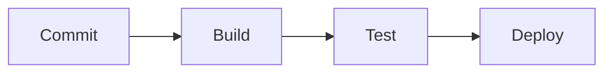

# DevOps Roadmap 中文手册开发指南

本文档是本仓库的内容实施方案和长期维护约定。所有文档变更应遵守这里定义的范围、结构、写作标准和验收流程。

## 项目目标

本项目使用 [Zensical](https://zensical.org/) 构建公开发布的中文 DevOps 学习手册。学习主题和大致顺序参考 [roadmap.sh DevOps Roadmap](https://roadmap.sh/devops)，但正文必须独立创作，重点解释可迁移的原理、工程实践和验证方法。

目标读者是具备基本计算机知识，希望系统学习 DevOps、SRE 或平台工程的开发者和运维工程师。

## 内容边界

- 可以参考 roadmap.sh 的公开主题范围和学习顺序。
- 不复制、逐句翻译或近义改写 roadmap.sh 的说明文字。
- 不下载、嵌入或重新发布 roadmap.sh 的图片、项目文件和原始数据。
- 技术事实优先依据开放标准、软件官方文档和可重复验证的实践。
- 外部引用必须链接原始来源；不得用本项目内容暗示 roadmap.sh 或工具厂商的授权、认可或合作。
- 产品名称仅用于客观介绍。涉及选型时说明评价维度，不将个人偏好表述为普遍事实。
- 命令和配置不得包含真实凭据、账号、域名或无法撤销的生产操作。

## 文件规划

文档全部放在 `docs/` 根目录。文件名使用不带序号的英文 URL slug，章节顺序由 `zensical.toml` 的导航定义。

| 顺序 | 文件 | 章节 | 必须覆盖的知识点 |
| ---: | --- | --- | --- |
| 1 | `learn-a-programming-language.md` | 学习一种编程语言 | Python、Go、Ruby、Rust、JavaScript / Node.js |
| 2 | `operating-system.md` | 操作系统 | Windows、FreeBSD、OpenBSD、NetBSD、Ubuntu / Debian、SUSE Linux、RHEL 及衍生发行版 |
| 3 | `terminal-knowledge.md` | 终端知识 | Bash、PowerShell、进程监控、性能监控、网络工具、文本处理、Vim / Nano / Emacs |
| 4 | `version-control-systems.md` | 版本控制系统 | Git |
| 5 | `vcs-hosting.md` | 版本控制托管 | GitHub、GitLab、Bitbucket |
| 6 | `containers.md` | 容器 | Docker、LXC |
| 7 | `common-infrastructure-services.md` | 常见基础设施服务 | 正向代理、反向代理、缓存、防火墙、负载均衡、Nginx、Caddy、Tomcat、Apache HTTP Server、IIS |
| 8 | `networking-and-protocols.md` | 网络与协议 | FTP / SFTP、DNS、HTTP、HTTPS、SSL / TLS、SSH、OSI 模型、白名单 / 灰名单、SMTP、DMARC、IMAP、SPF、POP3S、DomainKeys / DKIM |
| 9 | `cloud-providers.md` | 云服务商 | AWS、Azure、Google Cloud、DigitalOcean、Hetzner、Render、Alibaba Cloud、Heroku |
| 10 | `serverless.md` | 无服务器计算 | AWS Lambda、Cloudflare、Azure Functions、Vercel、Netlify、Google Cloud Functions |
| 11 | `provisioning.md` | 基础设施置备 | AWS CDK、CloudFormation、Pulumi、Terraform |
| 12 | `configuration-management.md` | 配置管理 | Chef、Ansible、Salt、Puppet |
| 13 | `ci-cd-tools.md` | CI/CD 工具 | Railway、Buildkite、TeamCity、Jenkins、GitLab CI/CD、CircleCI、Octopus Deploy、GitHub Actions |
| 14 | `secret-management.md` | 机密管理 | Sealed Secrets、External Secrets Operator、Vault、SOPS、云平台原生服务 |
| 15 | `infrastructure-monitoring.md` | 基础设施监控 | Prometheus、Grafana、Zabbix、Datadog |
| 16 | `logs-management.md` | 日志管理 | Papertrail、Splunk、Loki、Elastic Stack、Graylog |
| 17 | `container-orchestration.md` | 容器编排 | GKE / EKS / AKS、ECS / Fargate、Docker Swarm、Kubernetes、OpenShift |
| 18 | `observability.md` | 可观测性 | Jaeger、New Relic、Datadog、Prometheus、OpenTelemetry、Dynatrace |
| 19 | `artifact-management.md` | 制品管理 | Artifactory、Nexus、Cloudsmith |
| 20 | `gitops.md` | GitOps | Argo CD、Flux CD |
| 21 | `service-mesh.md` | 服务网格 | Istio、Consul、Linkerd、Envoy |
| 22 | `cloud-design-patterns.md` | 云设计模式 | 可用性、数据管理、设计与实现、管理与监控 |

`docs/index.md` 是全站入口，不计入上述 22 个学习章节。

## 学习阶段

导航和首页将章节组织成四个阶段，但阶段名称不进入 URL：

1. 基础能力：章节 1-6。
2. 基础设施与云：章节 7-12。
3. 持续交付与运行：章节 13-18。
4. 平台与架构治理：章节 19-22。

阶段只用于降低认知负担，不表示严格的先后依赖。读者可以按照已有经验跳转学习。

## 页面元数据

所有站点页面必须在文件顶部使用 YAML Front Matter，并提供独立的 `description`：

```yaml
---
description: 准确概括本页内容、目标读者和学习价值的页面描述。
tags:
  - 基础能力
  - 自动化交付
---
```

- `description` 会写入 HTML 的 `<meta name="description">`，应自然概括页面内容，建议控制在 70–120 个中文字符，不堆砌关键词，不与其他页面重复。
- `docs/index.md` 只添加 `description`，不添加 `tags`，避免首页参与章节标签过滤。
- 22 个学习章节必须添加 `description` 和 2–4 个 `tags`。
- 页面标题继续使用正文中的一级标题，不在 Front Matter 中重复设置 `title`。
- 标签用于页面底部展示和站内搜索过滤。当前 Zensical 不支持标签索引页，不创建无法工作的标签列表页面。

标签必须从以下受控词表中选择，不能为单个产品创建只出现一次的标签：

- `基础能力`：编程、操作系统、终端和 Git 等基础主题。
- `系统与网络`：主机、协议、入口服务和网络诊断。
- `版本与协作`：版本历史、代码评审、协作和声明变更。
- `容器与平台`：容器、编排、平台控制器和服务网格。
- `云与架构`：云资源、Serverless、基础设施和架构模式。
- `自动化交付`：基础设施即代码、配置自动化、CI/CD 和 GitOps。
- `配置与状态`：期望状态、配置、漂移和状态管理。
- `安全治理`：身份、权限、机密、策略和审计。
- `可观测性`：指标、日志、追踪、诊断和告警。
- `软件供应链`：依赖、镜像、制品、签名和来源证明。
- `可靠性工程`：可用性、容量、恢复、故障隔离和 SLO。

## 章节写作标准

每章应根据主题选择合适篇幅，至少包含以下内容：

1. 章节导语：说明为什么需要学习、解决什么问题。
2. 学习目标：使用可验证的动作描述，避免“了解一下”之类模糊目标。
3. 前置知识：链接到站内相关章节；没有前置要求时明确说明。
4. 核心原理：解释技术背后的机制，而不只罗列产品功能。
5. 知识点或工具：覆盖文件规划中的全部项目。
6. 选型思路：比较适用场景、约束、运维成本和迁移成本。
7. 实践示例：提供安全、最小且可理解的命令、配置或流程。
8. 生产实践：覆盖安全性、可靠性、可观测性、成本或可维护性中的相关方面。
9. 常见误区：指出容易产生事故或错误认知的做法。
10. 动手实践：给出可独立完成的练习和明确结果。
11. 完成检查：使用任务清单帮助读者自测。
12. 延伸阅读：优先链接规范、项目和厂商官方文档。

章节正文到延伸阅读结束，不添加手写的上一章、下一章或返回首页链接。前后页切换由 Zensical 的 `navigation.footer` 原生导航提供。

同一个产品可能出现在不同上下文中。例如 Prometheus 在基础设施监控和可观测性章节承担不同教学目标，不应因为名称重复而删除。

## 学习建议标记

路线图中的颜色只表示作者建议，不代表行业标准或强制要求。文档统一使用以下中文标记：

- **重点掌握**：适合作为该类能力的主要学习入口。
- **替代方案**：与主要入口解决相近问题，按技术栈和场景择一深入。
- **按需学习**：不依赖主路线顺序，可在实际需要时学习。
- **通用主题**：跨产品的架构或工程能力，不做工具推荐。

章节需要解释选择依据，不能仅靠标记代替技术分析。

## Zensical 内容能力

当前 `zensical.toml` 已启用 admonition、details、内容标签页、任务清单、代码高亮、脚注、缩写、工具提示和 Mermaid。内容应在确有帮助时使用这些能力。

### 提示框

```markdown
!!! tip "实践建议"
    先在临时环境验证配置，再应用到生产环境。

!!! warning "生产风险"
    此操作会影响现有连接，应先确认回滚路径。
```

### 折叠详情

```markdown
??? note "展开查看原理"
    放置补充原理、较长输出或非主线内容。
```

### 内容标签页

```markdown
=== "Linux"

    ```bash
    uname -a
    ```

=== "PowerShell"

    ```powershell
    Get-ComputerInfo
    ```
```

### 任务清单

```markdown
- [ ] 能解释该技术解决的问题
- [ ] 能完成最小实践
- [ ] 能说明生产环境的主要风险
```

### Mermaid

关系图必须表达正文中难以快速看清的流程或依赖，不绘制纯装饰性图表。

````markdown

````

## Markdown 约定

- 每个站点页面必须以符合“页面元数据”约定的 YAML Front Matter 开始。
- 每个文件只使用一个一级标题。
- 标题采用简体中文，首次出现的重要英文术语放在括号中。
- 标题层级依次递进，不跨级。
- 站内链接使用相对 Markdown 路径，例如 `[容器](containers.md)`。
- 外部链接使用 HTTPS，并优先链接官方文档。
- 代码块必须声明语言；示例中的占位值使用明显的示例域名或变量。
- 表格只用于需要横向比较的数据；移动端难以阅读的长内容改用列表。
- 不使用只有颜色才能理解的信息。
- 不为了展示扩展能力而滥用提示框、标签页或图表。
- 中文正文使用全角标点，代码、文件名、命令和标识符使用反引号。

## 首页要求

`docs/index.md` 应包含：

- 项目定位、适用读者和非官方声明。
- 四个学习阶段及 22 个章节入口。
- 学习建议标记的含义。
- 推荐学习方法和实践原则。
- 内容版本说明和上游参考链接。
- 不复制 roadmap.sh 原始路线图的版权说明。

首页可使用卡片网格，但必须确保未加载额外 CSS 时仍可正常阅读和导航。

## 站点配置

`zensical.toml` 应维护：

- 准确的中文站点名称和简介。
- 项目仓库地址与编辑链接。
- 首页和 22 章完整导航。
- 四个学习阶段的导航分组。
- 中文语言设置、搜索、代码复制、标签页、目录和 Mermaid 支持。

不得使用数字文件名前缀控制导航顺序，以免未来插入章节时改变公开 URL。

## 验收流程

每次完成内容变更后执行：

```bash
uv run zensical build --clean --strict
```

验收标准：

- `docs/` 中存在首页和 22 个规划章节。
- 117 个规划知识点全部有实质内容，不是只有名称的占位符。
- `zensical.toml` 中所有导航目标都存在。
- 23 个页面均有唯一且非空的 `description`，22 个章节均有 2–4 个受控标签，首页不设置标签。
- 严格构建没有错误或警告。
- 所有站内链接可解析，标题层级正确。
- 章节末尾没有手写的上一章、下一章或首页导航，原生页脚导航正常生成。
- Mermaid、提示框、标签页、代码块和任务清单能够渲染。
- 页面在窄屏下仍可阅读，避免超宽表格和超长不换行文本。
- 示例不包含密钥、真实账号和高风险的默认操作。
- 正文没有复制或逐句翻译 roadmap.sh 的受版权保护内容。

## 维护流程

roadmap.sh 是持续更新的动态参考，不存在冻结不变的“2026 版”。维护者应定期人工检查主题变化，但不能通过自动抓取复制其内容。

发现上游变化时：

1. 判断新增或删除的主题是否符合本手册目标。
2. 通过标准、官方文档和独立实践研究该主题。
3. 更新本文件的章节清单和对应原创章节。
4. 更新首页的内容基线日期。
5. 执行严格构建并检查站内链接。

主题顺序不是知识正确性的唯一依据。若技术演进使现有组织方式不再合理，应优先保证手册的准确性和可学习性，并在变更记录中说明原因。
