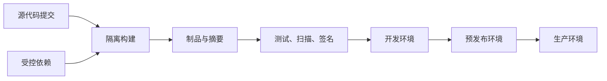

# 制品管理

源代码通过编译、测试和打包后，会形成容器镜像、软件包、压缩包、固件或模型等可交付对象。这些对象统称为制品（Artifact）。如果团队只保存源代码，却无法回答“生产环境运行的是哪次构建、由什么依赖生成、是否经过扫描”，交付链仍然不可重现，也很难在事故中快速回退。

制品管理解决的是二进制供应链中的存储、寻址、访问、晋级、保留与审计问题。本章不把制品仓库当成大容量网盘，而是把它视为构建与运行环境之间的可信边界。

**重点掌握**：不可变制品、摘要寻址、代理仓库、构建一次后逐级晋级，以及最小权限发布。

## 学习目标 {#learning-objectives}

完成本章后，你应能够：

- 区分源代码、构建缓存、制品、发布版本和部署配置。
- 用名称、版本、摘要和元数据唯一描述一次构建输出。
- 解释托管、代理和聚合仓库如何控制依赖流向。
- 比较 Artifactory、Nexus Repository 和 Cloudsmith 的部署边界与运维成本。
- 在本机 Nexus Repository 中发布并校验一个不可覆盖的测试制品。
- 为生产仓库设计权限、晋级、保留、签名、审计和灾难恢复策略。

## 前置知识 {#prerequisites}

- 熟悉 [版本控制系统](version-control-systems.md) 中的 Git 提交与标签。
- 理解 [CI/CD 工具](ci-cd-tools.md) 中的构建流水线和环境晋级。
- 若管理容器镜像，应先学习 [容器](containers.md) 与 [容器编排](container-orchestration.md)。
- 生产凭据应采用 [机密管理](secret-management.md) 中的方法，不写入仓库或流水线脚本。

## 核心原理 {#core-principles}

### 制品是已验证的构建结果 {#artifacts-are-verified-build-outputs}

一次交付通常涉及四类对象：

- **源代码**：用于产生构建结果，可由提交标识定位。
- **依赖**：构建时读取的第三方或内部组件，应锁定版本与摘要。
- **制品**：构建输出，例如 `app-1.4.2.jar`、Python wheel 或 OCI 镜像。
- **部署配置**：说明把哪个制品以何种参数运行在哪个环境。

生产部署不应重新从同一份源代码构建。即使提交不变，基础镜像、依赖解析器、编译器和时间戳也可能使输出发生变化。更可靠的流程是“构建一次，多环境晋级”：CI 生成一个制品并完成基础验证，测试、预发布和生产环境引用同一摘要，只改变该制品的状态和部署配置。



### 名称、版本与摘要各司其职 {#names-versions-and-digests}

制品坐标通常包含命名空间、名称、版本和格式，例如 Maven 的组、模块和版本，或 OCI 的仓库名与标签。版本便于人类沟通，但版本或标签可能被错误地覆盖；内容摘要则由字节计算得出，内容变化时摘要必然变化。

因此应同时保留：

- **版本**：表达兼容性或发布意图，例如 `2.3.1`。
- **摘要**：表达精确内容身份，例如 `sha256:...`。
- **源信息**：提交 ID、构建任务、构建器和依赖锁文件。
- **验证信息**：测试结果、软件物料清单（SBOM）、漏洞扫描、签名和来源证明。

!!! note "标签不是不可变标识"
    `latest`、`stable` 或环境标签适合作为可移动指针，不适合作为审计证据。部署记录应保存实际解析出的摘要；回退时也应选择已验证摘要，而不是重新解析旧标签。

### 三类仓库形成依赖边界 {#three-repository-types}

制品平台通常提供以下逻辑仓库：

- **托管仓库（Hosted/Local）**：保存组织自己发布的制品。
- **代理仓库（Proxy/Remote）**：按需缓存上游内容，并集中执行允许列表、超时和审计策略。
- **聚合仓库（Group/Virtual）**：用一个客户端入口组合多个托管与代理仓库。

客户端只访问聚合入口，可以减少配置漂移；平台管理员则能明确依赖从哪个上游进入。代理缓存提升可用性，但不能自动保证上游内容可信。首次下载仍需校验签名、摘要、许可证和恶意内容，缓存命中也不能替代持续漏洞评估。

### 发布、晋级和删除是状态机 {#publish-promote-and-delete-state-machine}

成熟的制品生命周期不是“上传后永久保留”，而是一组受控状态：

1. CI 使用发布身份上传候选制品，仓库拒绝覆盖已有版本。
2. 扫描器和测试系统附加证据，不修改制品字节。
3. 发布流程把通过策略的同一摘要晋级到更高信任级别。
4. 部署系统只读取符合环境策略的仓库或标签。
5. 保留策略清理不可达、过期且不受法律保留约束的对象。

晋级可以表现为元数据状态变化、仓库间服务端复制，或为同一 OCI 清单增加标签。关键不在具体动作，而在于不能重新打包，也不能丢失摘要与证据的关联。

### 完整性不等于真实性 {#integrity-is-not-authenticity}

摘要能发现内容是否改变，却不能证明内容由可信构建者产生。签名把身份与摘要关联，来源证明记录构建过程，SBOM 描述包含的组件。验证方应依据策略检查这些证据，而不是仅确认“仓库里存在这个文件”。

可信链还取决于构建器、身份系统、密钥、仓库管理员和部署端。仓库是其中一个控制点，不是供应链安全的全部。

## 制品平台 {#artifact-platforms}

### JFrog Artifactory {#jfrog-artifactory}

**替代方案**。Artifactory 是支持多种软件包格式的制品平台。其常见抽象是本地仓库、远程仓库和虚拟仓库，分别对应组织制品、上游代理和统一入口。构建信息可以把模块、依赖、环境和流水线关联起来；漏洞分析与策略能力通常还会与 JFrog 平台中的其他组件配合。

适合重点评估的场景包括：

- 一个组织需要统一管理 Maven、npm、PyPI、NuGet、OCI 等多种格式。
- 已有 JFrog 平台工作流，希望让构建信息、分发和安全证据共享同一体系。
- 需要自托管、云托管或混合拓扑，并愿意承担相应的平台治理成本。

选型时不要只比较“支持多少格式”。还应验证高可用方式、对象存储一致性、跨站点复制、权限模型、API 限额、插件或平台组件的授权边界，以及元数据导出能力。

### Sonatype Nexus Repository {#sonatype-nexus-repository}

**重点掌握**。Nexus Repository 使用托管、代理和组仓库组织多格式制品。它易于用单节点启动，适合学习依赖代理和内部发布，也可按官方支持范围构建生产部署。

需要注意：

- 不同格式对路径、元数据和删除的语义不同，不能把所有仓库当作通用文件目录。
- Community Edition 与商业版、不同版本之间的高可用和治理能力可能不同，应以拟采用版本的官方文档为准。当前 Community Edition 还设有组件数和每日请求数限制，超过限制会暂停新增组件；选型与容量测试必须核对届时条款和限额。
- JVM、Blob 存储和数据库的容量规划是独立问题；只监控磁盘总量不足以发现元数据或垃圾回收瓶颈。

### Cloudsmith {#cloudsmith}

**按需学习**。Cloudsmith 是托管式制品管理服务，提供多格式仓库、上游代理、访问控制和策略能力。团队不必运行仓库控制面，适合希望减少自托管负担、需要向外部分发软件，或成员分布较广的场景。

采用托管服务并不意味着无需治理。应确认：

- 数据驻留、合规、服务可用性和支持承诺是否满足要求。
- 构建与部署环境访问服务时的出口网络、延迟和流量费用。
- 服务中断时关键依赖是否有受控缓存或应急读取路径。
- 身份联合、短期令牌、客户访问授权和离职回收是否能自动化。
- 包元数据、审计记录和制品能否按迁移计划完整导出。

## 选型比较 {#selection-comparison}

| 维度 | Artifactory | Nexus Repository | Cloudsmith |
| --- | --- | --- | --- |
| 主要交付模型 | 自托管与厂商托管均可评估 | 常用于自托管，也应核对官方托管选项与版本能力 | 托管服务 |
| 运维责任 | 自托管时需负责升级、存储、数据库和高可用 | 自托管时需负责 JVM、Blob、数据库、备份和升级 | 厂商负责服务控制面，用户仍负责身份、策略和网络 |
| 工作流特点 | 多格式、虚拟仓库和平台化构建信息 | 托管、代理、组仓库模型直接，便于逐步引入 | 快速开通、外部分发与云服务集成便利 |
| 主要约束 | 平台能力与授权组合较多，需验证实际版本 | 大规模与高可用能力需按版本和支持范围验证 | 依赖外部服务、网络出口和数据治理条款 |
| 迁移关注点 | 构建信息、属性、权限和复制规则 | Blob、组件元数据、路径和组仓库顺序 | 批量导出、令牌替换、域名与客户端缓存 |

最终选择应从工作负载反推：列出格式、制品数量和增长率、单对象大小、读写比、地域、恢复目标、身份来源、外部客户以及法规要求，再用真实包做概念验证。不要用总下载次数代替峰值吞吐，也不要假设各产品中同名的“仓库”具有完全相同的语义。

??? tip "迁移成本如何实测"
    选择一个包含快照版、正式版、签名、SBOM 和删除标记的小型数据集。分别验证上传、代理缓存、搜索、权限拒绝、导出和重新导入，记录客户端配置变化及摘要是否保持一致。这样比只迁移几个普通文件更容易暴露格式元数据和权限映射问题。

## 最小实践：在本机发布不可覆盖制品 {#minimal-practice-publish-an-immutable-artifact-locally}

本实践在 Docker 中运行单节点 Nexus Repository，只监听回环地址。它用于理解托管仓库、发布身份和摘要校验，不是生产部署方案。

!!! warning "仅用于隔离实验"
    Nexus 首次启动会生成管理员密码。不要把 `8081` 暴露到公共网络，不要复用真实密码，也不要把本节的单节点和本地卷配置用于生产。镜像固定到已核验摘要以使实验可重复；实际使用前应选择仍受支持并完成安全评审的版本。

### 1. 启动 Nexus {#start-nexus}

准备至少约 4 GiB 可用内存，然后执行：

```bash
docker volume create roadmap-nexus-data
docker run --detach \
  --name roadmap-nexus \
  --publish 127.0.0.1:8081:8081 \
  --volume roadmap-nexus-data:/nexus-data \
  sonatype/nexus3:3.95.0@sha256:c47083c9e77d87cd7f7c1111a68b53e758644deb54aba2235c8de1b40eebb09a

attempt=0
until curl --fail --silent http://127.0.0.1:8081/service/rest/v1/status \
  >/dev/null; do
  attempt=$((attempt + 1))
  if [ "${attempt}" -ge 60 ]; then
    printf '%s\n' 'Nexus did not become ready within five minutes.' >&2
    exit 1
  fi
  sleep 5
done
```

读取一次性初始密码，并访问 `http://127.0.0.1:8081/` 完成向导：

```bash
docker exec roadmap-nexus cat /nexus-data/admin.password
```

在界面中完成以下设置：

1. 审阅 Community Edition EULA，只在同意后接受，再更换管理员密码并禁用匿名访问；未接受时不能上传或下载新组件。
2. 创建名为 `lab-raw` 的 `raw (hosted)` 仓库。
3. 将 Deployment policy 设为禁止重新部署，以阻止相同路径被覆盖。
4. 创建仅包含 `lab-raw` 浏览和读取权限的角色，以及只增加新增权限的发布角色。
5. 创建临时用户 `lab-reader` 和 `lab-publisher`，前者只授予读取角色，后者授予读取与发布角色。

具体权限名称会随版本显示为类似 `nx-repository-view-raw-lab-raw-browse`、`read` 和 `add`。不要给任一用户 `delete`、`edit` 或全局管理权限。

### 2. 发布并验证 {#publish-and-verify}

在临时目录创建测试内容，通过受限用户上传。`curl --user lab-publisher` 会交互式读取密码，避免把密码写进命令历史或 URL。

```bash
LAB_DIR="$(mktemp -d)"
printf '%s\n' 'roadmap artifact lab' >"${LAB_DIR}/hello.txt"

curl --fail --user lab-publisher \
  --upload-file "${LAB_DIR}/hello.txt" \
  http://127.0.0.1:8081/repository/lab-raw/handbook/hello/1.0.0/hello.txt

curl --fail --silent --show-error --user lab-reader \
  --output "${LAB_DIR}/downloaded.txt" \
  http://127.0.0.1:8081/repository/lab-raw/handbook/hello/1.0.0/hello.txt

cmp "${LAB_DIR}/hello.txt" "${LAB_DIR}/downloaded.txt"
printf 'verified: %s\n' "$(shasum -a 256 "${LAB_DIR}/downloaded.txt" | cut -d ' ' -f 1)"
```

再次执行上传命令应收到拒绝覆盖的响应；这正是正式版本需要的保护。快照制品若确有覆盖需求，应放到独立仓库，使用独立保留规则，不能降低正式仓库策略。

### 3. 清理 {#cleanup}

先在 Nexus 界面删除两个临时用户，再清理只属于本实验的资源：

```bash
[ -n "${LAB_DIR:-}" ] && rm -rf -- "${LAB_DIR}"
docker stop --time 120 roadmap-nexus
docker rm roadmap-nexus
docker volume rm roadmap-nexus-data
```

删除卷会永久删除本实验的 Nexus 数据，执行前应确认名称为 `roadmap-nexus-data` 且不包含其他用途的数据。

## 生产实践 {#production-practices}

### 仓库与权限分层 {#repository-and-permission-layers}

- 按格式、信任级别和生命周期划分仓库，不要只按团队任意拆分。
- 将读取、代理管理、发布、晋级、删除和平台管理拆成不同角色。
- CI 使用工作负载身份或短期令牌；人类管理员启用多因素认证，紧急账号离线保管并定期演练。
- 生产部署身份只有读取已晋级制品的权限，不能上传或删除。
- 外部客户下载使用独立授权、到期时间和速率限制，不能共享内部构建令牌。

### 固定依赖与受控上游 {#pinned-dependencies-and-controlled-upstreams}

- 使用依赖锁文件并校验摘要；代理仓库只是稳定入口，不是版本锁。
- 明确允许的上游域名，阻止客户端绕过代理直接访问公共仓库。
- 防范依赖混淆：内部命名空间应受控，解析顺序不应让同名公共包优先。
- 对新包、异常发布者、许可证变化和已知漏洞实施策略，但保留有审批和时限的例外流程。
- 为上游故障定义行为：是只允许已缓存内容，还是在审计后开放临时通道。

### 晋级与可追溯性 {#promotion-and-traceability}

每个生产摘要至少应能追溯到：

- 源代码提交和受保护的发布请求。
- 构建器身份、流水线运行 ID 和构建参数。
- 直接与传递依赖、基础镜像摘要以及 SBOM。
- 测试、漏洞扫描、许可证检查和人工审批结果。
- 签名与来源证明的验证策略。
- 部署过的环境、时间、变更单和当前保留原因。

证据应引用制品摘要，而不是只引用可能移动的版本标签。重新扫描发现新漏洞时，更新评估结果即可，不应修改旧制品内容。

### 容量、保留与成本 {#capacity-retention-and-cost}

容量模型至少考虑：平均制品大小、每日新增版本、复制因子、代理命中率、保留时间、垃圾回收延迟和备份增量。保留策略应区分正式版、快照版、拉取缓存和法律保留对象。

删除一般分为标记、元数据清理和 Blob 回收多个阶段。仓库显示已删除，不代表存储立即释放；反之，直接删除对象存储中的 Blob 可能破坏元数据。必须通过产品支持的 API 和任务执行清理。

### 可靠性、备份与恢复 {#reliability-backup-and-recovery}

- 高可用节点若共享同一数据库、对象存储和身份服务，这些依赖仍是共同故障点。
- 同时备份 Blob 与元数据，并使用产品规定的一致性方法；两者时间点不一致可能无法恢复。
- 定期在隔离环境恢复，验证随机抽样制品的摘要、权限和下载路径。
- 为仓库定义 RPO 与 RTO。代理缓存通常可重建，内部唯一制品则可能要求异地副本。
- 升级前检查格式迁移、数据库兼容和回退限制，先用生产数据规模的副本演练。

### 可观测性 {#observability}

除 CPU、内存和磁盘外，还应监控：

- 发布与下载的成功率、延迟、吞吐和各状态码。
- 上游请求延迟、缓存命中率、限流和证书到期时间。
- Blob 增长、孤儿对象、任务队列、数据库连接和垃圾回收。
- 权限拒绝、管理员操作、令牌使用位置和异常批量下载。
- 从制品上传到可部署之间的策略等待时间。

告警必须关联用户影响和处置动作。例如“可用空间将在保留窗口内耗尽”比固定的磁盘 80% 告警更可操作。

## 常见误区 {#common-misconceptions}

### 把 Git 仓库当二进制仓库 {#using-git-as-a-binary-repository}

大文件会膨胀克隆和历史，Git 也缺少包格式索引、代理缓存和保留语义。Git LFS 可缓解部分大文件问题，但不能替代制品供应链治理。

### 每个环境重新构建 {#rebuilding-for-each-environment}

这样会让测试对象与生产对象不同。应晋级同一摘要，并把环境差异放在部署配置中。

### 依赖 `latest` 回退 {#depending-on-latest-for-rollback}

移动标签无法证明过去指向什么。部署记录与回退清单应保存摘要。

### 允许发布用户覆盖正式版本 {#allowing-release-users-to-overwrite-versions}

覆盖会使相同版本代表不同字节，破坏缓存、审计和回退。需要修复时发布新版本；快照覆盖应与正式仓库隔离。

### 只做漏洞扫描 {#only-scanning-for-vulnerabilities}

扫描器可能有漏报、数据库延迟和上下文误判。还需要来源、签名、依赖锁定、最小权限、审计和响应流程。

### 备份了对象存储就认为可恢复 {#assuming-object-storage-backups-ensure-recovery}

缺少数据库、配置、密钥和一致性时间点时，Blob 集合通常不能直接还原成可用仓库。恢复演练才是备份有效性的证据。

## 动手练习 {#hands-on-exercises}

1. **设计仓库拓扑**：为一个同时使用 Maven、npm 和 OCI 的团队画出托管、代理、聚合入口及允许的流向。结果应确保开发机不能直接访问公共上游，生产身份只能读取已晋级摘要。
2. **验证不可变性**：完成最小实践后修改 `hello.txt`，尝试覆盖 `1.0.0`，再发布为 `1.0.1`。记录两个版本的 SHA-256 和服务器响应。
3. **制定保留策略**：给出正式版、分支快照、拉取缓存和法律保留对象的不同规则，并说明如何避免删除仍被生产部署引用的摘要。
4. **恢复抽样**：在隔离实例恢复一次备份，随机选择五个制品，对比坐标、摘要、签名和权限。结果应形成可重复的恢复记录，而不只是“服务能启动”。
5. **做一次产品验证**：用同一小型数据集分别验证候选平台的代理、拒绝覆盖、权限审计和导出，记录功能依赖的版本或授权，避免只依据宣传页面评分。

## 完成检查 {#completion-checklist}

- [ ] 能解释版本标签与内容摘要的差异。
- [ ] 能区分托管、代理和聚合仓库。
- [ ] 能说明为什么应构建一次并晋级同一制品。
- [ ] 能为 Artifactory、Nexus Repository 和 Cloudsmith 指出适用场景与主要约束。
- [ ] 已发布、下载并校验一个本机制品，且确认正式路径不能覆盖。
- [ ] 能设计不允许生产身份上传的最小权限模型。
- [ ] 能把生产制品追溯到提交、构建、SBOM、签名和验证结果。
- [ ] 已为容量、保留、监控、备份和恢复定义可验证方法。

## 官方延伸阅读 {#official-further-reading}

- [OCI Distribution Specification](https://github.com/opencontainers/distribution-spec/blob/main/spec.md)：OCI 内容上传、拉取和摘要校验的开放规范。
- [SLSA Specification](https://slsa.dev/spec/v1.2/)：软件供应链完整性与构建来源证明框架。
- [Sigstore Cosign 文档](https://docs.sigstore.dev/cosign/signing/overview/)：基于摘要签名与验证 OCI 对象。
- [SPDX 规范](https://spdx.github.io/spdx-spec/)：软件物料和许可证信息的开放标准。
- [JFrog Artifactory 文档](https://jfrog.com/help/r/jfrog-artifactory-documentation)：仓库、构建信息、权限与运维说明。
- [Sonatype Nexus Repository 文档](https://help.sonatype.com/en/sonatype-nexus-repository.html)：仓库类型、格式、安全和管理指南。
- [Cloudsmith 文档](https://docs.cloudsmith.com/)：仓库、上游、权限、策略和 API 说明。
