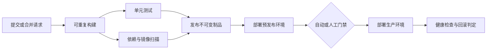

# CI/CD 工具

持续集成（Continuous Integration，CI）把代码合并、构建和验证变成可重复的自动化过程；持续交付（Continuous Delivery）保证候选版本随时可以发布，持续部署（Continuous Deployment）则进一步自动把通过门禁的版本送入生产环境。工具只是执行载体，真正需要掌握的是可验证、可追踪、可回滚的交付系统。

本章先建立流水线、制品和执行器的共同模型，再比较 Railway、Buildkite、TeamCity、Jenkins、GitLab CI/CD、CircleCI、Octopus Deploy 与 GitHub Actions。产品名称仅用于客观说明，实际选型还要结合团队已有平台和合规边界。

## 学习目标

完成本章后，你应当能够：

- 区分持续集成、持续交付和持续部署，并画出一次变更的交付路径。
- 把构建、测试、安全检查、制品发布和环境部署拆成有依赖关系的作业。
- 解释托管控制面、自托管执行器和全自托管平台的信任边界。
- 针对八种工具说明适用场景、主要约束和迁移成本。
- 编写并运行一条最小 CI 流水线，定位失败作业并读取日志。
- 为生产流水线设置最小权限、人工门禁、并发控制、超时和回滚策略。

## 前置知识

- 先掌握 [版本控制系统](version-control-systems.md) 中的提交、分支、标签与合并。
- 熟悉 [版本控制托管](vcs-hosting.md) 中的拉取请求和仓库权限模型。
- 部署容器工作负载时，建议先学习 [容器](containers.md)。
- 基础设施及主机状态应由 [配置管理](configuration-management.md) 等声明式流程维护，避免在流水线中临时手改服务器。

## 核心原理

### 从提交到部署

典型流水线是一个有向无环图（DAG），不是一串只能顺序执行的脚本。没有依赖关系的测试可以并行；部署必须依赖不可变制品和必要门禁。



关键对象如下：

- **触发器**：代码推送、合并请求、标签、定时任务、API 或上游流水线事件。
- **流水线与作业**：流水线描述整体交付过程，作业是可独立调度的执行单元，步骤在作业内通常顺序运行。
- **执行器**：Runner、Agent 或 Worker 提供计算环境。执行器读取代码和凭据，因此属于高价值信任边界。
- **制品**：编译包、容器镜像、清单或签名证明。应只构建一次，再把同一摘要的制品逐级提升。
- **门禁**：测试、策略、审批和变更窗口共同决定能否继续，不应仅以“脚本退出码为零”代表可发布。
- **部署记录**：关联提交、制品摘要、配置版本、操作者、目标环境和结果，为审计与回滚提供依据。

!!! note "持续交付不等于持续部署"
    持续交付要求主干上的候选版本始终处于可发布状态，但允许人工决定何时进入生产。持续部署才会让每个通过门禁的变更自动上线。高风险业务采用持续交付并不代表自动化程度较低。

### 构建一次，逐级提升

如果预发布和生产环境分别重新构建，同一提交可能解析到不同依赖或基础镜像。更可靠的过程是：

1. 在受控环境中构建制品。
2. 生成版本、哈希、软件物料清单（SBOM）和签名证明。
3. 测试该制品，而不是测试工作区里的另一份代码。
4. 以摘要而非可变标签把同一制品提升到后续环境。
5. 部署后验证服务级指标，失败时恢复上一已知良好版本。

制品的保存和代理策略将在 [制品管理](artifact-management.md) 中继续展开。

### 控制面与执行面

托管 CI 通常由厂商维护调度、界面和日志，作业运行在厂商临时执行器或团队自托管执行器上。自托管平台则由团队同时维护控制器、数据库、插件和执行节点。

选择自托管执行器可以访问内网资源和定制硬件，但也意味着团队要负责补丁、隔离、扩缩容和残留数据清理。来自外部贡献者的代码不应在持有生产网络权限的持久执行器上运行。

## 工具全景

### Railway

**按需学习**。Railway 更接近托管应用平台：它可以连接代码仓库或容器镜像，完成构建、部署、域名、变量和运行服务管理。它适合小团队快速交付 Web 服务、Worker 和数据库依赖，省去大量底层平台维护。

需要重点辨别其构建与部署边界。复杂测试仍可在仓库 CI 中完成，再让 Railway 部署已经验证的镜像。使用 Git 触发部署时，应确认预览环境、生产分支、健康检查和回滚行为；平台变量不能替代完整的 [机密管理](secret-management.md) 策略。平台抽象带来速度，也会增加网络模型、构建缓存和运行环境方面的迁移成本。

### Buildkite

**替代方案**。Buildkite 提供托管控制面，Agent 运行在团队自己的主机、虚拟机或 Kubernetes 中。流水线步骤通常保存在仓库 YAML 中，动态流水线还可以由前置步骤生成并上传。

这种分离适合需要内网访问、专用硬件或严格数据驻留的团队。代价是 Agent 池的镜像、补丁、弹性和隔离均由使用者负责。应按信任级别拆分队列，限制 Agent Token，避免让不可信拉取请求与发布作业共享机器。

### TeamCity

**替代方案**。JetBrains TeamCity 采用 Server 与 Build Agent 架构，支持构建配置、模板、依赖链、测试历史和 Kotlin DSL。它常见于 JVM、.NET 或既有 JetBrains 工具链较重的组织，也可管理通用构建。

Kotlin DSL 能让流水线配置进入版本控制，但 Server 数据库、升级兼容性、Agent 镜像与许可证仍需治理。依赖链应明确区分“快照依赖”和“制品依赖”，否则不同构建产生的输出可能被错误组合。

### Jenkins

**按需学习**。Jenkins 是可扩展的自托管自动化服务器，Controller 负责调度和配置，Agent 执行任务，`Jenkinsfile` 可用声明式或脚本式 Pipeline 描述过程。它的插件生态和可定制性适合大量遗留集成及特殊环境。

灵活性也形成主要风险：插件依赖、长期在线节点、控制器备份和脚本审批都需要持续维护。不要在 Controller 上执行普通构建；应使用短生命周期 Agent、限制插件数量、把共享逻辑放入经过评审的 Shared Library，并定期验证从备份恢复。

### GitLab CI/CD

**重点掌握**。GitLab CI/CD 将仓库、合并请求、环境和流水线集成在同一平台。`.gitlab-ci.yml` 定义阶段或 DAG 作业，GitLab Runner 提供 Shell、Docker、Kubernetes 等执行方式；`rules`、Environment、Protected Branch 和 Protected Variable 可控制发布路径。

它适合已经使用 GitLab 托管代码的团队。应避免无边界地复用共享 Runner，谨慎处理 `include` 的外部模板版本，并用 `needs` 表达真实依赖以减少等待。自托管 GitLab 还需承担整个平台、数据库、对象存储和 Runner 的容量与升级工作。

### CircleCI

**替代方案**。CircleCI 使用 `.circleci/config.yml` 描述 Job、Workflow、Executor、缓存和 Workspace。托管执行环境可以快速启动，也支持 Self-hosted Runner；Orb 用于复用参数化配置。

它适合需要成熟 SaaS CI、并行测试和多种执行器的团队。引入 Orb 前应检查维护者和版本，缓存键要包含锁文件哈希，Workspace 只传递当前工作流所需文件。迁移时要评估 CircleCI 配置语法、信用额度计算和上下文（Context）权限模型。

### Octopus Deploy

**按需学习**。Octopus Deploy 主要关注持续交付的后半段：把已经生成的包或镜像组织为 Release，通过 Lifecycle 推进到多个 Environment，并用 Deployment Process、Runbook、Approval 和 Variable Scope 控制部署。执行可由 Worker 完成，也可通过 Tentacle 与目标主机通信。

它适合多环境、审计严格、发布与构建职责分离的组织，尤其是需要标准化应用部署和运维 Runbook 的场景。不要把编译塞进部署步骤；应由 CI 产生带版本的不可变制品，再由 Octopus 编排推广。需额外维护项目模型、变量作用域、Worker/Tentacle 连通性和许可证。

### GitHub Actions

**重点掌握**。GitHub Actions 的 Workflow 位于 `.github/workflows/`，由仓库事件触发；Job 在 GitHub-hosted 或 Self-hosted Runner 上执行，Action 是可复用步骤，Environment 可配置审批和受保护机密。

它适合代码已经托管在 GitHub 的项目，Marketplace 也降低了常见集成成本。第三方 Action 本质上是在 Runner 中执行的代码，生产流水线应固定到完整提交哈希并审查来源。为工作流显式设置 `permissions`，发布到云平台时优先使用 OpenID Connect（OIDC）换取短期凭据，而不是保存长期 Access Key。

## 选型比较

先决定平台责任边界，再比较功能清单。以下分类不是绝对限制，而是常见起点。

| 场景 | 候选入口 | 主要收益 | 首要成本 |
| --- | --- | --- | --- |
| GitHub 仓库的一体化自动化 | GitHub Actions | 事件、权限和评审体验紧密集成 | Action 供应链与用量治理 |
| GitLab 仓库的一体化 DevSecOps | GitLab CI/CD | 仓库、流水线、环境统一 | Runner 及自托管平台运维 |
| 托管调度、执行留在内网 | Buildkite、CircleCI 自托管 Runner | 控制面省运维，执行面可定制 | Agent 隔离与网络治理 |
| 大量遗留或高度定制流程 | Jenkins、TeamCity | 插件、模板和既有积累丰富 | 升级、备份和扩展维护 |
| 快速托管应用 | Railway | 从代码到运行服务路径短 | 平台边界与迁移约束 |
| 跨多环境的独立部署平台 | Octopus Deploy | 发布、审批、Runbook 和审计清晰 | 额外平台及过程建模 |

实际评审至少回答这些问题：

- 执行器能否在一次作业后销毁？不可信代码与发布任务是否物理或逻辑隔离？
- 是否支持所需操作系统、CPU 架构、GPU、内网和数据驻留区域？
- 流水线配置能否评审、复用、测试并锁定外部依赖版本？
- 环境审批、审计日志、OIDC、细粒度权限和机密遮盖是否满足合规要求？
- 并发、队列等待、缓存、日志、存储和许可证的总成本如何计算？
- 导出构建历史、制品和配置是否可行？迁移会绑定哪些产品特有语法？

## 最小实践：可重复的 Python CI

这个示例只有标准库测试，不访问云资源，不使用机密，也不执行部署。先在本地运行，再把相同命令交给 GitHub Actions。示例工作流对仓库只有读取权限。

创建如下文件：

```text
ci-demo/
├── .github/
│   └── workflows/
│       └── ci.yml
├── calculator.py
└── test_calculator.py
```

`calculator.py`：

```python
def add(left: int, right: int) -> int:
    return left + right
```

`test_calculator.py`：

```python
import unittest

from calculator import add


class CalculatorTest(unittest.TestCase):
    def test_add(self) -> None:
        self.assertEqual(add(2, 3), 5)


if __name__ == "__main__":
    unittest.main()
```

`.github/workflows/ci.yml`：

```yaml
name: ci

on:
  pull_request:
  push:
    branches: [main]

permissions:
  contents: read

concurrency:
  group: ci-${{ github.ref }}
  cancel-in-progress: true

jobs:
  test:
    runs-on: ubuntu-24.04
    timeout-minutes: 5
    steps:
      - name: Check out source
        uses: actions/checkout@3d3c42e5aac5ba805825da76410c181273ba90b1 # v7.0.1
      - name: Set up Python
        uses: actions/setup-python@5fda3b95a4ea91299a34e894583c3862153e4b97 # v7.0.0
        with:
          python-version: "3.14.7"
      - name: Run unit tests
        run: python -m unittest discover -v
```

本地验证不会产生外部资源：

```bash
cd ci-demo
python3 -m unittest discover -v
```

预期看到 `Ran 1 test` 和 `OK`。把文件提交到自己的测试仓库后，打开拉取请求即可看到 `test` 作业。故意把期望值改为 `6`，确认作业失败并能从日志定位断言，再恢复为 `5`。

!!! warning "固定引用仍要持续更新"
    示例把官方 Action 固定到带版本注释的完整提交哈希，避免标签移动后静默改变执行代码。生产仓库还应由依赖更新工具提出升级请求，并在合并前核对新提交确实来自原 Action 仓库的预期版本。

同一测试命令可移植到其他工具；变化主要发生在触发器、执行器和配置语法，而不应重新发明测试逻辑。

## 生产实践

### 安全与供应链

- 默认把流水线令牌权限设为只读，只为单个发布作业增加所需权限。
- 使用 OIDC、Vault 动态凭据或云工作负载身份获取短期权限；机密生命周期参见 [机密管理](secret-management.md)。
- 外部拉取请求不读取仓库机密，不进入内网 Runner，不复用可信构建缓存。
- 第三方 Action、Orb、插件、容器镜像和模板锁定不可变版本，升级通过评审。
- 为制品生成 SBOM、来源证明和签名；部署时验证摘要与签名，而非只相信标签。
- 保护主分支、发布标签和生产 Environment，审批者不能审批自己未经评审的变更。

### 可靠性与发布控制

- 每个作业设置超时；只对网络抖动等瞬态失败做有限重试，不用重试掩盖不稳定测试。
- 使用并发组避免同一环境被两个发布同时修改，并让新提交取消已经过时的验证流水线。
- 将数据库变更设计为前后兼容的扩展/收缩过程，使应用回滚不会被新模式阻断。
- 采用滚动、蓝绿或金丝雀发布，基于 [可观测性](observability.md) 信号自动暂停或回滚。
- 定期演练 Runner 中断、控制面不可用、错误制品和回滚，记录恢复时间。

### 性能、成本与可维护性

- 先测量队列等待、执行时长、成功率和重跑率，再决定并行度与执行器规模。
- 缓存只保存可重新生成且不敏感的内容；缓存键包含操作系统、工具版本和锁文件哈希。
- 复用模板应有版本和契约。不要把所有仓库强制耦合到一个随时变化的中央脚本。
- 将日志、测试报告、覆盖率和部署事件按保留策略归档，避免无限保留调试输出。
- 跟踪部署频率、变更前置时间、变更失败率和恢复时间，但不要把指标变成个人绩效排名。

## 常见误区

**“安装了 CI 工具就实现了持续交付”**：如果构建不可重复、测试不可信、制品会被覆盖或没有回滚，工具只能更快地重复不稳定过程。

**每个环境重新构建**：这破坏了已测试对象与生产对象的一致性。应提升同一制品，仅替换受控的环境配置。

**所有作业共用一个高权限 Runner**：一次依赖投毒或恶意拉取请求就可能横向进入生产。应按代码信任级别和目标环境隔离执行器。

**把机密写进 YAML 后依赖日志遮盖**：提交历史和缓存仍可能泄漏值，遮盖规则也并非万能。应撤销泄漏凭据并改用短期身份。

**追求一条巨型流水线**：无关作业串行会延长反馈时间，任何局部失败都迫使全部重跑。使用 DAG、可复用组件和清晰制品契约拆分。

**无条件重试失败测试**：绿色结果可能只是概率事件。隔离不稳定测试、记录负责人并修复根因。

## 动手练习

1. 完成最小实践，在拉取请求中分别观察成功和失败的检查结果。
2. 增加一个并行的 `syntax` 作业，运行 `python -m compileall .`，确认它不依赖测试作业。
3. 为工作流增加仅在 `main` 分支运行的 `package` 作业，生成压缩包并计算 SHA-256；不要部署到外部环境。
4. 任选两个候选工具，用同一组维度比较执行器边界、权限、审计、价格模型和迁移路径。
5. 设计一次生产发布失败演练，写出触发回滚的信号、决策者、操作步骤和验证条件。

## 完成检查

- [ ] 能准确区分 CI、持续交付和持续部署。
- [ ] 能解释触发器、作业、执行器、门禁和不可变制品的关系。
- [ ] 能说明 Railway、Buildkite、TeamCity、Jenkins 的主要定位与运维责任。
- [ ] 能说明 GitLab CI/CD、CircleCI、Octopus Deploy、GitHub Actions 的主要定位与约束。
- [ ] 已在本地运行测试，并在测试仓库中得到可解释的 CI 结果。
- [ ] 能为不可信代码、发布作业和生产凭据划分信任边界。
- [ ] 能提出包含超时、并发控制、审批、验证和回滚的发布方案。

## 官方延伸阅读

- [Railway Docs](https://docs.railway.com/)
- [Buildkite Documentation](https://buildkite.com/docs)
- [TeamCity Documentation](https://www.jetbrains.com/help/teamcity/teamcity-documentation.html)
- [Jenkins User Documentation](https://www.jenkins.io/doc/)
- [GitLab CI/CD Documentation](https://docs.gitlab.com/ci/)
- [CircleCI Documentation](https://circleci.com/docs/)
- [Octopus Deploy Documentation](https://octopus.com/docs)
- [GitHub Actions Documentation](https://docs.github.com/en/actions)
- [GitHub Actions 安全加固](https://docs.github.com/en/actions/security-for-github-actions/security-guides/security-hardening-for-github-actions)
- [OpenID Connect Core 1.0](https://openid.net/specs/openid-connect-core-1_0.html)
