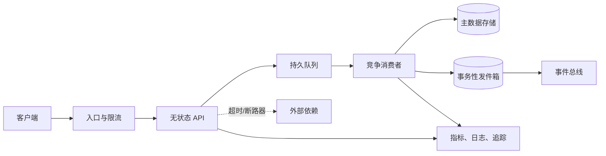

# 云设计模式

云平台提供弹性计算、托管数据服务、消息系统和自动化 API，但“用了云产品”不等于“具备云架构”。分布式系统会出现部分失败、网络延迟、重复消息、并发更新、配额和成本波动；跨区域部署还会面对更高延迟与一致性权衡。云设计模式（Cloud Design Patterns）是这些重复问题的可迁移解法及其适用条件。

模式不是复制即用的产品清单。每个模式都在吞吐、延迟、一致性、可用性、复杂度和成本之间做交换。采用前应从用户旅程、服务级目标（SLO）、恢复点目标（RPO）、恢复时间目标（RTO）和故障模型出发，采用后则必须用故障注入与运行指标验证假设。

**通用主题**：本章按可用性、数据管理、设计与实现、管理与监控四类问题组织。分类用于学习，一个实际方案往往同时涉及多类模式。

## 学习目标 {#learning-objectives}

完成本章后，你应能够：

- 从依赖、状态和故障域画出系统故障模型，而不是只画正常请求路径。
- 使用超时、退避重试、断路器、舱壁、健康端点和优雅降级提高可用性。
- 根据一致性需求选择幂等、事务性发件箱、Saga、CQRS、事件溯源或分片等数据模式。
- 使用队列削峰、竞争消费者、异步请求-响应、防腐层、Sidecar 和 Strangler Fig 演进系统。
- 以基础设施即代码、部署单元、领导者选举、外部配置、聚合日志与分布式追踪治理运行系统。
- 解释每项模式增加的延迟、状态、操作面、成本和新的失败方式。
- 运行一个本地幂等消费者，验证重复消息不会重复产生业务效果。

## 前置知识 {#prerequisites}

- 熟悉 [云服务商](cloud-providers.md) 中的计算、存储、网络、地域与可用区概念。
- 理解 [基础设施置备](provisioning.md) 中声明式资源和变更计划。
- 掌握 [容器编排](container-orchestration.md) 中的副本、调度、健康检查与滚动更新。
- 能使用 [可观测性](observability.md) 中的指标、日志和追踪描述系统状态。
- 了解 [GitOps](gitops.md) 中期望状态和持续协调，有助于理解自动修复与配置治理。

## 先定义约束，再选择模式 {#define-constraints-before-patterns}

### 从用户目标反推可靠性 {#derive-reliability-from-user-goals}

先描述关键用户旅程，例如“用户提交订单后 2 秒内得到可追踪的接收结果”。再定义：

- **SLI/SLO**：成功率、延迟、数据新鲜度或正确性目标。
- **RTO**：故障后可接受的最长恢复时间。
- **RPO**：可接受的数据丢失时间窗口。
- **一致性**：哪些读必须立即看到写，哪些可以最终一致。
- **负载**：平均值、峰值、突发持续时间、单租户热点和增长率。
- **法规与边界**：数据驻留、删除、审计、密钥和供应商约束。

“四个九可用”不能单靠多副本获得。它要求年度不可用预算约 52.6 分钟，并覆盖应用、依赖、变更和人为操作。每个关键依赖的目标、冗余和降级路径必须支持端到端目标。

### 建立故障模型 {#build-a-failure-model}

至少枚举：实例崩溃、可用区不可达、地域中断、网络分区、高延迟、依赖限流、凭据过期、消息重复或乱序、存储满、错误发布与运营误操作。然后标注系统对每种故障是停止、重试、降级、切换还是等待人工处理。



该图表达了几个关键边界：队列吸收突发但增加延迟；消费者必须处理重复；数据库与事件之间需要一致性策略；外部依赖必须有期限与降级；每一段都要可观测。

### 用六个维度评估模式 {#evaluate-patterns-across-six-dimensions}

1. **正确性**：是否保持业务不变量，失败与重放会发生什么。
2. **可用性与延迟**：故障时继续服务还是快速失败，正常路径增加多少跳。
3. **一致性**：强一致、会话一致还是最终一致，用户会看到哪些中间状态。
4. **扩展性与隔离**：热点如何处理，故障和租户是否互相影响。
5. **可运维性**：新增哪些队列、控制器、状态机、告警和人工补偿。
6. **成本与可迁移性**：空闲容量、跨区流量、存储放大、专有 API 和数据搬迁成本。

## 可用性模式 {#availability-patterns}

可用性不是“永不失败”，而是系统在规定条件下继续提供足够正确的服务，并能在预算内恢复。冗余、故障检测和恢复机制必须同时存在；只有副本，没有隔离和验证，仍可能被同一错误同时击穿。

### 超时与截止期限 {#timeouts-and-deadlines}

所有远程调用都可能无限等待。调用方应设置连接超时、每次尝试超时和端到端截止期限。下游应接收并尊重剩余期限，避免在上游已经放弃后继续消耗资源。

权衡：超时过短会把正常慢请求误判为失败，过长则占满线程、连接和队列。应根据延迟分布、用户目标和下游处理预算设置，并监控由哪一层触发超时。

### 有界重试与指数退避 {#bounded-retries-and-exponential-backoff}

瞬时网络错误、限流或服务切换可能通过重试恢复。重试应满足：操作可安全重放、错误被明确判为暂时性、次数与总时长有上限、使用指数退避和随机抖动，并计入端到端期限。

权衡：重试提高瞬时故障下的成功率，却增加负载和尾延迟。所有客户端同步重试会形成重试风暴。服务端可通过 `Retry-After` 提示恢复时间；客户端仍需总预算。非幂等写入应先引入幂等键。

### 断路器 {#circuit-breaker}

断路器根据近期失败或慢请求把调用状态从关闭切换为打开，暂时快速失败；等待后进入半开，用少量请求试探恢复。它保护调用方资源，也给下游恢复时间。

权衡：阈值不当会在少量波动时误打开，或在真正故障时反应过慢。断路器是本地判断，不代表依赖全局不可用；应按目标、错误类型和调用池隔离统计。它也不能代替超时，因为没有超时就无法及时计入失败。

### 舱壁隔离 {#bulkhead-isolation}

舱壁（Bulkhead）将线程池、连接池、队列、实例或租户容量分区，使一个工作负载耗尽资源时不拖垮全局。例如为在线请求和批处理设置独立消费者池，为高风险租户设置并发上限。

权衡：隔离缩小爆炸半径，却会降低资源共享效率，某一分区拥塞时其他分区可能闲置。分区应根据风险和优先级设置，并保留可控的借用或动态调整机制。

### 健康端点与自动修复 {#health-endpoints-and-automatic-repair}

存活检查回答“进程是否需要重启”，就绪检查回答“是否能接收流量”，启动检查保护慢启动过程。深度健康检查若同步探测全部下游，可能在依赖波动时把所有实例同时摘除；就绪逻辑只应包含接收请求必需的本地条件和经过设计的关键依赖。

自动修复适合已知、可重放且受限的动作，例如替换无状态实例。对数据损坏、未知故障和跨区切换，应设置保护条件和人工升级路径，避免自动化扩大事故。

### 优雅降级与静态稳定性 {#graceful-degradation-and-static-stability}

当个性化服务不可用时返回基础内容、缓存数据或稍后处理回执，比整个请求失败更可用。静态稳定性强调故障时不依赖立即创建新资源，例如预留足够实例跨可用区承载单区故障，而不是假设故障发生后一定能扩容。

权衡：降级结果可能陈旧或功能受限，必须向用户表达；预留容量增加常态成本。降级路径也要持续测试，否则只会在事故中第一次运行。

### 多可用区与多地域 {#multi-zone-and-multi-region}

多可用区副本能处理局部基础设施故障，但数据库仲裁、负载均衡、身份和部署系统仍可能是共同故障点。多地域可降低大范围故障风险并接近用户，却引入数据复制延迟、冲突、跨区费用和更复杂的发布。

主动-被动地域通常更易保持单写一致性，但切换慢且备用容量利用率低；主动-主动提高地域可用性和就近访问，却要求分区所有权、冲突解决或可接受最终一致。选型必须由 RPO、RTO 和业务写入语义决定，而不是追求地域数量。

## 数据管理模式 {#data-management-patterns}

分布式数据的难点不是选哪种数据库，而是保持业务不变量、处理并发与重复，并让数据生命周期可治理。跨服务强事务成本高且可用性受协调者影响，最终一致则把中间状态和补偿复杂度暴露给应用。

### 幂等消费者与幂等键 {#idempotent-consumers-and-idempotency-keys}

可靠消息处理常采用“至少一次”交付，消费者可能在完成业务写入后、确认消息前崩溃，从而再次收到同一消息。消费者应使用稳定消息 ID，在与业务变更相同的原子边界内记录已处理标识；重复消息返回既有结果。部分系统能在限定边界内提供更强保证，但不能据此假设外部副作用也恰好发生一次。

API 写入也可要求客户端提供幂等键，将键、请求摘要与结果关联。若同一个键对应不同请求，应拒绝而不是复用旧结果。

权衡：去重记录占用存储，需要定义作用域和保留期。保留期短于消息可能重放的时间时，旧重复仍会生效；全局永久去重则成本很高。

### 事务性发件箱 {#transactional-outbox}

服务既要更新数据库又要发布事件时，先写数据库再发消息会在两步之间崩溃。事务性发件箱（Transactional Outbox）把业务变更和待发事件写入同一数据库事务，再由独立发布器读取发件箱并发送，成功后标记。

权衡：它消除了数据库写入与“记录待发送”之间的双写窗口，但发布仍可能重复，因此消费者必须幂等。发件箱会增长，需要索引、清理、积压监控和事件顺序策略。数据库变更数据捕获可减少轮询，但增加专用基础设施和迁移约束。

### Saga 与补偿事务 {#saga-and-compensating-transactions}

Saga 将跨服务业务事务拆成多个本地事务，每一步发布结果并触发下一步；失败时执行补偿动作。编排式 Saga 由中央状态机决定流程，便于查看与超时；协同式 Saga 由事件驱动，耦合较松但全局路径难以理解。

补偿不是数据库回滚。例如退款可能产生费用，取消发货也可能已经太晚。每一步都应定义幂等、超时、重试、不可补偿状态和人工介入。Saga 提高参与服务的自治与可用性，代价是用户会看到“处理中”等中间状态，测试空间也显著扩大。

### 命令查询职责分离（CQRS） {#command-query-responsibility-segregation}

该模式使用不同模型处理写入意图与读取视图。写模型保护不变量，读模型按查询优化，并可由事件异步更新。

权衡：CQRS 能独立扩展读写、降低复杂查询对事务模型的影响，但引入模型同步、最终一致、重建和版本管理。如果普通 CRUD 数据库已满足负载与模型需求，不应仅为“架构先进”拆分。

### 事件溯源 {#event-sourcing}

事件溯源把不可变领域事件作为事实来源，当前状态由事件重放得到。它适合强审计、时态查询和需要重建多种投影的领域。

权衡：事件模式演进、重放成本、隐私删除、外部副作用和调试都更复杂。事件是业务事实，不应直接等同于数据库行变化。快照可加速重建，但必须能从受信事件验证；删除法规也要求加密擦除、裁剪或专门的数据设计。

### 分片、分区与热点 {#sharding-partitioning-and-hotspots}

分片按键把数据和负载分散到多个节点或服务单元。好的分区键具有足够基数、访问均匀，并支持主要查询；坏的键会形成热点或要求跨分片聚合。

权衡：分片提升容量和故障隔离，却让跨分片事务、唯一约束、二级索引、再平衡和备份更困难。开始时可在逻辑层保留租户或键边界，但只有容量或隔离证据支持时才物理分片。对超大租户可采用专属分片，避免平均哈希掩盖热点。

### 缓存旁路 {#cache-aside}

缓存旁路（Cache-Aside）由应用先查缓存，未命中时查主存储并回填。写入时更新数据库后删除或更新缓存。

权衡：缓存降低读取延迟和数据库负载，却引入陈旧数据、击穿和不一致。TTL 不是一致性保证；热点键应使用请求合并、抖动过期或预热，不能在缓存故障时让所有请求无界回源。缓存内容也需要访问控制和敏感数据策略。

## 设计与实现模式 {#design-and-implementation-patterns}

### 队列削峰 {#queue-based-load-leveling}

队列将接收与处理解耦，在突发时暂存工作，消费者按可持续速率处理。入口可快速返回任务 ID，再由客户端查询或接收回调。

权衡：队列平滑负载，却把同步结果变成最终完成，增加排队延迟、重复、乱序、死信和积压治理。容量规划要关注到达率与处理率：长期到达率大于处理率时，再大的队列也只会延迟失败。

### 竞争消费者 {#competing-consumers}

多个消费者从同一队列取任务，可按积压和处理时长水平扩展。消息可见性超时或租约使崩溃消费者的任务重新可用。

权衡：并行提高吞吐，但破坏全局顺序，并可能争用同一数据。需要按键分区、幂等、并发上限和背压。自动扩缩容应同时考虑队列深度、最老消息年龄、单任务耗时和下游容量，不能只追求清空队列。

### 异步请求-响应 {#asynchronous-request-reply}

对耗时操作，服务先验证并返回 `202 Accepted` 与任务位置，后台处理后更新状态。客户端轮询、使用 webhook 或订阅事件获取完成结果。

权衡：减少长连接和网关超时，但 API 必须定义任务状态、过期、取消、幂等、授权与结果保留。`202` 只代表已接收，不代表成功；监控应覆盖从接收到最终完成的端到端时间。

### 防腐层 {#anti-corruption-layer}

防腐层（Anti-Corruption Layer）在新领域模型与旧系统/外部供应商之间转换协议、模型和错误，阻止外部概念渗入核心业务。

权衡：隔离变化并利于替换供应商，但增加一次网络跳、映射维护和潜在吞吐瓶颈。转换逻辑要有契约测试、版本策略和原始关联 ID；不能把所有业务规则堆进一个“万能适配器”。

### 绞杀者模式（Strangler Fig Pattern） {#strangler-fig-pattern}

Strangler Fig 模式在旧系统前建立可路由边界，逐个能力将流量迁移到新实现，确认稳定后移除旧路径。它降低一次性重写风险，并允许按业务价值分批交付。

权衡：过渡期会同时运营新旧系统，数据所有权和双写尤其危险。优先明确每类数据的唯一写入者，使用事件或变更捕获同步只读副本，并设置迁移完成和删除旧路径的条件，避免“临时层”永久存在。

### 边车（Sidecar）与大使代理（Ambassador） {#sidecar-and-ambassador}

Sidecar 将日志代理、配置刷新或网络代理等辅助能力与应用部署在同一调度单元；Ambassador 代理代表应用访问外部服务，集中协议转换、认证或路由。

权衡：它们跨语言复用能力并独立升级，但共享资源和生命周期，可能拖慢启动或成为请求路径故障点。若每个实例都不需要独立辅助进程，节点级守护进程或托管网关成本可能更低。[服务网格](service-mesh.md) 是网络 sidecar/代理大规模治理的一种实现，不代表所有 sidecar 都需要网格。

### API 网关与后端适配 {#api-gateway-and-backend-adaptation}

API 网关集中处理外部认证、限流、路由和协议边界；面向前端的后端（Backend for Frontend，BFF）则为 Web、移动端等不同客户端聚合合适的数据。

权衡：边界统一可减少客户端复杂度，但网关不应承载大量领域逻辑，否则会成为组织和性能瓶颈。BFF 减少客户端往返，却可能复制逻辑；共享规则应下沉到领域服务，客户端特定编排保留在 BFF。

## 管理与监控模式 {#management-and-monitoring-patterns}

管理与监控不是部署后的附加工作，而是使前述模式可安全运行的反馈系统。不能观测队列积压、补偿状态或断路器，就无法判断系统是在降级、恢复还是悄悄丢失工作。

### 基础设施即代码与不可变基础设施 {#infrastructure-as-code-and-immutable-infrastructure}

网络、计算、数据服务和策略应通过版本化声明创建，变更先预览差异再执行。对无状态计算优先替换镜像或实例，而不是登录后原地修改，以减少配置漂移。

权衡：声明提高可重复性，但状态导入、提供商版本和破坏性计划仍需治理。不可变替换会增加临时容量和发布时间；数据库等有状态组件仍需要兼容迁移，不能简单删除重建。

### 部署戳与单元化架构 {#deployment-stamps-and-cell-based-architecture}

部署戳（Deployment Stamp）把计算、数据和配置作为可重复单元，按租户、地域或容量部署多个实例。每个单元限制规模和故障影响，控制面负责分配流量和生命周期。

权衡：故障隔离与水平扩展更清晰，但单元间容量不均、版本漂移、租户迁移和全局查询更复杂。部署戳应有最大容量、放置策略和自动化创建流程；手工复制环境会失去模式价值。

### 领导者选举与租约 {#leader-election-and-leases}

定时任务或协调器运行多副本时，可通过带过期时间的租约选出一个领导者执行单例工作。领导者必须续租，失去租约后停止写入。

权衡：租约提高控制面可用性，却无法单独防止暂停进程恢复后继续写入。对关键写入使用单调递增的栅栏令牌（Fencing Token），存储端拒绝旧领导者令牌。时钟偏差、网络分区和续租延迟都必须纳入设计。

### 外部配置与功能开关 {#external-configuration-and-feature-flags}

把环境配置与构建制品分离，可让同一制品跨环境晋级。配置需要模式校验、版本、审计和分阶段发布。功能开关可把代码部署与功能启用分离，支持小范围验证和快速关闭。

权衡：动态配置降低重新构建成本，却创建了一条绕过部署流程的变更通道。权限、评审、缓存失效和回退同样重要。功能开关必须有负责人和到期时间，长期叠加会扩大测试组合。

### 聚合日志与关联标识 {#aggregated-logging-and-correlation-identifiers}

实例是短暂的，日志应从标准输出或受控接口集中采集，使用结构化字段表达时间、级别、服务、版本、追踪 ID 和错误类型。关联标识帮助跨异步边界串联一次业务流程。

权衡：详细日志利于排障，但高吞吐、敏感数据和高基数索引会增加风险与成本。对令牌、个人信息和支付数据默认不记录；设置采样、保留、访问审计和删除策略。日志采集失败不应阻塞关键业务请求。

### 指标、分布式追踪与合成探测 {#metrics-distributed-tracing-and-synthetic-probes}

指标适合聚合趋势和告警，追踪适合定位跨服务单次请求，日志提供离散上下文，合成探测则从用户边界持续验证关键旅程。三者通过服务、版本、地域和追踪上下文关联。

权衡：全量追踪和无限标签不可持续。按 SLO 选择指标，采用头部/尾部采样并控制属性；对低流量关键错误保留足够样本。合成探测会产生真实写入时，应使用隔离租户、可识别数据和清理流程。

### 健康模型与自动化运行手册 {#health-models-and-automated-runbooks}

组件健康、依赖健康和用户旅程健康应分别建模。仪表盘展示状态，告警只覆盖需要行动且有负责人/运行手册的条件。对可安全重复的恢复动作可自动化，例如扩展消费者或切换只读模式；高影响操作需要审批和停止条件。

权衡：自动化降低平均恢复时间，也会以机器速度扩大错误。运行手册应包含前置检查、作用范围、成功信号、回滚和升级路径，并通过定期演练验证，而不是只存一段命令。

## 组合模式：可靠订单接收 {#composite-pattern-reliable-order-ingestion}

假设订单 API 在峰值每秒接收 2,000 个请求，支付服务可持续处理每秒 800 个请求，要求用户 2 秒内获得接收结果，订单最终完成目标为 10 分钟。

可以组合：

1. 入口用限流保护租户公平性，要求幂等键。
2. API 在本地事务中创建 `PENDING` 订单和发件箱记录，快速返回订单 ID。
3. 发件箱发布器把任务发送到持久队列；重复发布由消费者去重。
4. 竞争消费者按支付系统安全容量扩展，并使用超时、有界重试和断路器。
5. Saga 记录支付、库存和发货步骤；不可自动补偿时进入人工队列。
6. 查询模型异步更新订单进度，API 明确返回“处理中”而不是虚假成功。
7. 监控最老消息年龄、端到端完成时间、重复率、补偿率和各租户拒绝率。

### 架构权衡 {#architectural-tradeoffs}

- 队列让系统吸收短时峰值，但输入长期超过 800/s 时积压持续增长，必须限流、扩容或降低接收承诺。
- 快速返回提高入口可用性，却把“请求成功”改为“已接受”，客户端和客服流程都要支持中间状态。
- 发件箱保证订单与待发事件同时记录，但增加表、发布器和清理任务；消息仍需幂等处理。
- Saga 避免长时间锁定跨服务资源，却引入补偿和人工处理，业务不能承诺瞬时强一致。
- CQRS 提升高频状态查询能力，但读模型有延迟；页面要显示更新时间，强一致核对仍访问权威写模型。
- 多地域主动接收若共享订单键，需要明确地域所有权或冲突规则；否则同一幂等键可能在两个地域分别生效。
- 为单区故障预留容量会增加成本，但依赖故障后即时扩容可能不满足 RTO。应比较常态冗余成本与不可用预算价值。

模式组合会相互作用。断路器打开后，消费者不应高速重试；队列积压扩大时，扩容不能超过数据库和支付依赖容量；降级页面不能把未完成订单显示为成功。架构评审应验证整体状态机，而不是逐个模式打勾。

## 选型比较 {#selection-comparison}

| 目标约束 | 优先评估 | 接受的代价 | 不适用信号 |
| --- | --- | --- | --- |
| 短暂依赖故障且操作可重放 | 有界重试、退避和抖动 | 尾延迟与额外下游负载 | 非幂等副作用、长期过载 |
| 依赖持续失败时保护调用方 | 超时、断路器与舱壁 | 快速失败、隔离容量利用率下降 | 没有可靠失败分类或降级结果 |
| 突发输入超过短期处理能力 | 队列削峰、竞争消费者 | 最终完成、重复和积压治理 | 长期输入率超过最大处理率 |
| 跨服务维持业务流程 | Saga、幂等与发件箱 | 中间状态、补偿和状态机运维 | 必须即时强一致且可由单库事务完成 |
| 读写负载和模型显著不同 | CQRS，必要时配合事件投影 | 读延迟、模型同步和重建 | 普通 CRUD 已满足目标 |
| 单区故障仍需继续服务 | 多可用区与静态稳定性 | 常态冗余成本 | 共享依赖仍在单一故障域 |
| 地域级 RTO/RPO 无法由恢复满足 | 主动-被动或主动-主动多地域 | 复制、冲突、演练和跨区费用 | 业务无法定义写入所有权与一致性语义 |
| 渐进替换遗留系统 | 防腐层与 Strangler Fig | 过渡期双栈运维和路由复杂度 | 没有数据唯一写入者和退役条件 |

表格给出的是候选起点，不是固定组合。选型时先排除不满足正确性的不适用方案，再用代表性负载和故障演练比较 SLO、恢复、操作人数及总成本。更复杂的模式只有在简单方案无法满足已量化约束时才值得采用。

## 最小实践：幂等的至少一次消费者 {#minimal-practice-idempotent-at-least-once-consumer}

本实践只使用 Python 3 标准库和本地 SQLite。脚本模拟同一事件被投递两次，并在一个事务中同时写入业务结果和去重记录。它不会访问网络，也不会修改项目文件以外的持久数据。

### 1. 创建实验脚本 {#create-experiment-script}

在临时目录创建 `consumer.py`：

```python
import sqlite3
import sys
from pathlib import Path

database = Path(sys.argv[1])

connection = sqlite3.connect(database, timeout=30)
connection.executescript(
    """
    CREATE TABLE IF NOT EXISTS accounts (
        account_id TEXT PRIMARY KEY,
        credits INTEGER NOT NULL
    );
    CREATE TABLE IF NOT EXISTS processed_messages (
        consumer TEXT NOT NULL,
        message_id TEXT NOT NULL,
        processed_at TEXT NOT NULL DEFAULT CURRENT_TIMESTAMP,
        PRIMARY KEY (consumer, message_id)
    );
    INSERT OR IGNORE INTO accounts(account_id, credits)
    VALUES ('demo-account', 0);
    """
)


def handle(message_id: str, account_id: str, amount: int) -> bool:
    try:
        with connection:
            connection.execute(
                "INSERT INTO processed_messages(consumer, message_id) VALUES (?, ?)",
                ("credit-consumer", message_id),
            )
            connection.execute(
                "UPDATE accounts SET credits = credits + ? WHERE account_id = ?",
                (amount, account_id),
            )
        return True
    except sqlite3.IntegrityError:
        return False


event = ("event-0001", "demo-account", 10)
print("first delivery applied:", handle(*event))
print("second delivery applied:", handle(*event))
credits = connection.execute(
    "SELECT credits FROM accounts WHERE account_id = 'demo-account'"
).fetchone()[0]
print("credits:", credits)
connection.close()
```

运行：

```bash
LAB_DIR="$(mktemp -d)"
${EDITOR:-vi} "${LAB_DIR}/consumer.py"
python3 "${LAB_DIR}/consumer.py" "${LAB_DIR}/lab.db"
[ -n "${LAB_DIR:-}" ] && rm -rf -- "${LAB_DIR}"
```

预期输出：

```text
first delivery applied: True
second delivery applied: False
credits: 10
```

关键点是 `processed_messages` 与余额变更处于同一个数据库事务。如果先写余额、后写去重记录，进程在两者之间崩溃就可能重复增加余额。

!!! note "实验边界"
    SQLite 适合演示原子性，不代表生产消息系统配置。生产消费者还要在数据库提交后确认消息、处理可见性超时、并发、死信、毒消息和去重记录保留。所谓“恰好一次”通常只在特定系统边界内成立，端到端副作用仍应按可能重复设计。

### 2. 扩展验证 {#extend-validation}

把第二次事件的 `amount` 改为 `20`，但保留 `message_id`。安全实现应将其识别为冲突，而不仅仅返回“已处理”。为此可在去重表保存请求摘要，重复 ID 到来时比较摘要；不同摘要应记录安全事件并拒绝处理。

## 生产实践 {#production-practices}

### 可靠性与恢复 {#reliability-and-recovery}

- 为每个关键依赖定义超时、失败分类、降级路径和容量边界。
- 跨可用区部署前确认数据仲裁、负载均衡和身份服务没有同域单点。
- 备份必须通过恢复验证；分别测量数据恢复、基础设施重建和流量恢复时间。
- 使用故障注入验证实例、可用区、依赖高延迟、消息重复和凭据过期，而不是只演练进程崩溃。
- 把错误发布视为主要故障源，采用小批次、暂停条件和不可变回退制品。

### 数据正确性 {#data-correctness}

- 明确定义主数据所有者、事件模式、顺序范围和重复处理语义。
- 业务不变量在权威写入边界执行；缓存和读模型不能成为隐含真相源。
- 为 Saga 中间状态、补偿失败和人工处理建立可查询队列及服务级目标。
- 进行在线模式迁移时遵循扩展/收缩：先兼容新增字段，再迁移数据，最后删除旧字段。
- 加密、驻留、保留和删除要求要覆盖副本、缓存、事件日志、备份与可观测数据。

### 安全 {#security}

- 服务与自动化使用短期工作负载身份和最小权限；不把静态云密钥放进镜像或配置仓库。
- 网络分段不是身份授权的替代品；敏感操作同时验证身份、权限和请求上下文。
- 队列、对象存储、备份和遥测都可能包含敏感数据，应加密并记录访问审计。
- 防止 SSRF、租户越权和不受控回调：外部 URL 使用允许规则、独立出口和签名验证。
- 灾难恢复账号和跨地域复制权限爆炸半径很大，应隔离、定期轮换并演练。

### 性能与成本 {#performance-and-cost}

弹性并不等于无限容量。为 API、队列消费者、数据库连接和第三方配额建立联动容量模型。扩展某一层前确认下一层能承受新增并发；无法承受时实施背压或准入控制。

成本模型至少包含常态与故障冗余计算、跨可用区/地域流量、队列请求、日志和追踪字节、备份与事件长期保留。按租户和功能分摊成本，但避免把用户 ID 等无限维度直接放入指标标签。

### 可观测性与运维 {#observability-and-operations}

- 用用户旅程 SLI 告警，同时保留组件饱和度作为诊断信号。
- 异步系统重点监控最老消息年龄和端到端完成时间，仅看队列长度会受任务大小影响。
- 记录每次重试、断路器状态变化、Saga 步骤和补偿结果，但控制敏感信息与基数。
- 发布事件、配置变化和基础设施计划应成为可观测时间线的一部分。
- 告警关联运行手册、所有者和升级路径；定期删除没有行动价值的噪声告警。

### 可维护性与迁移 {#maintainability-and-migration}

优先使用开放协议、可导出的数据格式和清晰适配层，隔离云厂商特有 API。抽象并非越多越好：若为了理论可移植性封装所有服务，可能丢失托管能力并创建自有平台负担。应识别最可能迁移、最昂贵锁定的边界，例如身份、事件格式和大规模数据，而不是追求任意组件随时替换。

每个模式要有采用记录：问题、假设、被否决方案、成功指标、退出条件和负责人。定期检查已无价值的缓存、功能开关、双写和迁移适配层，减少架构沉积。

## 常见误区 {#common-misconceptions}

### 把多可用区当成自动高可用 {#assuming-multi-zone-means-high-availability}

若副本共享单一数据库、部署错误、身份服务或容量不足，多区仍会同时失败。必须验证端到端故障域和单区剩余容量。

### 无限重试提高成功率 {#using-unlimited-retries}

无界重试会占用资源并放大故障。应有总期限、次数、抖动、可重试分类和背压。

### 队列能解决长期容量不足 {#assuming-queues-fix-capacity-shortages}

队列只能吸收有限突发。平均输入持续高于处理能力时，积压和完成时间必然增长。

### 宣称端到端“恰好一次” {#claiming-end-to-end-exactly-once}

事务边界之外仍可能重复调用支付、邮件等副作用。应明确保证边界，并用幂等、去重或对账处理重复。

### 用事件溯源解决所有审计需求 {#using-event-sourcing-for-all-auditing}

普通不可变审计日志可能已经足够。事件溯源改变主存储和领域建模，带来重放、模式演进与删除难题。

### 同时采用 CQRS、Saga 和事件溯源 {#adopting-cqrs-saga-and-event-sourcing-together}

这些模式可以组合，但各自解决不同问题。没有独立需求和运营能力时叠加，只会扩大状态空间。

### 深度健康检查所有依赖 {#deep-health-checking-all-dependencies}

依赖短暂波动可能让所有实例同时不就绪，造成原本局部的故障扩散。就绪条件应基于是否还能安全提供目标能力。

### 只监控资源使用率 {#only-monitoring-resource-utilization}

CPU 正常不代表用户请求完成。必须观察成功率、延迟、数据正确性、积压年龄和业务终态。

### 为可移植性构建最低公分母 {#building-for-the-lowest-common-denominator}

完全回避云原生能力可能增加自建成本，却没有真实迁移收益。应量化退出成本，在关键边界保留可迁移性。

## 动手练习 {#hands-on-exercises}

1. **故障建模**：选择一个现有服务，画出正常路径和五种故障：超时、限流、区域中断、重复消息、错误发布。为每种故障写出检测、自动动作、用户表现和升级条件。
2. **计算重试预算**：为端到端 1 秒的请求设计最多两次尝试，包含连接、处理与退避时间。验证最坏情况不超过上游截止期限，并说明哪些错误不可重试。
3. **扩展幂等实验**：在最小实践中保存请求 SHA-256；同 ID、同内容返回原结果，同 ID、不同内容拒绝并记录冲突。用两个并发进程验证唯一约束。
4. **设计发件箱**：为“创建订单并发布 `OrderCreated`”定义业务表、发件箱表、发布器状态和清理策略。结果应解释发布器崩溃前后为何不会丢事件，以及重复如何处理。
5. **评审多地域方案**：分别设计主动-被动与主动-主动写入，比较 RPO、RTO、延迟、冲突、成本和演练难度，依据业务不变量选择而不是按地域数量选择。
6. **建立异步 SLO**：为队列任务定义接收成功率、最老消息年龄和 95% 完成时间，设计一个下游变慢实验，确认告警先于用户承诺被突破。
7. **清理架构沉积**：盘点功能开关、缓存、旧 API、防腐层和双写路径，为每项记录所有者、用途、成本和删除条件。

## 完成检查 {#completion-checklist}

- [ ] 能从 SLO、RPO、RTO、一致性和负载约束开始设计。
- [ ] 能解释超时、重试、断路器和舱壁如何组合及相互影响。
- [ ] 能判断多可用区、多地域主动-被动和主动-主动的权衡。
- [ ] 能说明幂等、发件箱、Saga、CQRS、事件溯源与分片分别解决什么问题。
- [ ] 已运行重复消息实验，并确认业务效果只发生一次。
- [ ] 能使用队列削峰和竞争消费者，同时识别积压、乱序与下游过载风险。
- [ ] 能用防腐层或 Strangler Fig 设计渐进迁移，并避免无所有者双写。
- [ ] 能解释基础设施即代码、部署戳、领导者选举和外部配置的操作成本。
- [ ] 能为同步与异步用户旅程设计指标、日志、追踪、告警和运行手册。
- [ ] 能针对安全、可靠性、性能、成本和可迁移性给出架构取舍，而非罗列产品。

## 官方延伸阅读 {#official-further-reading}

- [Microsoft Azure Architecture Center：Cloud Design Patterns](https://learn.microsoft.com/en-us/azure/architecture/patterns/)：按问题与权衡整理的云模式目录。
- [AWS Well-Architected Framework](https://docs.aws.amazon.com/wellarchitected/latest/framework/welcome.html)：从运营、安全、可靠性、性能、成本和可持续性评审架构。
- [Google Cloud Architecture Framework](https://cloud.google.com/architecture/framework)：云工作负载架构原则与评审方法。
- [Google SRE Workbook：Implementing SLOs](https://sre.google/workbook/implementing-slos/)：从用户旅程建立 SLI 与 SLO。
- [OpenTelemetry 官方文档](https://opentelemetry.io/docs/)：跨厂商生成和传输指标、日志与追踪遥测。
- [W3C Trace Context](https://www.w3.org/TR/trace-context/)：分布式追踪上下文标准。
- [CloudEvents Specification](https://cloudevents.io/)：跨系统描述事件元数据的开放规范。
- [NIST SP 800-204A](https://csrc.nist.gov/pubs/sp/800/204/a/final)：微服务部署中的安全策略与工程考虑。
