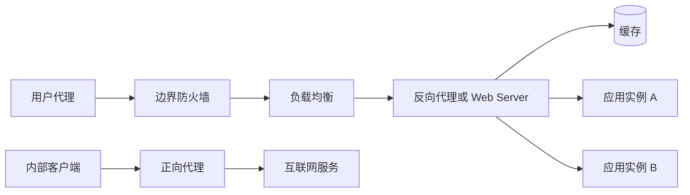

# 常见基础设施服务

应用能够启动，并不等于它已经适合被用户访问。生产流量通常还要经过防火墙、负载均衡器、反向代理和缓存；真正返回内容的组件也可能是静态 Web 服务器、应用服务器或二者的组合。本章把这些组件放回同一条请求链路中，重点说明每一层的职责边界、失效方式和选型依据。

## 学习目标 {#learning-objectives}

完成本章后，你应当能够：

- 根据流量方向区分正向代理与反向代理，并画出请求经过的信任边界。
- 解释缓存键、有效期、失效和一致性之间的关系。
- 区分网络防火墙、主机防火墙与 Web 应用防火墙的能力边界。
- 为一个无状态 HTTP 服务选择四层或七层负载均衡，并配置健康检查。
- 比较 Nginx、Caddy、Tomcat、Apache HTTP Server 与 IIS 的定位和运维约束。
- 在本机运行一个包含双后端和反向代理的最小环境，并验证负载分发。
- 列出入口服务上线前必须落实的安全、可靠性和可观测性措施。

## 前置知识 {#prerequisites}

- 能使用命令行查看端口、进程和日志，参见[终端知识](terminal-knowledge.md)。
- 理解容器端口映射和只读挂载，参见[容器](containers.md)。
- 建议先知道 TCP、HTTP 和 TLS 的基本概念；它们会在[网络与协议](networking-and-protocols.md)中系统讲解。

## 核心原理：从一条请求理解各层职责 {#core-principles-understanding-layers-through-a-request}

入口架构的首要原则是让每一层只承担清晰、可验证的职责。一个常见但并非唯一的链路如下：



图中组件可以合并。例如，云负载均衡器可能同时终止 TLS、执行七层路由和提供 Web 应用防火墙（WAF）；Nginx 或 Caddy 也能同时充当 Web Server、反向代理、缓存和软件负载均衡器。能力可以合并，但职责仍应分别建模，否则出现 `502`、缓存旧数据或连接超时时很难定位责任层。

### 数据面与控制面 {#data-plane-and-control-plane}

代理、负载均衡器和防火墙实际处理连接的部分称为**数据面**；下发路由、证书、访问策略和后端列表的部分称为**控制面**。生产事故经常来自控制面变更，而不是数据面程序崩溃。因此需要同时监控：

- 数据面：吞吐、并发连接、状态码、延迟、重试和丢包。
- 控制面：配置版本、证书期限、变更结果、配置分发延迟和失败回滚。

## 正向代理 {#forward-proxy}

正向代理（Forward Proxy）代表**客户端**访问目标服务。目标站点通常只看到代理出口地址，而不直接看到发起连接的内部主机。企业常用它控制出站访问、审计软件仓库下载、统一内容过滤或让隔离网络通过受控出口访问互联网。

HTTP 客户端可通过 `HTTP_PROXY`、`HTTPS_PROXY` 和 `NO_PROXY` 指定代理。对于 HTTPS，传统 HTTP 代理通常通过 `CONNECT` 建立 TCP 隧道；代理只有在实施 TLS 解密且客户端信任企业证书时才能读取加密内容。SOCKS 代理工作在更通用的连接层，不理解 HTTP 方法和缓存语义。

关键设计点包括：

- **身份与授权**：按用户、工作负载或设备身份授权，不要只依赖容易变化的源 IP。
- **目标限制**：默认拒绝高风险地址范围，尤其是云元数据地址、环回地址和内部控制面。
- **名称解析**：明确 DNS 由客户端还是代理完成，避免策略检查的域名与实际连接地址不一致。
- **绕过列表**：`NO_PROXY` 应精确到必要的主机或网段；过宽会让审计失效，遗漏则可能使内部流量绕远。
- **隐私边界**：TLS 解密会扩大敏感数据暴露范围，必须有明确的合规依据、证书治理和访问审计。

!!! warning "代理不是匿名保证"
    代理仍可能通过认证信息、请求头、日志和流量特征识别客户端。不要把企业代理当作隐私工具，也不要在代理日志中无差别记录令牌、Cookie 或请求正文。

## 反向代理 {#reverse-proxy}

反向代理（Reverse Proxy）代表**服务端**接收客户端请求，再选择内部后端。客户端通常只知道代理的公开地址。它常承担以下职责：

- TLS 终止与证书轮换。
- 基于主机名、路径、方法或请求头的七层路由。
- 请求大小、连接数和速率限制。
- 规范化或增删请求头，例如生成 `X-Request-ID`。
- 压缩、静态文件服务、响应缓存和后端负载均衡。
- 隔离公开网络与应用网络，隐藏后端拓扑。

反向代理必须正确维护“原始客户端信息”。常见协议是 `Forwarded` 或 `X-Forwarded-For`、`X-Forwarded-Proto`、`X-Forwarded-Host`。应用只能信任由**已知上游代理**写入的字段；入口代理应覆盖来自公网的同名头，而不是无条件追加，否则攻击者可能伪造客户端 IP 或 HTTPS 状态。

超时应按调用链逐层收紧。通常客户端超时最大，越靠近后端的代理超时越短，从而给上游留下处理错误和重试的时间。请求是否可重试还取决于幂等性；代理不应自动重放不可安全重复的写请求。

## 缓存 {#caching}

缓存用更快、更近或更便宜的副本换取延迟和源站负载，但同时引入数据陈旧与一致性问题。常见位置包括浏览器缓存、CDN 或边缘缓存、反向代理缓存、应用内缓存和数据库查询缓存。

### 缓存决策的四个问题 {#four-cache-decision-questions}

1. **缓存什么**：优先缓存可公开、读取频繁、生成成本高且可接受短暂陈旧的数据。带身份的响应默认不应进入共享缓存。
2. **用什么作键**：通常至少包含请求方法和规范化后的目标 URI，也就是 scheme、authority（含主机）、路径与查询部分。仅在响应确实随某请求头变化时，才通过 `Vary` 将该头纳入键；无边界地加入 Cookie 会造成缓存碎片。
3. **缓存多久**：HTTP 使用 `Cache-Control` 表达 `max-age`、`s-maxage`、`private`、`no-store` 等约束。`ETag` 和 `Last-Modified` 支持条件请求，命中验证时可返回 `304`。
4. **如何失效**：可使用短 TTL、版本化 URL、主动清除或事件驱动刷新。失效动作必须能够定位具体键并被审计。

缓存未命中时，大量并发请求可能同时回源，形成缓存击穿。可通过请求合并、互斥刷新、过期数据短暂服务（stale-while-revalidate）、随机化 TTL 和后端限流缓解。对于不存在的对象，也可短时缓存明确的 `404`，但必须避免把临时故障长期负缓存。

!!! tip "优先版本化静态资源"
    将内容摘要写入文件名，例如 `app.a1b2c3.js`，然后为资源设置较长有效期。HTML 入口使用短缓存并引用新文件名，通常比频繁执行全站缓存清除更可靠。

## 防火墙 {#firewalls}

防火墙依据网络身份和连接特征允许或拒绝流量。它是缩小暴露面的基础控制，而不是修复应用漏洞的替代品。

- **无状态包过滤**逐包判断源/目标地址、协议和端口，简单快速，但不了解连接上下文。
- **有状态防火墙**跟踪 TCP 连接或 UDP 流的状态，可以允许与已有流量匹配的返回流量。
- **主机防火墙**运行在服务器上，例如 Linux 的 nftables 或 Windows Defender Firewall，用于限制进出单机的流量。
- **网络防火墙或安全组**在子网、虚拟网络或云网卡附近执行策略，便于集中隔离工作负载。
- **WAF**检查 HTTP 层特征，可执行虚拟补丁、机器人控制和请求速率限制，但不能替代输入验证、参数化查询和正确授权。

策略应遵循默认拒绝、最小开放和双向考虑。入站只允许明确的服务端口，出站也应限制到业务所需目标。规则需要记录负责人、理由和过期时间，并定期通过流日志确认是否仍被使用。

??? note "网络地址转换不是防火墙"
    NAT 会改写地址或端口，但“从外部暂时无法直接发起连接”只是拓扑效果，不是完整安全策略。端口转发、IPv6、同网段攻击和已有连接都可能绕过这种假设。应显式配置并审计允许规则。

## 负载均衡 {#load-balancing}

负载均衡器把请求分配给多个可用后端，以扩展容量并隔离单实例故障。它不能凭空创造可用性：如果所有后端共享同一电源、可用区、数据库或错误配置，入口层仍有共同故障点。

### 四层与七层 {#layer-4-and-layer-7}

- **四层负载均衡（L4）**依据 IP、端口和传输层连接转发 TCP 或 UDP。协议开销较小，适合非 HTTP 流量、大吞吐或由后端终止 TLS 的场景。
- **七层负载均衡（L7）**理解 HTTP 等应用协议，可按域名、路径、Header 或 Cookie 路由，也能执行 TLS 终止、重定向和 WAF 策略。功能更多，但资源消耗和配置复杂度更高。

常见分配算法包括轮询、加权轮询、最少连接、最短响应时间和一致性哈希。不要只按“平均请求数”选算法：长连接、请求成本差异、实例规格和缓存局部性都会影响实际负载。

### 健康检查与故障处理 {#health-checks-and-failure-handling}

存活检查只回答“进程是否还能响应”，就绪检查回答“实例现在是否应接收业务流量”。就绪检查应验证关键依赖但保持轻量，避免每秒对数据库执行昂贵查询。下线阈值过低会因瞬时抖动频繁摘除实例，过高又会持续向故障实例发送请求。

实例发布或缩容时应先标记不就绪，再等待连接排空。会话粘滞可以临时兼容本地会话状态，但会造成热点和故障后的会话丢失；更稳妥的设计是让应用无状态，或把会话放入有复制和过期策略的外部存储。

## Web Server 与应用容器 {#web-servers-and-application-containers}

以下产品并非完全同类。选型前先判断需要的是静态内容、通用反向代理、特定语言运行时，还是与操作系统深度集成的服务平台。

### Nginx {#nginx}

**重点掌握**。Nginx 使用事件驱动模型处理大量并发连接，常用于静态文件、反向代理、TLS 终止、HTTP 缓存和软件负载均衡。配置由 `http`、`server`、`location` 等上下文组成；请求 URI 到 `location` 的匹配顺序、`proxy_pass` 是否携带 URI，以及 Header 继承规则都值得专门测试。

Nginx 开源版适合稳定且显式的配置。动态服务发现、主动健康检查和管理 API 等能力要结合具体版本、商业版或外围控制器评估。修改配置后应先运行 `nginx -t`，再优雅重载，使现有工作进程完成连接而不是被强制中断。

### Caddy {#caddy}

**替代方案**。Caddy 的突出能力是自动申请、续期和部署 HTTPS 证书，Caddyfile 对常见站点和反向代理场景较简洁。它也提供结构化 JSON 配置和管理 API，适合自动化控制。

公网自动 HTTPS 依赖域名解析正确、验证端口可达且证书颁发机构可用。生产环境应持久化 Caddy 的数据目录，保护管理接口，设置证书申请速率预案，并在受限网络中明确内部 CA 或外部证书流程。容器每次启动都丢失证书状态会造成重复申请和限额问题。

### Apache HTTP Server {#apache-http-server}

**替代方案**。Apache HTTP Server（`httpd`）是模块化 Web Server，通过 `mod_ssl`、`mod_proxy`、`mod_rewrite` 等模块提供 TLS、代理和重写能力。它支持事件型及其他多处理模块（MPM），也能通过目录级 `.htaccess` 委派配置。

`.htaccess` 便于共享托管，但会增加逐目录查找和分散治理的成本；可控服务器上通常优先把规则放入主配置并禁用不需要的覆盖。应只加载所需模块，显式选择合适 MPM，并用 `apachectl configtest` 验证配置。

### Tomcat {#tomcat}

**按需学习**。Apache Tomcat 是 Java Servlet、Jakarta Server Pages 等规范的实现，核心定位是 Java Web 应用容器，而非 Nginx 或 Apache HTTP Server 的同义替代。它可以直接提供 HTTP 服务，也常放在反向代理之后，由代理处理公网 TLS、静态资源和请求限制。

生产部署应使用受支持的 JDK 与 Tomcat 组合，移除或严格保护 Manager、Host Manager 和示例应用，限制 AJP 连接器，仅开放需要的连接器。线程池、堆内存、垃圾回收和数据库连接池要联合容量规划；只增大 Tomcat 线程数可能把压力转移到数据库。

!!! note "名称容易混淆"
    Apache HTTP Server 与 Apache Tomcat 都属于 Apache 软件基金会项目，但前者是通用 Web Server，后者主要承载 Java Web 应用。`mod_proxy_http` 可以把 HTTP Server 的请求转发给 Tomcat，它们也可以独立使用。

### IIS {#iis}

**按需学习**。Internet Information Services（IIS）是 Windows Server 的 Web Server 角色，与 Windows 身份验证、证书存储、PowerShell 管理和 ASP.NET 托管紧密集成。站点通过绑定关联 IP、端口、主机名和证书；应用程序池提供进程级隔离、身份和回收策略。

应为应用程序池配置最小权限的专用身份，避免把站点目录授予宽泛写权限。上线前检查请求筛选、日志字段、TLS 绑定、空闲回收和故障快速保护。对 ASP.NET Core，通常由 IIS 接收连接，再通过 ASP.NET Core Module 转交给应用进程。

## 选型比较 {#selection-comparison}

可以按以下顺序缩小范围：

1. **先确定协议和运行时**：Java Servlet 应用优先评估 Tomcat；深度依赖 Windows 身份和管理体系时评估 IIS；纯静态或通用 HTTP 入口再比较 Nginx、Caddy 与 Apache HTTP Server。
2. **再确定控制方式**：静态文件式配置强调可审查性；管理 API 或云托管入口更适合频繁变化的后端，但必须保护控制面。
3. **比较证书运营成本**：Caddy 默认自动化程度较高；其他产品也能借助 ACME 客户端或平台证书服务完成自动续期，但集成工作不同。
4. **评估必要模块**：确认认证、缓存、内容重写、动态服务发现和可观测性是否由入口承担。不要仅因产品“功能多”就开启更多模块。
5. **量化迁移成本**：专有重写规则、认证模块、应用程序池模型和运维 API 都可能形成绑定。保留标准 HTTP 行为测试和配置生成源，能降低替换成本。

对于负载均衡，低延迟 TCP 服务可优先评估 L4；需要按 URL 路由、统一 TLS 或 WAF 时使用 L7。云托管负载均衡减少节点维护，但可能产生按小时、规则、容量单位和跨区流量费用；自管软件入口控制力更高，却需要自行解决高可用、升级和容量。

## 最小实践：双后端与 Caddy 反向代理 {#minimal-practice-two-backends-and-caddy-reverse-proxy}

下面的实验只把端口绑定到 `127.0.0.1`，后端只加入临时容器网络。它会启动两个返回不同文本的后端，并让 Caddy 轮询转发。所有命令应在同一个 Shell 中执行；容器使用运行时返回的 ID，避免与已有容器同名。

### 1. 编写配置 {#write-configuration}

在空目录创建 `Caddyfile`：

```caddyfile
:8080 {
    log {
        output stdout
        format console
    }

    header {
        X-Content-Type-Options nosniff
        -Server
    }

    reverse_proxy app-a:5678 app-b:5678 {
        lb_policy round_robin
        health_uri /health
        health_interval 10s
    }
}
```

因为站点地址是 `:8080` 而不是域名，此实验使用本地 HTTP，不触发公网证书申请。生产环境不应照搬这一点。

### 2. 启动隔离环境 {#start-isolated-environment}

需要已经安装 Docker：

```bash
network_name="handbook-infra-$(id -u)-$$-$RANDOM"
network_id="$(docker network create "$network_name")"

app_a="$(docker run --detach --rm \
  --network "$network_id" \
  --network-alias app-a \
  --cap-drop ALL \
  --security-opt no-new-privileges \
  --read-only \
  hashicorp/http-echo:1.0 \
  -listen=:5678 -text="response-from-a")"

app_b="$(docker run --detach --rm \
  --network "$network_id" \
  --network-alias app-b \
  --cap-drop ALL \
  --security-opt no-new-privileges \
  --read-only \
  hashicorp/http-echo:1.0 \
  -listen=:5678 -text="response-from-b")"

proxy="$(docker run --detach --rm \
  --network "$network_id" \
  --publish 127.0.0.1:8080:8080 \
  --cap-drop ALL \
  --security-opt no-new-privileges \
  --read-only \
  --tmpfs /data \
  --tmpfs /config \
  --volume "$PWD/Caddyfile:/etc/caddy/Caddyfile:ro" \
  caddy:2.11-alpine)"
```

示例固定了主版本和次版本以减少意外变化；长期项目还应使用经过验证的补丁版本或镜像摘要，并由依赖更新流程维护。

### 3. 验证路由和响应头 {#verify-routing-and-response-headers}

```bash
for request in 1 2 3 4; do
  curl --fail --silent --show-error \
    --header "X-Request-ID: lab-$request" \
    http://127.0.0.1:8080/
done

curl --include http://127.0.0.1:8080/
docker logs "$proxy"
```

输出应同时出现 `response-from-a` 和 `response-from-b`，响应中应有 `X-Content-Type-Options: nosniff`。停止一个后端后再次请求，可以观察健康检查将其摘除：

```bash
docker stop "$app_a"
sleep 12
curl --fail http://127.0.0.1:8080/
```

### 4. 清理 {#cleanup}

```bash
docker stop "$proxy" "$app_a" "$app_b" 2>/dev/null || true
docker network rm "$network_id"
```

!!! warning "这个实验不等于生产配置"
    实验没有启用 TLS、访问控制、持久证书存储和指标采集。健康端点也只是固定文本，不能证明真实应用已准备好处理业务。

## 生产实践 {#production-practices}

### 安全性 {#security}

- 公网只暴露入口需要的端口，管理 API 和状态页面放在独立管理网络并要求强认证。
- 从可信代理列表推导客户端地址；清除公网请求伪造的转发头。
- 对请求头总大小、正文大小、上传时间、并发连接和请求速率设置边界。
- TLS 私钥由专用机密系统提供，文件权限最小化，证书续期失败需要提前告警。
- Web Server 和插件按支持周期升级，删除默认站点、示例应用、目录列表和不需要的模块。
- WAF 先在观察模式评估误报，再逐步阻断；高风险接口仍需应用层认证、授权和输入校验。

### 可靠性 {#reliability}

- 至少跨两个独立故障域部署入口和后端，确认 DNS、负载均衡控制面和证书服务也没有单点。
- 对配置执行静态检查、预发布流量验证和小批量发布；失败时回滚到已知配置版本。
- 设置连接建立、首字节、空闲和总请求超时，限制重试次数并加入抖动，避免重试风暴。
- 优雅排空连接。发布时先停止接收新请求，再等待在途请求完成，最后终止进程。
- 估算入口过载行为：宁可快速返回可识别的 `429` 或 `503`，也不要无限排队拖垮全部实例。

### 可观测性 {#observability}

最少采集请求量、错误率和延迟分位数，并按路由、后端和状态码聚合。还应关注活动连接、连接队列、TLS 握手失败、健康后端数、缓存命中率、回源延迟和配置重载结果。

访问日志使用结构化格式并带请求 ID，但不要记录凭据、完整 Cookie 或敏感查询参数。让入口把请求 ID 传给应用，再在[日志管理](logs-management.md)和[可观测性](observability.md)体系中关联日志、指标和追踪。

### 成本与容量 {#cost-and-capacity}

入口容量测试要模拟真实响应大小、TLS 新连接比例、长连接和慢客户端。云产品还应计算处理容量单位、规则数、公网 IP、跨区流量和日志存储费用。缓存节省的回源计算和带宽，应与失效复杂度、存储及一致性风险一起评估。

## 常见误区 {#common-misconceptions}

- **把反向代理当作应用安全边界的全部**：它无法判断业务对象是否属于当前用户，授权仍须在应用中执行。
- **信任所有 `X-Forwarded-For`**：攻击者可自行发送该头，导致审计、限流或 IP 授权被绕过。
- **健康检查只访问进程端口**：进程存活时数据库连接池可能已耗尽，应区分存活与就绪信号。
- **给写请求配置无条件重试**：重复扣款或重复创建资源是典型后果。先设计幂等键和去重机制。
- **把所有响应都缓存**：带授权信息、`Set-Cookie` 或用户数据的响应进入共享缓存会造成数据泄露。
- **依赖会话粘滞掩盖状态设计**：扩缩容和故障切换仍会让会话丢失或分布失衡。
- **直接重启入口加载配置**：会中断连接。应先语法校验，再使用优雅重载或滚动替换。
- **混淆 Tomcat 与 Apache HTTP Server**：二者可组合但运行模型、配置和风险面不同。
- **认为用了 NAT 或云安全组就不需要主机防火墙**：多层控制能限制单个配置错误的影响范围。

## 动手练习 {#hands-on-exercises}

1. 修改最小实践，为 `app-a` 设置权重 3、`app-b` 设置权重 1，连续请求至少 40 次并统计分布。结果应大致体现权重，而不是要求精确比例。
2. 为代理增加一个 `/ready` 路由，并使它返回不经过后端的固定 `200`。说明为什么入口自身健康与后端健康需要分别观测。
3. 让一个后端停止 5 秒后恢复，记录从失败到摘除、从恢复到重新加入的时间，评估期间客户端看到的错误数。
4. 为一个包含 `index.html` 和内容摘要文件名的 JavaScript 资源设计 `Cache-Control`。结果应让 HTML 可较快更新，而摘要资源可长期缓存。
5. 画出你熟悉系统的入口链路，标注每个 TLS 终止点、源客户端地址的传递方式，以及每层超时。若无法确定某项，就把它列为待验证风险。

## 完成检查 {#completion-checklist}

- [ ] 能从流量代表哪一方解释正向代理和反向代理的区别。
- [ ] 能说明缓存键、TTL、条件请求和失效策略。
- [ ] 能区分包过滤、主机或网络防火墙与 WAF。
- [ ] 能根据协议与路由需求选择 L4 或 L7 负载均衡。
- [ ] 能解释健康检查、连接排空、重试和会话粘滞的风险。
- [ ] 能说出 Nginx、Caddy、Tomcat、Apache HTTP Server 和 IIS 的主要定位。
- [ ] 已运行最小实践，并从响应与日志验证两个后端都收到流量。
- [ ] 能为入口服务列出安全、可靠性、可观测性和成本检查项。

## 官方延伸阅读 {#official-further-reading}

- [RFC 9111：HTTP Caching](https://www.rfc-editor.org/rfc/rfc9111)
- [RFC 7239：Forwarded HTTP Extension](https://www.rfc-editor.org/rfc/rfc7239)
- [OWASP Web Security Testing Guide](https://owasp.org/www-project-web-security-testing-guide/)
- [Nginx 官方文档](https://nginx.org/en/docs/)
- [Caddy 官方文档](https://caddyserver.com/docs/)
- [Apache HTTP Server 文档](https://httpd.apache.org/docs/)
- [Apache Tomcat 文档](https://tomcat.apache.org/)
- [Microsoft IIS 文档](https://learn.microsoft.com/iis/)
