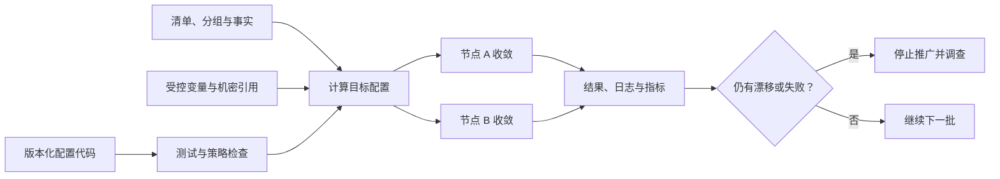

# 配置管理

置备完成的服务器仍需要用户、软件包、配置文件、服务和安全基线。逐台 SSH 修改会产生无法解释的差异，也难以在扩容或灾难恢复时重建。配置管理（Configuration Management）把主机期望状态写成版本化代码，通过重复收敛消除漂移。本章讲清收敛、幂等、推送与拉取模型，并比较 Chef、Ansible、Salt 和 Puppet。

## 学习目标

完成本章后，你应当能够：

- 划分配置管理、基础设施置备、镜像构建、应用发布和机密管理的边界。
- 解释期望状态、收敛、幂等、资源依赖、事实数据与漂移。
- 设计静态或动态清单、环境分组、变量优先级和分批执行策略。
- 说明 Chef 的 resources、recipes、cookbooks、Ohai 与 client-server 模型。
- 使用 Ansible inventory、playbook、module、role、handler 与 check mode。
- 说明 Salt 的 master/minion、states、grains、pillar、requisites 与事件系统。
- 说明 Puppet 的 resources、manifests、classes、modules、catalog、Facter 与 Hiera。
- 在本机运行一个无提权的 Ansible 幂等实践，并用第二次执行结果证明收敛。
- 根据规模、网络、平台、团队能力、安全和迁移成本选择工具。

## 前置知识

- 熟悉 Linux 或 Windows 的用户、权限、软件包和服务，参见[操作系统](operating-system.md)。
- 能使用 SSH 或 WinRM 等远程协议，SSH 原理参见[网络与协议](networking-and-protocols.md)。
- 理解 Git 评审和版本历史，参见[版本控制系统](version-control-systems.md)。
- 已有服务器或云资源通常由[基础设施置备](provisioning.md)创建。

## 配置管理的职责边界

配置管理适合管理操作系统及中间件状态，例如：

- 软件包存在且版本符合策略。
- 用户、组、目录和权限正确。
- 配置文件由模板生成且语法有效。
- 服务已启用、运行，并在配置变化后受控重启。
- 安全基线、日志代理和监控代理持续满足要求。

不宜把所有工作都塞入配置管理：

- 虚拟网络、数据库实例和负载均衡通常交给[基础设施置备](provisioning.md)。
- 大型二进制和系统依赖可在镜像构建阶段安装，以缩短扩容时间。
- 应用版本、流量切换和回滚通常由 [CI/CD 工具](ci-cd-tools.md)负责。
- 凭据应由[机密管理](secret-management.md)系统提供，配置工具只在授权运行时短暂取用。
- 容器内部通常通过重建镜像更新，而不是进入运行容器执行长期配置收敛。

边界并非绝对。关键是同一对象只有一个权威所有者，并记录交接契约。例如 IaC 创建主机和最小启动身份，配置管理安装代理，应用流水线部署版本；三者不能同时修改同一个服务单元。

## 核心原理

### 期望状态与收敛

配置代码声明资源应处于的状态。工具读取主机事实与当前状态，构建资源关系，执行必要变化，再验证结果。第一次运行可能产生变化，第二次在输入和环境不变时应报告无变化，这就是收敛与幂等的可观察证据。



幂等不是“命令执行成功”。反复使用 `shell: echo ... >> file` 每次都会追加内容，即使退出码始终为零。优先使用理解资源状态的模块，例如 package、file、user 和 service；必须执行命令时，增加准确的 `creates`、`unless`、`onlyif` 或状态检查，并明确何时算变化。

### 资源关系与通知

配置资源存在顺序关系：软件包先于配置文件，配置文件变化后才通知服务重载。好的模型表达“因为文件改变，所以服务需要动作”，而不是每次运行都重启服务。重启属于可能影响业务的副作用，应合并通知、分批执行并先做配置语法检查。

循环依赖通常意味着职责划分错误。不要仅通过增加全局顺序解决；先检查资源是否应拆分为独立阶段，或通过稳定接口解耦。

### 推送、拉取与事件模型

- **推送（Push）**：控制节点主动连接目标并执行，例如典型 Ansible。无需常驻客户端，适合按变更触发；控制节点需要网络可达且要处理并发和中断。
- **拉取（Pull）**：节点代理定期向服务端取策略并自行收敛，例如常见 Chef Infra Client 或 Puppet Agent。适合大规模持续纠偏和间歇联网节点；需要部署代理、证书与控制服务。
- **事件驱动**：消息或事件触发目标快速执行，例如 Salt 事件系统。响应及时，但控制面安全和事件风暴需要治理。

这些不是绝对分类。Ansible 可用 pull 模式，Salt 可无主运行，Chef 可本地运行，Puppet 也可手工触发。选型看组织采用的主要运行模式与控制面，不看单一命令是否存在。

### 清单、事实与变量

清单（Inventory）描述目标节点及分组，可来自静态文件、云 API、CMDB 或服务发现。主机名、环境和角色标签应稳定且有唯一来源；动态清单需要缓存、超时和失败策略，不能在返回空列表时把“没有目标”误判为成功。

事实（Facts）是操作系统、地址、内存和平台等观察数据。Chef 使用 Ohai，Ansible 收集 facts，Salt 使用 grains，Puppet 使用 Facter。事实便于跨平台分支，但会增加启动开销，也可能暴露网络和主机信息。只收集需要的数据，不让不可控事实决定高风险权限。

变量通常来自默认值、角色、环境、主机和运行参数。优先级越复杂，越难解释最终配置。保持来源少而明确，提供可查询的解析结果；机密与普通变量分离，避免出现在差异输出和日志中。

### 漂移与持续收敛

手工修改、包自动升级和其他工具都会造成漂移。定期收敛可恢复期望状态，但也可能在事故中覆盖紧急修复。生产流程应要求紧急修改有工单、期限和回写配置代码的责任人。

观察模式、check mode 或报告模式可发现潜在变化，但不是完美预测：命令型资源、自定义模块和运行时条件可能无法准确模拟。对关键配置结合文件完整性、服务指标和端到端验证，而不是只信任工具报告。

## Chef

**按需学习**。Chef Infra 以 resource 描述包、文件、模板、服务等状态，recipe 组合资源，cookbook 封装 recipes、templates、files、attributes 和自定义资源。Chef Infra Client 在节点上编译并收敛 run list；Chef Infra Server 保存策略与节点信息，也可使用本地模式执行。

Chef 执行通常分为编译与收敛阶段。recipe 中的 Ruby 代码在何时求值会影响资源顺序和动态值，不能把所有 Ruby 表达式都当作收敛时执行。通知分立即、延迟等时机，常用于“模板变化后重启服务”；多个延迟通知可在运行末尾合并。

关键组件和实践：

- **Ohai**收集节点自动属性，例如平台、网络和内存。
- **Custom Resources**把重复模式封装为具有明确属性和动作的领域资源。
- **Policyfiles**锁定 cookbook 版本、依赖和 run list，使不同节点执行同一策略制品。
- **Test Kitchen**在临时实例中测试 cookbook，Chef InSpec 验证收敛后的系统控制项。
- **Chef Vault 或 encrypted data bags**属于特定机密分发方案，仍需评估密钥、节点撤权和轮换；大型环境通常与专用机密系统集成。

Chef 适合已经使用 Ruby 生态、需要丰富自定义资源和节点持续拉取的大规模主机环境。运维成本包括 Chef Server、代理升级、证书、cookbook 依赖和 Ruby 调试。应使用策略锁定版本，避免生产节点自动取得未测试 cookbook。

## Ansible

**重点掌握**。Ansible 常从控制节点通过 SSH 管理 Linux 或网络设备，通过 WinRM 或 SSH 管理 Windows。inventory 定义目标，play 把主机组映射到 tasks，module 执行有状态操作，role 与 collection 提供复用和分发边界。

Playbook 使用 YAML 表达，但每个 task 调用模块。优先使用完全限定集合名，例如 `ansible.builtin.copy`，避免不同 collection 出现同名模块。Handler 只在被通知时运行，适合配置变化后的重载；默认在 play 后期执行，若后续任务必须依赖新配置，可在明确位置刷新 handler，但要考虑失败恢复。

常见能力包括：

- **inventory 与动态 inventory 插件**：按环境和角色组织主机。
- **facts 与自定义 facts**：支持平台差异和条件，但不要滥用复杂条件。
- **templates**：通过 Jinja 生成配置；对不可信值进行适当引用与格式校验。
- **roles 与 collections**：组织 defaults、tasks、handlers、modules 和依赖，并固定版本。
- **check mode 与 diff mode**：预览支持这些模式的模块；不能视作实际执行的绝对保证。
- **Ansible Vault**：加密仓库中的静态变量文件，不是动态机密生命周期系统；Vault 密码和解密后的值仍需保护。

Ansible 默认推送、无需目标常驻代理，上手和临时编排直接。规模扩大后要治理控制节点高可用、SSH 连接、forks、执行队列、凭据、审计和长任务中断。使用 `serial`、失败比例与批次健康检查滚动变更，不要一次重启整个集群。

## Salt

**替代方案**。Salt 常由 Salt Master 管理 Salt Minion，通过消息传输和公钥认证执行远程命令、下发状态和处理事件；也可使用 masterless 模式。Salt State（SLS）以 YAML 和 Jinja 等方式描述状态模块，Highstate 汇总节点应应用的目标状态。

核心概念包括：

- **execution modules**执行即时功能，**state modules**描述可收敛状态。临时命令不能替代长期 state。
- **grains**是 minion 提供的相对静态事实，适合平台与角色信息；不能存放机密，也不应被当作不可伪造授权身份。
- **pillar**向目标 minion 提供分层配置和敏感数据。敏感 pillar 仍会在 master 与授权 minion 解密可见，需要保护 external pillar、缓存和日志。
- **requisites**用 `require`、`watch`、`onchanges` 等表达依赖和变化通知。
- **top file**把环境和目标匹配到 states；匹配规则错误可能扩大执行范围。
- **event bus 与 reactor**根据事件触发响应，适合自动修复或编排，但必须防止事件循环、伪造和过宽权限。

Salt 的并行远程执行和事件能力适合大量节点、快速命令与持续配置结合的环境。代价是 master 或消息控制面、密钥接受、版本兼容和 Jinja 渲染安全。接受新 minion key 前核对身份，限制谁能发布命令和读取 job cache；高风险 reactor 先以观察或人工审批模式验证。

## Puppet

**替代方案**。Puppet 使用声明式 manifests 定义 resources、classes 和关系，modules 封装代码、模板与数据。Puppet Server 根据节点 facts 和分类编译 catalog，Puppet Agent 在节点上应用 catalog 并发送报告；也可使用 `puppet apply` 本地执行。

Puppet 默认按 manifest 中的声明顺序应用没有其他关系的资源，但自动关系或显式关系会改变这一顺序，不能把源码位置当作依赖契约。通过引用、箭头或 `require`、`before`、`notify`、`subscribe` 显式表达必要关系。`notify` 和 `subscribe` 支持 refresh 事件，例如配置变化后重启服务。应避免大量阶段和全局顺序，它们会削弱声明式依赖图。

关键组件包括：

- **Facter**收集节点 facts，可增加受控自定义事实。
- **Hiera**按层级分离配置数据与 manifests，便于环境、地点、角色和节点覆盖。
- **Environment 与 Code Manager 或部署流程**管理代码版本，生产环境不应直接跟随未测试分支。
- **PuppetDB**保存 catalog、facts 和报告数据，支持查询与导出资源；其中包含基础设施敏感信息，需要访问控制与保留策略。
- **report 与 noop**支持观察变更和运行结果，但自定义 provider 的模拟能力仍需验证。

Puppet 适合希望使用成熟声明模型、代理周期拉取和集中报告的大规模主机环境。成本包括 Puppet Server、CA、代理、环境发布、PuppetDB 和语言学习。证书自动签名必须严格限制，否则未授权节点可能获得 catalog 中的敏感配置。

## 选型比较

| 维度 | Chef | Ansible | Salt | Puppet |
| --- | --- | --- | --- | --- |
| 常见主模式 | 代理拉取 | 无代理推送 | Master/minion 与事件 | 代理拉取 |
| 配置表达 | Ruby DSL | YAML Playbook 与模块 | YAML/Jinja SLS | Puppet 声明语言 |
| 节点事实 | Ohai | Ansible facts | grains | Facter |
| 配置数据 | attributes、data bags 等 | inventory/group/host vars | pillar | Hiera |
| 突出能力 | 自定义资源、策略与测试生态 | 入口直接、编排与广泛模块 | 高并发远程执行、事件系统 | 声明式 catalog、持续报告 |
| 主要运营成本 | Server、代理、Ruby 与 cookbook | 控制节点、连接、执行队列 | Master、密钥、消息与版本 | Server、CA、代理、PuppetDB |

按以下问题选择：

1. **网络方向**：控制节点能否主动连接每台主机？不能时，代理拉取或中继模型可能更适合。跨隔离区不能为了工具方便永久开放宽泛管理端口。
2. **节点规模与变化速度**：少量主机和按需变更可从 Ansible 开始；大量节点持续纠偏可比较 Chef 或 Puppet；需要高速远程执行和事件响应可评估 Salt。
3. **操作系统与设备**：验证目标 Linux、Windows、网络设备和中间件模块的真实质量，不只看支持列表。
4. **团队能力**：Ruby、YAML/Jinja、Puppet DSL 和控制面运营经验会直接影响故障恢复时间。
5. **安全与审计**：比较证书、短期身份、节点撤权、机密集成、执行审批、日志完整性和控制面高可用。
6. **测试与发布**：候选工具必须证明语法测试、临时实例收敛、第二次无变更、失败恢复、分批推广和报告查询。
7. **迁移成本**：自定义 resource、module、state、class 和数据层级都形成资产。先迁移高价值基线，不要一次重写全部遗留配置。

工具组合需要明确边界。例如 Ansible 可做一次性引导，再由 Puppet Agent 持续收敛；但不要让两者同时管理同一文件和服务。长期存在两套工具会增加培训和控制面成本，应有退出条件。

## 最小实践：本机 Ansible 幂等收敛

该实验只连接本机、使用当前用户、不提权，并且只写入实验目录下的 `build/`。需要已经从可信渠道安装 `ansible-core`。

### 1. 创建清单

在空目录创建 `inventory.ini`：

```ini
[lab]
localhost ansible_connection=local
```

创建 `playbook.yml`：

```yaml
---
- name: Converge a safe local configuration
  hosts: lab
  gather_facts: false

  vars:
    lab_directory: "{{ playbook_dir }}/build"

  tasks:
    - name: Ensure the lab directory exists
      ansible.builtin.file:
        path: "{{ lab_directory }}"
        state: directory
        mode: "0750"

    - name: Render the handbook configuration
      ansible.builtin.template:
        src: handbook.conf.j2
        dest: "{{ lab_directory }}/handbook.conf"
        mode: "0640"
      notify: Report configuration change

    - name: Read the rendered configuration
      ansible.builtin.slurp:
        src: "{{ lab_directory }}/handbook.conf"
      register: rendered_configuration
      changed_when: false

    - name: Assert the expected environment was rendered
      ansible.builtin.assert:
        that:
          - "'environment=development' in (rendered_configuration.content | b64decode)"
        quiet: true

  handlers:
    - name: Report configuration change
      ansible.builtin.debug:
        msg: Configuration changed; a production service would be validated and reloaded here.
```

创建模板 `handbook.conf.j2`：

```jinja
# Managed by Ansible. Local handbook lab only.
environment=development
listen_address=127.0.0.1
```

模板中没有机密，监听地址明确为环回地址。实际服务模板应对变量执行适合目标格式的引用和校验。

### 2. 检查并执行

先检查语法，再执行第一次收敛：

```bash
ansible-playbook --inventory inventory.ini \
  playbook.yml --syntax-check

ansible-playbook --inventory inventory.ini playbook.yml
```

在全新目录直接运行完整 check mode 会遇到一个典型限制：`file` 模块只预测目录将被创建，不会真的创建它，后续 `template` 或 `slurp` 因而可能找不到路径。第一次收敛后再运行 check mode，并执行第二次实际收敛：

```bash
ansible-playbook --inventory inventory.ini \
  playbook.yml --check --diff

ansible-playbook --inventory inventory.ini playbook.yml
```

第一次运行应创建目录和文件，并触发 handler。随后的 check mode 和第二次实际运行都应显示 `changed=0`，handler 不再执行。这比“Playbook 没报错”更直接地证明幂等，也说明 check mode 不能完整模拟有前后依赖的首次收敛。

验证权限和内容：

```bash
ls -ld build build/handbook.conf
ansible localhost \
  --inventory inventory.ini \
  --module-name ansible.builtin.slurp \
  --args "{\"src\":\"$PWD/build/handbook.conf\"}"
```

### 3. 清理

确认当前目录是专用实验目录，再删除唯一生成物：

```bash
rm -- ./build/handbook.conf
rmdir -- ./build
```

!!! warning "不要把本机成功直接推广到全部主机"
    本实验没有软件包、服务重启、提权、网络中断和平台差异。生产变更先在临时实例验证，再以小批次执行，并让健康指标决定是否继续。

## 生产实践

### 代码与测试

- 格式化并执行语法、lint 和单元测试；在临时虚拟机或容器中执行两次收敛，第二次必须无意外变化。
- 测试所有支持的操作系统版本、升级路径和失败恢复，不只测试全新机器。
- 模板生成后先运行目标软件的配置检查命令，再原子替换并通知重载。
- role、cookbook、formula、module 和 collection 固定版本及依赖，升级通过评审提交。
- 删除测试同样重要：移除用户、包或配置时检查数据保留、服务依赖和回滚能力。

### 安全性

- 控制节点、Chef Server、Salt Master、Puppet Server 和 CA 都是高价值控制面，隔离网络、强认证、最小权限并集中审计。
- 使用短期 SSH 证书、Kerberos、mTLS 或受控代理身份；不在清单和仓库保存私钥与密码。
- 提权只授予必要命令和目标；审查模块实际调用，避免为了方便给自动化无限制 `sudo`。
- 机密在目标节点只以最小权限落盘或直接注入进程，diff 和日志对相关任务关闭并限制调试权限。
- 动态清单、facts、grains 和节点分类都不是天然可信授权源，高风险目标范围要由受控系统确认。
- 第三方模块与模板按软件供应链管理，固定来源、检查签名或校验和并扫描漏洞。

### 分批与恢复

- 按故障域和服务容量选择 canary 与批大小；每批完成后检查应用而不只是工具退出码。
- 设置最大失败比例和停止条件。失败时停止推广，保留已成功节点的状态，决定回滚或向前修复。
- 服务重启前确认负载均衡已摘流并等待连接排空；不要同时重启共享依赖的所有副本。
- 配置与应用版本保持兼容窗口。回滚配置时，旧应用和新应用都应能在窗口内运行。
- 对控制面不可用设计降级：代理应继续使用最后一个有效 catalog 或策略，不能因暂时失联破坏现有服务。

### 可观测性与维护

- 采集运行成功率、变化资源数、失败资源、执行时长、未响应节点、版本分布和漂移持续时间。
- 将运行 ID、配置提交、目标批次和变更单写入结构化审计，避免记录机密值。
- 对长期 `changed` 的资源告警，它通常表示不幂等、外部竞争写或不稳定输入。
- 节点报告要进入可查询系统并设置保留期限；控制面数据库、CA 与配置仓库定期备份和恢复演练。
- 定期删除退役节点、过期证书、废弃环境变量和无所有者代码，减少错误目标与攻击面。

## 常见误区

- **把 Shell 脚本包装进工具就称为幂等**：没有状态检查的命令仍会重复产生副作用。
- **每次运行都重启服务**：应只在配置确实变化且校验通过后通知重载或重启。
- **一次推送全部生产节点**：错误配置会同时消耗全部冗余，应按故障域和容量分批。
- **认为 check 或 noop 与真实执行完全相同**：自定义命令、外部 API 和运行时条件可能无法模拟。
- **在变量文件中保存明文机密**：即便仓库私有，克隆、日志和备份也会扩大泄露面。
- **依赖 IP 或自报 facts 决定管理员权限**：应使用经过认证的节点身份和受控分类数据。
- **多工具共同管理同一文件**：持续覆盖会产生永久漂移和重启循环，必须指定唯一所有者。
- **把配置管理当应用发布系统**：它能复制文件和重启服务，却不一定提供流量切换、制品证明和安全回滚。
- **自动接受所有代理证书或 Salt key**：未授权节点可能获得敏感 catalog、pillar 或执行能力。
- **只测试新装，不测试升级和删除**：真实事故更常发生在已有状态、版本跨度和数据保留上。

## 动手练习

1. 完成本机 Ansible 实验，保留两次执行摘要，确认第二次 `changed=0`。
2. 修改模板增加一个经变量传入的 `log_level`，只允许 `info`、`warning` 或 `error`。使用 `assert` 在写文件前拒绝非法值。
3. 添加一个校验 handler，但不要启动真实服务：配置变化时执行只读检查并仅输出消息。证明无变化时 handler 不执行。
4. 为三个 Web 节点设计 `serial: 1` 的滚动流程，写出摘流、配置校验、重载、健康检查、回流和停止条件。
5. 分别把 Ansible facts、Chef Ohai、Salt grains 和 Puppet Facter 映射到同一个“按操作系统选择包名”场景，说明为何这些数据不能单独授予高风险权限。
6. 选择 Chef、Salt 或 Puppet，为“安装 Web Server、写配置、配置变化后重载”写伪代码或实验配置，并验证第二次收敛无变化。
7. 列出当前系统中应由 IaC、镜像、配置管理、应用部署和机密系统分别拥有的对象，解决所有重复所有权。

## 完成检查

- [ ] 能区分配置管理与置备、镜像、应用发布和机密管理。
- [ ] 能解释期望状态、收敛、幂等、依赖、通知和漂移。
- [ ] 能比较推送、拉取和事件驱动模型的网络与运营成本。
- [ ] 能说明 inventory、facts 与变量层级，并限制其安全边界。
- [ ] 能说明 Chef resources、recipes、cookbooks、Ohai、Policyfiles 和测试方式。
- [ ] 能说明 Ansible inventory、playbook、module、role、handler、check 与 diff mode。
- [ ] 能说明 Salt states、grains、pillar、requisites 和 event reactor。
- [ ] 能说明 Puppet manifests、classes、modules、catalog、Facter 与 Hiera。
- [ ] 已在本机运行 Ansible 实验，并确认第二次执行 `changed=0`。
- [ ] 能为生产配置变更设计测试、分批、安全、恢复和可观测性措施。

## 官方延伸阅读

- [Chef Infra 文档](https://docs.chef.io/chef_overview/)
- [Chef Infra Resources](https://docs.chef.io/resources/)
- [Chef Test Kitchen 文档](https://kitchen.ci/docs/getting-started/introduction/)
- [Ansible Core 文档](https://docs.ansible.com/ansible-core/devel/index.html)
- [Ansible Playbook 最佳实践](https://docs.ansible.com/ansible/latest/tips_tricks/ansible_tips_tricks.html)
- [Ansible Check 与 Diff Mode](https://docs.ansible.com/ansible/latest/playbook_guide/playbooks_checkmode.html)
- [Salt Project 文档](https://docs.saltproject.io/)
- [Salt State System](https://docs.saltproject.io/en/latest/topics/tutorials/starting_states.html)
- [Puppet Language 文档](https://help.puppet.com/core/current/Content/PuppetCore/puppet_language.htm)
- [Puppet Catalog 编译](https://help.puppet.com/core/current/Content/PuppetCore/subsystem_catalog_compilation.htm)
- [Hiera 文档](https://help.puppet.com/core/current/Content/PuppetCore/hiera_intro.htm)
