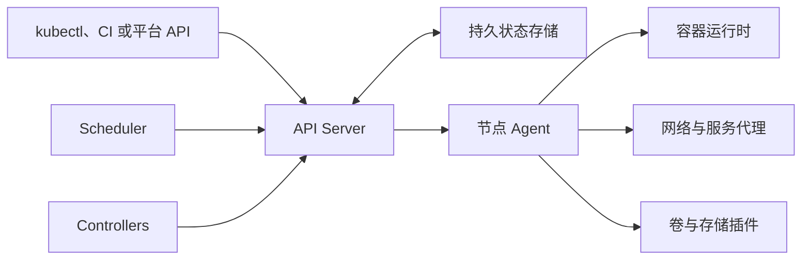

# 容器编排

单台主机能启动容器，却无法独自解决跨主机调度、服务发现、故障恢复、滚动发布、容量扩缩和策略治理。容器编排（Container Orchestration）用声明式 API 管理一组计算节点，让控制器持续把实际状态收敛到期望状态。

本章以 Kubernetes 建立通用模型，并覆盖 GKE、EKS、AKS 三种托管 Kubernetes，ECS 与 Fargate、Docker Swarm，以及 OpenShift。目标不是记住命令，而是理解控制面、数据面和云依赖的责任边界。

## 学习目标 {#learning-objectives}

完成本章后，你应当能够：

- 解释声明式 API、控制循环、调度、服务发现和滚动更新的工作机制。
- 区分控制面、工作节点、容器运行时、网络、存储与入口流量的职责。
- 比较 GKE、EKS、AKS、ECS/Fargate、Docker Swarm、Kubernetes 与 OpenShift。
- 在本地创建临时 Kubernetes 集群，部署一个受限的无状态服务并验证自愈。
- 为生产工作负载配置资源、探针、副本分布、发布策略和中断预算。
- 规划集群身份、租户隔离、升级、备份、容量和可观测性。

## 前置知识 {#prerequisites}

- 先学习 [容器](containers.md) 的镜像、进程、命名空间、卷和网络基础。
- 理解 [网络与协议](networking-and-protocols.md) 中的 DNS、HTTP、TLS 与负载均衡。
- 云托管方案需要 [云服务商](cloud-providers.md) 的 IAM、网络和计费基础。
- 建议已掌握 [基础设施置备](provisioning.md) 与 [配置管理](configuration-management.md) 的声明式思想。
- 机密注入和镜像交付分别参见 [机密管理](secret-management.md) 与 [CI/CD 工具](ci-cd-tools.md)。

## 核心原理 {#core-principles}

### 期望状态与控制循环 {#desired-state-and-control-loops}

编排器接收“运行三个副本”这样的期望状态，而不是只执行一次“启动容器”。控制器反复观察实际状态、计算差异并执行调节；节点故障或进程退出后，下一轮仍会尝试恢复。



这是一种最终一致的控制系统。API 返回“对象已创建”通常只代表期望状态已持久化，不代表应用已就绪。自动化必须观察 `status`、条件和超时，而不是用固定 `sleep` 猜测完成时间。

### 调度与资源 {#scheduling-and-resources}

调度器先过滤不满足资源、端口、污点和拓扑约束的节点，再对候选节点评分。容器的资源 **request** 用于调度和容量承诺，**limit** 约束可使用上限。CPU 超限通常被节流；内存超限可能触发 OOM 终止。

未设置 request 会造成节点过度承诺，设置过大则降低利用率。应从历史用量和压力测试出发，结合 Vertical Pod Autoscaler 建议或同类容量分析持续调整，而不是机械套用固定比例。

### 网络、服务发现与入口 {#networking-service-discovery-and-ingress}

Kubernetes 中每个 Pod 通常获得集群网络地址，Service 提供稳定虚拟地址与 DNS 名称，把流量分发到 Ready Endpoint。Ingress 描述 HTTP(S) 路由；Gateway API 可根据已安装的 CRD 和实现描述 HTTP、TCP 等路由。实际转发仍需要对应控制器和云负载均衡器。

网络连通不等于授权。默认允许所有 Pod 互通的集群应使用 NetworkPolicy 建立默认拒绝与显式放行；同时检查所选 CNI 插件是否真正实施该策略。

### 存储与有状态工作负载 {#storage-and-stateful-workloads}

容器可写层随重建丢失。PersistentVolume、PersistentVolumeClaim 和 StorageClass 把应用需求映射到存储实现；CSI 插件负责置备和挂载。StatefulSet 提供稳定身份和有序操作，但不会自动保证数据库一致性、备份或跨区复制。托管数据库通常比“把数据库放进 Kubernetes 就算高可用”更省风险。

### 健康、自愈与发布 {#health-self-healing-and-releases}

- **Startup Probe** 保护启动慢的应用，成功后才启用其他探针。
- **Readiness Probe** 决定实例是否接收流量，失败不应直接导致进程重启。
- **Liveness Probe** 处理进程无法自行恢复的死锁；配置过激会制造重启风暴。
- **Deployment** 通过新旧 ReplicaSet 滚动替换无状态实例，更新策略控制最大不可用与额外副本。
- **PodDisruptionBudget（PDB）** 限制自愿中断期间可同时下线的副本，不保护节点突然崩溃，也不能创造额外容量。

### 扩缩容 {#scaling}

Horizontal Pod Autoscaler（HPA）根据资源或自定义指标调整副本；Cluster Autoscaler 或云平台组件调整节点。两层扩缩有延迟，且可能互相影响。扩容不能修复数据库锁争用，也不能替代 request、队列背压和负载测试。

## 工具与平台 {#tools-and-platforms}

### Kubernetes {#kubernetes}

**重点掌握**。Kubernetes 是开放的容器编排 API 与控制器体系。核心对象包括 Pod、Deployment、StatefulSet、DaemonSet、Job/CronJob、Service、ConfigMap、Secret、Namespace、RBAC 和 NetworkPolicy。扩展通过 Custom Resource Definition（CRD）、Operator、Admission Webhook、CNI、CSI 和容器运行时接口接入。

它适合需要可移植 API、复杂调度、生态扩展和多团队平台能力的组织。代价是组件多、升级和策略复杂；裸 Kubernetes 不自动提供生产级入口、证书、镜像仓库、日志、监控、备份或开发者门户，这些都要明确选型和运维。

### Google Kubernetes Engine {#google-kubernetes-engine}

**替代方案**。Google Kubernetes Engine（GKE）由 Google Cloud 托管 Kubernetes 控制面。Standard 模式让团队管理节点池和更多底层配置；Autopilot 模式进一步由平台管理节点和大量运行约束，通常按 Pod 资源模型计费。它与 Google Cloud IAM、VPC、负载均衡、Artifact Registry 和 Workload Identity Federation for GKE 集成。

GKE 适合主要运行在 Google Cloud、希望减少控制面维护的团队。仍需负责工作负载配置、RBAC、镜像、网络策略、数据、升级窗口和费用。Autopilot 的限制与计费方式应先用真实负载验证，Standard 则要承担节点镜像、池设计与容量。

### Amazon Elastic Kubernetes Service {#amazon-elastic-kubernetes-service}

**替代方案**。Amazon Elastic Kubernetes Service（EKS）托管 Kubernetes 控制面，计算可使用 EKS Managed Node Groups、自管 EC2 节点、Karpenter 或 EKS on Fargate 的 Pod 计算。它与 VPC CNI、Elastic Load Balancing、EBS/EFS CSI、IAM Roles for Service Accounts 或 EKS Pod Identity 等 AWS 能力结合。

EKS 适合 AWS 网络与 IAM 已标准化、又需要 Kubernetes API 的组织。团队仍需管理节点或 Fargate 约束、Add-on 版本、VPC IP 容量、负载均衡器、安全组和跨可用区成本。不能把 EKS 控制面托管误认为整个集群免运维。

### Azure Kubernetes Service {#azure-kubernetes-service}

**替代方案**。Azure Kubernetes Service（AKS）托管控制面，使用系统与用户节点池承载集群组件和业务。它可与 Microsoft Entra ID、Azure RBAC、Managed Identity、Azure CNI、Application Gateway/Load Balancer、Azure Disk/File 和 Azure Monitor 集成。

AKS 适合使用 Azure 身份、网络和治理体系的组织。生产中要规划节点池用途、Kubernetes 与节点镜像升级、Pod/子网地址、区域可用性和维护窗口。工作负载身份优于在 Secret 中保存 Service Principal 凭据。

### Amazon ECS 与 Fargate {#amazon-ecs-and-fargate}

**替代方案**。Amazon Elastic Container Service（ECS）是 AWS 原生编排服务。Task Definition 描述一个或多个容器，Task 是运行实例，Service 维持副本并连接负载均衡，Cluster 组织容量。ECS 可以在 EC2 Capacity Provider 上运行，也可用 AWS Fargate 作为无服务器计算引擎。

Fargate 不是独立编排 API：它为 ECS 或 EKS Pod 提供隔离的按任务计算，不需要团队管理节点。ECS/Fargate 适合专注 AWS、希望减少 Kubernetes 复杂度的团队；约束包括 AWS 专有 API、任务级资源组合、部分守护进程/特权能力限制、网络接口和持续运行成本。需要底层定制或高密度稳定负载时，EC2 容量可能更灵活或经济。

### Docker Swarm {#docker-swarm}

**按需学习**。Docker Swarm mode 内置于 Docker Engine。Manager 通过 Raft 保存集群状态并调度 Service，Worker 运行 Task；Overlay Network、内置服务发现、Secret、Config 和 Rolling Update 提供基础编排能力。Stack 文件使用 Compose 格式的受支持子集部署多服务应用。

Swarm 概念少、接入快，适合已有 Docker 运维经验且需求简单的小型集群。相较 Kubernetes，其生态、托管服务、策略扩展和社区规模较小。Manager 仲裁、证书轮换、Overlay 网络、备份与升级仍需负责；从 Swarm 迁移到 Kubernetes/ECS 时，网络、Secret、部署与存储模型都要重写。

### OpenShift {#openshift}

**替代方案**。Red Hat OpenShift 是基于 Kubernetes 的企业应用平台，提供安装与生命周期管理、Operator、路由、内部镜像能力、监控、身份集成和开发者体验。OpenShift Container Platform 可自管，Red Hat OpenShift Dedicated、ROSA 和 Azure Red Hat OpenShift 等提供不同托管边界。

OpenShift 默认安全约束通常比宽松 Kubernetes 更严格，Security Context Constraints（SCC）会限制特权、UID 和主机资源；应用镜像应支持任意非 root UID。它适合需要受支持发行版、统一平台能力和企业治理的组织，代价是资源、订阅、平台约定与升级兼容成本。不要为了绕过镜像问题就给工作负载授予 `privileged` SCC。

## 选型比较 {#selection-comparison}

| 需求起点 | 候选方案 | 主要收益 | 主要责任或约束 |
| --- | --- | --- | --- |
| 开放生态与跨环境 API | Kubernetes | 可移植控制模型和广泛扩展 | 组装、升级和平台工程成本 |
| 已在 Google Cloud | GKE Standard/Autopilot | 云集成与托管控制面/节点抽象 | 模式限制、网络与费用治理 |
| 已在 AWS 且需 Kubernetes | EKS | AWS IAM、网络、存储集成 | 节点/Add-on/VPC 容量管理 |
| 已在 Azure 且需 Kubernetes | AKS | Entra、Managed Identity 和 Azure 集成 | 节点池、网络与升级治理 |
| AWS 原生且希望更少抽象 | ECS/Fargate | API 较小、无需或少管节点 | 云绑定与运行能力边界 |
| 小型、自管且需求简单 | Docker Swarm | 学习和部署路径短 | 生态与长期迁移能力 |
| 企业支持与集成平台 | OpenShift | 安全默认值、Operator 和平台套件 | 订阅、资源与平台约定 |

选型不能只比较控制面价格。至少评估：

- 工作负载数量、启动时间、CPU 架构、GPU、特权和持久存储需求。
- 团队是否有能力 24×7 维护控制面、节点、CNI、CSI、入口和升级。
- 身份、网络、密钥、日志、监控和策略能否复用已有云平台能力。
- 需要多云可移植，还是接受云专有 API 换取更低认知成本。
- 空闲容量、跨区流量、负载均衡器、NAT、日志和支持订阅的总成本。
- API 对象、Helm Chart、Operator、流水线和数据迁移的退出成本。

## 最小实践：在 kind 中验证声明式自愈 {#minimal-practice-validate-declarative-self-healing-with-kind}

本实践需要 Docker、`kubectl` 与 `kind` v0.32.0 或更高版本，只创建本地临时集群。工作负载不使用特权、不挂载主机目录、不读取机密，对外端口仅通过临时端口转发开放在回环地址。

创建集群：

```bash
kind create cluster --name orchestration-demo \
  --image kindest/node:v1.36.1@sha256:3489c7674813ba5d8b1a9977baea8a6e553784dab7b84759d1014dbd78f7ebd5 \
  --wait 60s
kubectl config current-context
```

将以下清单保存为 `demo.yaml`：

```yaml
apiVersion: apps/v1
kind: Deployment
metadata:
  name: demo-web
spec:
  replicas: 2
  selector:
    matchLabels:
      app: demo-web
  template:
    metadata:
      labels:
        app: demo-web
    spec:
      automountServiceAccountToken: false
      securityContext:
        runAsNonRoot: true
        runAsUser: 1000
        runAsGroup: 50000
        seccompProfile:
          type: RuntimeDefault
      containers:
        - name: web
          image: registry.k8s.io/e2e-test-images/agnhost:2.58@sha256:8f20ef3656260bdbca007119cc3bc53f7a1ddf2eb3eeb6922f217af1697333f9
          args: ["netexec", "--http-port=8080"]
          ports:
            - name: http
              containerPort: 8080
          readinessProbe:
            httpGet:
              path: /healthz
              port: http
          livenessProbe:
            httpGet:
              path: /healthz
              port: http
            initialDelaySeconds: 5
          resources:
            requests:
              cpu: 10m
              memory: 16Mi
            limits:
              cpu: 100m
              memory: 64Mi
          securityContext:
            allowPrivilegeEscalation: false
            capabilities:
              drop: ["ALL"]
            readOnlyRootFilesystem: true
---
apiVersion: v1
kind: Service
metadata:
  name: demo-web
spec:
  selector:
    app: demo-web
  ports:
    - name: http
      port: 80
      targetPort: http
```

应用并等待状态条件：

```bash
kubectl apply -f demo.yaml
kubectl rollout status deployment/demo-web --timeout=90s
kubectl get pods -l app=demo-web -o wide
```

删除一个 Pod，观察 Deployment 控制器恢复到两个副本：

```bash
POD="$(kubectl get pods -l app=demo-web -o jsonpath='{.items[0].metadata.name}')"
kubectl delete pod "$POD"
kubectl wait --for=jsonpath='{.status.readyReplicas}'=2 deployment/demo-web --timeout=90s
kubectl get pods -l app=demo-web
```

在一个终端建立本机端口转发：

```bash
kubectl port-forward --address 127.0.0.1 service/demo-web 8080:80
```

另一个终端验证服务：

```bash
curl --fail http://127.0.0.1:8080/healthz
```

停止端口转发后删除整个练习集群：

```bash
kind delete cluster --name orchestration-demo
```

!!! tip "固定生产镜像"
    示例保留可读版本标签，同时固定多架构镜像摘要。生产部署也应由 CI 解析并验证摘要，最终以 `image@sha256:...` 发布，同时保存签名与 SBOM。

## 生产实践 {#production-practices}

### 安全与多租户 {#security-and-multi-tenancy}

- 工作负载默认以非 root 运行，禁止提权，删除 Linux Capability，使用只读根文件系统和 RuntimeDefault seccomp。
- 默认不挂载 ServiceAccount Token；需要 API 时创建专用 ServiceAccount 和最小 RBAC。
- 使用 Pod Security Admission、策略引擎和准入控制阻止特权、未签名镜像与不合规仓库。
- NetworkPolicy 默认拒绝东西向与出口流量，再按服务依赖显式放行 DNS、数据库和外部 API。
- 不把不可信强隔离租户仅靠 Namespace 放在同一内核边界；按威胁模型使用独立集群、沙箱运行时或专用节点。

### 可靠性与发布 {#reliability-and-releases}

- 副本跨节点、可用区和故障域分布，使用拓扑分布约束或反亲和；确保实际有足够节点容量。
- 探针只检查对应语义：Readiness 检查能否接流量，Liveness 不依赖容易抖动的远程系统。
- 配置 PDB、优先级、优雅终止时间和 `preStop`，演练节点排空、区域故障与控制面不可用。
- Deployment 设置滚动更新上限，发布通过金丝雀或渐进交付观察 [可观测性](observability.md) 信号。
- 有状态系统使用应用一致性备份，并执行异地恢复；etcd 备份不能替代业务数据备份。

### 容量、成本与升级 {#capacity-cost-and-upgrades}

- 根据真实分位用量设置 request/limit，监控节流、OOM、Pending、驱逐和节点碎片。
- HPA 指标要与负载相关，设置稳定窗口；节点自动扩缩需考虑启动时间、PDB 和不可调度原因。
- 分离系统、通用、批处理、Spot/抢占式和特殊硬件节点池，用污点与容忍控制放置。
- 逐个小版本升级控制面、节点、CNI、CSI、入口和 CRD；先阅读弃用 API，再在预发布验证。
- 计算总成本时包含空闲 request、负载均衡器、持久盘、跨区/NAT 流量、日志和支持费用。

### 平台可维护性 {#platform-maintainability}

- 集群和 Add-on 使用基础设施即代码及 GitOps 管理，禁止依赖无人记录的控制台修改。
- 为 Namespace 提供 ResourceQuota、LimitRange、网络、身份、证书和可观测性的安全默认模板。
- 监控 API 延迟、调度失败、节点条件、控制器队列、证书到期、DNS、CNI 和 CSI，而不只看应用 Pod。
- 定义受支持的 Kubernetes 版本、基础镜像、Ingress/Gateway、存储类和 Operator 清单，减少无界组合。
- Runbook 覆盖 Pending、CrashLoopBackOff、ImagePullBackOff、DNS 故障、节点 NotReady 和磁盘压力。

## 常见误区 {#common-misconceptions}

**把编排器当作应用高可用开关**：三个副本若都落在一个节点、共享单区数据库或拥有同一缺陷，仍会一起失败。

**不设置资源请求**：调度器无法做可靠容量决策，节点压力时故障会集中爆发。

**用 Liveness 检查数据库**：数据库短暂故障会导致所有应用容器同时重启，放大事故。远程依赖通常影响 Readiness 或业务降级。

**托管 Kubernetes 等于零运维**：云厂商通常只承担部分控制面；节点、网络、Add-on、工作负载、安全与升级仍属于团队责任。

**为解决权限问题直接使用特权容器**：这把镜像缺陷升级为节点风险。应修复 UID、文件权限和 Capability 需求。

**用 `latest` 标签发布并现场修改**：实际运行内容不可追踪，回滚也不可重复。使用摘要和声明式配置。

## 动手练习 {#hands-on-exercises}

1. 完成 kind 实践，保存删除 Pod 前后的 UID，证明恢复的是新实例而非原进程重启。
2. 将副本扩展到四个，再查看它们在单节点 kind 集群的分布，说明生产中为何需要拓扑约束。
3. 增加一个 PDB 和滚动更新策略，计算在三个副本下允许的最大并发中断。
4. 为 `demo-web` 设计默认拒绝的 NetworkPolicy，只允许指定命名空间访问 8080 端口。
5. 根据一个“AWS 上 20 个无状态服务、无 Kubernetes 经验”的场景比较 ECS/Fargate 与 EKS，写出决策记录。
6. 制定一次节点池小版本升级计划，包含弃用检查、容量余量、排空、验证和回滚条件。

## 完成检查 {#completion-checklist}

- [ ] 能解释 API Server、状态存储、Scheduler、Controller、节点 Agent 和运行时的关系。
- [ ] 能说明 request/limit、探针、Service、PDB 和 HPA 的真实作用。
- [ ] 能比较 GKE、EKS、AKS 的云集成和共享责任。
- [ ] 能比较 ECS/Fargate、Docker Swarm、Kubernetes 和 OpenShift 的边界。
- [ ] 已在本地集群验证部署、Service、健康检查、声明式自愈与清理。
- [ ] 能为生产工作负载设计身份、网络、Pod 安全和镜像策略。
- [ ] 能规划跨故障域部署、备份恢复、升级和容量成本。

## 官方延伸阅读 {#official-further-reading}

- [Kubernetes Documentation](https://kubernetes.io/docs/home/)
- [Kubernetes Components](https://kubernetes.io/docs/concepts/overview/components/)
- [Google Kubernetes Engine 文档](https://cloud.google.com/kubernetes-engine/docs)
- [Amazon EKS 用户指南](https://docs.aws.amazon.com/eks/latest/userguide/what-is-eks.html)
- [Azure Kubernetes Service 文档](https://learn.microsoft.com/en-us/azure/aks/)
- [Amazon ECS 开发者指南](https://docs.aws.amazon.com/AmazonECS/latest/developerguide/Welcome.html)
- [AWS Fargate 文档](https://docs.aws.amazon.com/AmazonECS/latest/developerguide/AWS_Fargate.html)
- [Docker Swarm Mode 文档](https://docs.docker.com/engine/swarm/)
- [Red Hat OpenShift Container Platform 文档](https://docs.redhat.com/en/documentation/openshift_container_platform/)
- [kind Quick Start](https://kind.sigs.k8s.io/docs/user/quick-start/)
