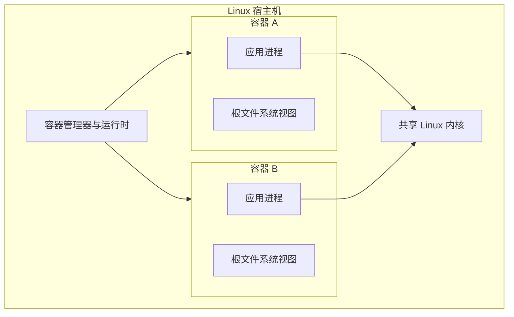

# 容器

容器把应用、依赖和启动约定打包为可重复交付的单元，并利用操作系统内核隔离进程与限制资源。它解决“同一制品如何在不同环境一致运行”的一部分问题，但不自动解决数据持久化、机密、网络策略、漏洞修补或高可用。

本章覆盖 Docker 与 LXC。Docker 主要围绕应用镜像和容器工作流，LXC 更接近运行完整 Linux 用户空间的系统容器；两者都共享宿主机内核，与虚拟机有根本差异。

## 学习目标

完成本章后，你应当能够：

- 解释 Linux namespaces、cgroups、capabilities、文件系统层和容器运行时的职责。
- 构建、检查并运行最小 Docker 镜像，使用非 root、只读根文件系统和资源限制。
- 描述 LXC 系统容器的配置、镜像、网络、存储以及特权 / 非特权模型。
- 根据隔离强度、工作负载形态、镜像生态、宿主机责任和迁移成本比较 Docker、LXC 与虚拟机。
- 设计镜像供应链、运行时安全、可观测性、容量和恢复实践。

## 前置知识

- [操作系统](operating-system.md)：进程、文件系统、身份、内核和服务管理。
- [终端知识](terminal-knowledge.md)：安全运行命令、查看进程与网络状态。
- [版本控制系统](version-control-systems.md)：管理 Dockerfile、LXC 配置与部署声明。
- 最小实践需要可用的 Docker Engine。LXC 通常要求 Linux 宿主机及管理员预先配置，相关命令只建议在专用测试主机运行。

## 核心原理

### 容器不是轻量虚拟机

虚拟机管理程序虚拟硬件，每台虚拟机运行自己的内核。Linux 容器把普通进程放入隔离视图，并共享宿主机 Linux 内核。



因此：

- 容器中的系统调用直接进入宿主机内核，内核漏洞可能跨越容器边界。
- Linux 容器不能携带另一种内核；在 Windows 或 macOS 上运行 Linux 容器通常由 Docker Desktop 等工具管理一个 Linux 虚拟机。
- 镜像中的 `/etc/os-release` 描述用户空间，`uname` 描述共享内核，两者发行版名称可能不同。
- 容器内的 root 若未经过用户命名空间映射，仍可能对应宿主机高权限身份；“在容器里”本身不是权限控制。

### namespaces：隔离视图

Linux namespace 让一组进程看到不同的系统资源视图。常见类型包括：

- **PID**：隔离进程编号和父子关系；容器内 PID 1 还承担信号转发与回收孤儿进程的责任。
- **mount**：隔离挂载点和根文件系统视图。
- **network**：提供独立接口、路由、防火墙与端口空间。
- **UTS**：隔离主机名和域名。
- **IPC**：隔离 System V IPC、POSIX 消息队列等进程通信资源。
- **user**：把容器内用户 ID 映射到宿主机不同 ID，是非特权容器的重要基础。
- **cgroup**：隔离进程所见的 cgroup 层级。
- **time**：在支持的内核与运行时中隔离部分时钟偏移，不代表可以随意改变宿主机时间。

namespace 主要控制“看见什么”，不直接限制“能用多少”。绑定宿主机目录、共享网络 namespace 或暴露运行时 socket 会主动打穿部分边界。

### cgroups：资源核算与限制

控制组（cgroups）按进程组核算并限制 CPU、内存、I/O 和进程数量等资源。cgroup v2 提供统一层级，但具体可用控制器取决于内核、宿主配置和运行时。

- CPU 配额控制一段周期内可用时间，CPU weight 控制竞争时相对份额。
- 内存上限触发回收和内存不足处理；容器可能在宿主仍有空闲内存时被终止。
- PID 上限能抑制 fork bomb，但过低会使应用无法创建线程或子进程。
- I/O 限制依赖设备和调度支持，必须在目标存储上验证。

资源限制不是容量规划替代品。没有请求与限制的合理关系、应用背压和监控，容器仍可能频繁节流或被终止。

### capabilities、seccomp 与强制访问控制

Linux 把传统 root 权限拆分为 capabilities，例如绑定低端口或管理网络。运行容器时应删除默认不需要的 capability，只按需求增加。seccomp 可限制系统调用，AppArmor 或 SELinux 可限制文件、进程和网络相关访问。

这些控制相互补充：namespace 隔离视图，cgroup 限制资源，capability 拆分特权，seccomp 缩小系统调用面，强制访问控制限制对象访问。关闭某一层会增大其他层失效后的影响。

### 镜像、层与运行容器

开放容器倡议（Open Container Initiative，OCI）定义镜像、运行时和分发相关规范。容器镜像由不可变内容层、配置和清单组成，注册表通过内容摘要分发对象。运行时在镜像层上增加可写层并创建进程。

- 标签是可移动名称，如 `app:1.2`；摘要是内容地址，如 `app@sha256:...`。生产部署应记录并优先固定摘要。
- 删除镜像后不会自动删除注册表中的历史、签名和派生制品；保留策略需要显式设计。
- 容器可写层适合短期运行状态，不适合唯一保存业务数据。容器删除后可写层通常随之消失。
- 多架构镜像清单可让同一标签指向不同平台镜像。构建和部署要验证 CPU 架构及操作系统。

??? note "Docker、containerd 与 runc 的关系"
    Docker Engine 提供镜像构建、网络、卷和 API 等高层能力，常通过 containerd 管理容器生命周期，再由 OCI 低层运行时（常见 `runc`）创建 namespaces、cgroups 和进程。具体组件会随部署产品变化，排障时先查询实际运行时版本和配置，不要假定固定调用链。

## Docker

**重点掌握**。Docker 提供 Dockerfile 构建、镜像分发、容器生命周期、网络与卷等一致工作流，适合把单个应用进程及依赖打包交付。Docker Engine 采用客户端与守护进程 API；能控制 Docker daemon 的主体通常可以在宿主机创建高权限容器，因此 Docker socket 等同于高价值管理接口。

### Dockerfile 与构建上下文

Dockerfile 逐步描述基础镜像、文件、依赖、用户、入口和元数据。构建上下文中的文件可被构建器读取，应通过 `.dockerignore` 排除 `.git`、凭据、本地缓存和无关大文件。

```dockerfile
# syntax=docker/dockerfile:1
FROM python:3.13-slim

WORKDIR /app
COPY --chown=65532:65532 server.py /app/server.py

USER 65532:65532
EXPOSE 8080
ENTRYPOINT ["python", "/app/server.py"]
```

生产 Dockerfile 应进一步做到：

- 基础镜像使用受信任来源并固定可追踪版本或摘要，定期由自动流程更新和重建。
- 多阶段构建把编译器留在构建阶段，只复制运行所需产物；但构建阶段依赖仍属于供应链，应扫描和记录。
- `RUN` 合理组合包安装与缓存清理，避免仓库元数据过期或无用层增大镜像。
- 使用 exec 形式的 `ENTRYPOINT` / `CMD`，使应用直接接收信号；若需要 init，选择明确的轻量 init 并测试停止行为。
- `HEALTHCHECK` 只做低成本本地判断，不能代替外部业务探测；编排平台是否使用镜像健康检查需另行确认。
- 不用 `ARG`、`ENV` 或 `COPY` 传递构建机密。使用构建器支持的临时 secret mount，且保证输出层不含机密。

!!! warning "Docker 组通常等价于宿主机 root"
    能访问未受限 Docker daemon 的用户可以挂载宿主文件系统或启动特权容器。不要把加入 `docker` 组当作普通的免提权便利，应按管理员权限管理并审计。

### 容器运行

运行时应显式定义：

- 非 root 用户和只读根文件系统；需要写入的路径使用受限临时挂载或卷。
- 删除全部 capabilities 后按最小需求增加，禁止 `--privileged` 作为兼容性捷径。
- CPU、内存、PID 和临时存储边界，以及超限时应用行为。
- 网络连接方向、监听地址和发布端口。`EXPOSE` 只是镜像元数据，不会自动向宿主发布端口。
- 日志驱动、轮转和阻塞策略。应用将结构化日志写到标准输出 / 错误，采集器负责传输。
- 停止信号与宽限期。应用需要处理信号、停止接收新请求并完成在途工作。

Rootless mode 能减少 daemon 和容器对应宿主 root 的风险，但网络、存储、cgroup 和低端口能力可能受宿主配置限制；它不是忽略镜像漏洞或错误挂载的理由。

### 网络与存储

Docker bridge 网络通常为容器提供私有地址，并通过端口发布将宿主流量转入容器。容器 IP 会变化，应用应通过服务名或编排服务发现通信。`--network host` 删除网络 namespace 隔离并可能产生端口冲突，只在明确性能或协议需求下采用。

卷由 Docker 管理生命周期，bind mount 直接暴露宿主路径。后者容易受宿主路径、权限、SELinux 标签和部署差异影响。数据库使用卷仍需应用一致的备份与恢复；复制卷目录未必得到可恢复数据。

Docker Compose 用声明文件定义多容器开发或单机应用，适合可重复本地环境。它不是自动提供多节点容错的编排系统。Compose 文件也应固定镜像、限制权限并把机密放在受控机制中。

## LXC

**替代方案**。Linux Containers（LXC）提供低层用户空间工具与库，用于创建和管理共享 Linux 内核的系统容器。系统容器通常运行接近完整发行版的用户空间和多个服务，管理体验类似轻量主机。LXC 与提供更高层 API、镜像和集群体验的 Incus 等项目有关联，但产品、命令和治理不同；本章只讨论 LXC 本身。

### 系统容器模型

LXC 配置描述根文件系统、网络、挂载、设备、capabilities、cgroup 与用户 ID 映射。容器可通过发行版模板或镜像创建，再使用 `lxc-start`、`lxc-stop`、`lxc-info`、`lxc-attach` 等工具管理。确切命令、模板来源和配置键以安装版本手册为准。

与应用容器相比，LXC 系统容器通常：

- 运行 init 和多个守护进程，具有自己的用户、包管理器和服务生命周期；
- 更适合整合遗留服务、提供接近虚拟机的 Linux 环境或高密度实验主机；
- 需要像服务器一样执行系统补丁、服务清单、日志与配置管理；
- 不天然采用 Docker / OCI 镜像作为应用发布单元，迁移和供应链工具链不同。

### 非特权与特权容器

非特权 LXC 容器使用 user namespace，把容器内 root 映射到宿主机非 root UID / GID 范围，通常应作为默认选择。宿主需要分配 subordinate ID，并确保映射、文件所有权、备份和共享存储工具正确处理这些数值。

特权容器中容器 root 更接近宿主 root，内核攻击面和错误设备 / 挂载配置的后果更大。只有无法通过非特权配置满足且风险被明确接受时才采用，并配合严格 capability、设备、AppArmor / SELinux、seccomp 与网络限制。

嵌套运行 Docker、访问物理设备、使用某些文件系统或系统调用时，常见诱惑是放宽整个容器。应先确定需要的单项 capability、设备节点、挂载传播和安全配置，避免启用全特权或不受限配置。

### 网络、存储与生命周期

LXC 可连接 Linux bridge、veth、macvlan 等网络。网络模式影响二层可达、宿主通信、地址管理和防火墙位置。生产部署必须明确入口与出口过滤在哪里执行，并防止容器伪造地址或绕过宿主策略。

根文件系统可位于目录、LVM、ZFS、Btrfs 等后端，能力与快照语义不同。快照通常不能自动保证多服务应用一致性，也不是异地备份。克隆系统容器后还要重新生成机器身份、SSH 主机密钥或其他唯一标识，防止重复身份。

由于 LXC 容器共享宿主内核，来宾发行版的用户空间必须与宿主内核兼容。需要不同内核模块、Windows 内核或强租户隔离时，应选择虚拟机。

## 选型比较

| 维度 | Docker 应用容器 | LXC 系统容器 | 虚拟机 |
| --- | --- | --- | --- |
| 交付单元 | 镜像加单个或少量前台进程 | 接近完整 Linux 用户空间 | 虚拟磁盘、固件和独立 OS |
| 内核 | 与宿主共享 | 与宿主共享 | 每台虚拟机独立 |
| 启动与密度 | 通常高密度、启动快 | 通常比虚拟机轻量 | 开销较高但隔离边界更强 |
| 更新方式 | 重建镜像并替换容器 | 可像主机原地更新，也可重建 | 镜像替换或来宾内更新 |
| 生态 | OCI 注册表、CI/CD、编排生态广 | Linux 主机管理与 LXC 工具 | 云和传统基础设施成熟 |
| 主要风险 | daemon 权限、镜像供应链、错误挂载 | 特权容器、宿主内核、系统漂移 | 镜像膨胀、补丁与容量成本 |

选择时回答：

1. 工作负载是单个可替换应用，还是需要完整 init、多个服务和接近主机的管理体验？
2. 租户是否互不信任，是否需要不同内核、模块或操作系统？强隔离通常优先虚拟机或专用节点。
3. 团队已有 OCI 构建与注册表流程，还是主机镜像、包管理和配置管理流程？
4. 数据状态在哪里，如何备份、恢复和迁移？容器技术不能替代数据库恢复设计。
5. 宿主机内核、运行时、镜像和容器用户空间分别由谁补丁，维护窗口如何协调？
6. 从 Docker 迁到 LXC（或反向）时，镜像格式、入口、服务管理、网络、卷和监控如何转换？

不要为了“容器化”把稳定虚拟机原样塞入特权系统容器，也不要把需要多个紧耦合系统服务的遗留环境强拆为大量应用容器。先测量隔离、交付和运维收益。

## 最小实践：最小权限 Docker 容器

该实践运行一个只读、无网络、删除全部 capabilities、限制内存和进程数的临时容器。它只打印身份和文件系统测试结果，结束后自动删除。首次运行会从 Docker Hub 拉取公开镜像；在受限环境中请改用组织批准的镜像仓库和摘要。

```bash
container_name="container-practice-$(date +%s)-$$"
docker run --rm \
    --name "$container_name" \
    --network none \
    --read-only \
    --tmpfs /tmp:rw,noexec,nosuid,size=16m \
    --cap-drop ALL \
    --security-opt no-new-privileges=true \
    --user 65534:65534 \
    --memory 64m \
    --pids-limit 32 \
    alpine:3.22 \
    /bin/sh -eu -c '
        id
        test ! -w /
        printf "temporary\n" > /tmp/probe
        test "$(cat /tmp/probe)" = temporary
        if wget -q -T 2 -O /dev/null https://example.com/; then
            echo "unexpected network access" >&2
            exit 1
        fi
        echo "isolation checks passed"
    '
test -z "$(docker ps --all --quiet --filter "name=^/${container_name}$")"
```

预期看到非 root 身份和 `isolation checks passed`。如果镜像中 `wget` 对无网络失败，脚本会继续；若意外访问成功，练习会失败。最后一条命令确认容器已自动删除。

!!! note "这不是完整沙箱证明"
    练习只验证几项配置的可见行为，不证明内核、运行时或镜像没有漏洞。生产还需要补丁、seccomp / AppArmor / SELinux、镜像验证、网络策略、节点隔离和持续监控。

### 可选构建实践

在空的练习目录中创建以下 `Dockerfile`：

```dockerfile
# syntax=docker/dockerfile:1
FROM alpine:3.22
RUN addgroup -S app && adduser -S -G app app
USER app
ENTRYPOINT ["/bin/sh", "-c"]
CMD ["printf 'hello from uid=%s\\n' \"$(id -u)\""]
```

构建并查看镜像历史：

```bash
image_tag="local/container-practice:practice-$(date +%s)-$$"
docker build --pull --tag "$image_tag" .
docker image inspect "$image_tag"
docker history --no-trunc "$image_tag"
docker run --rm --read-only --cap-drop ALL --network none \
    "$image_tag"
docker image rm "$image_tag"
```

本地标签不是生产来源证明。实际发布应在 CI 中生成软件物料清单（SBOM）、漏洞结果、来源证明与签名，并按不可变摘要部署。

## 生产实践

### 镜像供应链

- 基础镜像只来自批准来源，固定摘要并由自动化定期更新；镜像越小不必然越安全，关键是内容可盘点、可修补。
- 在隔离构建器中构建，不挂载开发者家目录或永久云凭据。依赖和基础镜像经过代理、校验与保留。
- 为镜像生成 SBOM、漏洞扫描、构建来源证明和签名，在准入阶段验证签名者、仓库与策略。
- 同一镜像逐级晋升，不在不同环境重新构建“相同版本”。记录源码提交、构建参数、镜像摘要和部署环境。
- 漏洞修复通过更新基础镜像与重新构建完成；运行中的旧容器不会因注册表标签更新而自动获得补丁。

### 运行时安全

- 默认非 root、只读根、删除 capabilities、`no-new-privileges`、受支持 seccomp 和 AppArmor / SELinux 策略。
- 禁止特权容器、宿主 PID / network namespace、任意设备和 Docker socket；例外必须有所有者、期限与隔离节点。
- 机密以运行时受控挂载或短期身份提供，不写入镜像层、环境转储或 Dockerfile。容器环境变量可被进程和调试接口读取。
- 限制入口与出口网络，管理面与业务面分离。容器端口发布前确认绑定地址，避免默认暴露到所有接口。
- 宿主机最小化安装并及时修补内核、固件和运行时；生产容器节点不作为通用登录和构建主机。

### 可靠性与数据

- 应用处理终止信号并在宽限期内优雅退出；启动、就绪、存活和业务健康是不同信号。
- 设置 CPU、内存和 PID 边界，通过压力测试确定节流、OOM 和重启行为，避免所有副本同时触顶。
- 无状态容器通过替换恢复；有状态服务按应用一致性备份卷和外部数据，并在不同故障域演练恢复。
- 容器、镜像和卷有明确生命周期。清理任务只删除可重建且已过保留期的对象，先输出计划并限制作用域。
- Docker daemon 或 LXC 管理面不可用时，定义现有工作负载是否继续、如何安全重启及配置从何恢复。

### 可观测性与成本

- 采集容器与宿主两层 CPU、内存压力、I/O、网络、重启和 OOM 事件，并保留镜像摘要、节点和部署版本标签。
- 应用日志写标准流并由驱动轮转、传输；高日志速率要有背压和磁盘上限，避免填满宿主分区。
- 对镜像层、构建缓存、注册表、卷快照和网络出口设置保留与预算。多架构镜像和重复基础层会增加存储。
- 密度优化不能牺牲故障域。单节点放置过多关键副本会让一次内核或运行时故障造成集中中断。

### LXC 专项基线

- 优先非特权容器，集中管理 UID / GID 子区间并监控耗尽或重叠。
- 将每个系统容器纳入主机资产、补丁、配置、备份和漏洞管理，不因其启动快而当作临时进程忽略。
- 限定可挂载文件系统、设备、内核接口和网络模式；评审任何 `lxc.apparmor.profile`、capability 或设备放宽。
- 克隆后重置机器唯一身份，验证日志、监控和配置管理不会把两个容器视为同一节点。
- 宿主升级前在代表性系统容器验证用户空间兼容性，并保留虚拟机或替代节点恢复路径。

## 常见误区

- **把容器当作虚拟机安全边界**：共享内核使攻击面和故障域不同，不可信租户通常需要更强隔离。
- **使用 `latest` 就认为总能获得修复**：标签可移动，运行实例不会自动更新，回滚也失去明确目标。
- **镜像扫描无高危就代表安全**：扫描可能缺少运行配置、未知组件和可利用性上下文。
- **在 Dockerfile 中删除机密即可**：早期层仍可能保存内容，构建机密必须从未进入持久层。
- **用 root 只是容器内部方便**：错误挂载、内核漏洞和过量 capabilities 会放大 root 的后果。
- **挂载 Docker socket 管理兄弟容器**：这通常授予宿主机级控制，应通过受限管理 API 或独立控制面替代。
- **只限制内存，不验证 OOM**：应用可能损坏在途操作、频繁重启或让依赖承受重试风暴。
- **把容器可写层保存为数据库备份**：文件可能不一致，容器删除后状态也可能丢失。
- **把 LXC 系统容器当作无需补丁的镜像**：它通常运行完整用户空间和多个服务，仍有长期系统维护责任。
- **遇到 LXC 兼容问题就改成特权容器**：应先定位具体 capability、设备、映射或策略需求。

## 动手练习

1. 运行最小权限实践，并用 `docker inspect` 找出用户、只读根、网络模式、内存和 PID 限制对应字段。
2. 构建可选镜像，分别检查镜像配置和历史，证明没有加入本地 `.git` 或凭据文件。
3. 编写一个 20 行以内的 HTTP 服务，在容器中以非 root 运行；实现终止信号处理，并验证停止时能在宽限期退出。
4. 为同一容器设置较小 CPU 与内存限制，在测试负载下观察节流和 OOM；记录应用、容器和宿主三层证据。
5. 设计一个数据库容器备份流程，明确一致性点、加密、异地副本、保留期限和恢复验收，不能只写“备份卷”。
6. 在专用 Linux 测试机上创建一个非特权 LXC 容器，记录 UID 映射、网络、存储后端和安全配置；若无专用环境，只完成配置评审，不在共享主机尝试。
7. 对 Docker、非特权 LXC 和虚拟机做威胁模型，分别说明宿主内核漏洞、错误挂载和恶意租户的影响范围。
8. 选择一个公开镜像，以摘要拉取并生成 SBOM，验证其中操作系统包来源，然后写出补丁触发与重新部署流程。

## 完成检查

- [ ] 能解释 namespace、cgroup、capability、seccomp 和强制访问控制的不同职责。
- [ ] 能说明容器共享宿主机内核，以及它与虚拟机的隔离差异。
- [ ] 能解释 OCI 镜像层、标签、摘要、可写层和注册表。
- [ ] 能构建并运行非 root、只读、无额外 capability 且有限资源的 Docker 容器。
- [ ] 能说明 Docker daemon、socket、网络、卷和停止信号的生产风险。
- [ ] 能解释 LXC 系统容器及特权 / 非特权模型，并说明何时选择它。
- [ ] 能按工作负载、隔离、生态、数据和维护成本选择 Docker、LXC 或虚拟机。
- [ ] 能设计镜像来源证明、签名、扫描、补丁和按摘要晋升流程。
- [ ] 能监控容器与宿主资源，并通过恢复演练验证有状态数据。

## 官方延伸阅读

- [Docker 官方文档](https://docs.docker.com/)、[Dockerfile 参考](https://docs.docker.com/reference/dockerfile/)与[Docker Engine 安全](https://docs.docker.com/engine/security/)
- [Docker Rootless mode](https://docs.docker.com/engine/security/rootless/)、[资源约束](https://docs.docker.com/engine/containers/resource_constraints/)与[存储文档](https://docs.docker.com/engine/storage/)
- [LXC 官方站点](https://linuxcontainers.org/lxc/)、[LXC 入门](https://linuxcontainers.org/lxc/getting-started/)与[LXC 手册页](https://linuxcontainers.org/lxc/manpages/)
- [Linux namespaces 手册](https://man7.org/linux/man-pages/man7/namespaces.7.html)、[cgroup v2 文档](https://docs.kernel.org/admin-guide/cgroup-v2.html)与[capabilities 手册](https://man7.org/linux/man-pages/man7/capabilities.7.html)
- [OCI Image Specification](https://github.com/opencontainers/image-spec)、[OCI Runtime Specification](https://github.com/opencontainers/runtime-spec)与[OCI Distribution Specification](https://github.com/opencontainers/distribution-spec)
- [containerd 文档](https://containerd.io/docs/)、[runc 项目](https://github.com/opencontainers/runc)与[BuildKit 文档](https://docs.docker.com/build/buildkit/)
- [Sigstore 文档](https://docs.sigstore.dev/)、[SLSA](https://slsa.dev/)与[SPDX](https://spdx.dev/)
