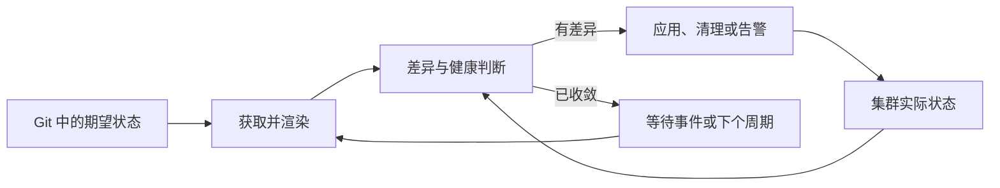

# 声明式运维（GitOps）

当集群和应用由大量命令、控制台操作与流水线脚本共同修改时，团队很难回答“当前状态从哪里来、谁批准了变化、漂移后应以谁为准”。GitOps 把经过版本控制和评审的声明作为期望状态，由集群内的协调器（Reconciler）持续比较期望与实际状态，并通过幂等操作收敛差异。

GitOps 不是“把 YAML 放进 Git”，也不等同于某个产品。它是一种运行模型：声明式描述、版本化且不可变的变更历史、自动拉取与持续协调。正确使用时，它缩小部署凭据的分发范围，统一变更审计和回退入口；错误使用时，也可能让一次错误提交迅速传播到所有环境。

**重点掌握**：期望状态、持续协调、漂移、健康状态、分层交付，以及以 Git 提交而不是集群命令驱动变更。

## 学习目标

完成本章后，你应能够：

- 解释 GitOps 控制环以及拉取式交付与推送式流水线的信任边界。
- 设计应用源、环境配置与机密之间的仓库边界。
- 使用 Argo CD 或 Flux CD 将临时 Kubernetes 集群收敛到 Git 中的状态。
- 判断自动同步、自动修复和自动清理应在哪些环境启用。
- 比较 Argo CD 与 Flux CD 的操作模型、扩展方式和迁移成本。
- 为多集群交付设计渐进发布、策略门禁、可观测性和灾难恢复流程。

## 前置知识

- 熟悉 [版本控制系统](version-control-systems.md) 中的分支、提交、标签和合并请求。
- 理解 [CI/CD 工具](ci-cd-tools.md) 中构建、测试和部署阶段的职责。
- 能操作 [容器编排](container-orchestration.md) 中的 Kubernetes 对象、命名空间和 RBAC。
- 知道如何从 [制品管理](artifact-management.md) 中按不可变摘要选择镜像。
- 了解 [机密管理](secret-management.md) 中的加密存储和外部机密引用。

## 核心原理

### Git 是期望状态入口，不是运行时数据库

Git 仓库保存的是经过授权的期望状态及其历史。Kubernetes API 保存运行时状态；云 API、数据库和外部控制器也可能拥有各自的真实状态。GitOps 不会消除这些状态源，而是明确哪些字段由谁负责，并让控制器将自己负责的字段持续收敛。

适合声明式管理的内容通常包括：

- Kubernetes 工作负载、服务、策略与控制器自定义资源。
- 以引用形式表达的镜像摘要和外部机密。
- 可由控制器安全协调的云资源或平台能力。

不应直接提交的内容包括明文机密、瞬时状态、完整数据库内容、未脱敏导出，以及由运行时控制器频繁写回的状态字段。

### 协调是一个持续控制环

协调器反复执行“观察、比较、行动、再观察”：



一个可靠控制环应具备：

- **幂等性**：重复协调不会不断制造新变化。
- **最终一致性**：短暂差异可以存在，但系统会在限定时间内收敛或报告失败。
- **所有权边界**：避免多个控制器反复争夺同一字段。
- **可观察状态**：能区分已同步、健康、正在推进、暂停与失败。
- **安全失败**：无法验证来源、渲染失败或越权时停止，而不是猜测性部署。

同步（Sync）与健康（Health）是不同维度。对象可以与 Git 一致，但应用仍因镜像拉取失败而不健康；也可以运行健康，却因人工修改副本数而产生漂移。

### 拉取式交付重画凭据边界

传统推送式部署常让 CI 持有每个目标集群的高权限凭据。GitOps 通常在目标集群或受控管理集群中运行协调器，由它拉取 Git 与制品，并使用本地服务账号应用变更。CI 只需构建、测试、发布不可变制品，并提出环境仓库变更。

这减少了 CI 凭据横向影响范围，但不会自动安全：协调器本身权限很高，Git 写权限可以间接变成部署权限，仓库凭据与 Webhook 也必须保护。管理多个集群的中央控制器还可能形成更大的爆炸半径，需要按租户、环境或信任域拆分。

### 漂移、清理与回退

漂移是实际状态偏离期望状态。处理方式有三种：

- **只检测**：报告差异，人工决定如何处理，适合刚接入或高风险资源。
- **自动修复**：把手工修改恢复为 Git 状态，适合所有权清晰且可安全重放的资源。
- **接受差异**：明确忽略由其他控制器拥有的字段，避免无意义抖动。

清理（Prune）会删除 Git 中已移除的对象。它能消除孤儿资源，也可能因路径、渲染或仓库错误大规模删除，因此应有范围、顺序、保护规则和审计。

Git 回退通常是创建一个恢复旧期望状态的新提交，而不是改写历史。若旧镜像已经删除、数据库发生不可逆迁移，或外部状态已变化，回退提交也无法自动恢复。因此部署回退、数据恢复和业务补偿必须分别设计。

### 仓库结构表达职责

常见分层是：

1. 应用仓库构建并测试软件，发布带摘要的制品。
2. 环境仓库保存该摘要、部署参数和平台策略。
3. 自动化或发布人员提交环境变更，评审者批准。
4. 协调器只读取获准路径，并把变化应用到对应集群。

单仓库便于原子修改和统一搜索，但权限边界较粗、规模增长快；多仓库可隔离团队与环境，却增加版本关联和批量变更成本。不要机械套用目录模板，应先明确谁能提议、谁能批准、哪个协调器能读、哪些变化必须原子发生。

## Argo CD

**重点掌握**。Argo CD 是面向 Kubernetes 的声明式 GitOps 持续交付控制器。它以 `Application` 资源描述来源、目标和同步策略，并提供 API、CLI 与 Web UI 展示差异、资源树和健康状态。

核心概念包括：

- **Application**：关联 Git/Helm/OCI 来源与目标集群、命名空间。
- **Project**：限制允许的来源仓库、目标和资源种类，是多租户安全边界之一。
- **Sync**：把渲染结果应用到目标，可手动或自动执行。
- **Health**：根据资源状态判断应用是否可用，不等于同步状态。
- **ApplicationSet**：按集群、Git 目录或其他生成器批量生成 `Application`。

Argo CD 的资源视图有利于排查依赖关系和人工审批。生产中应尽快关闭或保护初始管理员入口，接入单点登录，配置项目边界，并限制仓库凭据和目标集群。若启用多个配置管理插件，插件执行环境也属于供应链攻击面。

## Flux CD

**替代方案**。Flux CD 是一组 Kubernetes 控制器与自定义资源的集合，常见组件分别负责来源获取、Kustomize 协调、Helm 发布、通知和镜像自动化。它更强调由 Kubernetes API 表达可组合的控制器工作流。

典型资源包括：

- **GitRepository/OCIRepository**：获取并验证来源制品。
- **Kustomization**：选择路径、渲染并应用资源，可声明依赖、健康检查和清理。
- **HelmRepository/HelmRelease**：获取 Helm 来源并协调发布。
- **Receiver/Alert/Provider**：接收事件并发送状态通知。
- **ImageRepository/ImagePolicy/ImageUpdateAutomation**：发现镜像并按策略提出或写入版本更新。

Flux 可通过 `flux bootstrap` 把控制器及其同步配置写入 Git，使自身也由 Git 管理。生产引导时应使用短期、最小权限凭据，审查 bootstrap 产生的密钥和部署密钥，并为来源验证、租户隔离与控制器权限建立明确策略。

## 选型比较

| 维度 | Argo CD | Flux CD |
| --- | --- | --- |
| 主要交互 | `Application`/`ApplicationSet`、API、CLI 和 Web UI | 可组合 CRD、`flux` CLI 与 Kubernetes 原生 API |
| 状态呈现 | 内置应用资源树、差异和健康界面 | 状态主要体现在 CRD、事件、通知和外接界面 |
| 多实例生成 | ApplicationSet 生成器 | 多个来源和 Kustomization/HelmRelease 组合 |
| 引导方式 | 安装控制器后声明应用，可再管理自身 | `flux bootstrap` 强调把控制器同步配置纳入 Git |
| 迁移关注点 | Application/Project、健康定制、同步波次和忽略规则 | Source/Kustomization/HelmRelease、依赖与通知对象 |

选择时应实际验证以下维度：

- 团队是否需要内置的可视化审批和资源树，还是偏好纯 API/CRD 工作流。
- Helm、Kustomize、OCI 来源、签名验证和私有仓库的实际组合。
- 多集群数量、租户边界、控制器放置方式及单点故障范围。
- 失败重试、依赖排序、健康判定、渐进发布和通知如何实现。
- 自定义扩展是否需要执行不受信代码，升级时 CRD 与行为如何兼容。
- 从现有工具迁移时，哪些产品特定对象需要转换，如何并行观察而不让两个控制器争夺资源。

两者都能实现可靠 GitOps。不要仅凭是否有 UI 选型；用一个包含自定义资源、失败回滚、机密引用和多环境覆盖的代表性服务做验证，并测量从合并到收敛、从漂移到修复的时间。

## 最小实践：用 Argo CD 协调临时集群

本实践创建仅供本机实验的 `kind` 集群，安装固定版本的 Argo CD，并从固定提交的公开示例仓库同步一个 Web 服务。示例通过 Kustomize 把上游旧镜像替换成以多架构摘要固定的非特权 Nginx 镜像。它不会访问生产集群，也不要求把密码写入文件。

### 1. 准备工具与集群

需要 Docker、`kubectl` 和 `kind`。创建独立集群，避免与现有上下文混淆：

```bash
kind create cluster --name gitops-lab --wait 120s
kubectl config current-context
```

输出应为 `kind-gitops-lab`。后续命令都显式使用该上下文。

### 2. 安装控制器

```bash
kubectl --context kind-gitops-lab create namespace argocd
kubectl --context kind-gitops-lab apply \
  --server-side \
  --force-conflicts \
  --namespace argocd \
  --filename https://raw.githubusercontent.com/argoproj/argo-cd/v3.5.1/manifests/install.yaml
kubectl --context kind-gitops-lab wait \
  --namespace argocd \
  --for=condition=Available \
  --timeout=300s deployment/argocd-server
```

!!! warning "远程清单必须先审查"
    为保持篇幅最小，本实验直接应用固定发布版本的官方清单。生产中应先下载到受控仓库，审查内容，并校验清单及其中镜像的来源或摘要，再通过既有发布流程安装。不要使用随时间移动的 `stable` 或 `latest` URL。

### 3. 声明并同步应用

以下 `Application` 固定示例仓库的提交，避免实验内容随上游分支变化。目标命名空间由 Argo CD 创建；自动修复演示漂移收敛，自动清理只作用于这个临时应用。

```yaml
apiVersion: argoproj.io/v1alpha1
kind: Application
metadata:
  name: guestbook-lab
  namespace: argocd
spec:
  project: default
  source:
    repoURL: https://github.com/argoproj/argocd-example-apps.git
    targetRevision: 53e28ff20cc530b9ada2173fbbd64d48338583ba
    path: kustomize-guestbook
    kustomize:
      images:
        - gcr.io/heptio-images/ks-guestbook-demo=nginxinc/nginx-unprivileged@sha256:44e36330f74d4f3a1d4e222acca9e23b401fb87811a7597024502bb759c4dd49
      patches:
        - target:
            kind: Deployment
            name: guestbook-ui
          patch: |-
            - op: replace
              path: /spec/template/spec/containers/0/ports/0/containerPort
              value: 8080
        - target:
            kind: Service
            name: guestbook-ui
          patch: |-
            - op: replace
              path: /spec/ports/0/targetPort
              value: 8080
  destination:
    server: https://kubernetes.default.svc
    namespace: guestbook-lab
  syncPolicy:
    automated:
      prune: true
      selfHeal: true
    syncOptions:
      - CreateNamespace=true
```

将清单通过标准输入应用，无需创建持久临时文件：

```bash
kubectl --context kind-gitops-lab apply --filename - <<'YAML'
apiVersion: argoproj.io/v1alpha1
kind: Application
metadata:
  name: guestbook-lab
  namespace: argocd
spec:
  project: default
  source:
    repoURL: https://github.com/argoproj/argocd-example-apps.git
    targetRevision: 53e28ff20cc530b9ada2173fbbd64d48338583ba
    path: kustomize-guestbook
    kustomize:
      images:
        - gcr.io/heptio-images/ks-guestbook-demo=nginxinc/nginx-unprivileged@sha256:44e36330f74d4f3a1d4e222acca9e23b401fb87811a7597024502bb759c4dd49
      patches:
        - target:
            kind: Deployment
            name: guestbook-ui
          patch: |-
            - op: replace
              path: /spec/template/spec/containers/0/ports/0/containerPort
              value: 8080
        - target:
            kind: Service
            name: guestbook-ui
          patch: |-
            - op: replace
              path: /spec/ports/0/targetPort
              value: 8080
  destination:
    server: https://kubernetes.default.svc
    namespace: guestbook-lab
  syncPolicy:
    automated:
      prune: true
      selfHeal: true
    syncOptions:
      - CreateNamespace=true
YAML

kubectl --context kind-gitops-lab wait \
  --namespace argocd \
  --for=jsonpath='{.status.sync.status}'=Synced \
  --timeout=300s application/guestbook-lab
kubectl --context kind-gitops-lab wait \
  --namespace argocd \
  --for=jsonpath='{.status.health.status}'=Healthy \
  --timeout=300s application/guestbook-lab
kubectl --context kind-gitops-lab get application \
  --namespace argocd guestbook-lab
```

预期应用最终显示 `Synced` 和 `Healthy`。如需查看本机页面，可在一个终端运行：

```bash
kubectl --context kind-gitops-lab \
  --namespace guestbook-lab port-forward service/kustomize-guestbook-ui 8080:80
```

然后访问 `http://127.0.0.1:8080/`。端口转发只监听本机，不创建公网入口。

### 4. 观察漂移修复

手工把副本数改为 2，等待协调器恢复 Git 中声明的 1：

```bash
kubectl --context kind-gitops-lab \
  --namespace guestbook-lab scale deployment/kustomize-guestbook-ui --replicas=2

kubectl --context kind-gitops-lab \
  --namespace guestbook-lab get deployment kustomize-guestbook-ui --watch
```

看到副本数回到 1 后按 ++ctrl+c++ 结束观察。这说明手工命令不是持久期望状态；正式变更应修改 Git 并经过评审。

### 5. 清理

```bash
kind delete cluster --name gitops-lab
```

该命令只删除本实验的 `gitops-lab` 集群。不要把实验上下文或默认项目配置直接用于生产。

??? note "如何改用 Flux CD 完成同一练习"
    在临时集群安装固定版本 Flux 控制器，创建指向固定提交的 `GitRepository`，再创建引用 `guestbook` 路径的 `Kustomization`。观察 `Ready` 条件与资源漂移。若使用 `flux bootstrap`，应先创建自己的实验仓库，并在练习后回收写权限和部署密钥；不要对不受控的公共仓库执行 bootstrap。

## 生产实践

### 仓库与变更治理

- 保护生产分支，要求评审、状态检查和提交签名或受信身份。
- 用代码所有者规则约束关键目录；提交者与最终批准者按风险分离。
- 环境配置引用镜像摘要，不让协调器在生产中解析可移动标签。
- 渲染后的资源也要在 CI 中做模式校验、策略检查和服务端 dry-run；只检查模板语法不够。
- 大规模自动更新应分批提出，避免一个机器人提交同时影响全部集群。

### 机密与来源

Git 历史不会因普通删除而消失，明文机密一旦提交必须立即轮换。推荐在 Git 中保存加密密文或外部机密引用，由受控控制器在目标环境解密或读取。密钥权限应与仓库读权限分离，使拿到 Git 副本的人不能直接还原生产机密。

对 Git、Helm 和 OCI 来源固定提交、版本或摘要，并验证 TLS 与签名。私有仓库凭据使用只读、最小作用域和可轮换的身份；不同租户不要共享同一高权限部署密钥。

### 权限与多租户

- 每个协调器只管理明确的集群、命名空间和资源种类。
- 限制团队可选的来源仓库、目标和集群级对象，不能只依赖目录约定。
- 对 CRD、Webhook、RBAC、Namespace 和策略对象设置更严格审批，因为它们可扩大权限或影响全局。
- 隔离不互信租户的渲染执行环境，防止模板插件读取控制器凭据或其他仓库。
- 中央控制面若管理多个集群，应评估其被攻陷后的整体影响，并考虑按信任域拆分实例。

### 发布安全与回退

自动同步不等于一次性全量发布。生产变更可按以下路径推进：

1. 在低风险集群验证新摘要和配置。
2. 通过 Argo Rollouts、Flagger 或云原生流量机制执行金丝雀/蓝绿发布。
3. 依据服务级指标暂停、推进或回退，而不是只看 Pod 是否 Ready。
4. 分批更新地域或集群，保留故障隔离窗口。

为破坏性变更设置同步顺序与显式门禁。数据库迁移优先采用向前和向后兼容的扩展/收缩流程；不要假设 `git revert` 可以逆转已经删除的数据。

### 清理与防误删

启用自动清理前，应验证路径为空、渲染失败、仓库暂时不可用和分支删除时的行为。对 Namespace、持久卷、CRD 等高影响对象使用删除保护、最终确认或独立生命周期。先在非生产环境观察仅检测模式，再逐步启用自动修复和清理。

### 可观测性与服务级目标

监控控制器不仅要看进程存活，还应覆盖：

- 从合并到控制器发现新提交的时间。
- 从发现到同步完成、从漂移到修复的时间。
- 同步失败率、连续重试、队列深度和 API 限流。
- 应用同步状态与健康状态的分布。
- Git、制品仓库、身份服务和目标集群连接错误。
- 高风险资源删除、权限变化和来源验证失败。

告警应携带提交、应用、集群、失败阶段和负责人。控制器日志进入 [日志管理](logs-management.md)，指标与追踪按 [可观测性](observability.md) 的方法关联到发布事件。

### 控制器恢复

Git 可以重建期望状态，但不能重建所有运行时数据。应备份或能够重新生成：控制器配置、项目和租户边界、仓库凭据、集群注册信息、加密密钥及外部状态。定期在空集群演练 bootstrap，确认固定版本的控制器能从 Git 恢复，且恢复过程不会误接管生产资源。

## 常见误区

### 把自动同步等同于 GitOps

若变更没有声明式来源、审计和持续协调，单纯由 webhook 触发脚本仍是普通自动部署。

### 让 CI 直接改集群，再让 GitOps 接管

两个写入者会导致竞争和无法解释的漂移。CI 应发布制品并更新期望状态，由一个明确控制器负责应用。

### 把明文机密放进私有仓库

私有仓库仍可能被克隆、备份、日志记录或误授权。必须加密或保存外部引用，并建立轮换流程。

### 默认开启全局自动清理

错误路径或渲染结果可能删除大量资源。自动清理必须配合范围限制、保护对象、分批启用和恢复演练。

### 认为回退提交一定安全

外部 API、消息、数据库迁移和已删除制品可能不可逆。回退前需验证数据兼容性和制品可用性。

### 忽略字段所有权

水平自动扩缩器、Operator 和 GitOps 控制器若同时管理同一字段，会持续互相覆盖。应明确忽略规则或重新划分所有权，而不是延长协调间隔掩盖问题。

### 直接跟踪上游主分支

移动分支会绕过本组织评审，使上游变化直接进入集群。应固定提交或经过验证的版本，再由受控变更更新。

## 动手练习

1. **完成漂移实验**：在最小实践中修改副本数，记录 Argo CD 检测和恢复所需时间；然后暂停自动同步，比较仅检测模式。
2. **设计仓库职责**：为应用开发者、平台团队和生产审批者画出读写矩阵。结果应明确谁能更新镜像摘要、修改集群级 RBAC 和批准生产变更。
3. **演练失败变更**：在自有实验仓库提交一个不存在的镜像摘要，观察“已同步”与“健康失败”的区别，再用一个新提交恢复。
4. **验证清理边界**：在临时命名空间增加一个由 Git 管理的 ConfigMap 和一个明确不归协调器管理的对象，删除前者的声明，确认只有预期对象被清理。
5. **比较实现**：用 Flux `GitRepository` 与 `Kustomization` 重做最小实践，记录来源状态、健康等待、漂移恢复和可视化排障路径的差异。
6. **恢复控制面**：删除实验集群后从固定版本和仓库重新引导，测量恢复时间并列出 Git 之外仍需恢复的身份与密钥材料。

## 完成检查

- [ ] 能画出 GitOps 的观察、比较、行动控制环。
- [ ] 能区分同步状态、健康状态和运行时漂移。
- [ ] 能解释拉取式模型改变了哪些凭据与网络边界。
- [ ] 已用 Argo CD 或 Flux CD 在临时集群完成一次声明式同步。
- [ ] 能比较 Argo CD 与 Flux CD 的交互模型、适用场景和迁移对象。
- [ ] 能说明自动修复和自动清理的风险与启用条件。
- [ ] 能为机密、集群级资源和多租户设计最小权限。
- [ ] 能用新提交回退配置，并识别无法由 Git 回退的数据变化。
- [ ] 已定义合并到收敛、漂移到修复和同步失败的监控指标。

## 官方延伸阅读

- [OpenGitOps Principles](https://opengitops.dev/)：GitOps 的厂商中立原则。
- [Argo CD 官方文档](https://argo-cd.readthedocs.io/en/stable/)：安装、Application、同步、项目与安全说明。
- [Argo CD 安全考虑](https://argo-cd.readthedocs.io/en/stable/operator-manual/security/)：控制器、来源与多租户风险。
- [Flux CD 官方文档](https://fluxcd.io/flux/)：来源、Kustomize、Helm、通知和 bootstrap 指南。
- [Flux 安全指南](https://fluxcd.io/flux/security/)：部署安全、租户隔离和来源验证。
- [Kubernetes 声明式管理](https://kubernetes.io/docs/tasks/manage-kubernetes-objects/declarative-config/)：声明式对象管理的基础语义。
- [Kubernetes Server-Side Apply](https://kubernetes.io/docs/reference/using-api/server-side-apply/)：字段管理和冲突机制。
