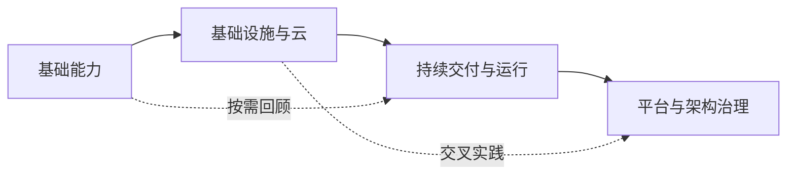

# DevOps Roadmap 中文手册

从命令行、操作系统和版本控制出发，逐步学习基础设施、云平台、持续交付、可观测性与云架构。本手册面向希望建立完整知识体系的 DevOps、SRE 和平台工程学习者，强调原理、工程权衡和可验证实践，而不是堆叠工具名称。

!!! info "非官方原创手册"
    本站参考 [roadmap.sh DevOps Roadmap](https://roadmap.sh/devops) 的公开主题范围和学习顺序，但不是官方翻译或授权版本。正文均为独立编写，不复制或逐句翻译其说明文字，也不重新发布其路线图图片和原始数据。

## 如何使用 {#how-to-use-this-guide}

每章围绕“为什么需要、怎样工作、如何选型、怎样验证、生产环境注意什么”展开。初学者可以按照四个阶段顺序学习；已有经验的读者可以直接进入薄弱主题，再通过章内链接补齐前置知识。

建议为练习准备本地虚拟机、容器环境或独立云沙箱。不要在生产账号中直接试验示例命令。

## 学习路线 {#learning-path}

-   **第一阶段：基础能力**

    建立自动化所需的编程、操作系统、终端、Git 和容器基础。

    [从编程语言开始](learn-a-programming-language.md)

-   **第二阶段：基础设施与云**

    理解网络服务、协议、云资源、Serverless、基础设施即代码和配置管理。

    [进入基础设施服务](common-infrastructure-services.md)

-   **第三阶段：持续交付与运行**

    建设 CI/CD、机密、监控、日志、容器编排和可观测性能力。

    [进入 CI/CD 工具](ci-cd-tools.md)

-   **第四阶段：平台与架构治理**

    管理制品和声明式交付，并理解服务网格及云设计模式的工程权衡。

    [进入制品管理](artifact-management.md)

### 第一阶段：基础能力 {#stage-one-foundational-skills}

1. [学习一种编程语言](learn-a-programming-language.md)：选择主力语言，建立可测试、可交付的自动化能力。
2. [操作系统](operating-system.md)：理解进程、内存、文件系统、权限和主流系统家族。
3. [终端知识](terminal-knowledge.md)：使用 Shell、文本工具和诊断命令高效定位问题。
4. [版本控制系统](version-control-systems.md)：掌握 Git 对象模型、分支、合并和安全恢复。
5. [版本控制托管](vcs-hosting.md)：建立代码审查、权限、保护规则和协作流程。
6. [容器](containers.md)：理解镜像、隔离、资源限制和容器生命周期。

### 第二阶段：基础设施与云 {#stage-two-infrastructure-and-cloud}

7. [常见基础设施服务](common-infrastructure-services.md)：搭建代理、缓存、防火墙、负载均衡和 Web Server。
8. [网络与协议](networking-and-protocols.md)：沿 DNS、TCP、TLS、HTTP、SSH 和邮件协议链路排障。
9. [云服务商](cloud-providers.md)：理解责任共担、地域、身份、网络、计算和托管服务。
10. [无服务器计算](serverless.md)：设计事件驱动函数，治理冷启动、权限、重试和成本。
11. [基础设施置备](provisioning.md)：通过 Terraform、Pulumi、CloudFormation 或 CDK 管理资源。
12. [配置管理](configuration-management.md)：让主机和软件配置可重复、幂等并可审计。

### 第三阶段：持续交付与运行 {#stage-three-continuous-delivery-and-operations}

13. [CI/CD 工具](ci-cd-tools.md)：把构建、测试、晋级、部署和回滚组织成可信流水线。
14. [机密管理](secret-management.md)：管理凭据的生成、分发、轮换、撤销和审计。
15. [基础设施监控](infrastructure-monitoring.md)：用指标、仪表盘和可行动告警管理容量与健康状态。
16. [日志管理](logs-management.md)：建立结构化采集、检索、保留和敏感数据治理流程。
17. [容器编排](container-orchestration.md)：管理容器调度、服务发现、更新、弹性和故障恢复。
18. [可观测性](observability.md)：关联指标、日志、追踪和 SLO，诊断未知故障。

### 第四阶段：平台与架构治理 {#stage-four-platform-and-architecture-governance}

19. [制品管理](artifact-management.md)：建立不可变、可追溯、可验证的软件供应链。
20. [GitOps](gitops.md)：通过 Git 中的期望状态和持续协调交付系统变更。
21. [服务网格](service-mesh.md)：治理服务间身份、流量、可靠性和遥测。
22. [云设计模式](cloud-design-patterns.md)：在可用性、一致性、复杂度和成本之间做架构权衡。

## 学习建议 {#learning-recommendations}

章节中的标记描述学习策略，而不是行业排名：

- **重点掌握**：适合作为某类能力的主要学习入口，建议完成原理与实践。
- **替代方案**：解决相近问题，结合团队技术栈选择一种深入，同时能读懂其他方案。
- **按需学习**：不依赖主路线顺序，遇到对应环境或业务需求时再深入。
- **通用主题**：跨产品的架构和工程能力，需要理解权衡而非记住工具操作。

!!! tip "以能力驱动工具学习"
    先说明要解决的问题和验收指标，再选择工具完成实践。能够解释失败模式、权限边界和回滚路径，比记住一组命令更重要。

## 实践原则 {#practice-principles}

- [ ] 使用本地环境或独立沙箱，不在生产系统直接试验。
- [ ] 所有修改操作先确认目标、权限、影响范围和回滚方式。
- [ ] 示例凭据只使用占位值；真实密钥进入专用机密系统。
- [ ] 为自动化设置超时、有限重试、幂等语义和明确退出码。
- [ ] 使用指标、日志或状态检查验证结果，不以“命令没有报错”作为唯一成功标准。
- [ ] 完成练习后清理临时资源，检查是否仍有云资源产生费用。

## 内容基线 {#content-baseline}

当前章节范围于 **2026 年 8 月 13 日** 对照 roadmap.sh 的公开 DevOps 路线图整理。上游路线图会持续变化，本手册不会自动抓取或同步其内容；维护者会结合开放标准、工具官方文档和独立实践评估是否更新。

内容编写和维护规则见仓库中的 [`DEVELOPMENT.md`](https://github.com/oaixnah/roadmap-devops/blob/main/DEVELOPMENT.md)。发现技术错误或失效链接时，欢迎通过项目仓库提交 Issue 或修订。

[开始学习：学习一种编程语言 →](learn-a-programming-language.md)
