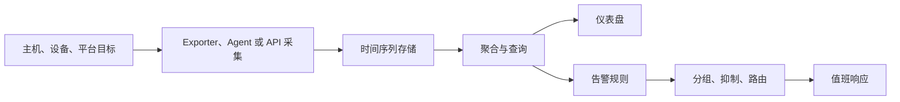

# 基础设施监控

基础设施监控（Infrastructure Monitoring）回答“承载业务的计算、存储、网络和平台是否健康”。它把 CPU、内存、磁盘、网络、主机和设备状态转成时间序列、事件与告警，使团队能在容量耗尽或故障扩散前采取行动。

本章聚焦指标监控，覆盖 Prometheus、Grafana、Zabbix 与 Datadog。这里的 Prometheus 用于采集和告警基础设施指标，Datadog 用于托管式基础设施视图；它们在 [可观测性](observability.md) 中还会以跨信号关联和应用诊断的不同上下文出现。

## 学习目标 {#learning-objectives}

完成本章后，你应当能够：

- 设计主机、网络、存储与平台的指标和标签模型。
- 解释拉取与推送、服务发现、采样、聚合、保留和告警状态机。
- 使用 Prometheus 安全地抓取本地示例服务，并写出一条可验证的 PromQL 查询。
- 比较 Prometheus、Grafana、Zabbix 与 Datadog 的职责、部署方式和成本边界。
- 用症状型告警、持续时间和抑制规则降低噪声。
- 制定监控系统自身的高可用、容量、权限与恢复方案。

## 前置知识 {#prerequisites}

- 熟悉 [操作系统](operating-system.md) 的进程、CPU、内存和文件系统。
- 熟悉 [终端知识](terminal-knowledge.md) 中的性能和网络诊断工具。
- 理解 [网络与协议](networking-and-protocols.md) 中的 HTTP、DNS 和 TLS。
- 容器环境中的服务发现与资源模型可结合 [容器编排](container-orchestration.md) 学习。

## 核心原理 {#core-principles}

### 从测量到行动 {#from-measurement-to-action}

一个监控系统至少包含采集、存储、查询、展示和告警五个环节：



指标是随时间变化的数值，通常由名称和标签集合唯一标识一条时间序列。一个样本可抽象为：

```text
metric_name{label_a="value", label_b="value"} 123.4 @ timestamp
```

常见类型包括：

- **Counter**：只增加或重置的累计量，例如网络接收字节。查询时通常计算 `rate()`，而不是直接告警绝对值。
- **Gauge**：可增可减的瞬时值，例如当前内存占用或温度。
- **Histogram**：把观测值累计到桶中，可跨实例聚合并估计分位数。
- **Summary**：由客户端计算分位数，通常不适合跨实例直接聚合。

### USE、RED 与四个黄金信号 {#use-red-and-four-golden-signals}

基础设施可先用 USE 方法检查每种资源：

- **Utilization（使用率）**：资源忙碌时间或已占容量比例。
- **Saturation（饱和度）**：等待队列、内存回收或负载超过资源能力的程度。
- **Errors（错误）**：设备、接口或操作失败计数。

服务层常用 RED，即请求速率、错误和持续时间；SRE 的四个黄金信号还包括饱和度。不要把 CPU 80% 直接等同于故障：高使用率可能是正常且经济的，持续队列增长和用户延迟才更接近症状。

### 拉取、推送与采样 {#pull-push-and-sampling}

Prometheus 主要由服务端按间隔拉取 HTTP 指标，便于判断目标是否可达并统一采样。Zabbix 和 Datadog Agent 可主动上报，适合被防火墙隔离或动态主机。两种方式都要处理目标身份、重复样本、时钟、网络中断和缓冲。

采样间隔越短，发现突发越快，但存储和查询成本越高。15 秒采样不代表能准确捕获 1 秒尖峰。关键快速信号可用更短间隔，容量趋势可以记录规则预聚合或降采样。

### 标签基数 {#label-cardinality}

时间序列数量大致是指标名与所有标签值组合的乘积。把 `user_id`、请求 UUID、原始 URL 或错误全文放进标签会产生高基数，导致内存、索引和费用快速增长。可枚举的环境、区域、服务和状态码适合作为标签；高基数上下文应进入日志或追踪。

!!! tip "先定义问题，再采集指标"
    每个指标都应对应容量、故障或服务目标问题，并明确负责人和保留期限。无目的地采集“所有能采的值”只会增加成本和告警噪声。

### 告警是状态机 {#alerting-is-a-state-machine}

一个健壮告警通常经历未触发、等待持续时间、触发和恢复。`for` 持续时间可以过滤瞬时波动；分组把同一故障导致的大量实例告警合并；抑制让上游网络故障时不再通知所有下游“不可达”。

告警标签用于路由，注解应说明影响、证据、仪表盘和 Runbook。告警必须可行动：如果值班人员没有权限或步骤改变结果，它更适合作为仪表盘信息。

## 工具详解 {#tool-details}

### Prometheus {#prometheus}

**重点掌握**。Prometheus 通过服务发现找到目标，拉取 OpenMetrics/Prometheus 文本格式指标，存入本地时间序列数据库，并用 PromQL 查询。Exporter 把主机、数据库、网络设备等系统转换为指标；记录规则预计算常用表达式；告警规则交给 Alertmanager 分组、抑制和路由。

Prometheus 单实例自治、标签模型灵活，适合 Kubernetes 和动态基础设施。单机本地存储不是无限规模的数据仓库，长期保留、全局查询和多集群场景常结合远程写入或 Thanos、Cortex/Mimir 等体系。Pushgateway 仅适合无法被抓取的短生命周期批任务，不应用来把所有服务改成推送模式；过期序列必须显式清理。

### Grafana {#grafana}

**重点掌握**。Grafana 是查询与可视化层，可连接 Prometheus、Loki、Elasticsearch、云监控和多种数据库。Dashboard 通过 Panel 和变量组织视图，数据源负责执行查询；Unified Alerting 也可跨数据源评估规则。

Grafana 不等于指标采集或存储。应把仪表盘、告警和数据源配置纳入版本控制，限制匿名访问和数据源编辑权限，避免变量允许任意高成本查询。一个好仪表盘从服务影响下钻到资源原因，而不是堆叠数十张无解释的折线图。

### Zabbix {#zabbix}

**替代方案**。Zabbix 是集采集、存储、触发器、发现、仪表盘和通知于一体的监控平台。Server 负责核心处理，Agent 可主动或被动采集主机数据，Proxy 可在远端网络汇聚；Template、Item、Trigger 和 Low-level Discovery 支持规模化管理。它还适合 SNMP 网络设备、传统服务器和不能原生暴露 Prometheus 指标的环境。

Zabbix 的一体化降低组件拼装成本，但数据库容量、History/Trend 保留、模板继承和 Proxy 队列需要规划。模板升级前应在小范围验证；触发器表达式要考虑维护窗口和依赖关系，避免设备断网造成告警风暴。

### Datadog {#datadog}

**替代方案**。Datadog Infrastructure Monitoring 通常由 Agent 收集主机、容器、进程和集成指标，发送到托管平台，通过 Tags、Dashboards、Monitors、Events 和 Watchdog 展示与告警。云集成可读取云资源元数据和平台指标，免去自建时序存储。

它适合希望快速获得跨云主机与集成视图、减少监控后端运维的团队。需要治理按主机、容器、自定义指标和日志等维度产生的费用，并限制高基数标签。Agent 配置、API/Application Key 和数据出境属于安全边界。这里关注资源健康；在可观测性章节，Datadog 会用于指标、日志、追踪和真实用户体验的关联诊断。

## 选型比较 {#selection-comparison}

| 维度 | Prometheus + Grafana | Zabbix | Datadog |
| --- | --- | --- | --- |
| 责任边界 | 自建采集、规则、存储与展示组件 | 自建一体化平台及数据库 | 厂商托管后端，团队管理 Agent 与数据 |
| 强项 | 云原生指标、PromQL、开放生态 | 传统主机、SNMP、模板与综合监控 | 快速集成、跨云资产和托管体验 |
| 扩展关注 | 联邦、远程写入、长期存储 | Server/Proxy/数据库容量 | 套餐、标签和自定义指标费用 |
| 迁移关注 | PromQL、Exporter、Dashboard | Template、Trigger、历史数据 | 专有集成、Monitor、历史与成本模型 |

Grafana 是展示与告警层，常与 Prometheus 配套，也能展示 Zabbix 或 Datadog 等数据，因此不应把它与采集存储系统简单视为互斥产品。

选型时还需验证：

- 环境以 Kubernetes、传统虚拟机、网络设备还是托管云服务为主？
- 团队愿意维护多少监控基础设施，故障时由谁监控监控系统？
- 数据保留、区域、合规和网络出口要求是什么？
- 预计活跃时间序列、采样频率、主机数和查询并发是多少？
- 是否可导出原始数据、规则和仪表盘，迁移时要重写多少查询？

## 最小实践：监控本地 HTTP 服务 {#minimal-practice-monitor-a-local-http-service}

本实践让 Prometheus 抓取隔离 Docker 网络中的 Python 示例服务。业务容器不发布端口，Prometheus 查询界面只绑定本机回环地址；示例不需要密码，也不会修改系统服务。

创建 `metrics_server.py`：

```python
from http.server import BaseHTTPRequestHandler, HTTPServer


class Handler(BaseHTTPRequestHandler):
    requests_total = 0

    def do_GET(self) -> None:
        if self.path != "/metrics":
            self.send_response(404)
            self.end_headers()
            return

        Handler.requests_total += 1
        body = (
            "# HELP demo_requests_total Number of demo requests.\n"
            "# TYPE demo_requests_total counter\n"
            f'demo_requests_total{{method="GET"}} {Handler.requests_total}\n'
        ).encode()
        self.send_response(200)
        self.send_header("Content-Type", "text/plain; version=0.0.4")
        self.send_header("Content-Length", str(len(body)))
        self.end_headers()
        self.wfile.write(body)


HTTPServer(("0.0.0.0", 8000), Handler).serve_forever()
```

创建 `prometheus.yml`：

```yaml
global:
  scrape_interval: 5s
  evaluation_interval: 5s

scrape_configs:
  - job_name: demo
    static_configs:
      - targets: ["metrics-app:8000"]
```

创建一次性网络，再启动无外部端口、无额外 Linux Capability 的示例服务：

```bash
docker network create metrics-demo
docker run --rm --detach --name metrics-app \
  --network metrics-demo \
  --user 65532:65532 \
  --read-only \
  --cap-drop=ALL \
  --security-opt=no-new-privileges \
  -v "$PWD/metrics_server.py:/demo/metrics_server.py:ro" \
  python:3.14.7-alpine@sha256:05b2b8b732ecd268fee8727a369f936f022d1321b59befd13c30ede22769dcdc \
  python /demo/metrics_server.py
```

启动 Prometheus 容器。版本标签与多架构镜像摘要共同固定实际内容，`--pull=missing` 避免每次强制下载；容器加入同一隔离网络，并只把查询界面绑定到本机：

```bash
docker run --rm --detach --name prometheus-demo \
  --pull=missing \
  --network metrics-demo \
  --cap-drop=ALL \
  --security-opt=no-new-privileges \
  -p 127.0.0.1:9090:9090 \
  -v "$PWD/prometheus.yml:/etc/prometheus/prometheus.yml:ro" \
  prom/prometheus:v3.13.2@sha256:508729e0e2d18e11fd742a5a5ca70e557b940a93948c3c95fd0123a6fd538b69
```

访问 `http://127.0.0.1:9090/query`，依次查询：

```promql
up{job="demo"}
```

```promql
demo_requests_total{job="demo"}
```

预期 `up` 为 `1`，并能看到随抓取增加的示例 Counter。停止业务容器后等待约十秒，`up` 应变为 `0`：

```bash
docker stop metrics-app
```

完成观察后删除 Prometheus 与一次性网络：

```bash
docker stop prometheus-demo
docker network rm metrics-demo
```

## 生产实践 {#production-practices}

### 指标设计与容量 {#metric-design-and-capacity}

- 指标命名包含单位和类型语义，例如秒用 `_seconds`、字节用 `_bytes`、Counter 用 `_total`。
- 对标签建立允许列表和基数预算，在接入评审及运行中统计活跃序列增长。
- 为原始高频数据、记录规则和长期趋势设置不同保留策略；容量估算包含副本与增长余量。
- 时间同步是事件关联的基础，所有节点使用可靠 NTP 来源并监控时钟偏移。

### 告警工程 {#alerting-engineering}

- 告警优先覆盖用户可见症状、服务级目标消耗和即将耗尽的硬资源。
- 设置持续时间、恢复阈值或迟滞，避免临界值附近反复开关。
- 通知包含所有者、影响、当前值、仪表盘和经过演练的 Runbook 链接。
- 使用维护窗口、依赖抑制和通知分组；每月复盘无人处理、误报和重复告警。
- 用合成故障验证规则和通知链，不能只确认配置文件语法正确。

### 安全与可靠性 {#security-and-reliability}

- 指标端点不暴露客户标识、查询文本、令牌或完整 URL；采集链路使用认证、TLS 和网络策略。
- 按团队和环境限制查询、仪表盘编辑、静默及规则修改权限，审计配置变更。
- 监控系统跨故障域部署，避免与被监控系统共享唯一电源、集群或身份依赖。
- 备份规则、仪表盘和关键配置，验证恢复；托管平台也要保留可导出的配置即代码。
- 监控采集失败、规则评估延迟、通知失败、存储空间和查询延迟，实现元监控。

### 成本与维护 {#cost-and-maintenance}

- 优先减少无价值序列，而不是只缩短保留期；停止采集没人查询、没有决策用途的指标。
- 将默认全量仪表盘改成面向角色的入口：值班、容量、平台组件和业务服务分别组织。
- 版本化 Exporter、Agent、规则与 Dashboard；升级前在一组目标上验证指标名称和标签变化。
- 在 [日志管理](logs-management.md) 中保存事件细节，用可共享的 `service`、`environment` 等字段支持下钻，不把日志全文复制进标签。

## 常见误区 {#common-misconceptions}

**只盯 CPU、内存百分比**：资源指标能解释原因，却不一定反映用户影响。应把容量信号与错误、延迟和服务目标结合。

**每个异常值都发消息**：通知数量上升会降低响应质量。只有需要及时人工行动的状态才应分页告警。

**标签越详细越好**：高基数字段使查询、存储和费用失控。请求级上下文属于日志或追踪。

**把 Grafana 当作数据源**：Grafana 通常查询后端；没有可靠采集和存储，仅有仪表盘不能构成监控系统。

**平均值代表所有实例**：平均延迟可能掩盖一个区域或一个实例的严重退化。按故障域切分，并检查分布与尾延迟。

**监控与生产同生共死**：唯一监控实例若与目标处于同一故障域，最需要信息时可能一起离线。

## 动手练习 {#hands-on-exercises}

1. 完成最小实践，记录目标正常和停止时 `up` 的变化。
2. 为示例增加 `demo_temperature_celsius` Gauge，并说明为什么 `user_id` 不应成为标签。
3. 写一条告警规则：`up{job="demo"} == 0` 持续两分钟才触发，并补充摘要和 Runbook 注解。
4. 使用 USE 方法为一台 Linux 主机列出 CPU、内存、磁盘和网络的使用率、饱和度与错误指标。
5. 任选 Prometheus/Zabbix/Datadog 两种方案，估算 1000 台主机的执行责任、数据量和一年迁移成本。

## 完成检查 {#completion-checklist}

- [ ] 能解释 Counter、Gauge、Histogram 与标签基数。
- [ ] 能用 USE、RED 或黄金信号设计监控视图。
- [ ] 能说明拉取和推送模式的故障判定差异。
- [ ] 能区分 Prometheus、Grafana、Zabbix、Datadog 的职责与适用环境。
- [ ] 已运行本地抓取实践，并能解释 `up` 指标。
- [ ] 能写出有持续时间、路由、Runbook 和恢复条件的告警。
- [ ] 能规划监控系统自身的权限、容量、高可用和恢复。

## 官方延伸阅读 {#official-further-reading}

- [Prometheus Documentation](https://prometheus.io/docs/introduction/overview/)
- [PromQL 基础](https://prometheus.io/docs/prometheus/latest/querying/basics/)
- [Alertmanager Documentation](https://prometheus.io/docs/alerting/latest/alertmanager/)
- [Grafana Documentation](https://grafana.com/docs/grafana/latest/)
- [Zabbix Documentation](https://www.zabbix.com/documentation/current/en/manual)
- [Datadog Infrastructure Monitoring 文档](https://docs.datadoghq.com/infrastructure/)
- [OpenMetrics Specification](https://prometheus.io/docs/specs/om/open_metrics_spec/)
- [Google SRE Workbook：Monitoring](https://sre.google/workbook/monitoring/)
