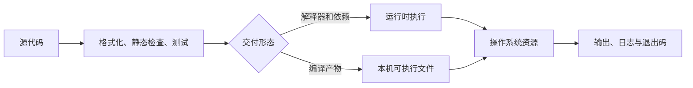

# 学习一种编程语言

DevOps 工作并不以开发业务功能为主，却经常需要把人工步骤变成可重复、可测试的程序：解析配置、调用 API、检查部署结果、生成清单或编写控制器。只会拼接命令通常足以完成一次操作，但当输入不可信、失败需要恢复、任务需要并发或代码由多人维护时，一门掌握扎实的编程语言会显著降低风险。

本章不要求同时精通所有语言。目标是选择一种作为主力，再能读懂团队中其他语言的依赖和运行方式。

## 学习目标

完成本章后，你应当能够：

- 用一种语言编写带参数校验、错误处理和明确退出码的命令行工具。
- 解释解释执行、即时编译和提前编译对交付方式的影响。
- 使用语言原生的依赖、测试和格式化工具构建可复现项目。
- 根据部署环境、并发模型、团队能力和维护周期比较 Python、Go、Ruby、Rust 与 JavaScript / Node.js。
- 识别自动化程序中的凭据泄露、无限重试、非幂等修改和依赖供应链风险。

## 前置知识

本章没有强制前置要求。示例需要 Python 3.10 或更高版本，以及基本的命令行操作；不熟悉命令行时，可以先浏览[终端知识](terminal-knowledge.md)，再回来完成实践。

## 核心原理

### 从源代码到可运行程序

不同语言的交付形态不同，但都要解决同一组问题：把源代码转换为机器可执行的指令，加载依赖，获得操作系统资源，并把结果或失败反馈给调用者。



- **解释型运行时**：Python 和 Ruby 通常由目标机器上的解释器加载源码或字节码，修改和调试快，但必须管理解释器与依赖版本。
- **即时编译运行时**：Node.js 的 V8 会在运行期间解释并优化 JavaScript。启动、内存和事件循环行为都属于运行时的一部分。
- **提前编译**：Go 和 Rust 通常在构建阶段生成本机二进制文件，目标机不必安装语言工具链，但构建目标、系统调用和 C 库兼容性需要提前确定。

“编译型”不自动等于快，“解释型”也不自动等于不可用于生产。输入输出、网络等待、算法复杂度、依赖质量和可观测性往往比语言标签更重要。

### 自动化程序的工程边界

一个可靠的自动化程序至少应当区分以下边界：

1. **输入**：命令行参数、环境变量、文件和 API 响应都可能缺失或格式错误，必须校验。
2. **副作用**：读取与修改分开；修改前展示计划，重复执行应尽量得到相同结果。
3. **失败**：可恢复错误使用有限次数重试，不可恢复错误立即终止并返回非零退出码。
4. **状态**：需要跨进程保存的数据应写入明确的存储，不依赖当前工作目录或内存中的偶然状态。
5. **接口**：标准输出用于机器可消费的结果，标准错误用于诊断；日志不得包含令牌和密码。

!!! tip "先写小工具，再写平台"
    先把一个边界清楚、能够测试的重复任务自动化。只有在多个任务确实共享接口、权限模型和生命周期时，才值得抽象成服务或平台。

## 语言与工具链

无论选择哪种语言，都应先掌握值与类型、集合、条件与循环、函数与模块、文件和网络 I/O、错误处理及测试，并能阅读 API 文档和调用栈。只记住语法不足以维护自动化；还要理解该语言如何表示缺失值、管理资源、组织依赖和传递失败。

### Python

**重点掌握**。Python 语法直接、标准库覆盖文件、JSON、HTTP 基础、子进程和测试等常见任务，是自动化、云 SDK、数据处理和配置工具中常见的入口语言。

- **运行模型**：CPython 先把源码编译为字节码，再由虚拟机执行。全局解释器锁（GIL）的具体行为取决于 Python 实现和版本；网络自动化通常受 I/O 而非 CPU 限制，可使用线程、进程或 `asyncio`，但不能把并发等同于并行。
- **类型与错误**：类型注解可由静态检查器验证，但默认不会在运行时强制执行。预期失败应捕获具体异常，不能用空的 `except` 隐藏故障。
- **依赖**：使用 `venv` 隔离项目，使用 `pyproject.toml` 描述构建和工具配置，并锁定直接及间接依赖。不要向系统 Python 全局安装项目包。
- **工程工具**：`argparse` 适合无额外依赖的 CLI，`pathlib` 处理路径，`unittest` 是标准库测试入口；团队还可统一选择 Ruff、pytest 和类型检查器。
- **适用边界**：快速编写运维工具和整合 API 很合适；对单文件静态交付、极低启动开销或重 CPU 并行有硬要求时，需要评估打包复杂度或其他语言。

### Go

**重点掌握**。Go 提供静态类型、快速编译、内建格式化与测试工具，并且通常能生成易于部署的单个二进制文件。许多云原生组件和 Kubernetes 生态工具使用 Go。

- **运行模型**：编译器生成本机代码，运行时负责垃圾回收、调度 goroutine 和网络轮询。goroutine 很轻量，但每一个并发任务仍需取消、超时和数量上限。
- **错误处理**：错误是普通返回值，应补充上下文并沿调用链处理；`panic` 不应用于可预期的配置或网络错误。
- **依赖**：`go.mod` 声明模块与最低 Go 版本，`go.sum` 校验下载内容。`go mod tidy` 应在代码审查中检查，避免无意引入依赖。
- **工程工具**：`gofmt`、`go test`、`go vet` 和竞争检测器构成基础质量门禁。`context.Context` 用于传递截止时间和取消信号，而不是存放任意业务参数。
- **适用边界**：适合 CLI、代理、控制器和长时间运行的网络服务；需要精细内存控制或大量动态元编程的任务未必是其优势。

### Ruby

**替代方案**。Ruby 强调表达力，在已有 Ruby、Rails、Chef 或 Fastlane 生态的团队中，继续使用通常比引入新语言更经济。

- **运行模型**：常见实现 CRuby 运行源码或字节码，并由垃圾回收器管理内存。线程、Ractor 和不同 Ruby 实现的并发特性不同，应依据实际运行时验证。
- **依赖**：RubyGems 分发包（gem），Bundler 根据 `Gemfile` 和 `Gemfile.lock` 安装一致版本。应用应提交锁文件，并隔离系统 Ruby 与项目 Ruby。
- **工程工具**：Rake 描述任务，Minitest 属于标准库，RSpec 和 RuboCop 是常见的团队选择。Shell 命令应使用参数数组调用，避免把不可信输入拼成字符串。
- **适用边界**：适合维护 Ruby 生态自动化和快速表达领域流程；冷启动、内存占用和目标机运行时管理需要纳入交付成本。

### Rust

**按需学习**。Rust 以所有权、借用和生命周期在编译期约束内存访问，在不依赖垃圾回收的前提下提供内存安全，适合高性能代理、系统工具、跨平台 CLI 和安全敏感组件。

- **运行模型**：源码通过 LLVM 等后端生成本机代码。所有权规则防止多类悬垂指针和数据竞争，但不能自动消除死锁、逻辑错误或不安全代码块中的问题。
- **错误处理**：可恢复错误使用 `Result<T, E>`，可选值使用 `Option<T>`；`?` 可以传播错误，但面向用户的边界仍要补充上下文和稳定退出码。
- **依赖**：Cargo 统一构建、测试和包管理，`Cargo.toml` 描述依赖，应用通常提交 `Cargo.lock`。启用依赖特性时要控制功能集合和编译体积。
- **适用边界**：适合资源受限、性能敏感或需要强内存安全保证的程序；学习曲线、编译时间和跨平台本机依赖会增加早期成本。

### JavaScript 与 Node.js

**替代方案**。Node.js 让 JavaScript 可以运行在服务端，前后端共享语言的团队可复用类型、测试和包管理经验，也有丰富的云服务 SDK。

- **运行模型**：JavaScript 主线程执行事件循环，网络和文件等异步操作由运行时协调。CPU 密集循环会阻塞同一进程中的其他请求，需要工作线程、子进程或外部服务隔离。
- **异步错误**：使用 `async` / `await` 时必须处理 Promise 拒绝，设置请求超时，并避免无限并发的 `Promise.all`。进程收到终止信号后应停止接收新任务并等待在途任务结束。
- **依赖**：`package.json` 描述脚本和依赖，应用应提交所选包管理器的锁文件并在 CI 使用冻结安装模式，例如 `npm ci`。不要混用多个锁文件。
- **模块**：ECMAScript Modules 与 CommonJS 的解析方式不同，应在项目入口、包配置和测试工具中统一，不依赖隐式转换。
- **适用边界**：适合 API 编排、事件驱动服务、Serverless 函数和团队已有 JavaScript 技能的工具；大量依赖带来的审计面和运行时内存需要持续治理。

??? note "类型系统解决什么问题"
    静态类型可在运行前发现一部分接口不匹配，动态类型则常以更少声明换取快速迭代。两者都不能替代输入校验和测试。来自网络、文件或环境变量的数据在进入程序时仍然是不可信字节，必须解析并验证后才能成为领域对象。

## 选型比较

先从团队需要长期维护的任务出发，而不是从语法偏好出发。

| 语言 | 交付与运行时 | 主要优势 | 主要约束 | 常见 DevOps 场景 |
| --- | --- | --- | --- | --- |
| Python | 解释器、虚拟环境和依赖 | 开发快，SDK 与自动化生态广 | 运行时和依赖需一并治理 | 脚本、云 API、数据转换 |
| Go | 常为单个本机二进制文件 | 工具链统一，并发和网络支持好 | 垃圾回收与二进制兼容仍需验证 | CLI、控制器、代理 |
| Ruby | Ruby 运行时与 gem | 表达力强，既有生态成熟 | 运行时版本和资源成本 | Chef、Rails 周边、任务编排 |
| Rust | 本机二进制文件 | 内存安全、性能和资源可控 | 学习与编译成本较高 | 系统工具、代理、安全组件 |
| Node.js | Node.js 运行时与包依赖 | 异步 I/O 生态和全栈复用 | 事件循环阻塞、依赖审计面大 | API 编排、函数、事件处理 |

选择时依次回答：

1. 目标环境是否允许安装运行时，还是必须交付单个二进制文件？
2. 工作负载主要等待网络和磁盘，还是消耗 CPU 与内存？
3. 团队能否在值班期间读懂堆栈、定位依赖和发布修复？
4. 官方 SDK、协议库和现有代码在哪种语言中最成熟？
5. 构建速度、镜像体积、冷启动和跨平台支持是否有可测量的限制？
6. 将来迁移时，稳定接口和测试是否足以让实现逐步替换？

!!! warning "不要因一次脚本而引入永久平台"
    新语言意味着补丁源、构建镜像、依赖代理、代码扫描、人才和应急手册都要增加一种。只有收益覆盖完整生命周期成本时才应扩充技术栈。

## 最小实践：只读目录清单工具

下面的 Python 程序只读取指定目录，统计普通文件数量和总字节数，并输出 JSON。它展示参数解析、路径校验、确定性遍历、异常处理、结构化输出和退出码，不修改被检查目录。

创建 `inventory.py`：

```python
#!/usr/bin/env python3
import argparse
import json
import sys
from pathlib import Path


def inventory(root: Path) -> dict[str, int | str]:
    if not root.is_dir():
        raise ValueError(f"不是可访问目录：{root}")

    files = 0
    bytes_total = 0
    for path in sorted(root.rglob("*")):
        if path.is_file() and not path.is_symlink():
            files += 1
            bytes_total += path.stat().st_size

    return {"root": str(root.resolve()), "files": files, "bytes": bytes_total}


def main() -> int:
    parser = argparse.ArgumentParser(description="生成只读目录清单")
    parser.add_argument("directory", type=Path)
    args = parser.parse_args()
    try:
        print(json.dumps(inventory(args.directory), ensure_ascii=False, sort_keys=True))
    except (OSError, ValueError) as error:
        print(f"inventory: {error}", file=sys.stderr)
        return 2
    return 0


if __name__ == "__main__":
    raise SystemExit(main())
```

在临时目录中验证正常路径和失败路径：

```bash
practice_dir="$(mktemp -d)"
printf 'alpha\n' > "${practice_dir}/a.txt"
mkdir "${practice_dir}/nested"
printf 'beta\n' > "${practice_dir}/nested/b.txt"

python3 inventory.py "${practice_dir}"
python3 inventory.py "${practice_dir}/missing" || test "$?" -eq 2
rm -rf "${practice_dir}"
```

第一条命令应输出 `files` 为 `2` 的 JSON；第二条应把诊断写到标准错误并返回退出码 `2`。临时目录只保存刚创建的练习文件。

可为核心函数增加标准库测试：

```python
import tempfile
import unittest
from pathlib import Path

from inventory import inventory


class InventoryTest(unittest.TestCase):
    def test_counts_regular_files(self) -> None:
        with tempfile.TemporaryDirectory() as directory:
            root = Path(directory)
            (root / "sample.txt").write_text("abc", encoding="utf-8")
            self.assertEqual(inventory(root)["files"], 1)
            self.assertEqual(inventory(root)["bytes"], 3)


if __name__ == "__main__":
    unittest.main()
```

使用 `python3 -m unittest -v` 运行。测试通过只能证明已覆盖的行为，不代表程序能安全扫描任意生产路径；权限变化、文件在扫描期间被删除和超大目录都需要进一步设计。

## 生产实践

### 可维护性与交付

- 固定语言主版本和依赖解析结果，在干净环境中执行构建与测试，避免“只在开发机可用”。
- 让格式化、静态检查、单元测试和依赖漏洞检查进入[版本控制系统](version-control-systems.md)及 CI 门禁。
- 为 CLI 定义稳定的参数、输出格式和退出码；破坏兼容的改变需要版本说明和迁移期。
- 小程序也应有所有者、使用说明、测试和废弃计划。无人维护的关键脚本比手工操作更隐蔽。
- 构建制品应能追溯到源码提交、工具链和依赖版本；不要在生产机器上临时下载依赖并现场构建。

### 安全与可靠性

- 使用工作负载身份或短期凭据；凭据从受控接口注入，不写入源码、命令参数、异常或调试日志。
- 所有网络请求设置连接与总超时。重试只用于暂时性故障，采用退避、随机抖动和总次数上限。
- 对修改操作提供 `--dry-run`、幂等语义和明确作用域。批量处理应能记录进度并安全续跑。
- 调用外部命令时传递参数数组，检查退出码并限制输入；不要把用户输入拼接到 Shell 字符串。
- 限制并发、响应大小、临时文件和内存占用，避免一次异常输入耗尽运行节点。

### 可观测性与成本

- 日志至少包含时间、级别、操作名称和不含敏感信息的关联标识；面向机器采集时使用稳定结构。
- 长时间运行的任务记录处理量、失败量、延迟和重试次数，并传播分布式追踪上下文（如果所在系统使用追踪）。
- 先测量 CPU、内存、网络、调用次数和构建耗时，再决定重写语言。语言迁移本身通常比节省的单次资源更昂贵。

## 常见误区

- **把能运行当成可维护**：没有测试、版本约束和错误契约的脚本会把复杂度推给值班人员。
- **同时学习五门语言却没有主力语言**：先用一门语言完成几个端到端工具，再学习其他语言的阅读和构建方式。
- **把所有失败都重试**：认证失败、参数错误和配额硬限制不会因重试消失，反而可能扩大事故。
- **依赖越多开发越快**：每个依赖都增加升级、许可证、漏洞和供应链审计成本，小功能优先检查标准库。
- **把异步当作无限并发**：任何语言都需要并发上限、取消机制和背压。
- **通过日志打印完整请求排障**：请求头、环境变量和对象序列化结果可能含令牌或个人数据，应显式允许字段而非事后遮盖。
- **先选最快的语言**：没有代表性基准、性能目标和剖析结果时，“更快”只是猜测。

## 动手练习

1. 为目录清单工具增加 `--max-files` 参数，达到上限时返回退出码 `3`，不得继续遍历。结果应能通过一个正常测试和一个超限测试验证。
2. 将 JSON 输出契约写成示例，并让测试解析 JSON 后检查字段，而不是比较可能变化的完整字符串。
3. 用你的主力语言实现一个 HTTP 健康检查器：只允许 `https`，设置 3 秒超时，不跟随到非 HTTPS 地址，并用不同退出码区分网络失败和状态码异常。只对 `https://example.com/` 或本地测试服务运行。
4. 选择另外一种语言，列出实现同一工具所需的运行时、依赖文件、测试命令和交付物。结果应是一份可供团队评审的选型记录，而不是仅比较语法。
5. 人为制造“目录不存在”和“没有读取权限”两种失败，确认诊断不包含堆栈噪声，且自动化调用者能从退出码区分结果。

## 完成检查

- [ ] 能用一种语言编写、测试并交付参数明确的 CLI。
- [ ] 能解释运行时、编译产物、依赖锁定和退出码的作用。
- [ ] 能说明 Python、Go、Ruby、Rust、Node.js 各自适合的场景与主要约束。
- [ ] 能为网络调用设置超时、有限重试和并发上限。
- [ ] 能保证日志、错误和测试夹具不包含真实凭据。
- [ ] 能用可测量需求而非个人偏好完成语言选型。
- [ ] 已完成至少一个失败路径测试和一次干净环境运行。

## 官方延伸阅读

- [Python 官方教程](https://docs.python.org/zh-cn/3/tutorial/)、[`venv` 文档](https://docs.python.org/zh-cn/3/library/venv.html)与[打包指南](https://packaging.python.org/)
- [Go 文档](https://go.dev/doc/)、[模块参考](https://go.dev/ref/mod)与[有效 Go](https://go.dev/doc/effective_go)
- [Ruby 官方文档](https://www.ruby-lang.org/zh_cn/documentation/)、[RubyGems 指南](https://guides.rubygems.org/)与[Bundler 文档](https://bundler.io/docs.html)
- [Rust 程序设计语言](https://doc.rust-lang.org/book/)、[Cargo 手册](https://doc.rust-lang.org/cargo/)与[Rust API 指南](https://rust-lang.github.io/api-guidelines/)
- [Node.js 学习文档](https://nodejs.org/en/learn)、[Node.js API](https://nodejs.org/api/)与[npm 文档](https://docs.npmjs.com/)
- [语义化版本规范](https://semver.org/lang/zh-CN/)与[开放源代码软件包可交换格式（SPDX）](https://spdx.dev/)
