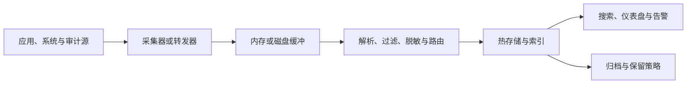

# 日志管理

日志是系统在特定时间发生了什么的离散记录。单机上读文件可以解决早期问题，但实例扩缩、容器销毁和服务跨区域后，必须统一处理采集、解析、传输、索引、检索、保留、权限和销毁，才能把日志变成可靠证据而不是昂贵噪声。

本章覆盖 Papertrail、Splunk、Loki、Elastic Stack 与 Graylog，并通过本地 Loki 实践建立结构化日志、标签和查询的基本方法。

## 学习目标 {#learning-objectives}

完成本章后，你应当能够：

- 设计带时间、级别、服务、环境和关联标识的结构化日志事件。
- 解释从应用到采集器、缓冲、存储、查询和归档的完整数据路径。
- 区分全文索引、字段索引和标签索引，控制基数、保留期与成本。
- 比较 Papertrail、Splunk、Loki、Elastic Stack 与 Graylog 的适用场景和运维责任。
- 在本地安全运行 Loki，写入虚构日志并用 LogQL 检索。
- 制定脱敏、访问控制、防篡改、丢日志检测和事件响应方案。

## 前置知识 {#prerequisites}

- 熟悉 [操作系统](operating-system.md) 的文件、权限和服务日志。
- 熟悉 [终端知识](terminal-knowledge.md) 中的文本处理、进程和网络工具。
- 理解 [网络与协议](networking-and-protocols.md) 中的 TCP、UDP、HTTP 与 TLS。
- 日志产生的资源上下文可结合 [基础设施监控](infrastructure-monitoring.md) 学习。

## 核心原理 {#core-principles}

### 日志流水线 {#logging-pipeline}



每一段都可能丢失、重复或重排事件。TCP 能确认传输字节，不代表后端已成功索引；本地磁盘缓冲可以抵御短暂中断，却会消耗节点空间。应监控采集延迟、队列长度、拒收、解析失败和最后成功写入时间。

### 结构化事件 {#structured-events}

纯文本便于人临时阅读，稳定 JSON 字段更适合机器查询。建议至少包含：

- `timestamp`：带时区的 RFC 3339 时间，统一使用 UTC 并保留源时间。
- `severity`：稳定枚举，例如 `DEBUG`、`INFO`、`WARN`、`ERROR`。
- `service`、`environment`、`version`：定位事件来源和部署批次。
- `message` 与 `event_name`：分别供人阅读和机器聚合。
- `trace_id`、`span_id`、`request_id`：跨服务关联，但不要把这些高基数字段设为 Loki 索引标签；支持时可使用结构化元数据。
- 必要的错误类型和堆栈；禁止记录密码、令牌、会话 Cookie 和完整个人敏感信息。

示例：

```json
{"timestamp":"2026-08-13T09:30:00Z","severity":"INFO","service":"checkout","environment":"demo","event_name":"order_validated","request_id":"req-example-001","message":"example order validated"}
```

### 索引模型 {#indexing-model}

不同产品的成本和查询体验由索引模型决定：

- **全文/字段索引**可快速搜索大量字段和任意词项，但摄取 CPU、存储和字段映射成本较高。Elastic Stack、Splunk 和 Graylog 常采用这一思路。
- **标签索引**只索引低基数标签，日志正文压缩为块并在查询时扫描过滤。Loki 借鉴 Prometheus 标签模型，摄取成本较低，但查询必须先用选择性标签缩小范围。
- **托管日志搜索**由服务商隐藏后端实现，用户通过查询语法、保留套餐和摄取配额使用，例如 Papertrail。

不存在“所有字段全部索引又几乎无成本”的方案。字段结构、查询模式、保留期和合规要求必须共同设计。

### 时间、顺序与重复 {#time-ordering-and-duplicates}

分布式系统没有天然的全局事件顺序。源主机时钟偏移、队列重试和批量发送都可能改变到达次序。日志事件应有源时间，并通过 NTP 监控时钟；接收时间可作为补充。需要幂等处理时加入事件标识，但不要假设后端一定去重。

### 日志、指标与追踪 {#logs-metrics-and-traces}

日志适合表达离散事件和丰富上下文；指标适合低成本聚合趋势和告警；追踪适合查看一次请求跨服务的因果路径。三者通过稳定的服务名、环境和 Trace ID 关联，而不是让同一信息在三个系统中无差别复制。跨信号诊断将在 [可观测性](observability.md) 展开。

!!! warning "日志是敏感数据资产"
    集中日志扩大了可搜索范围，也扩大了泄漏影响面。脱敏应尽量发生在数据离开源环境之前；后端界面中的字段隐藏不等于删除原始敏感值。

## 工具详解 {#tool-details}

### Papertrail {#papertrail}

**按需学习**。Papertrail 是 SolarWinds 提供的托管日志管理服务，常通过 Syslog（包括 TLS Syslog）、远程日志目标或平台集成集中系统与应用日志，提供实时 Tail、搜索、保存搜索和告警。

它适合希望快速集中 Heroku、Linux 服务和网络设备日志、又不想维护搜索集群的小团队。应核对每日/每月摄取、搜索窗口、归档、区域和合规要求。公网 UDP Syslog 无加密且可能丢包，生产中应优先使用 TLS 或受保护的转发器，并限制发送端地址。

### Splunk {#splunk}

**替代方案**。Splunk Enterprise/Cloud 通过 Universal Forwarder、HTTP Event Collector（HEC）等接入数据，经解析进入 Index，由 Search Head 使用 Search Processing Language（SPL）搜索、统计、告警和制作仪表盘。Source type、时间解析和字段提取决定数据可用性。

Splunk 适合数据源多、搜索分析和安全运营需求复杂的组织。主要约束是许可/摄取成本、索引容量、搜索并发以及分布式集群治理。应在源端过滤无价值噪声、正确设置索引与保留策略，HEC Token 必须按来源隔离并通过 TLS 传输。

### Loki {#loki}

**重点掌握**。Grafana Loki 以标签索引日志流，正文压缩后存入块和对象存储；LogQL 先选择日志流，再进行文本过滤、解析或指标式聚合。采集可使用 Grafana Alloy、Fluent Bit、OpenTelemetry Collector 等；Promtail 已于 2026 年 3 月 2 日结束生命周期，不应再用于新部署，既有部署应迁移到 Alloy 或其他受支持客户端。

Loki 适合已有 Prometheus/Grafana 体系并希望用一致标签在指标与日志间跳转的团队。索引标签只放有界、常用于筛选的维度，如 `service`、`environment` 和 `cluster`；`request_id`、用户 ID 等请求级值应留在正文或结构化元数据。Pod 名可用于区分日志流，但短命 Job 等造成的标签频繁变化会生成大量小流，必须评估基数与流 churn。对象存储、索引网关、压缩器和查询公平性决定生产规模能力。

### Elastic Stack {#elastic-stack}

**重点掌握**。Elastic Stack 通常由 Elasticsearch、Kibana 以及 Elastic Agent/Beats 或 Logstash 组成。Elasticsearch 把文档存入索引和分片，Mapping 定义字段类型；Ingest Pipeline 或 Logstash 负责解析与转换；Kibana 提供 Discover、Dashboard、告警和管理界面。

它适合需要灵活全文搜索、结构化字段查询和广泛数据接入的场景。生产中应使用 Data Stream 和 Index Lifecycle Management（ILM）管理滚动与冷热阶段，谨慎控制动态字段，规划主分片数量和副本。分片过多、Mapping Explosion 和高成本聚合是常见故障源。

### Graylog {#graylog}

**替代方案**。Graylog 接收 Syslog、GELF 等输入，通过 Stream 路由消息，Pipeline Rule 解析和规范字段，Search、Dashboard、Event Definition 与 Notification 用于分析和告警。其部署还依赖用于搜索存储的 Data Node/OpenSearch 体系及元数据组件，具体支持组合应以所用版本官方文档为准。

Graylog 适合重视 Syslog/GELF、集中解析和自托管搜索体验的团队。应按 Stream 与 Index Set 划分保留、权限和路由，监控 Journal 缓冲及搜索后端容量。升级时必须核对 Graylog 与底层数据节点的版本兼容矩阵，不能独立滚动升级其中一层。

## 选型比较 {#selection-comparison}

| 方案 | 运维模式 | 查询与索引特点 | 主要适用场景 | 主要约束 |
| --- | --- | --- | --- | --- |
| Papertrail | 托管 | 简洁搜索、实时 Tail | 快速集中系统和平台日志 | 套餐、保留、区域与复杂分析能力 |
| Splunk | 托管或自建 | SPL 与成熟字段/全文分析 | 企业搜索、安全与多源分析 | 许可、摄取和集群成本 |
| Loki | 自建或托管 | 低基数标签索引、LogQL | 云原生、Grafana 生态 | 标签设计与大范围扫描查询 |
| Elastic Stack | 自建或托管 | 文档字段和全文索引 | 灵活搜索与可定制数据管道 | 分片、Mapping、容量维护 |
| Graylog | 主要为自建 | Stream、Pipeline、搜索后端 | Syslog/GELF 与集中运维日志 | 组件兼容和后端容量 |

选型时先采样真实日志并回答：

- 每日摄取量、峰值吞吐、平均事件大小和保留期限是多少？
- 主要查询是按服务看最近错误，还是跨月全文取证和复杂统计？
- 是否涉及个人信息、支付数据、跨境、不可篡改归档或法律保留？
- 团队能否维护索引、分片、对象存储、升级和灾难恢复？
- 成本按摄取、索引、搜索、保留、主机还是用户计算？
- 能否导出原始日志、解析规则、仪表盘和告警，替换 Agent 的成本多大？

## 最小实践：写入并查询 Loki {#minimal-practice-write-and-query-loki}

本实践使用 Loki 官方容器的单进程本地配置，仅绑定回环地址，并禁用匿名使用统计。数据随容器删除，不用于生产。示例日志完全虚构且不含凭据。

创建 `loki-local.yaml`：

```yaml
auth_enabled: false

server:
  http_listen_port: 3100

common:
  instance_addr: 127.0.0.1
  path_prefix: /tmp/loki
  storage:
    filesystem:
      chunks_directory: /tmp/loki/chunks
      rules_directory: /tmp/loki/rules
  replication_factor: 1
  ring:
    kvstore:
      store: inmemory

schema_config:
  configs:
    - from: 2020-10-24
      store: tsdb
      object_store: filesystem
      schema: v13
      index:
        prefix: index_
        period: 24h

analytics:
  reporting_enabled: false
```

启动 Loki：

```bash
docker run --rm --name loki-demo \
  --pull=missing \
  --cap-drop=ALL \
  --security-opt=no-new-privileges \
  -p 127.0.0.1:3100:3100 \
  -v "$PWD/loki-local.yaml:/etc/loki/local-config.yaml:ro" \
  grafana/loki:3.7.6@sha256:efd47c67f9bac88ca29bcf8cb997d9ab29d1848bd0aff579282295542a745952 \
  -config.file=/etc/loki/local-config.yaml
```

在另一个终端确认就绪：

```bash
curl --fail --silent --show-error http://127.0.0.1:3100/ready
```

生成纳秒时间戳并写入两条 JSON 日志。Loki Push API 在生产环境应放在认证代理之后；这里只允许本机访问：

```bash
NOW="$(date +%s)000000000"
curl --fail --silent --show-error \
  -H 'Content-Type: application/json' \
  -X POST http://127.0.0.1:3100/loki/api/v1/push \
  --data-raw "{\"streams\":[{\"stream\":{\"service\":\"demo-api\",\"environment\":\"local\"},\"values\":[[\"${NOW}\",\"{\\\"severity\\\":\\\"INFO\\\",\\\"request_id\\\":\\\"req-example-001\\\",\\\"message\\\":\\\"demo started\\\"}\"],[\"$((NOW + 1))\",\"{\\\"severity\\\":\\\"ERROR\\\",\\\"request_id\\\":\\\"req-example-002\\\",\\\"message\\\":\\\"simulated failure\\\"}\"]]}]}"
```

查询该日志流并只保留 `ERROR` 事件：

```bash
curl --get --fail --silent --show-error \
  --data-urlencode 'query={service="demo-api",environment="local"} | json | severity="ERROR"' \
  --data-urlencode 'limit=10' \
  http://127.0.0.1:3100/loki/api/v1/query_range
```

响应 JSON 的 `data.result` 中应包含 `simulated failure`。注意 `request_id` 保留在正文并由查询时的 `json` 解析，而不是作为标签。用 ++control+c++ 停止 Loki，容器将自动删除。

## 生产实践 {#production-practices}

### 日志契约与采集 {#logging-contracts-and-collection}

- 为公共字段定义版本化 Schema，统一服务名、环境、级别、时间和 Trace ID；Schema 变更需兼容查询与告警。
- 应用优先写标准输出或本地受管理日志接口，由节点 Agent 采集，避免每个进程各自实现远程重试。
- 多行堆栈在源端正确合并，设置最大事件大小；超大正文转存受控对象存储，仅记录引用和校验值。
- 采集器使用磁盘缓冲、退避和限流，同时监控丢弃与积压；不能为“不丢日志”耗尽业务节点磁盘。

### 安全、隐私与审计 {#security-privacy-and-auditing}

- 在代码和采集管道双层实施允许列表或脱敏规则，测试 Authorization、Cookie、连接串和个人信息不会出现。
- 按环境、团队、租户和字段敏感度控制读取；导出、保存搜索、告警目标和 API Token 也要授权与审计。
- 传输使用 TLS，静态数据使用受管密钥加密。审计日志写入权限与业务管理员分离，并考虑防篡改归档。
- 为数据主体删除、法律保留、跨境和备份副本建立可执行流程，不能只删除热索引。

### 可靠性、性能与成本 {#reliability-performance-and-cost}

- 热存储保留近期可搜索数据，较老数据转入低成本归档；恢复归档要有时间目标并定期演练。
- 先删除健康检查成功日志等低价值事件，再考虑采样；安全审计和错误事件通常不能随机采样。
- 限制无时间范围、无标签或前导通配符的大查询，为租户设置并发和扫描配额。
- 使用真实日志分布压测解析、摄取和查询，容量包含副本、索引开销、峰值和故障余量。
- 配置即代码管理采集器、Pipeline、索引模板、保留策略和告警，升级前验证字段及查询兼容性。

### 可操作性 {#operability}

- 告警优先来自指标；日志告警适用于明确、低频且可行动的事件，如审计策略拒绝或批任务终态失败。
- 在仪表盘和 Runbook 中保存参数化查询，不共享带固定生产敏感值的长链接。
- 用 Canary 周期性写入已知日志并查询，检测从采集到检索的端到端中断。
- 将部署版本和变更事件写成可关联字段，排障时可按版本快速切分。

## 常见误区 {#common-misconceptions}

**把所有对象序列化进日志**：对象可能包含令牌和个人信息，字段爆炸还会推高索引成本。应显式选择允许记录的字段。

**只依赖正则表达式事后脱敏**：格式变化和编码会绕过规则。优先从源头不记录，脱敏作为第二道防线。

**所有日志永久保留**：增加费用、泄漏面和合规负担。保留应由用途和法规决定，并验证实际删除。

**用日志代替指标告警**：文本格式变化会让规则失效，大范围扫描也更昂贵。稳定的高频告警信号应暴露为指标。

**把唯一标识设为 Loki 标签**：每个请求产生独立流，会造成高基数和大量小块。唯一标识留在正文，查询时解析。

**认为 TCP 或 Agent 成功发送就绝不丢失**：后端拒收、解析失败、缓冲溢出和保留策略都可能丢数据，必须端到端验证。

## 动手练习 {#hands-on-exercises}

1. 完成 Loki 实践，分别查询全部日志、`ERROR` 日志和指定 `request_id`。
2. 将一行 Nginx 风格文本转换为 JSON Schema，明确字段类型、缺失值和时间格式。
3. 设计一条源端脱敏测试，确保请求头中的 Bearer Token 和查询参数 `password` 不进入日志。
4. 给每日 100 GiB 日志制定热存储、归档和删除策略，并写出查询恢复目标。
5. 任选两个日志工具，用相同样本比较接入、查询、权限、三年成本和迁移工作量。

## 完成检查 {#completion-checklist}

- [ ] 能解释日志从源端到检索的每个环节和可能的丢失点。
- [ ] 能设计稳定的结构化日志字段并关联 Trace ID。
- [ ] 能区分全文/字段索引和 Loki 标签索引的成本模型。
- [ ] 能说明 Papertrail、Splunk、Loki、Elastic Stack、Graylog 的定位与约束。
- [ ] 已完成本地 Loki 写入、JSON 解析查询和清理。
- [ ] 能制定脱敏、RBAC、加密、审计、保留和删除方案。
- [ ] 能监控采集延迟、队列、丢弃、解析失败和端到端可查询性。

## 官方延伸阅读 {#official-further-reading}

- [Papertrail Documentation](https://www.papertrail.com/help/)
- [Splunk Documentation](https://docs.splunk.com/Documentation)
- [Grafana Loki Documentation](https://grafana.com/docs/loki/latest/)
- [LogQL Documentation](https://grafana.com/docs/loki/latest/query/)
- [Elastic Stack Documentation](https://www.elastic.co/docs/get-started/the-stack)
- [Elasticsearch Index Lifecycle Management](https://www.elastic.co/docs/manage-data/lifecycle/index-lifecycle-management)
- [Graylog Documentation](https://go2docs.graylog.org/current/home.htm)
- [RFC 5424：The Syslog Protocol](https://www.rfc-editor.org/rfc/rfc5424)
- [OpenTelemetry Logs Data Model](https://opentelemetry.io/docs/specs/otel/logs/data-model/)
