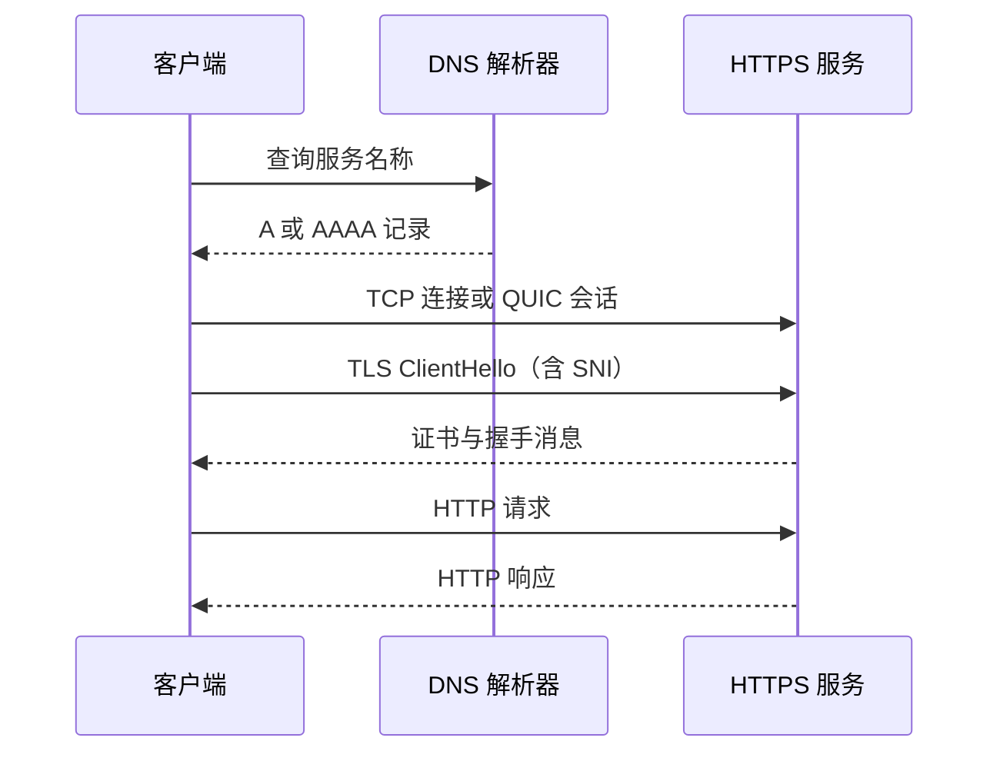
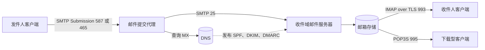

# 网络与协议

DevOps 工作中的许多“应用故障”，实际发生在名称解析、路由、连接、TLS 或邮件认证层。掌握协议的目标不是背端口号，而是能够沿分层模型提出假设，用协议工具收集证据，并在不降低安全性的前提下定位问题。本章同时覆盖 Web、远程访问、文件传输和完整的邮件投递链路。

## 学习目标

完成本章后，你应当能够：

- 使用 OSI 模型给故障定位，并说明现实互联网协议与七层模型的对应关系不是绝对的。
- 追踪一次 DNS 查询，解释常用记录、TTL、缓存和权威边界。
- 从 HTTP 报文、状态码和幂等性分析客户端与服务端行为。
- 解释 HTTPS、TLS 握手、证书链和主机名校验，避免继续使用 SSL。
- 安全选择 SSH、SFTP、FTP、IMAP、POP3S 和 SMTP 的连接方式。
- 解释白名单或允许列表、邮件灰名单的机制与限制。
- 说明 SPF、DomainKeys、DKIM 与 DMARC 各自验证什么，以及标识符对齐为何重要。
- 在本机建立受信任的最小 TLS 服务，并用 `curl` 与 OpenSSL 验证它。

## 前置知识

- 熟悉进程、文件权限和基本命令行操作，参见[操作系统](operating-system.md)与[终端知识](terminal-knowledge.md)。
- 若需要理解代理和负载均衡所处位置，先阅读[常见基础设施服务](common-infrastructure-services.md)。
- 本章不要求先有云账号，也不会要求连接真实邮件账号。

## 核心原理：OSI 模型与排障方法

开放系统互连模型（OSI Model）把通信抽象为七层。它适合建立共同语言，但 TCP/IP 实现并不会严格按七个独立模块运行。

| 层 | 主要问题 | 常见例子 | 常用证据 |
| --- | --- | --- | --- |
| 7 应用层 | 双方是否理解同一应用语义 | HTTP、DNS、SMTP、SSH | 状态码、协议日志、应用报文 |
| 6 表示层 | 编码、加密、序列化是否一致 | TLS、UTF-8、JSON | 握手详情、编码错误 |
| 5 会话层 | 会话如何建立与恢复 | RPC 会话、TLS 会话 | 会话 ID、重连记录 |
| 4 传输层 | 端口、可靠传输和流控是否正常 | TCP、UDP、QUIC | SYN、重传、端口状态 |
| 3 网络层 | 数据包能否跨网络到达 | IPv4、IPv6、ICMP | 路由表、跳数、丢包 |
| 2 数据链路层 | 同一链路如何寻址和传帧 | Ethernet、Wi-Fi、ARP | MAC、邻居表、VLAN |
| 1 物理层 | 信号与介质是否工作 | 光纤、双绞线、无线电 | 链路状态、误码、光功率 |

排障时从已知事实逐层缩小范围。例如：“DNS 返回了预期 IP”不代表 TCP 端口可达；“TCP 已连接”不代表 TLS 证书有效；“TLS 成功”也不代表 HTTP 路由和授权正确。反过来，收到 HTTP `403` 通常已经证明下层链路基本可用，不必先更换网线。



## DNS

域名系统（Domain Name System，DNS）是分层、委派且大量依赖缓存的命名系统。典型查询经过本机存根解析器、递归解析器，再按根、顶级域和权威服务器的委派找到答案。递归解析器通常替客户端完成后续查询并缓存结果。

### 常用记录

- `A` 与 `AAAA`：分别把名称映射到 IPv4 和 IPv6 地址。
- `CNAME`：把一个名称别名指向另一个规范名称。它通常不能与同名的其他数据共存，根域是否支持类似能力取决于 DNS 服务商的扁平化实现。
- `MX`：声明接收某域邮件的服务器及优先级，数值越小优先级越高；目标应是主机名而不是直接写 IP。
- `TXT`：承载文本策略和验证数据，SPF、DKIM、DMARC 常使用它，但 TXT 本身不赋予内容可信度。
- `NS`：标识区域的权威名称服务器。
- `SOA`：记录区域主服务器、序列号和相关计时参数。
- `PTR`：执行 IP 到名称的反向解析，由地址拥有者管理相应反向区域。邮件系统常检查发送 IP 的反向解析。
- `CAA`：限制哪些证书颁发机构可为域名签发证书。
- `SRV`：发布某服务的目标主机、端口、优先级和权重。

TTL 决定缓存答案可复用多久，不保证变更在精确秒数后全球同步。递归解析器可能有最小或最大缓存策略，应用也可能自行缓存。迁移前应提前降低 TTL，待旧记录缓存自然过期后再切换；迁移完成后恢复合理 TTL，避免长期增加权威查询压力。

DNSSEC 为 DNS 数据提供来源真实性和完整性验证，但不加密查询内容。加密 DNS 传输可使用 DNS over TLS 或 DNS over HTTPS，二者与 DNSSEC 解决的问题不同。

### 安全排查

使用 `dig` 时同时观察答案、权威服务器、状态与 TTL：

```bash
dig A www.example.com
dig AAAA www.example.com
dig MX example.com
dig +trace www.example.com
```

`NXDOMAIN` 表示名称不存在，`NOERROR` 且答案为空可能表示名称存在但没有所查询类型。不要把任何 DNS 失败都归结为“还在传播”；先直接查询权威服务器并检查委派、DNSSEC 和记录类型。

## HTTP

超文本传输协议（HTTP）是请求与响应协议。HTTP/1.1 以文本形式表达报文并可复用 TCP 连接；HTTP/2 在单连接上复用二进制流并压缩头部；HTTP/3 在 QUIC 之上运行，减少传输层队头阻塞。版本改变传输方式，但方法、状态码、Header 和缓存等语义仍由 HTTP 规范定义。

### 方法、安全性与幂等性

- `GET` 获取表示，语义上安全且幂等，不应触发业务状态变更。
- `HEAD` 与 `GET` 类似但不返回响应正文，适合检查元数据。
- `POST` 提交处理请求，通常不幂等；重试前需要幂等键或业务去重。
- `PUT` 用给定表示替换目标资源，语义上幂等。
- `PATCH` 部分更新资源，是否幂等取决于补丁格式和服务实现。
- `DELETE` 请求删除目标资源，语义上幂等不等于每次响应必须相同。
- `OPTIONS` 描述通信选项，也用于浏览器 CORS 预检。

“幂等”表示相同请求执行一次和多次的预期服务端效果相同，不表示没有日志、计费或时间变化，也不表示网络库可以无条件重试。调用方还要判断请求是否已经到达服务端。

### 状态码和头部

`1xx` 表示临时信息，`2xx` 表示已处理，`3xx` 表示重定向或缓存验证，`4xx` 表示客户端请求不能按当前形式完成，`5xx` 表示服务端未能履行有效请求。监控时应保留具体状态码：`401`、`403`、`404`、`409`、`429`、`500`、`502`、`503` 和 `504` 的修复方向不同。

重要 Header 包括 `Host`、`Content-Type`、`Content-Length`、`Authorization`、`Cookie`、`Set-Cookie`、`Cache-Control`、`ETag`、`Location`、`Retry-After` 和 `Vary`。Header 名称不区分大小写，但值的语义由各字段规范决定。代理转发与缓存细节参见[常见基础设施服务](common-infrastructure-services.md)。

## HTTPS、SSL 与 TLS

HTTPS 是在 TLS 保护下传输 HTTP。TLS 提供传输加密、完整性保护和对端身份认证；它不自动证明网站业务可信，也不替代应用授权。

SSL 2.0 和 SSL 3.0 已废弃。工程交流中仍会看到“SSL 证书”或“SSL 终止”，通常实际指 TLS。新系统应使用当前受支持的 TLS 版本和算法，不能通过启用旧 SSL 来兼容过时客户端。

### TLS 握手要点

1. 客户端发送支持的 TLS 版本、密码套件、随机数、密钥协商参数，以及服务器名称指示（SNI）和应用层协议协商（ALPN）。
2. 服务端选择参数并返回证书链和密钥协商消息。
3. 客户端验证证书链是否到达受信任根、证书是否在有效期、主机名是否匹配，以及用途和吊销策略是否满足要求。
4. 双方派生会话密钥并验证握手完整性，之后用对称加密保护应用数据。

TLS 1.3 简化了握手并移除多项旧算法。会话恢复能减少延迟，但 `0-RTT` 早期数据可能被重放，只能用于明确可安全重放的操作。

!!! warning "不要用跳过校验修复证书问题"
    `curl -k`、关闭主机名校验或信任任意证书只会隐藏身份验证失败。应修复系统时间、完整证书链、SAN 主机名、信任根或代理拦截配置。

## SSH

安全外壳协议（Secure Shell，SSH）在不可信网络上提供加密的远程登录、命令执行、端口转发和文件传输。客户端先验证服务器主机密钥，再由服务端验证用户身份。这两个方向不可混为一谈。

推荐使用现代密钥算法和受口令保护的私钥，私钥留在客户端或硬件密钥中。`known_hosts` 记录服务端身份；首次连接前应通过可信渠道核对指纹，而不是习惯性接受未知主机。自动化使用独立账号、短期证书或受限密钥，并在 `authorized_keys` 中按需限制来源、命令和转发能力。

生产服务通常应：

- 禁止直接以 `root` 登录，使用可审计的提权流程。
- 在密钥认证稳定后关闭口令登录，防止暴力猜测。
- 限制允许用户、网络来源、空闲时长和认证尝试次数。
- 谨慎启用代理转发和端口转发；转发的认证代理可能被远端进程滥用。
- 维护主机密钥轮换流程，避免重建主机后让所有人忽略指纹变化。

## FTP 与 SFTP

FTP 使用独立的控制连接和数据连接。主动模式由服务器连接客户端数据端口，容易被客户端 NAT 或防火墙阻断；被动模式由客户端连接服务端公布的数据端口，服务端需要配置并放行受控端口范围。传统 FTP 的用户名、密码和内容都是明文。

FTPS 是 FTP 加 TLS，仍保留 FTP 的双连接模型；它与 SFTP 不是同一种协议。SFTP 是 SSH 文件传输子系统，通常复用 SSH 的单一端口、主机密钥和用户认证，防火墙与身份治理更直接。

**重点掌握 SFTP**，只在兼容遗留合作方时按需维护 FTP 或 FTPS。文件交换还应考虑：

- 把上传目录与最终消费目录隔离，上传完成后使用原子重命名交付。
- 限制目录范围、文件大小、扩展名、配额和并发连接。
- 对文件执行恶意内容扫描和内容类型验证，不信任文件名。
- 用校验和或签名验证完整性，并定义重复文件的幂等处理规则。
- 独立记录谁在何时上传、下载或删除了什么，不在日志中泄露文件内容。

## 允许列表与灰名单

“白名单”通常指允许列表（Allowlist）：只有明确列出的身份、地址、域名或操作被允许，其余拒绝。相比开放后再逐项阻止，它更接近最小权限，但维护成本会随动态地址、第三方依赖和规模增长。

允许列表不是身份认证。IP 可能由 NAT 后的多个主体共享，也可能重分配；域名到 IP 的映射可能变化。生产策略应尽可能结合工作负载身份、双向 TLS、短期凭据和审计，并为条目设置负责人及期限。

灰名单（Greylisting）在邮件领域通常指接收服务器首次看到某个发送组合时临时返回 `4xx`，合规 SMTP 发送方会稍后重试，而部分垃圾发送程序可能不会。它依赖 SMTP 重试语义，可能推迟正常邮件，也很难单独应对使用正规基础设施发送的垃圾邮件。现代系统通常把它作为信誉、速率和内容检测的补充，而不是唯一防线。

在访问控制语境中，“灰名单”有时泛指需要额外验证或限制的中间状态。设计和文档必须明确具体动作，不能只写颜色名称。

## 邮件协议全景

邮件系统把提交、服务器间传输、存储和读取分开。发送成功响应通常只表示下一跳服务器已接受消息，并不保证收件人最终看见邮件。



### SMTP

简单邮件传输协议（SMTP）负责提交和转发邮件。服务器之间通常在 TCP `25` 端口传输；客户端提交通常使用 `587` 配合 STARTTLS，或使用 `465` 的隐式 TLS。端口是常见约定而非安全结论，必须根据服务端策略验证加密和认证。

SMTP 是存储转发协议。临时失败用 `4xx`，发送方应按退避策略重试；永久失败用 `5xx`，通常不应原样重试。开放中继会让未授权用户借服务器发送邮件，必须要求提交认证并限制可用发件身份。

STARTTLS 是在明文连接上协商升级 TLS。若客户端把它当作“可选”，降级攻击或配置错误可能使邮件明文传输。服务器间强制 TLS 可结合 MTA-STS 或 DANE 等机制，但部署前需要理解 DNSSEC 和兼容性边界。

### IMAP 与 POP3S

互联网消息访问协议（IMAP）以服务器邮箱为中心，支持文件夹、状态同步、多设备访问和按需下载。常见安全端口是隐式 TLS 的 `993`；`143` 可使用 STARTTLS，但不应在公网发送明文凭据。

邮局协议第 3 版（POP3）更偏向下载邮件到单一客户端。POP3S 指 POP3 over TLS，常用端口 `995`。它功能较少，在多设备同步和服务器端文件夹方面不如 IMAP，但仍存在于设备和遗留流程中。

不要仅凭端口认定连接安全。客户端要验证服务端证书和主机名，服务端应禁用明文认证或要求认证只发生在 TLS 建立之后。更现代的客户端认证可使用 OAuth 2.0 短期令牌，减少长期密码暴露。

## SPF、DomainKeys、DKIM 与 DMARC

这些机制主要降低发件域伪造并建立可验证身份，不负责加密邮件正文，也不能证明邮件内容无恶意。

### SPF

发件人策略框架（Sender Policy Framework，SPF）由域所有者在 DNS TXT 中声明哪些主机可使用该域作为 SMTP 信封发件地址发送邮件。接收方根据实际连接的发送 IP、`MAIL FROM` 域或空退信时的 HELO 域计算结果。

SPF 不直接验证用户在邮件客户端看到的 `From` 头。邮件转发会改变最后一跳发送 IP，可能导致 SPF 失败；转发系统可使用 SRS 等机制重写信封发件地址。SPF DNS 查询次数有规范限制，不能无限嵌套 `include`。通常只发布一条 SPF 记录，并在确认所有合法来源后逐步收紧结尾策略。

示意记录如下，`example.com` 是保留示例域名，不代表可直接用于生产：

```dns
example.com. 3600 IN TXT "v=spf1 include:_spf.mail-provider.example -all"
```

### DomainKeys 与 DKIM

DomainKeys 是较早的域级邮件签名方案，现已被 DomainKeys Identified Mail（DKIM）取代。遇到遗留系统的 `DomainKey-Signature` 或 `_domainkey` 配置时，应区分历史 DomainKeys 与现代 `DKIM-Signature`；新部署应使用 DKIM，不要新建 DomainKeys 实现。

DKIM 发送方使用私钥对选定邮件头和正文摘要签名，并在 `DKIM-Signature` 中写入签名域 `d=` 与选择器 `s=`。接收方查询 `<selector>._domainkey.<domain>` 的 DNS TXT 公钥来验签。签名可在邮件转发后继续有效，只要中间系统没有以不兼容方式修改被签内容。

选择器让同一域可以并行发布多个密钥，从而无中断轮换。私钥应只存在于授权邮件系统或机密服务中，限制读取权限；DNS 公钥可以公开。应使用受支持的密钥算法和长度，轮换时先发布新公钥，切换签名，再等待旧邮件和 DNS 缓存过期后删除旧记录。

```dns
selector1._domainkey.example.com. 3600 IN TXT "v=DKIM1; k=rsa; p=BASE64_PUBLIC_KEY_PLACEHOLDER"
```

### DMARC

基于域的消息认证、报告与一致性（DMARC）把 SPF 或 DKIM 的结果与用户可见 `From` 域进行**对齐**。一封邮件只需至少一条对齐路径通过：

- SPF 通过，并且经过验证的信封发件域与 `From` 域按宽松或严格模式对齐。
- DKIM 通过，并且有效签名的 `d=` 域与 `From` 域按策略对齐。

域所有者在 `_dmarc.<domain>` 发布策略，可请求接收方对失败邮件执行 `none`、`quarantine` 或 `reject`，并接收聚合报告。DMARC 不是“发布 `reject` 就结束”：第三方发送平台、邮件列表、子域和转发链都可能受影响。

接收方从可见 `From` 的作者域开始查询 DMARC 记录；当前 RFC 9989 使用有查询次数上限的 DNS Tree Walk 寻找适用策略，而不能只假设精确域名或依赖本地公共后缀列表。新标准还增加 `t` 测试模式，并移除了旧 `pct` 标签。

安全上线流程通常是：

1. 盘点全部合法发送源，并为每个来源正确配置 SPF 或 DKIM。
2. 发布 `p=none` 收集聚合报告，确认未知来源和对齐失败原因。
3. 修复合法流量后，先在隔离测试子域验证 `quarantine`；已确认主要接收方支持 RFC 9989 时，也可用 `p=quarantine; t=y` 请求测试模式，再切换为 `p=quarantine; t=n`。
4. 证据充分时以同样方式验证 `reject`，最终切换为 `p=reject; t=n`；持续监控新增发送源和密钥轮换。不要再用已从 RFC 9989 删除的 `pct` 标签设计新部署。

`t=y` 只是域所有者的处理请求，不保证所有接收方都按测试模式执行；尚未支持 RFC 9989 的接收方可能把 `t` 当未知标签忽略并直接应用 `p`。灰度前应确认主要接收方的支持情况，并优先在隔离测试域或子域验证，不能仅靠 `t=y` 保护生产邮件。

```dns
_dmarc.example.com. 3600 IN TXT "v=DMARC1; p=none; rua=mailto:dmarc-reports@example.com"
```

!!! warning "报告地址也需要治理"
    DMARC 聚合报告可能量大，并包含发送基础设施信息。失败报告还可能包含邮件头、正文和个人信息，很多接收方因此限制或不发送；常规监控应优先使用聚合报告。应使用专用邮箱和自动解析流程，设定保留期限与访问权限。示例地址不可用于真实报告。

### 三种机制如何协作

| 机制 | 主要验证对象 | 数据位置 | 典型限制 |
| --- | --- | --- | --- |
| SPF | 当前发送 IP 是否获信封域授权 | 域名 DNS TXT | 转发易破坏；不直接绑定可见 `From` |
| DKIM | 签名域负责的内容在传输中是否保持可验证 | 邮件签名头与 DNS 公钥 | 修改正文或已签头可能使验签失败 |
| DMARC | SPF 或 DKIM 是否通过且与可见 `From` 对齐 | `_dmarc` DNS TXT | 依赖准确发送源盘点和持续报告分析 |

三者不能代替垃圾邮件信誉、恶意附件扫描、用户认证或端到端加密。S/MIME 和 OpenPGP 等内容签名或加密属于另一层问题。

## 选型比较

### 文件传输

新系统优先选择 SFTP、HTTPS 对象上传或受控 API。SFTP 适合目录式批量交换和既有 SSH 身份体系；HTTPS API 更容易表达细粒度业务验证、幂等性和状态。只有对方协议固定时才保留 FTP/FTPS，并隔离网关、限制被动端口和强制 TLS。

### 远程管理

少量主机可使用加固后的 SSH；大规模环境应结合短期 SSH 证书、堡垒机或基于身份的会话服务，减少长期密钥和公网管理端口。需要批量执行时，不要把手工 SSH 当作配置管理，参见[配置管理](configuration-management.md)。

### 邮箱读取

需要多设备、服务器文件夹和状态同步时选择 IMAP over TLS。只需把邮件下载给受控单用途程序且服务商支持时，才考虑 POP3S。自动化处理还可评估供应商 API，但要比较开放标准可迁移性、限流和长期令牌风险。

### 名称和传输安全

公网站点通常需要权威 DNS、自动化证书和 HTTPS。DNS 服务商选型应比较 Anycast 覆盖、DNSSEC、变更审计、API 权限、查询日志和故障转移能力。TLS 由云入口还是自管代理终止，要根据信任边界、证书控制、性能和端到端加密要求决定。

## 最小实践：本机 TLS 服务

该实验使用 OpenSSL 生成只用于 `localhost` 的临时自签发证书，服务仅监听环回地址。`curl` 显式信任这张实验根证书，而不是跳过校验。

### 1. 生成证书

在空目录执行：

```bash
umask 077
openssl req -x509 -newkey rsa:2048 -sha256 -nodes \
  -keyout localhost.key \
  -out localhost.crt \
  -days 1 \
  -subj "/CN=localhost" \
  -addext "subjectAltName=DNS:localhost,IP:127.0.0.1" \
  -addext "keyUsage=digitalSignature,keyEncipherment" \
  -addext "extendedKeyUsage=serverAuth"

openssl x509 -in localhost.crt -noout \
  -subject -issuer -dates -ext subjectAltName
```

证书有效期只有一天，私钥权限受 `umask` 限制。自签发证书只适合实验或明确受控的内部信任体系。

### 2. 启动服务

在第一个终端运行：

```bash
openssl s_server \
  -accept 127.0.0.1:8443 \
  -cert localhost.crt \
  -key localhost.key \
  -www
```

在第二个终端验证证书和 HTTP：

```bash
curl --fail --show-error \
  --cacert localhost.crt \
  https://localhost:8443/

openssl s_client \
  -connect 127.0.0.1:8443 \
  -servername localhost \
  -verify_hostname localhost \
  -CAfile localhost.crt \
  -verify_return_error </dev/null
```

应看到 `Verify return code: 0 (ok)`。将 `-verify_hostname localhost` 改为其他名称，或让 `curl` 不再提供 `--cacert`，验证应失败，这正是身份校验在发挥作用。`-servername` 负责发送 SNI，`-verify_hostname` 才明确要求 `s_client` 校验目标主机名。

### 3. 清理

在第一个终端按 `Ctrl+C` 停止服务，然后删除临时材料：

```bash
rm -f localhost.key localhost.crt
```

## 生产实践

### 安全性

- 所有管理、文件和邮件认证连接强制使用受支持的 TLS 或 SSH 配置，禁用明文回退。
- 自动化证书签发、部署、续期和吊销；对到期时间、握手失败和异常签发设置告警。
- DNS 变更使用最小权限 API 凭据、多人审查和审计日志；注册商账号启用强多因素认证和注册锁。
- SSH 主机密钥、用户密钥和 DKIM 密钥建立清单、负责人和轮换流程，私钥不得写入仓库。
- 网络允许列表与应用身份认证叠加，不以源 IP 代替用户或服务身份。
- 邮件域从监控策略逐步收紧 DMARC，避免未经盘点直接拒绝合法第三方邮件。

### 可靠性

- 同时测试 IPv4 和 IPv6。只监控 `A` 记录会漏掉错误的 `AAAA` 路径。
- DNS 与证书切换保留重叠窗口；旧地址、旧密钥或旧证书在缓存和在途消息耗尽前不要过早删除。
- 客户端超时、退避和重试应符合协议语义。SMTP `4xx` 可延迟重试，HTTP 非幂等写请求则需业务去重。
- 监控应从多个网络位置执行 DNS、TCP、TLS 和应用层探测，以区分局部网络故障和全局故障。
- 邮件队列设置容量和最老消息年龄告警；只看“当前发送成功率”会遗漏持续积压。

### 可观测性

按层保存恰当证据：DNS 响应码和延迟、TCP 建连时间与重传、TLS 版本和失败原因、HTTP 状态及延迟、SSH 认证事件、SMTP 队列与退信分类、DKIM/SPF/DMARC 结果。日志字段应结构化，但认证信息、邮件正文和个人数据需要最小采集与脱敏。

抓包可能包含凭据、Cookie 和业务内容。只在授权范围内采集，缩小过滤条件，限制文件权限与保留时间；结束后及时删除。

## 常见误区

- **把 OSI 层当作严格实现结构**：它是定位和沟通模型，QUIC 等协议会跨越传统边界。
- **认为能 `ping` 就代表服务正常**：ICMP 可达不能证明 DNS 名称、TCP 端口、TLS 或应用路由正常。
- **把 DNS 变更问题都称为传播**：配置错误、错误权威服务器、DNSSEC 失败和应用缓存需要分别验证。
- **用 `curl -k` 解决证书错误**：这会关闭关键身份校验，使中间人攻击更容易成功。
- **把 SFTP 当作加密 FTP**：SFTP 基于 SSH；FTPS 才是 FTP 加 TLS，连接和防火墙模型不同。
- **首次 SSH 连接总是接受主机密钥**：这样无法区分真实新主机与中间人，应从可信来源核对指纹。
- **认为端口 `993` 或 `995` 自动保证安全**：仍须验证证书、TLS 版本和认证配置。
- **把 SPF 的通过等同于可见发件人可信**：SPF 检查信封身份，DMARC 才要求与可见 `From` 对齐。
- **只配置 SPF，不配置 DKIM**：邮件转发可能破坏 SPF；DKIM 为 DMARC 提供另一条可对齐路径。
- **混用 DomainKeys 与 DKIM**：DomainKeys 是历史方案，新系统应实现并轮换 DKIM。
- **直接把 DMARC 改成 `p=reject`**：未盘点的合法发送平台和邮件列表可能立即被拒收。

## 动手练习

1. 对 `www.example.com` 分别查询 `A`、`AAAA`、`CAA` 和权威 `NS`，记录每个答案的 TTL，并说明变更时哪个管理方负责。
2. 使用 `curl --verbose https://www.example.com/` 记录协商出的 HTTP 版本、TLS 版本和证书主机名。不要使用 `-k`。
3. 在最小 TLS 实验中用 `openssl x509` 查看 SAN，再生成一张不含 `localhost` SAN 的证书，确认客户端为何拒绝它。
4. 设计一条 SFTP 文件接收流程，至少包括账号隔离、上传临时名、校验和、原子交付、重复文件处理和审计。
5. 选择你控制的测试域，仅使用只读 DNS 查询检查 MX、SPF、DKIM 选择器和 DMARC。画出 SPF 与 DKIM 各自参与 DMARC 对齐的标识符；不要在练习中修改生产 DNS。
6. 为 HTTP `POST /orders` 设计幂等键处理流程，说明客户端超时后如何安全重试，以及服务端保存去重结果多久。

## 完成检查

- [ ] 能用 OSI 模型逐层说明 DNS、TCP、TLS 和 HTTP 的证据。
- [ ] 能解释递归解析、权威服务器、常用 DNS 记录与 TTL。
- [ ] 能判断常见 HTTP 方法是否安全、是否幂等，并正确理解状态码类别。
- [ ] 能解释 HTTPS 与 TLS 的关系，并明确 SSL 已废弃。
- [ ] 能核验证书链、有效期和主机名，而不是关闭校验。
- [ ] 能说明 SSH 主机认证、用户认证和 SFTP 的安全边界。
- [ ] 能解释 FTP 主动或被动连接与 SFTP 的区别。
- [ ] 能区分允许列表和邮件灰名单，不把它们当作完整身份认证。
- [ ] 能描述 SMTP、IMAP 与 POP3S 在邮件链路中的不同职责。
- [ ] 能分别说明 SPF、DomainKeys、DKIM 和 DMARC，并解释标识符对齐。
- [ ] 已完成本机 TLS 实验并得到成功的证书验证结果。

## 官方延伸阅读

- [RFC 1122：Internet Hosts Communication Layers](https://www.rfc-editor.org/rfc/rfc1122)
- [RFC 1034：Domain Names Concepts and Facilities](https://www.rfc-editor.org/rfc/rfc1034)
- [RFC 1035：Domain Names Implementation and Specification](https://www.rfc-editor.org/rfc/rfc1035)
- [RFC 9110：HTTP Semantics](https://www.rfc-editor.org/rfc/rfc9110)
- [RFC 9114：HTTP/3](https://www.rfc-editor.org/rfc/rfc9114)
- [RFC 8446：TLS 1.3](https://www.rfc-editor.org/rfc/rfc8446)
- [OpenSSH Manual Pages](https://www.openssh.com/manual.html)
- [RFC 959：File Transfer Protocol](https://www.rfc-editor.org/rfc/rfc959)
- [RFC 5321：Simple Mail Transfer Protocol](https://www.rfc-editor.org/rfc/rfc5321)
- [RFC 9051：Internet Message Access Protocol](https://www.rfc-editor.org/rfc/rfc9051)
- [RFC 1939：Post Office Protocol Version 3](https://www.rfc-editor.org/rfc/rfc1939)
- [RFC 7208：Sender Policy Framework](https://www.rfc-editor.org/rfc/rfc7208)
- [RFC 6376：DomainKeys Identified Mail](https://www.rfc-editor.org/rfc/rfc6376)
- [RFC 9989：DMARC](https://www.rfc-editor.org/rfc/rfc9989)
- [RFC 9990：DMARC Aggregate Reporting](https://www.rfc-editor.org/rfc/rfc9990)
- [RFC 9991：DMARC Failure Reporting](https://www.rfc-editor.org/rfc/rfc9991)
