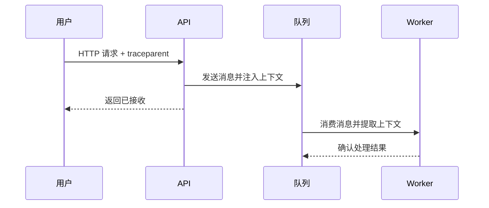
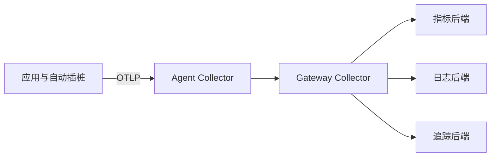

# 可观测性

监控已知故障模式很重要，但复杂分布式系统还会以设计时未预料的方式失败。可观测性（Observability）关注能否仅凭系统输出，提出新问题并逐步缩小原因范围。它不是购买一个“全栈平台”，而是把信号、上下文、服务目标和响应流程组织成可验证的诊断能力。

本章覆盖 Jaeger、New Relic、Datadog、Prometheus、OpenTelemetry 与 Dynatrace。Prometheus 在这里承担开放指标信号及 SLO 分析，而不是重复 [基础设施监控](infrastructure-monitoring.md) 中的主机采集教学；Datadog 在这里关注 APM、日志、追踪和用户体验关联，而不只展示基础设施资源。

## 学习目标 {#learning-objectives}

完成本章后，你应当能够：

- 区分指标、日志、追踪、Profile、事件及其适用问题。
- 解释 Trace、Span、Context Propagation、采样和尾部延迟。
- 用 OpenTelemetry 对遥测生成、处理和导出进行厂商中立建模。
- 比较 Jaeger、New Relic、Datadog、Prometheus、OpenTelemetry 与 Dynatrace 的职责和锁定成本。
- 在本地运行 OpenTelemetry Collector 与 Jaeger，发送虚构 Trace 并完成检索。
- 定义 SLI、SLO、错误预算，并让告警和发布决策围绕用户结果工作。

## 前置知识 {#prerequisites}

- 先学习 [基础设施监控](infrastructure-monitoring.md) 的时间序列、标签、告警和容量概念。
- 熟悉 [日志管理](logs-management.md) 的结构化事件、保留与敏感数据治理。
- 理解 [网络与协议](networking-and-protocols.md) 中的 HTTP、TLS、DNS 和跨服务调用。
- 分布式实践可结合 [容器编排](container-orchestration.md) 和 [CI/CD 工具](ci-cd-tools.md) 学习。

## 核心原理 {#core-principles}

### 可观测性与监控 {#observability-and-monitoring}

监控通常从已知问题出发，例如“节点磁盘是否将在四小时内耗尽”；可观测性要求系统输出足够丰富且可关联，使工程师还能追问“为何只有某版本、某区域、某支付方式的请求变慢”。两者互补：没有稳定监控就无法及时发现问题，没有可观测性就可能在新故障上停止于猜测。

### 遥测信号 {#telemetry-signals}

- **Metrics（指标）**：低成本聚合趋势，适合 SLI、容量和告警，但压缩掉单次事件细节。
- **Logs（日志）**：表达离散事件及丰富字段，适合取证和业务状态，全文检索成本较高。
- **Traces（追踪）**：记录一次事务跨组件的路径与时序，适合依赖、关键路径和尾延迟分析。
- **Profiles（剖析）**：统计代码在 CPU、内存或锁上的消耗，适合定位函数级热点。
- **Events（事件）**：部署、配置变更和功能开关等上下文，帮助把行为变化与操作关联。

信号之间通过统一的资源属性和上下文关联，例如 `service.name`、`deployment.environment.name`、`service.version`、`trace_id`。关联字段必须稳定，但不能把 Trace ID 直接变成指标标签。

### 分布式追踪 {#distributed-tracing}

一次 Trace 表示端到端事务，每个 Span 表示其中一个操作，包含名称、开始时间、持续时间、状态、属性、事件以及父 Span。服务通过 HTTP `traceparent` 等传播头把上下文传给下游：



如果丢失传播头，后端会出现多个孤立 Trace；如果盲目信任外部传入属性，又可能污染租户或采样决策。跨信任边界应遵循 W3C Trace Context 并过滤不允许的 Baggage。

### 采样 {#sampling}

全量保留追踪通常成本过高：

- **Head Sampling** 在 Trace 开始时决定是否采样，开销低，但此时不知道请求最终是否错误或很慢。
- **Tail Sampling** 收集完整 Trace 后再按错误、延迟或属性决定保留，信息更好，但 Collector 需要缓存、状态和容量。
- **概率采样** 保留固定比例；基于规则的采样可提高错误、重要租户或罕见路径的保留率。

采样会影响统计。不能直接用非均匀采样的 Trace 数量代替精确请求量；核心 SLI 应来自完整计数指标或能校正采样的数据。

### SLI、SLO 与错误预算 {#sli-slo-and-error-budgets}

服务级指标（SLI）是被测结果，例如“成功且低于 300 ms 的有效请求比例”；服务级目标（SLO）规定时间窗口内的目标值。错误预算表示允许的不良事件比例：

```text
错误预算 = 1 - SLO 目标
```

99.9% 可用性目标在 30 天窗口内约允许 43.2 分钟不良时间，但按请求比例定义时应计算失败请求，而非简单计时。多窗口、多燃烧率告警同时检测快速消耗与缓慢持续消耗，比固定“错误率大于 1% 五分钟”更贴近用户承诺。

!!! note "可观测性不是数据越多越好"
    高质量遥测应能支持具体诊断或决策，并有所有者、Schema、基数与保留预算。无边界数据会增加费用、隐私风险和排障噪声。

### OpenTelemetry 数据路径 {#opentelemetry-data-path}

OpenTelemetry（OTel）提供 API、SDK、语义约定、自动插桩、OTLP 协议和 Collector。典型路径是应用 SDK 生成遥测，经 Collector Receiver 接收，由 Processor 批处理、过滤、富化或采样，再由 Exporter 送往一个或多个后端。



Collector 只有列在 `service.pipelines` 中的组件才会运行。它可以降低应用对后端协议的耦合，但后端查询语言、仪表盘、告警和历史数据仍会形成迁移成本。

## 工具详解 {#tool-details}

### Jaeger {#jaeger}

**重点掌握**。Jaeger 是开源分布式追踪后端，可接收 OpenTelemetry/OTLP 数据，存储 Trace，并通过 UI 按服务、操作、标签和时长检索。生产架构可拆分 Collector、Query 和持久存储，也可通过 OpenTelemetry Collector 在前端完成处理与路由。

Jaeger 适合需要开放追踪能力、自主管理数据和理解 Trace 模型的团队。它主要解决追踪，而非完整指标、日志与业务分析平台；存储容量、索引、采样、租户隔离、认证和升级由团队负责。生产 UI 与接收端必须置于认证授权和 TLS 边界内。

### New Relic {#new-relic}

**替代方案**。New Relic 是托管可观测性平台，覆盖 APM、基础设施、日志、浏览器、移动端、合成监控和分布式追踪，数据可通过自有 Agent 或 OpenTelemetry 接入，并使用 New Relic Query Language（NRQL）查询。

它适合希望快速获得应用拓扑、事务分析和统一 SaaS 工作流的团队。选型时要验证数据摄取和用户计费、区域与保留、Agent 开销、属性基数和敏感字段过滤。NRQL、实体模型、仪表盘与告警会形成迁移工作量，使用 OTel 可降低采集层锁定，但不能完全消除后端锁定。

### Datadog {#datadog}

**替代方案**。Datadog 在可观测性上下文中把 APM、Continuous Profiler、Log Management、Real User Monitoring、Synthetic Monitoring 与基础设施实体关联。统一 Tagging 和 Service Catalog/Map 可从一个慢 Trace 下钻到相关日志、部署版本和容器资源。

它适合需要广泛集成和托管式跨信号工作流的团队。APM 采样、日志摄取与索引、RUM 会话、自定义指标和 Profile 都可能采用不同费用维度，应在上线前建立用量预算。Agent/API Key、客户端隐私、Tag 基数和数据出境需要治理。与监控章节不同，此处评价重点是跨信号诊断，而非单独的主机健康面板。

### Prometheus {#prometheus}

**重点掌握**。Prometheus 在可观测性体系中提供开放指标模型、PromQL、记录规则和基于 SLI 的告警。应用可暴露请求计数、错误、延迟 Histogram 和队列深度；Exemplar 可把某个指标样本关联到 Trace ID，使工程师从尾延迟图跳转到代表性 Trace。

Prometheus 不存储完整日志或 Trace，也不会自动建立服务因果图。这里应关注服务语义、Histogram 桶、SLO 规则和跨信号链接；主机 Exporter、目标抓取和基础设施容量已在 [基础设施监控](infrastructure-monitoring.md) 讨论。生产中还需治理高基数、远程写入、规则一致性和长期保留。

### OpenTelemetry {#opentelemetry}

**重点掌握**。OpenTelemetry 是遥测标准与工具生态，不是最终查询后端。API 让库作者描述 Span/Meter/Logger，SDK 控制采样与导出，语义约定统一 HTTP、数据库、消息系统和资源属性，OTLP 在组件间传输数据，Collector 负责接收、处理和导出。

它适合希望统一插桩并保留后端选择权的组织。应优先使用稳定的语义约定，集中管理 Collector 配置并限制属性；自动插桩提供广度，关键业务步骤仍需要少量手工 Span 和业务属性。Collector 是生产数据管道，必须有队列、重试、内存限制、认证、TLS、扩缩与自身遥测。

### Dynatrace {#dynatrace}

**替代方案**。Dynatrace 提供应用与基础设施可观测性、真实用户监控、合成监控、日志、剖析及拓扑分析。OneAgent 可自动发现进程和依赖，OpenTelemetry 数据也可接入；Grail、DQL、Smartscape 与 Davis 等能力用于存储查询、拓扑和分析，具体可用范围取决于部署与订阅。

它适合重视自动发现、企业拓扑和托管分析的复杂环境。应评估 OneAgent 权限与升级、数据采集范围、DQL/平台模型学习成本、许可和数据驻留。自动发现不能替代业务语义：订单类型、关键阶段和 SLO 仍要由团队定义。

## 选型比较 {#selection-comparison}

这些工具并非完全互斥。常见架构是 OTel 负责生成与传输，Prometheus 管指标，Jaeger 管 Trace，Grafana 等提供入口；也可以让 OTel/厂商 Agent 把信号送入 New Relic、Datadog 或 Dynatrace 的统一托管平台。

| 方案 | 主要角色 | 适合起点 | 主要成本或约束 |
| --- | --- | --- | --- |
| Jaeger | 开源追踪后端 | 自建 Trace 与开放标准 | 存储、采样、权限和后端运维 |
| New Relic | 托管全栈平台 | 快速统一 APM 与用户体验 | 摄取/用户费用及 NRQL 资产迁移 |
| Datadog | 托管全栈平台 | 云集成与跨信号关联 | 多产品计费、Tag 和数据治理 |
| Prometheus | 指标与规则后端 | 开放指标、SLO 与云原生生态 | 规模、长期存储，不覆盖完整 Trace/日志 |
| OpenTelemetry | 生成、处理与传输标准 | 降低采集层耦合 | Collector 运维，仍需要后端 |
| Dynatrace | 托管/企业可观测平台 | 自动发现和复杂拓扑 | Agent 权限、许可与平台模型锁定 |

选型验证应使用同一组真实故障，而不是只看演示：

- 能否从 SLO 告警在几次点击内定位到版本、Trace、日志和资源？
- 所需语言、异步框架、数据库和边缘/浏览器是否有可靠插桩？
- 遥测量、基数、采样和保留在正常及事故峰值下费用多少？
- 数据驻留、个人信息、租户隔离、加密和访问审计是否满足要求？
- 平台或 Collector 故障会阻塞业务请求吗？本地队列能承受多久？
- 若更换后端，API/SDK、Collector、查询、仪表盘、告警和历史数据各需迁移多少？

## 最小实践：OTel Collector 到 Jaeger {#minimal-practice-otel-collector-to-jaeger}

本实践在本机运行 Jaeger 与 OpenTelemetry Collector，把一个虚构 Trace 通过 OTLP/HTTP 发送到 Collector，再在 Jaeger UI 检索。所有端口仅绑定回环地址，不使用真实凭据，停止容器后数据即删除。

创建 `otel-collector.yaml`：

```yaml
receivers:
  otlp:
    protocols:
      http:
        endpoint: 0.0.0.0:4318

processors:
  memory_limiter:
    check_interval: 1s
    limit_mib: 128
  batch: {}

exporters:
  otlp/jaeger:
    endpoint: jaeger:4317
    tls:
      insecure: true

service:
  pipelines:
    traces:
      receivers: [otlp]
      processors: [memory_limiter, batch]
      exporters: [otlp/jaeger]
```

创建一次性 Docker 网络并启动 Jaeger：

```bash
docker network create observability-demo
docker run --rm --detach --name jaeger \
  --network observability-demo \
  --cap-drop=ALL \
  --security-opt=no-new-privileges \
  -p 127.0.0.1:16686:16686 \
  cr.jaegertracing.io/jaegertracing/jaeger:2.20.0@sha256:46a886260e04002d8f45e213fc39063fa11a50446048fdaa64786fc0840cb9f8
```

启动 Collector，只向本机暴露 OTLP/HTTP：

```bash
docker run --rm --detach --name otel-collector \
  --network observability-demo \
  --cap-drop=ALL \
  --security-opt=no-new-privileges \
  -p 127.0.0.1:4318:4318 \
  -v "$PWD/otel-collector.yaml:/etc/otelcol/config.yaml:ro" \
  otel/opentelemetry-collector-contrib:0.158.0@sha256:c5918f78992ee73b0d6f0e599423ac5ec52dd5d9726733114d6eca53d5a32ed5 \
  --config=/etc/otelcol/config.yaml
```

OTLP JSON 中时间单位为 Unix 纳秒。下面发送一条固定 Trace ID 的单 Span 示例，字段均为虚构值：

```bash
START="$(date +%s)000000000"
END="$((START + 50000000))"
curl --fail --silent --show-error \
  -H 'Content-Type: application/json' \
  -X POST http://127.0.0.1:4318/v1/traces \
  --data-raw "{\"resourceSpans\":[{\"resource\":{\"attributes\":[{\"key\":\"service.name\",\"value\":{\"stringValue\":\"checkout-demo\"}},{\"key\":\"deployment.environment.name\",\"value\":{\"stringValue\":\"local\"}}]},\"scopeSpans\":[{\"scope\":{\"name\":\"manual-demo\"},\"spans\":[{\"traceId\":\"5b8efff798038103d269b633813fc60c\",\"spanId\":\"eee19b7ec3c1b174\",\"name\":\"validate-demo-order\",\"kind\":1,\"startTimeUnixNano\":\"${START}\",\"endTimeUnixNano\":\"${END}\",\"status\":{\"code\":1}}]}]}]}"
```

打开 `http://127.0.0.1:16686`，选择服务 `checkout-demo` 并单击 **Find Traces**。预期能看到约 50 ms 的 `validate-demo-order` Span。若暂未出现，等待批处理刷新后重试，并检查：

```bash
docker logs otel-collector
```

完成后删除容器与网络：

```bash
docker stop otel-collector jaeger
docker network rm observability-demo
```

!!! warning "示例中的明文 OTLP 仅限本机"
    生产环境必须为接收端配置认证、TLS、网络访问控制和租户隔离，不能把 OTLP 或 Jaeger UI 直接暴露到公网。Collector 的 `insecure: true` 只用于一次性 Docker 内部网络。

## 生产实践 {#production-practices}

### 插桩与数据质量 {#instrumentation-and-data-quality}

- 建立遥测 Schema 和资源属性规范，统一服务、版本、环境、区域和团队；避免各语言命名不同。
- 使用自动插桩覆盖通用 HTTP、RPC、数据库与消息系统，再为关键业务阶段添加少量手工 Span。
- 正确传播异步消息上下文，限制 Baggage 大小和允许字段，禁止携带令牌、个人信息和大对象。
- Histogram 桶围绕 SLO 阈值设计，日志包含 Trace ID，Trace 保留服务版本，使三类信号可关联。
- 在 CI 中验证遥测契约，例如关键 Span 名、指标单位和敏感字段过滤，而不只验证业务返回值。

### SLO 与告警 {#slo-and-alerting}

- 从用户旅程选择少量 SLI，分母排除无效流量但不能为了“好看”排除真实失败。
- SLO 窗口和目标由业务影响、依赖承诺与恢复能力决定，不机械追求更多九。
- 使用多窗口燃烧率告警，通知中给出预算消耗、受影响服务、版本、区域和调查入口。
- 部署事件与 SLO 图关联；高燃烧率时自动暂停发布，是否回滚由兼容性和证据决定。
- 定期复盘 SLO 是否驱动了实际决策，无人行动的 SLI 应调整或删除。

### 管道可靠性与成本 {#pipeline-reliability-and-cost}

- SDK 异步批量导出，设置严格超时；遥测后端故障不得阻塞业务主路径。
- Collector 设置内存限制、持久队列、批处理、重试和背压，并监控接收、拒绝、丢弃、队列和导出失败。
- 根据风险组合 Head/Tail Sampling，始终保留关键错误和高延迟 Trace，同时限制攻击者制造高采样流量。
- 对指标序列、日志字节、Span 数、Profile 和前端会话分别设置预算与保留策略。
- 在源端删除无价值和敏感属性，不能只依赖后端摄取后过滤，因为费用和泄漏可能已经发生。

### 安全与治理 {#security-and-governance}

- Agent 和自动插桩视为生产代码，固定版本、审查权限并分阶段升级；主机级 Agent 往往能看到多个进程数据。
- OTLP 使用 mTLS 或受管身份，Collector 接收端按网络和租户隔离；后端查询实施 RBAC 和审计。
- 浏览器/RUM 数据先取得适用同意，屏蔽输入、URL 查询、Cookie 和会话内容，遵守区域与保留要求。
- 配置日志和 Trace 的字段级访问策略；支持导出不代表所有工程师都应读取全部客户上下文。
- 为厂商中断准备降级、缓冲和配置导出；定期测试更换导出后端而不修改应用业务代码。

## 常见误区 {#common-misconceptions}

**“我们收集了指标、日志和 Trace，所以已经可观测”**：如果字段不一致、无法关联、没有 SLO 或值班人员不会查询，数据只是三个孤岛。

**所有请求全量追踪并永久保留**：成本和隐私风险会迅速增长。按诊断价值采样并分层保留。

**把用户 ID、Trace ID 放进 Prometheus 标签**：时间序列基数失控。用 Exemplar 或日志字段关联，而非创建每请求序列。

**自动插桩能理解业务**：它能发现框架调用，却不知道“支付已授权但库存预留失败”意味着什么。关键业务边界需要手工语义。

**遥测导出失败就让业务请求失败**：可观测性是辅助系统，不应成为主路径硬依赖。使用异步、超时、队列和丢弃策略保护业务。

**用平均延迟定义体验**：少量极慢请求会被平均值掩盖。使用 Histogram、分位数、良好事件比例和尾部 Trace。

**采用 OpenTelemetry 就没有锁定**：插桩和协议更可移植，但查询语言、告警、Dashboard、数据模型增强和历史仍属于后端资产。

## 动手练习 {#hands-on-exercises}

1. 完成 OTel 到 Jaeger 实践，找到固定 Trace ID 并核对服务名、Span 名和持续时间。
2. 扩展示例为父子两个 Span，保持同一 Trace ID、使用不同 Span ID，并设置正确 `parentSpanId`。
3. 为一个 HTTP 服务定义请求计数、错误计数和延迟 Histogram，写出“300 ms 内成功请求比例”的 SLI。
4. 为 99.9% SLO 设计快速与慢速两类错误预算燃烧告警，说明每类通知对象和动作。
5. 用同一“特定版本在单一区域变慢”故障比较 Jaeger + Prometheus 与一种 SaaS 平台的调查路径。
6. 制定遥测隐私检查表，覆盖服务端日志、Trace 属性、Baggage、RUM 输入和导出目标。

## 完成检查 {#completion-checklist}

- [ ] 能区分指标、日志、追踪、Profile 和部署事件的用途。
- [ ] 能解释 Trace、Span、上下文传播、Head/Tail Sampling 和尾延迟。
- [ ] 能说明 Jaeger、New Relic、Datadog、Prometheus、OpenTelemetry、Dynatrace 的职责与边界。
- [ ] 能说明 Prometheus 和 Datadog 在监控章节与本章的不同教学上下文。
- [ ] 已完成 OTLP 接收、Collector 处理、Jaeger 查询和资源清理。
- [ ] 能定义基于用户结果的 SLI、SLO 与错误预算告警。
- [ ] 能规划遥测管道的安全、背压、采样、成本和后端迁移。

## 官方延伸阅读 {#official-further-reading}

- [Jaeger Documentation](https://www.jaegertracing.io/docs/)
- [New Relic Documentation](https://docs.newrelic.com/)
- [Datadog APM Documentation](https://docs.datadoghq.com/tracing/)
- [Prometheus Documentation](https://prometheus.io/docs/introduction/overview/)
- [OpenTelemetry Documentation](https://opentelemetry.io/docs/)
- [OpenTelemetry Specification](https://opentelemetry.io/docs/specs/otel/)
- [Dynatrace Documentation](https://docs.dynatrace.com/)
- [W3C Trace Context](https://www.w3.org/TR/trace-context/)
- [Google SRE Workbook：Implementing SLOs](https://sre.google/workbook/implementing-slos/)
- [Google SRE Workbook：Alerting on SLOs](https://sre.google/workbook/alerting-on-slos/)
