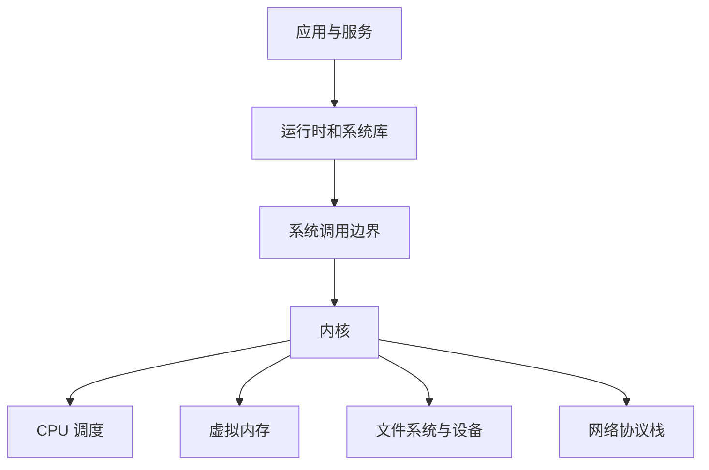

# 操作系统

操作系统（Operating System，OS）决定进程如何获得 CPU 和内存、文件如何持久化、用户如何被授权、数据包如何进入应用，以及服务如何启动和更新。DevOps 工程师不必开发内核，但必须能判断问题发生在应用、运行时还是操作系统边界，并选择团队能够长期修补和恢复的平台。

本章覆盖 Windows、FreeBSD、OpenBSD、NetBSD，以及 Ubuntu / Debian、SUSE Linux、RHEL 及其衍生发行版。重点不是背诵命令差异，而是建立跨平台的系统模型。

## 学习目标

完成本章后，你应当能够：

- 描述内核、用户空间、系统调用、进程、虚拟内存、文件系统和设备之间的关系。
- 在 Windows、BSD 和主流 Linux 发行版上采集版本、资源、服务及网络基础信息。
- 比较各操作系统的发布周期、软件来源、安全机制、自动化接口和迁移成本。
- 设计包含最小化安装、补丁、权限、日志、备份和恢复验证的服务器基线。
- 区分发行版差异、内核能力与应用兼容性，避免把命令表当作系统知识。

## 前置知识

- 建议先掌握一种用于自动化的语言，参见[学习一种编程语言](learn-a-programming-language.md)。
- 本章示例使用 Shell 或 PowerShell；可与[终端知识](terminal-knowledge.md)同步学习。
- 不要求有管理员权限。最小实践中的命令均为信息查询，不修改系统配置。

## 核心原理

### 内核与用户空间

应用通常不能直接操作硬件。它通过语言运行时和系统库发起系统调用，由内核校验权限并调度 CPU、内存、设备与网络资源。



这条边界解释了几个常见现象：

- 应用看到的是进程自己的虚拟地址空间，不是物理内存的直接映射。
- 文件权限由内核依据进程身份和访问控制规则判断，文件名本身不构成安全边界。
- 容器共享宿主机内核；虚拟机则运行自己的内核。更多内容参见[容器](containers.md)。
- 用户空间工具可以替换，但不能使用当前内核未实现或未启用的能力。

### 进程、服务与启动

进程是程序的一次运行实例，拥有身份、地址空间、打开的文件和调度状态。服务管理器负责声明依赖、启动、停止、重启和收集状态：Linux 常见 `systemd`，BSD 使用 `rc` 系统，Windows 使用服务控制管理器（Service Control Manager）。

服务“正在运行”只说明进程状态，不表示业务可用。生产检查还应覆盖监听端口、依赖可达、请求成功率和关键业务路径。

### 文件、身份与权限

Unix 类系统通常以用户 ID、组 ID 和权限位为基础，并可叠加 POSIX ACL、Linux capabilities、SELinux 或 AppArmor。Windows 以安全标识符（SID）、访问令牌和 NTFS ACL 表达更细的允许与拒绝规则。两类系统都遵循同一原则：权限授予进程所携带的身份，而不是授予“某段代码”。

!!! warning "管理员权限不是排障前提"
    先用普通账户收集证据，再对确实需要的单个操作提权。长期使用 `root`、本地 Administrator 或关闭强制访问控制，会让误操作和入侵拥有完整影响范围。

### 软件包与更新

操作系统供应商通常负责一组经过构建、签名和兼容性验证的软件仓库。包管理器解析依赖并记录已安装内容，但应用语言的包管理器、容器镜像和手工复制的二进制文件可能绕过系统仓库。资产清单必须同时覆盖这些来源。

安全补丁与功能升级是不同风险：前者应按漏洞暴露和服务等级及时部署，后者可能改变接口。两者都需要分批发布、健康验证和可测试的恢复路径。

## 操作系统家族

### Windows

**按需学习**。Windows Server 适合依赖 Active Directory、组策略、IIS、Microsoft 工作负载或厂商仅支持 Windows 的环境，桌面版也常作为开发和管理终端。

- **系统基础**：Windows NT 内核管理进程、线程、虚拟内存、I/O 和对象权限。服务由服务控制管理器管理，计划任务由 Task Scheduler 管理。
- **文件与配置**：NTFS 支持 ACL、审计、备用数据流和卷功能。注册表是分层配置数据库，但应用也可能使用文件或远程配置，不能把所有状态都归因于注册表。
- **自动化**：PowerShell 以 .NET 对象作为管道数据，Windows Management Instrumentation（WMI）与 Common Information Model（CIM）提供管理接口。新脚本应优先使用受支持的 cmdlet 和结构化对象。
- **软件与更新**：Windows Update、Windows Server Update Services（WSUS）或企业补丁平台管理系统更新；WSUS 已停止主动开发，现有能力仍可用，选型时应评估后续迁移路径。`winget` 可用于部分应用，但必须验证服务器版本和组织支持策略。
- **安全**：使用域或云身份、组策略、Defender、防火墙、BitLocker、凭据保护和 Just Enough Administration 等能力建立分层控制。不要因兼容问题永久关闭防护。

需要同时运行 Linux 工具时，Windows Subsystem for Linux（WSL）可提供开发环境，但其进程、文件权限和网络边界随 WSL 版本与网络模式而异，不能把开发便利直接等同于生产拓扑。

### BSD 家族概览

FreeBSD、OpenBSD 和 NetBSD 共享 Unix 传统和 BSD 许可证，但它们是独立操作系统，不是同一内核的“发行版”。各项目同时维护内核和基本用户空间，因此系统升级、手册页与基础工具具有较强整体性；第三方软件再通过 ports、packages 或 pkgsrc 提供。

#### FreeBSD

**替代方案**。FreeBSD 注重完整系统的一致性，常见于网络服务、存储设备和需要 Jails 或 ZFS 的环境。

- 基本系统与第三方包分开升级；二进制包常用 `pkg`，ports collection 用于按选项从源码构建。
- Jails 在共享 FreeBSD 内核上隔离进程、文件和网络，是系统级隔离机制，但不等同于虚拟机。
- ZFS 集成提供校验、快照、发送与接收等能力。快照不是离机备份，仍需独立故障域和恢复演练。
- 服务通常通过 `/etc/rc.conf` 声明并由 `service` / `rc.d` 脚本管理；修改前应阅读对应手册页。

#### OpenBSD

**按需学习**。OpenBSD 把代码正确性、安全默认值和文档一致性放在优先位置，常用于防火墙、路由、跳板及对简洁安全基线要求较高的服务。

- `pf` 提供包过滤与流量控制；规则应先做语法检查并保留带外恢复路径。
- `pledge(2)` 与 `unveil(2)` 允许程序收窄可用系统调用和文件系统视图，但只有应用主动采用时才生效。
- 基本系统安全修复可使用项目支持的补丁机制，版本升级遵循明确顺序。稳定取向意味着第三方软件版本未必追求最新。
- 默认安装已有较完整的基础服务与手册，应避免为熟悉感盲目替换系统组件。

#### NetBSD

**按需学习**。NetBSD 以可移植性著称，支持多种硬件架构，适合嵌入式、老旧硬件、跨平台系统研究和需要 pkgsrc 的场景。

- 内核与用户空间可面向多个架构构建，跨编译工具链是项目的重要能力。
- pkgsrc 不仅服务 NetBSD，也可在其他类 Unix 系统上管理第三方软件。
- `rc.d` 服务模型和清晰的手册页便于自动化，但选型前要确认目标硬件、驱动和商业软件的支持范围。

### Linux 共同基础

Linux 发行版共享 Linux 内核和大量 GNU 或其他用户空间组件，但在软件包格式、默认配置、安全策略、发布周期和厂商支持上不同。生产环境应记录发行版、版本、内核、仓库和镜像来源，不能只记录“Linux”。

#### Ubuntu 与 Debian

**重点掌握**。Debian 强调自由软件、广泛架构支持和稳定发布；Ubuntu 基于 Debian，提供固定节奏版本、长期支持（LTS）及商业支持选项。两者相近但仓库、生命周期和包版本不能混用。

- 软件包使用 Debian 包格式，底层工具为 `dpkg`，`apt` 负责仓库和依赖解析。自动化中使用非交互模式前必须预先定义配置行为，不能简单压制所有提示。
- 主流服务器版本通常使用 `systemd` 管理服务和日志入口，网络配置工具因版本与镜像而异。
- Ubuntu 常默认启用 AppArmor 配置；Debian 是否启用及策略覆盖范围需按实际安装验证。
- Debian stable 适合重视稳定和社区治理的环境；Ubuntu LTS 适合需要明确支持窗口、云镜像和厂商认证的环境。两者都应在支持终止前规划升级。

#### SUSE Linux

**替代方案**。SUSE Linux Enterprise Server（SLES）提供企业支持，openSUSE Leap 与 Tumbleweed 分别面向稳定发布和滚动发布等不同需求。生产选型要区分具体产品，不能用“SUSE”概括生命周期。

- 使用 RPM 包格式，`zypper` 管理仓库、依赖和补丁，底层可用 `rpm` 查询包元数据。
- YaST 提供文本和图形化系统管理接口，适合交互管理；规模化环境仍应将期望状态写入可审查的自动化配置。
- Btrfs 与 Snapper 常用于系统快照和回滚。回滚系统卷不等于回滚外部数据库或消息，应用一致性仍需单独设计。
- SLES 的模块、扩展和订阅决定软件来源与支持范围，引入仓库前要确认供应方、签名和生命周期。

#### RHEL 及衍生发行版

**重点掌握**。Red Hat Enterprise Linux（RHEL）强调企业生命周期、认证生态与商业支持。Rocky Linux、AlmaLinux、Oracle Linux 等衍生发行版提供不同治理、构建、内核或支持选项；兼容目标不代表所有包、时间线和支持责任完全相同。

- 使用 RPM 包格式，现代版本常用 `dnf` 管理仓库和依赖。仓库模块化、应用流等行为应依据所用主版本文档确认。
- SELinux 通常默认启用，通过标签和策略实施强制访问控制。遇到拒绝时应查看审计记录并修正标签或策略，不应直接永久设为宽容模式。
- `firewalld` 可按区域和服务管理防火墙规则；底层实现随版本演进，自动化应使用发行版支持的稳定接口。
- 主版本生命周期较长，但软件版本可能通过回移安全补丁保持修复。不能只看上游版本号判断是否存在漏洞。
- 选择衍生发行版时，要分别评估构建来源、更新延迟、签名密钥、治理模式、商业支持和迁移工具。

!!! note "上游版本号不等于补丁状态"
    企业发行版经常把安全修复回移到较旧的稳定版本，同时保留兼容的版本号。漏洞判断应查询发行版安全公告和包发布号，而不是只用通用扫描器比较上游版本字符串。

## 选型比较

| 系统家族 | 软件与更新 | 突出能力 | 主要约束 | 典型采用条件 |
| --- | --- | --- | --- | --- |
| Windows | Windows 更新与厂商渠道 | AD、组策略、Microsoft 生态 | 授权、自动化差异、特定工作负载依赖 | Microsoft 或仅支持 Windows 的应用 |
| FreeBSD | 基本系统、`pkg`、ports | Jails、ZFS、系统整体性 | 云镜像和商业软件覆盖需确认 | 网络、存储、FreeBSD 原生服务 |
| OpenBSD | 基本系统与 packages | 安全默认值、`pf`、文档一致 | 硬件和第三方生态相对聚焦 | 防火墙、路由、安全敏感节点 |
| NetBSD | 基本系统与 pkgsrc | 多架构与可移植性 | 团队经验和厂商支持需确认 | 嵌入式、异构和研究环境 |
| Ubuntu / Debian | `apt` 与 Debian 包 | 社区广、云镜像和软件生态成熟 | 两者仓库与生命周期不可混用 | 通用服务器和云工作负载 |
| SUSE Linux | `zypper` 与 RPM | YaST、Btrfs / Snapper、企业支持 | 产品线和模块需明确 | SUSE 生态、SAP 等认证场景 |
| RHEL 及衍生版 | `dnf` 与 RPM | SELinux、长生命周期、认证生态 | 订阅与衍生版支持责任不同 | 企业标准化和受认证工作负载 |

选型时应做代表性验证：

1. 业务软件、驱动、监控、安全代理和备份工具是否获得该版本的正式支持？
2. 安全公告发布后，补丁多久可进入组织批准的仓库？
3. 团队能否自动构建镜像、执行原地升级或替换节点，并在失败时恢复？
4. 身份、审计、磁盘加密、强制访问控制和合规工具能否统一接入？
5. 授权、订阅、镜像存储、扫描例外和人员培训的总成本是多少？
6. 从当前系统迁移时，路径、权限、服务管理、换行符、大小写和系统调用差异会影响哪些应用？

## 最小实践：采集系统事实

以下命令只读取系统信息。选择与当前平台匹配的标签页运行，不要为了练习在生产服务器安装额外工具。

=== "Linux"

    ```bash
    printf '%s\n' '--- release ---'
    if test -r /etc/os-release; then
        awk -F= '/^(NAME|VERSION_ID|ID)=/ {print}' /etc/os-release
    fi
    printf '%s\n' '--- kernel ---'
    uname -srmo
    printf '%s\n' '--- identity ---'
    id
    printf '%s\n' '--- filesystem ---'
    df -hP /
    printf '%s\n' '--- uptime ---'
    uptime
    printf '%s\n' '--- service manager ---'
    ps -p 1 -o comm=
    ```

=== "PowerShell"

    ```powershell
    $ErrorActionPreference = 'Stop'
    Get-ComputerInfo |
        Select-Object WindowsProductName, WindowsVersion, OsBuildNumber, OsArchitecture
    Get-CimInstance Win32_OperatingSystem |
        Select-Object LastBootUpTime, TotalVisibleMemorySize, FreePhysicalMemory
    [System.Security.Principal.WindowsIdentity]::GetCurrent().Name
    Get-Volume |
        Where-Object DriveLetter |
        Select-Object DriveLetter, FileSystem, Size, SizeRemaining
    ```

=== "FreeBSD / OpenBSD / NetBSD"

    ```sh
    printf '%s\n' '--- system ---'
    uname -a
    printf '%s\n' '--- identity ---'
    id
    printf '%s\n' '--- filesystem ---'
    df -h /
    printf '%s\n' '--- boot time ---'
    sysctl kern.boottime
    printf '%s\n' '--- enabled services ---'
    case "$(uname -s)" in
        FreeBSD|NetBSD) service -e ;;
        OpenBSD) rcctl ls on ;;
    esac
    ```

将结果整理为以下字段：操作系统及版本、内核及架构、当前身份、根文件系统容量、启动时间或已运行时长、服务管理方式。命令输出是一次观测，不是资产系统中的永久事实；机器升级或重建后应重新采集。

??? note "容器中为什么看到宿主机内核"
    Linux 容器中的 `/etc/os-release` 通常描述容器用户空间，而 `uname` 返回共享的宿主机内核。二者出现不同“发行版”并不矛盾。排障记录应同时包含镜像用户空间和宿主机内核信息。

## 生产实践

### 建立可重复基线

- 从官方或组织验证的镜像构建最小系统，只安装业务、监控和应急恢复所需组件。
- 将时区、时间同步、DNS、软件仓库、身份、日志、审计、磁盘布局和服务配置纳入配置管理，不依赖人工点击。
- 记录操作系统版本、内核、包、固件、镜像摘要和例外项。对会自动漂移的配置执行持续检测。
- 开发、预发布和生产使用相同家族与主版本；不能相同时，明确记录系统调用、文件系统和运行时差异。

### 补丁与生命周期

- 订阅供应商安全公告，根据漏洞可利用性、暴露面和资产等级设定修复时限。
- 建立小批量金丝雀、健康检查、暂停条件和替换或回滚路径。内核、驱动和底层库升级要包含重启测试。
- 在版本停止安全支持前完成迁移演练。延长支持是争取迁移时间的手段，不是永久方案。
- 内部镜像和仓库要校验签名、限制发布权限并监控同步失败，避免供应链中断造成无法扩容。

### 权限与防护

- 人员使用具名账户和短期提权；服务使用独立低权限身份，禁止共享管理员凭据。
- 保持 SELinux、AppArmor、Windows Defender、防火墙等防护开启。以最小规则修复兼容问题并记录原因和期限。
- 禁止不必要的远程服务和监听地址；管理面使用独立网络、强认证与审计。
- 敏感卷启用静态加密，密钥独立托管。休眠、交换空间、崩溃转储和临时目录也可能包含敏感数据。

### 可靠性与恢复

- 监控 CPU 饱和、内存压力、磁盘延迟、inode 或元数据、网络错误、时间偏移和关键服务，而不只监控“主机在线”。
- 日志发送到独立故障域，并限制大小和保留周期，防止日志填满系统盘。
- 备份配置、数据和恢复所需密钥；定期在隔离环境恢复。RAID、快照和镜像都不能单独替代备份。
- 对有状态服务验证文件系统冻结、应用一致性和恢复顺序；对无状态节点优先自动重建而非手工修复。

## 常见误区

- **把发行版当作外观差异**：仓库、补丁策略、安全默认值和支持责任都会影响生产风险。
- **混用相似发行版的仓库**：Debian 与 Ubuntu、不同 RHEL 衍生版之间直接混装包会破坏依赖和支持边界。
- **看到旧版本号就认定未修复**：应以供应商安全公告、包发布号和实际配置为依据。
- **为了排障关闭 SELinux 或防火墙**：这会删除关键证据并扩大暴露面。先读取审计日志和命中规则。
- **把快照当作备份**：同一存储或同一管理面的损坏、误删和勒索攻击可能同时删除快照。
- **只测试新装，不测试升级**：长期运行系统的风险集中在补丁、重启、数据迁移和回滚。
- **假设脚本在所有 Unix 上相同**：命令参数、`sed` / `awk` 实现、服务模型和文件路径都可能不同，应检测平台并测试。
- **手工维护“雪花服务器”**：无法重建的服务器会把历史偶然状态变成单点故障。

## 动手练习

1. 在一台非生产机器运行系统事实采集命令，写出五项结论和两项仍未知的信息。结果不得只粘贴原始输出。
2. 创建一份操作系统支持矩阵，至少包含业务运行时、监控代理、备份代理、身份接入和结束支持日期。每项结论链接到厂商支持声明。
3. 选择 Ubuntu / Debian、SUSE、RHEL 系中的两个测试镜像，分别找出“查询已安装包”“查询服务状态”“查看系统日志”的只读命令，并解释输出字段差异。
4. 为一台假想 Web 服务器设计补丁批次：定义金丝雀比例、成功指标、最长观察时间、暂停条件和恢复方法。
5. 在不关闭安全机制的前提下，阅读当前系统的一条防火墙或强制访问控制规则，说明其主体、资源、动作和作用域。
6. 写出一次从 Windows 迁移到 Linux 或从 Linux 迁移到 BSD 的风险清单，覆盖路径、权限、大小写、换行符、服务、依赖和可观测性。

## 完成检查

- [ ] 能解释内核、用户空间、系统调用、进程和虚拟内存的关系。
- [ ] 能在当前平台以普通权限采集版本、身份、磁盘和服务信息。
- [ ] 能说明 Windows、FreeBSD、OpenBSD、NetBSD 的定位与主要管理方式。
- [ ] 能说明 Ubuntu / Debian、SUSE Linux、RHEL 及衍生版的软件和安全机制差异。
- [ ] 能依据支持周期、生态、自动化、安全和总成本做选型，而不是只凭熟悉程度。
- [ ] 能制定包含测试批次、健康指标和恢复路径的补丁流程。
- [ ] 能区分快照、冗余、镜像与可验证备份。
- [ ] 能在不关闭防护的前提下调查权限或策略拒绝。

## 官方延伸阅读

- [Microsoft Windows Server 文档](https://learn.microsoft.com/windows-server/)与[PowerShell 文档](https://learn.microsoft.com/powershell/)
- [FreeBSD Handbook](https://docs.freebsd.org/en/books/handbook/)、[Jails 章节](https://docs.freebsd.org/en/books/handbook/jails/)与[ZFS 章节](https://docs.freebsd.org/en/books/handbook/zfs/)
- [OpenBSD FAQ](https://www.openbsd.org/faq/)、[`pf` 用户指南](https://www.openbsd.org/faq/pf/)与[手册页](https://man.openbsd.org/)
- [NetBSD Guide](https://www.netbsd.org/docs/guide/en/)与[pkgsrc 指南](https://www.netbsd.org/docs/pkgsrc/)
- [Debian 管理员手册](https://www.debian.org/doc/manuals/debian-handbook/)与[Debian 安全信息](https://www.debian.org/security/)
- [Ubuntu Server 文档](https://documentation.ubuntu.com/server/)与[Ubuntu 发布周期](https://ubuntu.com/about/release-cycle)
- [SUSE 文档](https://documentation.suse.com/)与[openSUSE 文档](https://doc.opensuse.org/)
- [Red Hat Enterprise Linux 文档](https://docs.redhat.com/en/documentation/red_hat_enterprise_linux/)与[Red Hat 安全公告](https://access.redhat.com/security/security-updates/)
- [Linux 内核文档](https://docs.kernel.org/)与[systemd 手册](https://www.freedesktop.org/software/systemd/man/latest/)
