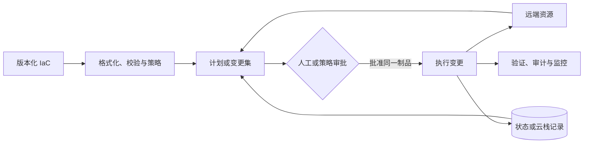

# 基础设施置备

手工点击控制台可以快速验证想法，却很难回答“谁改了什么、能否在另一个环境重建、失败后如何恢复”。基础设施即代码（Infrastructure as Code，IaC）把云资源及其关系表达为可审查、可测试、可重复执行的代码。本章围绕状态、依赖图、计划、漂移和生命周期讲解置备，并比较 AWS CDK、CloudFormation、Pulumi 与 Terraform。

## 学习目标 {#learning-objectives}

完成本章后，你应当能够：

- 区分基础设施置备、镜像构建、配置管理、应用部署和编排的职责。
- 解释声明式期望状态、资源依赖图、幂等、状态文件、漂移和替换语义。
- 设计包含格式化、校验、计划、审批、应用和验证的安全 IaC 流程。
- 说明 AWS CDK 如何合成为 CloudFormation，以及 constructs、tokens 与 bootstrap 的作用。
- 使用 CloudFormation 模板、变更集、栈、漂移检测和 StackSets 管理 AWS 资源。
- 比较 Pulumi 的通用语言模型与 Terraform 的 HCL、provider、module 和 state 模型。
- 在本机运行不调用云 API 的 Terraform 最小实践，并检查计划与幂等结果。
- 根据云范围、团队语言、治理、状态运维和迁移成本选择工具。

## 前置知识 {#prerequisites}

- 理解云资源、身份、网络、区域和共享责任，参见[云服务商](cloud-providers.md)。
- 熟悉 Git 分支、评审和变更历史，参见[版本控制系统](version-control-systems.md)。
- 能阅读至少一种编程语言或配置语言，参见[学习一种编程语言](learn-a-programming-language.md)。
- 配置主机内部状态属于下一章[配置管理](configuration-management.md)，两者可组合但不应混淆。

## IaC 管理什么 {#what-iac-manages}

基础设施置备通常负责生命周期较长、由控制面 API 管理的资源，例如虚拟网络、子网、负载均衡、数据库、队列、身份角色和 Kubernetes 集群。相邻能力包括：

- **镜像构建**：把操作系统、软件和基线配置烘焙成不可变虚拟机或容器镜像。
- **配置管理**：在已有机器上安装软件、管理文件和启动服务。
- **应用部署**：选择应用版本、发布顺序、健康检查和回滚。
- **编排**：持续调度容器或工作负载，并根据运行状态采取动作。

边界可以重叠，但资源所有权必须唯一。例如 Terraform 创建虚拟机，Ansible 配置系统；不要让两者同时争夺同一防火墙规则或服务配置。对频繁替换的计算节点，优先把大部分配置放入版本化镜像，减少启动时长和收敛失败面。

## 核心原理：执行模型 {#core-principles-execution-model}

### 期望状态与资源图 {#desired-state-and-resource-graph}

声明式 IaC 描述“最终应存在什么”。工具读取代码和必要状态，查询远端 API，构建依赖图，再计算创建、更新、替换或删除操作。显式引用通常自动形成依赖，只有无法从数据流推导时才应手工增加依赖。



依赖图允许无依赖资源并行，提高速度；错误依赖会导致竞争，过多手工依赖则降低并行度并隐藏真正的数据关系。资源“已创建”也不一定“业务已就绪”，因此应用层验证不能只依赖控制面成功响应。

### 幂等与不可变替换 {#idempotency-and-immutable-replacement}

理想情况下，同一代码对已满足期望的环境再次执行不会产生变更，这称为幂等。云 API 的最终一致性、默认值、集合排序或提供商缺陷可能制造永久差异，需要定位根因，而不是每次忽略计划。

有些属性可原地更新，有些只能替换资源。数据库、网段和持久磁盘的替换尤其危险。计划必须清楚标示 `create`、`update`、`replace` 和 `delete`，并用生命周期保护、删除策略、先建后删或显式迁移降低数据损失与停机风险。生命周期规则是最后护栏，不是跳过备份和评审的理由。

### 状态 {#state}

IaC 工具需要把代码中的逻辑地址关联到远端资源 ID。CloudFormation 由 AWS 维护栈状态；Terraform 和 Pulumi 通常使用本地或远端后端保存状态及元数据。

状态可能包含资源属性、连接信息甚至敏感值。把输出标记为 `sensitive` 主要防止正常 CLI 显示，并不保证状态内容被删除或加密。生产后端应具备：

- 静态与传输加密。
- 最小权限和短期身份。
- 并发锁或平台事务，防止两次应用互相覆盖。
- 版本历史、备份与恢复测试。
- 审计日志和跨环境隔离。

状态不能随意手工编辑。移动或重命名资源时使用工具提供的 `moved`、导入或状态迁移功能，并先备份和在非生产环境演练。

### 漂移 {#drift}

漂移（Drift）是远端实际配置与代码或栈记录不一致。它可能来自控制台热修复、其他自动化、服务默认值变化或外部系统。检测漂移前先规定处置策略：

1. 临时修复若合理，应回写代码并走正常评审。
2. 未授权变更应由代码恢复，同时调查身份和流程。
3. 明确由其他控制器管理的属性不应被 IaC 同时声明。
4. 高风险漂移先保全数据和业务，再恢复一致，不能机械覆盖。

频繁定时执行 `apply` 可能把故障现场覆盖掉。更稳妥的是定期只读计划或原生漂移检测，产生可审查告警，再由负责人决定修复。

## 模块、环境与仓库结构 {#modules-environments-and-repository-structure}

模块封装一组有明确输入、输出和生命周期的资源。好模块表达业务能力，例如“带日志与加密的对象存储”，而不是把每个资源包装一遍。输入应有类型、描述和校验，输出只暴露调用方需要的稳定接口。

生产与非生产环境应使用独立状态和权限边界。仅使用一个变量切换环境，无法阻止测试身份误改生产状态。常见结构是共享版本化模块，每个环境有小型根配置和独立流水线。模块版本升级通过显式提交进行，不自动追踪浮动分支。

不要创建一个包含全部公司的巨型状态：它会扩大锁冲突、计划耗时、权限和故障爆炸半径。也不要拆成每个资源一个状态，否则跨栈依赖和发布顺序会失控。按团队所有权、变更频率、权限边界和故障域划分，并通过稳定输出或参数服务传递必要信息。

## AWS CloudFormation {#aws-cloudformation}

**重点掌握（AWS 原生场景）**。AWS CloudFormation 使用 JSON 或 YAML 模板声明 AWS 资源，以栈（Stack）为部署和生命周期单元。模板主要包含 `Parameters`、`Mappings`、`Conditions`、`Resources`、`Outputs` 和可选的转换；`Resources` 是核心。

CloudFormation 根据资源引用推导依赖，并通过栈事件展示执行过程。更新前创建变更集（Change Set），检查新增、修改、替换和删除；然后执行同一变更集，避免审批后重新生成不同计划。失败更新通常触发回滚，但外部副作用、数据资源和无法恢复的 API 操作仍需人工预案。

关键能力包括：

- **DeletionPolicy 与 UpdateReplacePolicy**：决定栈删除或资源替换时保留、删除或快照数据资源。
- **Drift Detection**：检查受支持资源属性是否偏离模板，但并非所有资源和属性都完整支持。
- **Nested Stacks 与 Modules**：复用资源组合，需管理版本和失败传播。
- **StackSets**：跨多个账号和区域部署标准资源，适合组织基线，但爆炸半径大，应分阶段推出。
- **Hooks、Guard 与策略**：在部署前或部署中执行组织约束。
- **Stack Policy**：限制关键资源被栈更新，修改流程也要受控。

参数的 `NoEcho` 不能保证机密不会出现在资源属性、输出、元数据或 API 中。优先让模板引用 Secrets Manager 或 Parameter Store 的受控值，并避免在计划和日志中展开。模板中的动态引用也要检查目标服务是否最终保存明文。

CloudFormation 的优势是 AWS 原生托管状态、权限与审计集成，以及新服务通常有原生资源类型。约束是仅面向 AWS，模板规模较大时抽象与测试成本上升，回滚时间和资源支持差异需要实际验证。

## AWS CDK {#aws-cdk}

**替代方案（AWS 原生场景）**。AWS Cloud Development Kit（AWS CDK）允许使用 TypeScript、JavaScript、Python、Java、C#、Go 等语言定义 constructs。CDK 应用经 `synth` 生成 CloudFormation 模板，最终仍由 CloudFormation 创建和维护资源。

construct 分为不同抽象层级：底层资源通常接近 CloudFormation 属性，高层 construct 提供合理组合和默认值。高层默认值提高效率，但升级库后合成模板可能变化，因此依赖必须锁定，升级时审查 `cdk diff` 与合成产物。

CDK 中许多值在合成时未知，以 token 表示，部署时由 CloudFormation 解析。不要用普通字符串或条件分支假设 token 已有真实值。环境查询可能写入 context；需要可重复合成时应审查并版本化适当的 context，避免同一提交因当前账号查询结果不同而生成不同模板。

`cdk bootstrap` 会在目标账号和区域创建部署所需资源及角色，是高权限的先决步骤。组织应集中维护 bootstrap 模板、可信账号和角色权限，而不是让每个开发者随意执行默认引导。部署流水线先执行单元测试、`cdk synth`、策略检查与 `cdk diff`，审批后由受控角色部署。

CDK 适合 AWS 团队希望用熟悉语言、测试和 construct 库表达基础设施。通用语言也允许网络调用、随机值和任意副作用；基础设施代码应保持确定性，不在合成阶段创建资源或读取未固定外部数据。

## Pulumi {#pulumi}

**替代方案**。Pulumi 使用 TypeScript、JavaScript、Python、Go、C#、Java 或 YAML 等方式定义云资源。Pulumi 引擎执行程序获得资源图，provider 与云 API 交互，状态由 Pulumi Cloud 或自管后端保存。`pulumi preview` 展示计划，`pulumi up` 执行变更。

资源输出（Output）表示部署时才确定的异步值。应通过 `apply` 或语言对应的输出组合机制传递，不能把它当普通字符串同步读取。程序在 preview 与 update 阶段都会运行，因此顶层代码必须确定且无不受控副作用；网络查询、当前时间和随机值都可能导致计划与执行不一致。

Pulumi Config 管理环境配置，`--secret` 值在配置和状态中以所选机密提供者加密。机密传播可保护派生输出，但明文仍可能被应用代码、provider、云 API 或日志接触。需要管理密钥提供者、恢复材料、轮换和后端权限，而不是只依赖“secret”标签。

Stacks 隔离不同环境，组件资源封装可复用组合，Policy as Code 可执行治理。Pulumi 适合希望复用通用语言、包管理和测试生态，或同时管理多云与 SaaS API 的团队。约束包括语言依赖供应链、程序确定性、Pulumi 状态运营，以及团队必须同时理解编程语言和资源生命周期。

## Terraform {#terraform}

**重点掌握（通用场景）**。Terraform 使用 HashiCorp Configuration Language（HCL）声明资源，通过 provider 调用云、SaaS 或基础设施 API。核心对象包括：

- **resource**：由 Terraform 管理生命周期的对象。
- **data**：只读查询外部已有信息；查询结果变化也可能改变计划。
- **provider**：实现资源和数据源，版本应受约束并通过 lock file 固定选择及校验和。
- **module**：一组配置的复用边界；根模块调用本地或注册模块。
- **variable、local 与 output**：构成输入、内部表达式和对外接口。

典型流程为 `init`、`fmt`、`validate`、`plan` 和 `apply`。`plan -out` 生成已保存计划，审批后应应用该文件；直接再次执行无参数 `apply` 会重新生成计划。即使使用已保存计划，远端状态或凭据变化仍可能让执行失败，所以要保留回滚与恢复路径。

Terraform state 将资源地址映射到远端 ID。团队环境使用支持锁、版本、加密和审计的远端后端。CLI workspace 可以共享代码和后端配置，但隔离能力有限；高风险环境通常再结合独立账号、状态键、流水线和身份。

导入现有资源后还要编写匹配配置并检查下一次计划。重构地址使用 `moved` block，跨状态迁移要逐步执行和验证。`lifecycle.ignore_changes` 只用于某属性明确由其他系统管理的场景；滥用会把真实漂移永久藏起来。

Terraform 适合多平台、成熟 provider 生态和偏好声明式 HCL 的团队。需要评估 provider 质量、许可与使用方式、状态后端、模块治理和升级工作。若组织采用兼容生态中的其他实现，也应单独验证状态、provider 与命令行为，不能假设完全互换。

## 选型比较 {#selection-comparison}

| 维度 | CloudFormation | AWS CDK | Pulumi | Terraform |
| --- | --- | --- | --- | --- |
| 主要范围 | AWS | AWS，合成为 CloudFormation | 多云与多类 provider | 多云与多类 provider |
| 表达方式 | YAML 或 JSON 模板 | 通用语言与 constructs | 通用语言或 YAML | 声明式 HCL |
| 状态运营 | AWS 托管栈 | AWS 托管栈 | Pulumi Cloud 或自管后端 | 本地或远端后端 |
| 预览机制 | Change Set | `cdk diff` 与 Change Set | `pulumi preview` | `terraform plan` |
| 抽象能力 | 嵌套栈、模块、宏 | 语言、construct 库 | 语言、组件资源 | module、表达式 |
| 主要风险 | 模板规模、AWS 绑定、回滚边界 | 合成差异、语言副作用、bootstrap 权限 | 语言副作用、状态与依赖供应链 | 状态治理、provider 差异、HCL 抽象边界 |

选择步骤：

1. 仅管理 AWS 且希望服务商托管状态时，从 CloudFormation 与 CDK 开始评估。需要直接透明模板时选 CloudFormation，需要高层 construct 和语言测试时评估 CDK。
2. 跨多个云或 SaaS API 时比较 Pulumi 与 Terraform。团队偏好通用语言和组件抽象可试点 Pulumi；偏好专用声明语言、成熟模块和广泛运维经验可试点 Terraform。
3. 用同一小型环境验证首次创建、无变更执行、原地更新、强制替换、失败回滚、导入、漂移检测和工具升级。
4. 比较的不是代码行数，而是五年内的权限、状态、升级、调试、模块所有权和人员培训成本。
5. 确认关键资源的 provider 或原生类型支持质量。工具支持某云不代表每个新资源和属性都完整可用。

一个组织可以在明确边界内使用多种工具，例如 CDK 管理 AWS 产品栈、Terraform 管理跨云共享服务。但同一资源只能有一个所有者，并应记录工具间输出契约，避免循环依赖。

## 最小实践：本地 Terraform 状态 {#minimal-practice-local-terraform-state}

该实验使用 Terraform 内置的 `terraform_data` 资源，只创建当前目录中的状态文件，不安装 provider、不访问云 API，也不需要凭据。建议使用 Terraform `1.6` 或更高且低于 `2.0` 的兼容版本。

### 1. 编写配置 {#write-configuration}

在空目录创建 `main.tf`：

```hcl
terraform {
  required_version = ">= 1.6.0, < 2.0.0"
}

variable "environment" {
  description = "The environment represented by this local lab."
  type        = string
  default     = "development"

  validation {
    condition     = contains(["development", "staging"], var.environment)
    error_message = "environment must be development or staging."
  }
}

locals {
  common_tags = {
    environment = var.environment
    managed_by  = "terraform"
    purpose     = "handbook-lab"
  }
}

resource "terraform_data" "handbook" {
  input = {
    name = "safe-local-example"
    tags = local.common_tags
  }
}

output "validated_model" {
  description = "The normalized model stored only in local Terraform state."
  value       = terraform_data.handbook.output
}
```

### 2. 校验并保存计划 {#validate-and-save-plan}

```bash
terraform init
terraform fmt -check
terraform validate
terraform plan -out=handbook.tfplan
terraform show handbook.tfplan
```

检查计划应只创建 `terraform_data.handbook`，没有云 provider 和外部资源。确认后应用**同一个**计划文件：

```bash
terraform apply handbook.tfplan
terraform output -json
```

### 3. 验证幂等与校验 {#verify-idempotency-and-validation}

```bash
terraform plan -detailed-exitcode
```

无变更时命令退出码为 `0`；有差异为 `2`；错误为 `1`。不要在脚本中把非零一律当成失败。

再验证非法输入会在计划阶段被拒绝：

```bash
terraform plan -var='environment=production'
```

本实验有意不允许 `production`，命令应输出变量校验错误。

### 4. 销毁与清理 {#destroy-and-clean-up}

```bash
terraform destroy && \
  rm -r -- ./.terraform && \
  rm -f -- terraform.tfstate terraform.tfstate.backup handbook.tfplan
```

删除前确认当前目录是专用实验目录。只有销毁成功后才会继续清理本地文件；若命令失败，应保留状态并排查，不能手工跳过到 `rm`。`.terraform.lock.hcl` 在真实项目中应提交版本控制；本实验没有外部 provider，是否生成取决于 Terraform 版本。

!!! warning "本地状态只适合实验"
    `terraform.tfstate` 未提供团队锁、集中审计和独立备份。生产环境使用经过批准的远端后端，并把状态视为敏感数据。不要把状态文件或保存的计划提交到 Git。

## 生产实践：变更流程 {#production-practices-change-workflow}

### 提交前 {#before-commit}

- 固定 CLI、provider、模块和语言依赖版本，验证来源与校验和。
- 执行格式化、语法、类型、单元和静态安全检查。
- 对网络全开放、未加密存储、公开数据、长期密钥和无删除保护等规则执行策略检查。
- 在临时环境测试模块，包括创建、更新、替换、销毁和失败恢复。

### 计划与审批 {#plan-and-approval}

- CI 使用只读规划身份生成计划，不让不受信任的拉取请求取得生产凭据。
- 计划绑定提交摘要、工具版本、依赖锁和目标环境，过期后重新生成。
- 评审者重点查看删除、替换、权限扩大、公开访问、跨区和预估成本变化。
- 高风险数据库、网络和身份变更需要服务负责人及安全或数据负责人审批。

### 执行与验证 {#apply-and-verify}

- 受保护流水线使用短期工作负载身份应用已审批计划，禁止个人长期密钥。
- 同一状态同一时间只允许一次写操作；环境级部署锁不能替代状态后端锁。
- 变更分阶段进行，先非生产、单一区域或小范围账号，再逐步推广。
- 执行后运行 DNS、网络、权限和应用健康验证，并观察错误率和延迟。
- 保存计划摘要、执行日志、审批和状态版本，但对机密字段脱敏并设置保留期限。

### 恢复 {#recovery}

IaC 回滚不是简单执行旧代码：如果数据库已迁移、对象已删除或资源名不可复用，旧配置可能无法恢复。每项高风险变更都要说明：

- 原地回滚、向前修复还是从备份恢复。
- 谁决定中止，观察窗口多长。
- 数据是否兼容旧应用和旧资源。
- 状态损坏或锁遗留时如何恢复。
- 控制面不可用时业务能否继续，以及哪些操作必须暂停。

## 安全与可维护性 {#security-and-maintainability}

- IaC 仓库不保存云密钥、私钥、状态和包含机密的计划文件。扫描只能作为最后防线。
- 使用 OIDC 或平台工作负载身份让 CI 获取短期角色；规划和应用角色权限分离。
- 模块有负责人、版本、变更记录、弃用周期和升级指南，不直接追踪 Git 默认分支。
- 定期只读检测漂移并分类告警，控制台紧急修改必须设置期限和回写任务。
- 为资源设置统一命名、标签、日志、加密、备份和删除保护基线，允许经过记录的例外。
- 估算每次计划的成本变化，但把估算视为决策输入，不保证与账单完全一致。
- 对 IaC 指标进行监控：计划失败率、应用时长、回滚次数、漂移数量和模块版本分布。

## 常见误区 {#common-misconceptions}

- **把 IaC 当作控制台操作的文本备份**：真正价值来自可重复执行、状态关联、评审、测试和治理。
- **计划后再次无参数执行**：重新生成的计划可能与审批内容不同，应应用同一已保存制品或平台锁定的变更集。
- **把状态文件提交 Git**：状态会变化、产生冲突且可能含机密，应使用受控远端后端。
- **认为 `sensitive` 会从状态中删除值**：它通常只隐藏界面输出，状态仍须加密并限制访问。
- **依赖目标式应用作为常规流程**：只应用图的一部分可能跳过必要变更，目标参数应只用于受控恢复。
- **滥用 `ignore_changes` 消除噪声**：它也会隐藏安全漂移和失效配置，必须有明确的其他所有者。
- **一个状态管理所有环境**：锁、权限、错误和删除的爆炸半径会过大。
- **模块越通用越好**：包含大量布尔开关的万能模块难测试、难升级，也无法表达清晰所有权。
- **用 IaC 自动修复所有运行时故障**：持续重建可能覆盖证据或扩大事故，应先区分配置漂移与服务故障。
- **认为删除后一定可由旧代码恢复**：持久数据、唯一名称和外部依赖可能不可逆，必须有备份和恢复验证。

## 动手练习 {#hands-on-exercises}

1. 完成 Terraform 本地实验，保存首次创建计划并应用，再确认第二次计划退出码为 `0`。
2. 给实验增加一个 `owner` 变量，要求非空且不超过 40 个字符。分别用合法和非法值验证，不要在变量中写邮箱或个人信息。
3. 重命名 `terraform_data.handbook` 的资源地址，先观察无迁移声明时的删除与创建计划，再添加 `moved` block，确认计划不再替换资源。
4. 为一个包含网络、数据库和应用的系统划分状态边界，说明每个状态的所有者、变更频率、权限及跨状态输出契约。
5. 分别用 CloudFormation、AWS CDK、Pulumi 和 Terraform 的官方文档设计同一个加密对象存储。比较代码之外的状态、预览、策略、测试和删除保护流程。
6. 编写一份高风险数据库替换的变更清单，必须包含备份验证、兼容窗口、已审批计划、停止条件和恢复责任人。

## 完成检查 {#completion-checklist}

- [ ] 能区分置备、镜像构建、配置管理、应用部署和编排。
- [ ] 能解释期望状态、依赖图、幂等、状态、漂移和资源替换。
- [ ] 能说明 CloudFormation 栈、变更集、删除策略、漂移和 StackSets。
- [ ] 能说明 AWS CDK construct、token、context、synth 与 bootstrap。
- [ ] 能说明 Pulumi program、Output、stack、state 和 secret 传播。
- [ ] 能说明 Terraform provider、resource、data、module、plan 和 state。
- [ ] 已完成不访问云 API 的 Terraform 实验并验证无变更计划。
- [ ] 能为 IaC 设计安全的计划、审批、执行、验证和恢复流程。
- [ ] 能根据范围、团队、治理、状态和迁移成本选择工具。

## 官方延伸阅读 {#official-further-reading}

- [AWS CloudFormation User Guide](https://docs.aws.amazon.com/AWSCloudFormation/latest/UserGuide/Welcome.html)
- [CloudFormation 安全最佳实践](https://docs.aws.amazon.com/AWSCloudFormation/latest/UserGuide/security-best-practices.html)
- [AWS CDK Developer Guide](https://docs.aws.amazon.com/cdk/v2/guide/home.html)
- [AWS CDK Constructs](https://docs.aws.amazon.com/cdk/v2/guide/constructs.html)
- [Pulumi 文档](https://www.pulumi.com/docs/)
- [Pulumi IaC Concepts](https://www.pulumi.com/docs/iac/concepts/)
- [Terraform 文档](https://developer.hashicorp.com/terraform/docs)
- [Terraform State](https://developer.hashicorp.com/terraform/language/state)
- [Terraform Module 设计指南](https://developer.hashicorp.com/terraform/language/modules/develop/structure)
