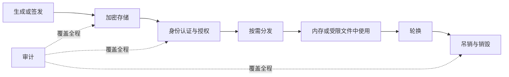

# 机密管理

密码、API 令牌、私钥和证书一旦混入源码、镜像或日志，就会突破原本的访问边界。机密管理（Secrets Management）不是“找一个更隐蔽的配置文件”，而是管理敏感值从创建、授权、分发、使用、轮换到吊销的完整生命周期。

本章覆盖 Kubernetes Sealed Secrets、External Secrets Operator、HashiCorp Vault、SOPS 与云平台原生服务，并给出不依赖真实云账号的加密文件实践。

## 学习目标 {#learning-objectives}

完成本章后，你应当能够：

- 识别机密、普通配置和身份信息，绘制机密从来源到工作负载的路径。
- 解释静态加密、信封加密、动态凭据和工作负载身份的差异。
- 比较五类方案的信任根、运行依赖、轮换能力和故障模式。
- 使用 SOPS 与 age 安全地加密、解密一个本地示例文件，并验证明文没有进入 Git。
- 为 CI/CD 与 Kubernetes 设计最小权限、短期授权和可审计的机密交付方式。
- 制定泄漏响应、轮换、备份恢复和断路行为。

## 前置知识 {#prerequisites}

- 熟悉 [版本控制系统](version-control-systems.md)，理解提交历史不能靠删除当前文件彻底清除。
- 熟悉 [CI/CD 工具](ci-cd-tools.md) 的执行器、环境与权限边界。
- Kubernetes 相关方案需要 [容器](containers.md) 基础；控制器和命名空间模型将在 [容器编排](container-orchestration.md) 中展开。
- 使用云密钥管理服务前，建议先学习 [云服务商](cloud-providers.md) 的身份与访问管理概念。

## 核心原理 {#core-principles}

### 什么是机密 {#what-is-a-secret}

只要某个值泄漏后能直接授予权限、证明身份或解密其他数据，就应按机密处理，例如数据库密码、OAuth Client Secret、SSH 私钥、TLS 私钥、签名密钥和恢复令牌。用户名、服务地址和功能开关通常是配置，但敏感性仍要由威胁模型判断。

哈希不是通用的机密存储方法。密码校验可以保存带盐的慢哈希，因为系统不需要恢复原密码；应用连接数据库则必须取得可用凭据，需要加密或动态签发。

### 生命周期与信任链 {#lifecycle-and-chain-of-trust}



每条链最终都有一个**信任根**：本地私钥、硬件安全模块（HSM）、云密钥管理服务（KMS）、Vault 解封机制，或 Kubernetes 集群内的控制器密钥。加密文件可以公开存放，但解密密钥不能与密文使用同一权限边界。

### 信封加密 {#envelope-encryption}

直接用主密钥加密所有大数据难以轮换，也扩大了主密钥暴露面。信封加密通常为每份数据生成数据加密密钥（DEK），用 DEK 加密内容，再由密钥加密密钥（KEK）加密 DEK。轮换 KEK 时可以只重新包装 DEK。

SOPS 与许多云机密服务都运用类似思想。密文进 Git 不代表万事大吉：能够调用 KMS 解密或持有 age 私钥的主体仍可读取内容，授权与审计同样重要。

### 静态机密、动态机密与工作负载身份 {#static-secrets-dynamic-secrets-and-workload-identity}

- **静态机密**由人或系统预先创建，直到轮换前保持不变。接入简单，但容易长期存在和扩散。
- **动态机密**在请求时生成，带租约并自动过期，例如 Vault 按策略创建短期数据库账号。泄漏窗口更短，但依赖签发系统和可靠续租。
- **工作负载身份**让工作负载用平台身份换取短期令牌，例如云 IAM 的 OIDC 联邦。能不用长期 Secret 时，应优先使用身份机制。

!!! warning "Kubernetes Secret 不是保险箱"
    Kubernetes Secret 的值通常只是 Base64 编码。是否在 etcd 中加密、谁能通过 API 读取、节点和容器如何访问，取决于集群配置与 RBAC。Base64 不能提供保密性。

## 方案详解 {#solution-details}

### Sealed Secrets {#sealed-secrets}

**重点掌握**。Bitnami Sealed Secrets 面向 Kubernetes GitOps：`kubeseal` 用集群控制器的公钥把普通 Secret 加密为 `SealedSecret` 自定义资源，只有持有私钥的集群控制器能解密并创建 Kubernetes Secret。密文清单可以提交到仓库。

优点是工作流直观、无需让每个使用者持有解密密钥；作用域可限制到名称和命名空间。约束是加密结果绑定控制器密钥和作用域，跨集群迁移与灾难恢复依赖私钥备份。控制器私钥若丢失，既有密文无法恢复；若泄漏，应轮换密钥和所有受影响机密，而不只是重新加密清单。

### External Secrets Operator {#external-secrets-operator}

**重点掌握**。External Secrets Operator（ESO）本身通常不保存机密，它根据 `ExternalSecret` 等自定义资源，从 Vault、AWS Secrets Manager、Azure Key Vault、Google Secret Manager 等外部存储读取值，再同步为 Kubernetes Secret，或通过支持的模式生成目标资源。

它适合已有中心机密源、需要跨集群统一轮换的组织。关键边界是控制器身份和 `SecretStore`/`ClusterSecretStore` 范围：一个高权限集群级存储可能让多个命名空间越权读取。同步还会产生 Kubernetes Secret 副本，应启用 etcd 静态加密、限制 RBAC，并决定外部服务中断时继续使用旧值还是让部署失败。

### Vault {#vault}

**按需学习**。HashiCorp Vault 提供统一 API、认证方法、策略、KV 存储、Transit 加密、PKI 以及数据库/云平台动态凭据。客户端先证明身份，再按策略获得令牌和带租约的 Secret；审计设备记录请求元数据。

Vault 的价值不只在 KV，而在短期凭据和集中策略。其代价是高可用存储、初始化与解封、升级、审计容量、备份恢复和令牌生命周期的持续运维。应用需要处理认证、租约续期和吊销；不要把 Root Token 当日常凭据，也不要把“自动解封”误解为无需保护底层 KMS 权限。

### SOPS {#sops}

**重点掌握**。SOPS 最初由 Mozilla 发布，现由云原生计算基金会（CNCF）社区维护。它支持 YAML、JSON、ENV、INI 和二进制文件，可使用 age、PGP 或 AWS KMS、Azure Key Vault、Google Cloud KMS 等密钥服务。它通常只加密值并保留键名和结构，便于 Git 差异审查。

SOPS 适合配置即代码和离线审阅；`.sops.yaml` 可按路径选择接收者和加密规则。它不是在线动态机密服务，不负责把轮换后的值推送给正在运行的进程。CI 解密时应使用短期工作负载身份，把明文限制在内存、标准输入或权限受限的临时文件中，并确保调试日志不展开内容。

### 云平台原生服务 {#cloud-native-services}

**替代方案**。云原生服务包括 AWS Secrets Manager 与 Systems Manager Parameter Store、Azure Key Vault、Google Cloud Secret Manager，以及其他云平台提供的同类能力。它们通常与 IAM、KMS、审计日志、版本和托管轮换集成，减少自建高可用控制面的负担。

这类服务适合工作负载主要运行在单一云平台的团队。应用应通过实例、Pod 或服务账号身份取值，而不是保存云访问密钥。需要评估 API 调用费用、速率限制、区域可用性、跨账号授权、私网端点、缓存策略和供应商迁移。不要让每次业务请求都同步调用机密 API；可在启动或受控刷新时取值，并明确定义服务不可用时的行为。

## 选型比较 {#selection-comparison}

| 方案 | 机密权威来源 | 运行时依赖 | 突出能力 | 主要约束 |
| --- | --- | --- | --- | --- |
| Sealed Secrets | Git 中的密文清单 | 集群内控制器 | Kubernetes GitOps 简单直观 | 密钥备份、集群绑定、仍生成 Secret |
| External Secrets Operator | 外部机密服务 | 控制器与外部 API | 中心存储同步到 Kubernetes | 控制器权限、同步延迟、服务依赖 |
| Vault | Vault 集群 | Vault API 与存储后端 | 动态凭据、PKI、细粒度策略 | 平台运维与客户端租约处理 |
| SOPS | Git 中的加密文件 | 解密时需要密钥或 KMS | 可审查的加密配置文件 | 不负责运行时签发和刷新 |
| 云平台原生服务 | 云托管机密服务 | 云 IAM 与区域 API | 托管可用性、审计和 IAM 集成 | 云绑定、成本、配额和跨云复杂度 |

选择时按以下顺序判断：

1. 能否用工作负载身份或动态凭据彻底消除静态机密？
2. 权威来源应在 Git 密文、外部服务还是专用动态签发平台？
3. 工作负载在 Kubernetes、虚拟机、无服务器还是多云中运行？
4. 轮换后如何通知并安全重载应用，允许多长传播延迟？
5. 控制面不可用时是使用缓存值、拒绝启动，还是进入降级模式？
6. 信任根如何备份、恢复、轮换和执行职责分离？

常见组合并不冲突：SOPS 管理部署期静态配置，ESO 从云服务同步运行时 Secret，Vault 签发短期数据库凭据。应减少权威来源数量，并明确每个值由谁创建和轮换。

## 最小实践：用 SOPS 与 age 加密文件 {#minimal-practice-encrypt-a-file-with-sops-and-age}

本实践只在本机生成一次性 age 密钥，不连接云平台，也不使用真实机密。请在临时目录或个人练习仓库中操作，不要把 `keys.txt` 提交到 Git。

先确认已安装 `sops` 和 `age`。macOS 可使用 Homebrew，其他系统请按官方文档安装：

```bash
brew install sops age
```

创建临时目录，生成练习密钥并收紧权限：

```bash
DEMO_DIR="$(mktemp -d)"
cd "$DEMO_DIR"
age-keygen -o keys.txt
chmod 600 keys.txt
```

命令输出会显示以 `age1` 开头的公钥。把它设为当前 shell 变量；下面的值必须替换为刚生成的**公钥**，不是 `AGE-SECRET-KEY-...` 私钥：

```bash
export SOPS_AGE_RECIPIENTS='age1example_replace_with_generated_public_key'
```

创建只含虚构值的 `app.enc.yaml`，SOPS 会调用编辑器并在保存后加密：

```bash
sops edit app.enc.yaml
```

在编辑器中输入：

```yaml
database:
  username: demo_user
  password: EXAMPLE_NOT_A_REAL_PASSWORD
```

验证磁盘文件不含示例明文。第一条命令不应输出匹配行；第二条命令把私钥路径仅提供给当前进程：

```bash
grep 'EXAMPLE_NOT_A_REAL_PASSWORD' app.enc.yaml
SOPS_AGE_KEY_FILE=keys.txt sops decrypt app.enc.yaml
```

第一条命令应因没有匹配而不输出内容，第二条应仅向终端输出解密后的 YAML。不要用 `sops decrypt app.enc.yaml > app.yaml` 留下明文副本。

清理练习密钥和密文：

```bash
test -n "${DEMO_DIR:-}" && test "$PWD" = "$DEMO_DIR" && \
  rm -f -- keys.txt app.enc.yaml && cd / && rmdir -- "$DEMO_DIR"
unset SOPS_AGE_RECIPIENTS
unset DEMO_DIR
```

!!! tip "团队实践"
    生产环境优先让 CI 通过 OIDC 调用云 KMS 解密，而不是把 age 私钥保存为另一个长期 CI 变量。若确需 age，应为不同环境设置不同接收者，并建立离线恢复与轮换流程。

## 生产实践 {#production-practices}

### 最小权限与身份 {#least-privilege-and-identity}

- 人员、CI、运行时工作负载和紧急账号使用不同身份，不共享万能令牌。
- 授权绑定环境、路径、动作和短有效期；生产写权限不能由普通构建作业继承。
- Kubernetes 中优先使用工作负载身份，按命名空间和服务账号限制 ESO 或 Vault 访问。
- 对读取和管理权限做职责分离。能定义策略的人不应默认能读取所有机密值。

### 分发与使用 {#distribution-and-use}

- 避免命令行参数和普通环境变量在诊断信息中意外暴露；按应用能力优先使用权限受限的内存卷或文件描述符。
- 禁止 Shell 调试模式输出带机密的命令；对日志和错误追踪做字段级脱敏。
- 机密不进入镜像层、构建缓存、测试快照、制品、Terraform 状态或崩溃转储。
- 应用支持不重启刷新或受控滚动重启；轮换期间允许新旧凭据短暂重叠，避免瞬时中断。

### 轮换与事件响应 {#rotation-and-incident-response}

- 为每类机密定义所有者、用途、消费者、到期时间和轮换间隔。
- 自动轮换必须包含消费者验证；“服务端已更新”不代表所有实例已使用新值。
- 发现泄漏时先吊销或禁用凭据，再清理公开位置、分析访问日志、修复根因。仅删除 Git 文件不够。
- 定期恢复加密备份并演练 KMS、Vault 或 Sealed Secrets 密钥丢失场景。

### 审计与可用性 {#auditing-and-availability}

- 记录谁在何时读取或修改哪个机密版本，但日志不得包含机密正文。
- 对异常批量读取、拒绝激增、即将到期、轮换失败和审计管道中断告警。
- 明确缓存有效期和断路策略。中心服务短暂不可用不应导致所有已运行实例立即失效，但新实例也不能无限使用过期缓存。
- 监控机密服务只描述健康状态；请求内容和敏感标签不得进入 [日志管理](logs-management.md) 或指标。

## 常见误区 {#common-misconceptions}

**把 Base64 当加密**：Base64 是可逆编码。任何能读取值的人都能立即还原。

**把 `.env` 加入 `.gitignore` 就算安全**：它仍可能被备份、上传到工单、打进镜像或由同机其他进程读取。开发机也需要明确的机密来源和权限。

**密文和解密密钥放在同一仓库或同一 CI 变量范围**：攻击者取得一个边界后即可同时拿到两者，等同于明文存储。

**使用一个永久云密钥部署所有环境**：泄漏影响面和审计盲区都过大。应使用 OIDC 和环境级短期角色。

**只轮换服务端，不重载消费者**：旧连接池和长时间运行进程可能继续持有旧值，最终在旧凭据吊销时集中故障。

**盲目记录完整请求便于排障**：Authorization Header、Cookie、连接串和签名参数会进入日志系统并扩散到更多操作者。

## 动手练习 {#hands-on-exercises}

1. 完成 SOPS 实践，确认 `app.enc.yaml` 中键名可读、值不可读，私钥权限为 `0600`。
2. 为开发、预发布和生产设计三个不同 age 接收者，说明某位开发者离职时需要重加密哪些文件。
3. 画出一个应用通过 ESO 从云机密服务取得数据库密码的身份链，标明每一步允许的动作。
4. 设计静态数据库密码迁移到 Vault 动态凭据的过程，包括租约、连接池刷新、故障回退和审计。
5. 编写一份泄漏演练记录模板，至少包括发现时间、吊销时间、受影响资源、访问证据和预防措施。

## 完成检查 {#completion-checklist}

- [ ] 能区分编码、哈希、加密和信封加密。
- [ ] 能解释静态机密、动态机密和工作负载身份的风险差异。
- [ ] 能说明 Sealed Secrets、External Secrets Operator、Vault、SOPS 与云平台原生服务的信任根。
- [ ] 已用一次性示例密钥完成加密、明文检查、解密和清理。
- [ ] 能保证源码、镜像、制品、状态文件和日志不包含机密。
- [ ] 能描述机密轮换、消费者重载、吊销和恢复流程。
- [ ] 能为 CI 与 Kubernetes 设计最小权限的短期授权。

## 官方延伸阅读 {#official-further-reading}

- [Sealed Secrets 项目文档](https://github.com/bitnami-labs/sealed-secrets)
- [External Secrets Operator 文档](https://external-secrets.io/latest/)
- [HashiCorp Vault 文档](https://developer.hashicorp.com/vault/docs)
- [SOPS 项目文档](https://github.com/getsops/sops)
- [age 项目文档](https://github.com/FiloSottile/age)
- [AWS Secrets Manager 用户指南](https://docs.aws.amazon.com/secretsmanager/latest/userguide/intro.html)
- [Azure Key Vault 文档](https://learn.microsoft.com/en-us/azure/key-vault/)
- [Google Cloud Secret Manager 文档](https://cloud.google.com/secret-manager/docs)
- [Kubernetes Secret 良好实践](https://kubernetes.io/docs/concepts/security/secrets-good-practices/)
