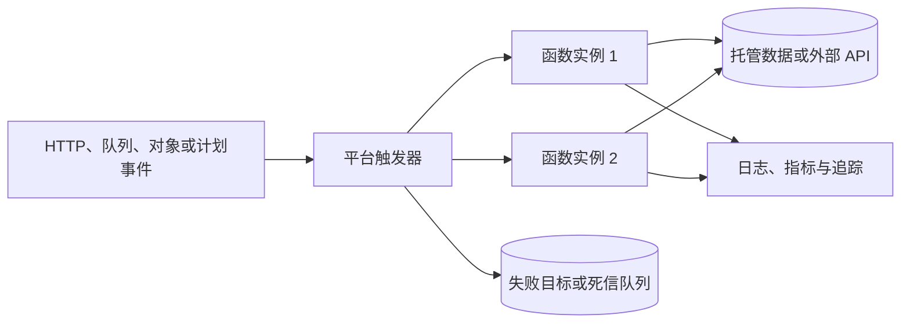

# 无服务器计算

无服务器计算（Serverless）并不是没有服务器，而是平台接管服务器置备、运行时补丁、按事件扩缩容和部分可用性工作，团队围绕函数、静态站点、托管数据和事件源交付能力。它适合突发、事件驱动或希望减少空闲容量的负载，也会带来运行限制、冷启动、重试副作用、成本非线性和平台绑定。

## 学习目标

完成本章后，你应当能够：

- 区分 Serverless、函数即服务（FaaS）、后端即服务（BaaS）和边缘函数。
- 解释事件触发、实例生命周期、并发、冷启动、超时和至少一次投递。
- 把 HTTP、队列、对象事件、计划任务和流式事件映射到安全的处理模式。
- 比较 AWS Lambda、Cloudflare Workers、Azure Functions、Vercel、Netlify 与 Cloud Run functions（原 Google Cloud Functions）。
- 设计幂等、可重试、可观测且不会泄露机密的函数。
- 在本机运行一个 Cloudflare Worker，并验证输入校验和结构化响应。
- 判断何时不应使用 Serverless，以及如何控制费用和迁移成本。

## 前置知识

- 理解 HTTP、TLS、DNS 和状态码，参见[网络与协议](networking-and-protocols.md)。
- 理解云的区域、身份、网络和共享责任，参见[云服务商](cloud-providers.md)。
- 能阅读 JavaScript 或其他编程语言，参见[学习一种编程语言](learn-a-programming-language.md)。
- 容器不是学习 FaaS 的必需前置，但有助于比较运行隔离，参见[容器](containers.md)。

## 核心原理

### 托管事件执行

传统常驻服务先准备容量，再持续等待请求。FaaS 则由平台接收事件、选择运行环境、启动或复用实例并调用处理函数。开发者声明内存、超时、触发器、权限和代码，平台负责调度与扩缩容。



实例可能在调用后被复用，也可能随时回收。因此：

- 初始化代码可以放在处理函数外以复用连接，但不能假设它一定执行一次。
- 内存和临时磁盘不是持久状态，重要数据必须写入外部存储。
- 并发调用可能在多个实例同时处理相同或相关事件，不能依赖进程内锁保证全局互斥。
- 部署包、运行时、区域、内存、CPU、超时、请求大小和网络连接都有平台限制。

### 冷启动与延迟

没有可复用实例时，平台要创建隔离环境、加载运行时和执行初始化，形成冷启动。运行时、包体、依赖初始化、私有网络连接和实例规格都会影响延迟。突发流量还可能遇到扩容速率或并发配额。

优化前先区分初始化时间与处理时间。可采用更小依赖、延迟加载非关键模块、连接复用、预置并发或最小实例等策略。预热会增加成本，也不能替代配额和下游容量规划。对极低延迟且持续高负载的服务，常驻容器可能更合适。

### 并发、背压与下游保护

Serverless 平台可以快速增加函数实例，但数据库连接数、第三方 API 配额和消息消费能力未必同步增长。应设置保留并发、最大实例数、队列批大小或消费者并发，把平台扩容速度限制在下游可承受范围。

同步 HTTP 超过并发限制时通常应快速返回 `429` 或 `503`；异步事件可在队列中形成背压。队列积压、最老消息年龄和失败重试次数比“函数运行实例数”更能反映用户影响。

### 投递语义与幂等性

事件源的投递保证因平台和触发类型而异，但工程上应假设**至少一次**：同一事件可能因超时、网络中断、批处理失败或人工重放而被处理多次。所谓“精确一次”通常只在特定边界内成立。

安全处理流程是：

1. 从平台事件中取得稳定事件 ID，或由业务方提供幂等键。
2. 在与业务写入相同的事务边界中记录处理结果，或使用带条件写的去重存储。
3. 重复事件返回已有结果，而不是再次执行外部副作用。
4. 为去重记录设置符合最大重放窗口的保留期。
5. 对永久错误转入失败目标或死信队列，避免无限重试。

对于批量队列事件，整批失败可能重放已经成功的消息。优先使用平台支持的部分批次失败报告，或逐项幂等处理。重试采用指数退避和随机抖动，并设置总时限。

### FaaS、BaaS 与边缘计算

- **FaaS**运行短生命周期代码，例如 Lambda 或 Azure Functions。
- **BaaS**提供认证、数据库、对象存储和消息等可直接调用的后端能力。Serverless 应用通常由 FaaS 与 BaaS 组合而成。
- **边缘函数**在靠近用户的分布式位置运行，适合请求重写、认证前置、个性化和轻量 API。其运行时、CPU 时间、网络出口和一致性限制通常不同于区域函数。
- **Serverless 应用平台**将静态内容、构建、预览、CDN 和函数整合起来，例如 Vercel 和 Netlify。

“边缘”不是自动更快。若函数每次都访问远端单区域数据库，总延迟可能更高，还会产生大量跨区域连接。计算与数据应按访问模式共同放置。

## 常见触发模式

### HTTP 请求

HTTP 函数适合短时 API、Webhook 和请求转换。必须限制方法、内容类型、正文大小和执行时长；先验证签名再解析或执行副作用。面向用户的长任务应返回任务 ID，并通过队列异步处理，而不是让连接一直等待。

### 消息与队列

队列吸收峰值并解耦生产者与消费者。函数应处理重复、乱序和毒消息。监控可见消息数、最老消息年龄、处理延迟及死信队列；仅监控调用错误会漏掉没有消费者的积压。

### 对象存储事件

上传对象可触发缩略图、扫描或数据导入。不要让函数写回同一前缀并再次触发自己，除非有明确循环终止条件。对象键和元数据不可信，下载前检查大小，处理后用输出前缀或标签标识状态。

### 计划任务

计划触发适合清理、汇总和同步。调度可能延迟或重复，任务仍需幂等。记录逻辑运行窗口，而不是只依赖实际启动时间，以便补跑遗漏周期。

### 流式事件

流分区通常决定顺序和并发。单个失败记录可能阻塞整个分区，应设置最大重试时间、失败去向和告警。增加并发不能突破分区数，也可能破坏依赖全局顺序的业务假设。

## AWS Lambda

**重点掌握**。AWS Lambda 可由 API Gateway、Application Load Balancer、S3、EventBridge、SQS、SNS、DynamoDB Streams、Kinesis 等服务触发。函数配置执行角色、运行时、内存、临时存储、超时、环境变量和并发；版本与别名支持稳定引用和流量切换。

内存设置也会影响可用 CPU，调优应同时测量时延和总费用。保留并发可保护其他函数或下游，预置并发可减少关键同步路径的冷启动但会产生持续费用。SQS 与流式事件源由事件源映射拉取，批大小、批窗口、并发和部分批次失败需要一起设计。

函数执行角色只授予所需资源与操作。访问 VPC 资源会引入网络配置，应优先通过私有端点访问 AWS 服务，并为出站流量计算 NAT 成本。机密从 Secrets Manager 或 Systems Manager Parameter Store 等服务按身份读取，不写入部署包；环境变量也不是无条件适合所有敏感数据。

Lambda 适合 AWS 事件生态、突发任务和可在最大执行时长内完成的处理。长时间持续计算、依赖特殊宿主能力或需要精确常驻连接的任务应评估 ECS、EKS 或其他计算方式。

## Cloudflare Workers

**替代方案**。Cloudflare Workers 在全球边缘网络上运行，使用基于 Web 标准的运行时处理 `Request` 并返回 `Response`。它常与 Workers KV、Durable Objects、D1、R2、Queues 和其他 Cloudflare 服务组合。

Workers 适合低延迟请求处理、边缘鉴权、代理、静态或动态站点以及靠近用户的轻量 API。它不是完整 Node.js 主机；虽然平台提供不断扩展的兼容能力，依赖原生扩展、任意文件系统或特定 Node API 的包仍需逐项验证。限制维度包括 CPU 时间、子请求、请求或响应大小和各类绑定配额，具体值按计划和最新官方文档确认。

KV 偏向高读取和最终一致场景，Durable Objects 为单一对象提供协调与强一致模型，D1 提供关系数据能力，R2 面向对象存储。不能因为它们都能“保存数据”就互换。边缘函数访问单一区域数据库时，应使用连接代理、区域化架构或将计算移近数据。

## Azure Functions

**替代方案**。Azure Functions 使用触发器和绑定连接 HTTP、Timer、Queue Storage、Service Bus、Event Hubs、Blob Storage 等服务。Function App 是部署、配置和部分扩缩边界；托管选项包括不同的动态和专用计划，功能、网络、冷启动和计费方式有所不同。

输入与输出绑定减少样板代码，但也隐藏重试、并发和连接行为，生产前要阅读对应扩展的语义。使用托管身份访问 Azure 资源，避免连接字符串和账号密钥。需要长流程时可评估 Durable Functions，它通过编排历史实现可靠状态机，但编排器代码必须遵守确定性约束。

选型时检查运行时版本、托管计划的网络能力、实例上限、超时、部署槽和区域支持。持续稳定高负载或依赖专用网络与固定容量时，专用计划或 Azure Container Apps 可能更可控。

## Vercel

**按需学习**。Vercel 将 Git 集成、预览部署、CDN、前端框架构建与 Functions 或 Edge 能力组合，尤其常用于 Next.js 等前端和全栈 Web 项目。平台根据项目约定生成不可变部署，并为分支或提交提供预览 URL。

Vercel Functions 适合与前端共同交付的 API、服务端渲染和短任务；不同函数运行时在 Node.js API、区域、持续时间和边缘能力上存在差异。不要把大文件上传先完整经过函数内存，可使用对象存储直传和签名 URL。数据库连接应使用适合短生命周期与并发扩展的驱动、连接池代理或平台集成。

评估时关注构建分钟、函数执行、带宽、图像处理、日志保留、并发和团队席位费用。框架的缓存与增量渲染语义也会影响数据新鲜度，发布后要验证失效而不是假设每次请求都执行新代码。

## Netlify

**按需学习**。Netlify 提供基于 Git 的构建部署、Deploy Previews、CDN、Functions、Edge Functions、Forms 和相关平台能力，适合静态站点与 Jamstack 风格应用。

Functions 通常处理区域型后端逻辑，Edge Functions 靠近用户执行受限的请求逻辑。二者运行时、API、资源限制和一致性模型不同，不能只按名称替换。部署产物应不可变，运行时状态放入外部数据服务；异步和后台函数能力需要按当前计划及限制确认。

选型要验证框架适配、重定向和 Header 配置、构建缓存、函数区域、身份与机密注入、日志出口、带宽和构建费用。预览环境同样可能访问生产数据，必须使用隔离凭据和数据集。

## Google Cloud Functions / Cloud Run functions

**替代方案**。Google 已将 Cloud Functions 更名为 Cloud Run functions。当前推荐从源代码把函数直接部署到 Cloud Run，并通过 HTTP 或 Eventarc 触发；为兼容已有部署，`gcloud functions`、Cloud Functions v2 API 和第一代函数仍有独立入口。部署时需要区分运行服务账号与触发器身份，并配置区域、实例上下限、并发、CPU、内存和超时。

调用身份与运行身份要分离：前者决定谁能触发函数，后者决定函数能访问哪些资源。通过服务账号和工作负载身份使用短期凭据，不创建可下载的长期密钥。事件通常采用 CloudEvents 表达，但事件源的重试、顺序和过滤能力仍需分别确认。

Cloud Run functions 适合 Google Cloud 事件集成和小粒度函数。若应用包含多个路由、需要自定义容器、持续服务或更直接的并发控制，可比较普通 Cloud Run 服务；数据和分析流水线则可能更适合专用服务。

## 选型比较

先回答工作负载问题，再比较平台名称：

1. **事件来源在哪里**：数据已经在 S3、Service Bus 或 Pub/Sub 时，同云函数通常减少身份、网络和事件桥接复杂度。
2. **延迟目标是什么**：全球请求前置逻辑可评估 Cloudflare Workers 或平台边缘函数；重数据操作应优先靠近数据，而非盲目靠近用户。
3. **负载形状如何**：低占空比、突发事件容易受益于按使用付费；稳定高占用时常驻容器可能更便宜且延迟更稳定。
4. **执行需要什么**：核对运行时、原生依赖、CPU 或 GPU、内存、临时磁盘、最大时长、并发和网络，不要只确认编程语言名称。
5. **失败如何恢复**：确认同步与异步重试、死信目标、最大事件年龄、顺序和部分批次失败能力。
6. **如何治理**：比较工作负载身份、私网、机密、审计、日志导出、区域、合规和部署回滚。
7. **如何退出**：业务逻辑与平台事件适配层尽量分开，保留事件契约测试和数据导出路径；但不要构建一个比函数本身更复杂的“万能多云框架”。

| 场景 | 优先评估 | 主要验证点 |
| --- | --- | --- |
| AWS 内部事件处理 | AWS Lambda | IAM、并发、VPC、事件源重试 |
| 全球边缘请求逻辑 | Cloudflare Workers | 运行时 API、CPU、数据位置与一致性 |
| Azure 消息或企业集成 | Azure Functions | 托管计划、绑定语义、托管身份 |
| 前端与 Next.js 一体交付 | Vercel | 函数区域、缓存、数据库连接与费用 |
| 静态或 Jamstack 站点 | Netlify | 构建、边缘或区域函数、预览隔离 |
| Google Cloud 事件处理 | Cloud Run functions（原 Cloud Functions） | 部署入口、Eventarc、服务账号与并发 |

### 不适合 Serverless 的信号

- 需要超出平台时限的持续任务，且无法可靠拆分或检查点续跑。
- 持续高 CPU 或高内存使用，按调用计费明显高于稳定容量。
- 依赖特殊内核、设备、守护进程、任意端口或本地持久状态。
- 极端低延迟要求无法容忍任何冷启动或多租户抖动。
- 大量跨区数据和数据库连接抵消了边缘计算收益。
- 团队无法接受平台限制、区域范围或数据退出能力。

## 最小实践：本地运行 Cloudflare Worker

这个实验不需要 Cloudflare 账号，不部署公网服务，也不使用机密。它创建一个校验查询参数并返回 JSON 的 Worker，通过本地 Wrangler 模拟器运行。

### 1. 创建项目文件

在空目录创建 `package.json`：

```json
{
  "name": "serverless-handbook-lab",
  "private": true,
  "scripts": {
    "dev": "wrangler dev --local --ip 127.0.0.1 --port 8787"
  },
  "devDependencies": {
    "wrangler": "4.122.0"
  }
}
```

创建 `wrangler.toml`：

```toml
name = "serverless-handbook-lab"
main = "src/index.mjs"
compatibility_date = "2026-08-13"
```

创建 `src/index.mjs`：

```javascript
export default {
  async fetch(request) {
    const url = new URL(request.url);

    if (request.method !== "GET" || url.pathname !== "/hello") {
      return Response.json(
        { error: "not_found" },
        { status: 404, headers: { "cache-control": "no-store" } },
      );
    }

    const rawName = url.searchParams.get("name");
    const name = rawName === null ? "reader" : rawName.trim();
    if (name.length < 1 || name.length > 40) {
      return Response.json(
        { error: "name_must_be_1_to_40_characters" },
        { status: 400, headers: { "cache-control": "no-store" } },
      );
    }

    return Response.json(
      { message: `hello, ${name}`, requestId: crypto.randomUUID() },
      {
        headers: {
          "cache-control": "no-store",
          "x-content-type-options": "nosniff",
        },
      },
    );
  },
};
```

### 2. 安装并启动

Wrangler `4.122.0` 需要 Node.js 22 或更高版本。检查 Node.js、npm 和依赖来源可信后，安装固定的直接依赖并生成锁文件：

```bash
node --version
npm install
npm run dev
```

服务只监听 `127.0.0.1:8787`。在另一个终端验证正常、非法和未知路由：

```bash
curl --fail --silent --show-error \
  "http://127.0.0.1:8787/hello?name=DevOps"

curl --include \
  "http://127.0.0.1:8787/hello?name="

curl --include \
  "http://127.0.0.1:8787/unknown"
```

第一个请求应返回含 `message` 和不同 `requestId` 的 JSON；后两个请求应分别得到 `400` 和 `404`。处理器不记录查询内容，避免把未来可能出现的敏感输入写入日志。

### 3. 验证可重复性并清理

保留 `package-lock.json` 才能让团队和 CI 使用相同依赖图。实验结束后按 `Ctrl+C` 停止服务。若目录只用于实验，可在确认当前路径后删除整个实验目录；不要把 `node_modules` 或本地开发状态提交到业务仓库。

!!! note "本地模拟的边界"
    本地运行可验证处理逻辑和基本运行时 API，不能证明生产区域、配额、冷启动、路由、身份绑定或计费行为。部署前仍需在隔离的云测试环境执行契约、负载和失败注入测试。

## 生产实践

### 代码与部署

- 处理器只做协议适配，把可独立测试的业务逻辑放入普通函数或模块。
- 锁定运行时与依赖，生成软件物料清单并扫描已知漏洞；部署包只含运行所需文件。
- 使用不可变版本和流量别名或平台部署版本，小比例验证后再扩大流量。
- 数据库架构变更与函数回滚保持向前和向后兼容，避免旧函数读到新结构后崩溃。
- 配置按环境分离，机密由平台机密服务和工作负载身份注入，不放在源码或构建日志。

### 安全性

- 函数默认不公开；HTTP 入口要求明确认证与授权。Webhook 应先限制声明大小并以有上限的方式读取签名覆盖的原始字节，再验证签名和时间窗，验证通过前不得解析不可信内容或执行副作用。
- 每个函数使用最小权限运行身份，不让整个应用共享一个管理员角色。
- 限制出站目标、正文大小、解压后大小和临时文件，防止 SSRF、压缩炸弹和资源耗尽。
- 预览部署使用隔离数据和只读或低权限凭据，禁止将任意分支代码连接生产数据库。
- 日志不记录令牌、Cookie、完整请求正文和个人数据；错误响应不暴露堆栈或平台内部信息。

### 可靠性

- 所有事件处理都假设重复和乱序，业务副作用有幂等键或条件写保护。
- 为同步请求设置明确截止时间；异步处理配置最大重试、事件年龄和死信目标。
- 用并发上限保护数据库和第三方服务，并为连接池或连接代理做容量测试。
- 对计划任务记录逻辑时间窗，对流事件记录检查点和分区延迟。
- 定期重放经过脱敏的失败事件，验证修复流程和死信队列消费责任。

### 可观测性

至少采集调用量、成功率、错误分类、处理时长、冷启动、并发、限流、初始化时间和费用估算。异步系统还要采集队列深度、最老事件年龄、重试次数和死信数量。

使用请求 ID、事件 ID 和追踪上下文关联触发器、函数与下游。采样策略应保留错误和高延迟调用。告警以用户结果和积压为中心，不能只在函数抛异常时触发。

### 成本

- 估算请求费、执行时间、内存或 CPU、预置实例、构建、日志、存储和数据传输。
- 设置平台预算和并发或最大实例护栏，避免循环触发和攻击导致无限扩容账单。
- 日志采用采样和保留策略；高频逐请求调试日志可能比函数执行更贵。
- 对稳定高负载定期与常驻容器比较单位请求成本，迁移成本也计入决策。

## 常见误区

- **认为 Serverless 没有运维**：运行时、依赖、权限、事件、配额、数据和成本仍需持续运营。
- **依赖函数实例保存状态**：实例会回收或并发扩展，本地内存和临时磁盘都不是持久数据库。
- **假设事件只到达一次**：超时后结果可能已提交，盲目重试会重复扣款、发信或写数据。
- **让函数无限扩展到数据库**：大量实例会瞬间耗尽连接和写吞吐，应设置背压与并发上限。
- **用定时请求预热解决全部冷启动**：它增加费用，不能覆盖突发扩容、版本发布和实例回收。
- **把边缘函数和区域函数视为同一运行时**：API、CPU、数据一致性和网络位置都可能不同。
- **通过环境变量散发所有机密**：环境变量可能出现在配置视图、转储或诊断中，应按威胁模型使用机密服务和短期身份。
- **只看函数执行费用**：API 网关、日志、数据库、NAT、构建和出口流量常是主要账单。
- **在对象触发器中写回同一位置**：可能形成自触发循环，快速耗尽配额并产生费用。

## 动手练习

1. 完成本地 Worker 实验，为响应增加稳定的调用方幂等键校验；缺失或超过 64 字符时返回 `400`，并编写至少三个 `curl` 验证用例。
2. 设计一个“图片上传后生成缩略图”的事件流程，标注输入前缀、输出前缀、文件上限、幂等键、重试、死信目标和恶意文件扫描。
3. 假设数据库最多接受 100 个连接、每个函数实例最多保持 2 个连接，为函数设置并发上限并预留运维连接。写出计算和过载时客户端行为。
4. 分别为 AWS Lambda、Azure Functions 和 Cloud Run functions 找到一个队列触发器，比较批大小、部分失败、重试和死信能力，以当前官方文档为准。
5. 对每月 100 万次、每次 200 毫秒和每次 2 秒的两种负载，比较候选平台的执行、请求、日志和出口费用。记录价格日期与区域，不只给一个总数。
6. 选择 Vercel 或 Netlify 的预览部署，设计一条规则确保未审查分支不能使用生产写凭据。

## 完成检查

- [ ] 能区分 Serverless、FaaS、BaaS、边缘函数和应用平台。
- [ ] 能解释实例复用、冷启动、并发、超时和平台限制。
- [ ] 能为 HTTP、队列、对象、计划和流事件设计失败处理。
- [ ] 能说明 AWS Lambda 与 AWS 事件源、权限和并发的关系。
- [ ] 能说明 Cloudflare Workers 的边缘运行时与数据绑定边界。
- [ ] 能说明 Azure Functions 的触发器、绑定、托管计划与身份。
- [ ] 能说明 Vercel、Netlify 的前端交付模型和预览环境风险。
- [ ] 能说明 Cloud Run functions（原 Google Cloud Functions）的事件、运行身份和实例设置。
- [ ] 已在本机运行 Worker，并验证成功、输入错误和未知路由。
- [ ] 能判断一个工作负载何时不适合 Serverless，并计算完整成本。

## 官方延伸阅读

- [AWS Lambda Developer Guide](https://docs.aws.amazon.com/lambda/latest/dg/welcome.html)
- [AWS Lambda Operator Guide](https://docs.aws.amazon.com/lambda/latest/operatorguide/intro.html)
- [Cloudflare Workers 文档](https://developers.cloudflare.com/workers/)
- [Azure Functions 文档](https://learn.microsoft.com/azure/azure-functions/)
- [Vercel Functions 文档](https://vercel.com/docs/functions)
- [Netlify Functions 文档](https://docs.netlify.com/functions/overview/)
- [Cloud Run functions 文档](https://cloud.google.com/run/docs/functions-with-run)
- [CloudEvents 规范](https://cloudevents.io/)
- [OWASP Serverless Top 10](https://owasp.org/www-project-serverless-top-10/)
