# 服务网格

微服务之间需要身份认证、加密、负载均衡、超时、重试、流量切分和遥测。如果每个语言框架分别实现这些能力，策略会不一致，升级也难以协调。服务网格（Service Mesh）把一部分服务间通信能力下沉到基础设施代理与控制平面，使平台能够统一实施身份和流量策略。

服务网格并不会修复糟糕的 API、慢查询或错误的重试语义。它还会引入代理资源消耗、证书体系、控制平面依赖和排障层次。因此，采用网格应始于明确的跨服务问题和可量化收益，而不是把“所有流量进入代理”当成目标。

**按需学习**：当服务数量、语言异构、零信任要求或渐进发布复杂度已经超过应用库能经济治理的范围时，再评估服务网格。

## 学习目标

完成本章后，你应能够：

- 区分服务网格的数据平面、控制平面和证书信任域。
- 解释 sidecar、节点代理和无 sidecar 数据平面的主要权衡。
- 为服务调用配置超时、有限重试、熔断、流量切分和双向 TLS。
- 说明 Envoy 在网格中的角色，以及它与 Istio、Consul、Linkerd 的关系。
- 比较 Istio、Consul 与 Linkerd 的能力边界、复杂度和迁移成本。
- 在本机运行一个只监听回环地址的 Envoy 最小代理并验证流量路径。
- 为生产网格设计容量、可观测性、证书轮换、故障隔离和渐进迁移策略。

## 前置知识

- 理解 [网络与协议](networking-and-protocols.md) 中的 DNS、HTTP、TLS 与负载均衡。
- 熟悉 [容器编排](container-orchestration.md) 中的 Pod、Service、探针和网络策略。
- 能使用 [可观测性](observability.md) 中的指标、日志与追踪定位分布式请求。
- 了解 [机密管理](secret-management.md) 中证书与私钥的保护要求。
- 若用 Git 管理网格策略，可结合 [GitOps](gitops.md) 的持续协调方法。

## 核心原理

### 数据平面转发，控制平面分发意图

数据平面位于请求路径上，执行服务发现、负载均衡、TLS、策略检查和遥测。控制平面不转发普通业务请求，而是把服务、端点、证书和路由意图转换成数据平面配置。

```mermaid
flowchart TB
    Control[控制平面] -->|端点、路由、证书、策略| ProxyA[数据平面代理 A]
    Control -->|端点、路由、证书、策略| ProxyB[数据平面代理 B]
    AppA[服务 A] --> ProxyA
    ProxyA -->|mTLS 业务流量| ProxyB
    ProxyB --> AppB[服务 B]
    ProxyA --> Telemetry[指标、日志、追踪]
    ProxyB --> Telemetry
```



控制平面暂时不可用时，成熟的数据平面通常继续使用最后一次有效配置，但无法及时获得新端点、证书或策略。数据平面故障则直接影响请求。生产设计必须分别定义两者的服务级目标和降级行为。

### 流量如何进入代理

常见数据平面形态有：

- **边车（Sidecar）**：每个工作负载实例旁运行代理。隔离与计量粒度细，但每个 Pod 都有 CPU、内存和升级成本。
- **节点代理**：节点上的共享代理处理多个工作负载，减少 sidecar 数量，但故障和资源争用范围扩大。
- **分层或无 sidecar 模式**：基础四层转发由节点隧道承担，需要七层策略时再经过专用代理。它降低默认开销，但策略能力取决于流量实际经过哪一层。
- **显式代理库或网关**：应用主动连接代理，路径清晰，但需要修改客户端配置，透明覆盖能力较弱。

透明流量捕获通常依赖内核规则、eBPF 或网络命名空间。它方便接入，却会增加排障隐蔽性。UDP、主机网络、数据库协议、健康检查和控制平面流量是否被捕获，必须按实现验证，不能假设所有流量都自动进入网格。

### 身份先于加密

双向 TLS（mTLS）让客户端和服务端互相验证证书，并加密传输。网格通常把工作负载身份编码到短生命周期证书中，由代理自动申请和轮换。

安全属性取决于整条链：

1. 平台根据服务账号、节点证明等信息认证工作负载。
2. 证书颁发机构把身份绑定到公钥。
3. 控制平面安全地把证书材料交给正确数据平面。
4. 代理验证对端信任链和身份，再依据授权策略放行。

仅开启 mTLS 只代表“连接加密且有身份”，不代表“任何有证书的服务都应互通”。还需要默认拒绝、按调用关系授权，以及集群之外的入口/出口控制。证书轮换失败必须在过期前告警。

### 服务发现与负载均衡

代理从控制平面获取逻辑服务及健康端点，并采用轮询、最少请求、一致性哈希等算法选择目标。主动健康检查会额外发请求；被动异常检测根据实际失败暂时逐出端点。过度激进地逐出实例可能在局部故障时把负载压到更少实例上，形成级联故障。

负载均衡策略应匹配业务：无状态短请求常适合轮询或最少请求；缓存亲和可考虑一致性哈希，但会牺牲均匀性，扩缩容时也会重映射。网格无法把有状态协议自动变成无状态服务。

### 超时、重试、熔断与预算

- **超时**限制一次等待，应该从调用链整体期限向下分配，而不是每一跳都设置相同长超时。
- **重试**只适用于安全重放的操作，需限制次数、总时长并加入退避和抖动。
- **熔断/过载保护**限制并发、连接、排队和待处理请求，避免故障服务拖垮调用方。Envoy 等代理所称的熔断主要是资源上限，不等同于根据近期失败率在关闭、打开和半开之间切换的状态机断路器。
- **异常检测**暂时移除持续失败的端点，但必须保留最小健康容量并监控逐出比例。

若一个请求经过五跳，每跳最多重试三次，最坏情况下下游负载会成倍放大。重试策略应由调用方或网格中的一个明确层负责，并受重试预算约束；非幂等写操作需使用幂等键或禁止自动重试。

### 七层路由与渐进发布

代理可按主机、路径、头、权重或身份路由，用于金丝雀、蓝绿、故障注入和区域故障转移。流量切分只有与版本标签、可观测指标和回退条件一起使用才有意义。

对少量流量按百分比分配时，请求数量可能不足以稳定评估；长连接也可能只在建连时选择一次目标。生产发布应明确采样窗口、最小请求量、会话行为和成功指标，不能仅看到“5% 权重”就假定每分钟精确分配 5%。

### 遥测来自代理视角

数据平面能统一记录请求量、延迟、响应码、重试和连接指标，并传播追踪上下文。但代理只能看到它解码的协议和自身时延，不能解释业务语义、数据库内部耗时或应用队列。

高基数标签如用户 ID、原始 URL 和请求 ID 会造成巨大成本。指标使用有界维度，详细请求信息进入采样日志或追踪，并对敏感头进行删除或脱敏。应用仍需产生业务指标和正确传播追踪上下文。

## Envoy

**重点掌握**。Envoy 是通用的 L4/L7 代理，也是多个服务网格的数据平面基础。其配置围绕以下对象组织：

- **Listener**：接受下游连接的地址和端口。
- **Filter chain**：对连接或 HTTP 请求执行解码、路由、认证、遥测等处理。
- **Route**：把请求匹配到上游集群。
- **Cluster**：描述一组逻辑上游、发现方式、负载均衡和健康策略。
- **Endpoint**：具体上游实例。

Envoy 可读取静态配置，也可通过 xDS API 动态接收监听器、路由、集群、端点和密钥。xDS 是控制平面向代理分发配置的接口族；控制平面负责将平台意图翻译为这些资源并处理版本、确认与拒绝。

Envoy 本身是代理，不是完整的服务网格控制平面。直接管理大量静态 Envoy 配置会把服务发现、证书、策略、灰度和升级负担留给团队；当这些问题跨越许多服务时，才体现控制平面的价值。

## Istio

**重点掌握**。Istio 提供服务发现、流量管理、安全策略和遥测控制，常使用 Envoy 作为数据平面。其 API 能表达虚拟服务、目标规则、网关、对等认证和授权策略等意图。

Istio 的能力面较广，适合需要复杂七层路由、多集群、统一安全策略或丰富扩展点的组织。代价是对象关系、升级兼容、代理配置规模和排障路径更复杂。现代 Istio 还提供 ambient 等无 sidecar 数据平面选项；它与 sidecar 在协议能力、隔离粒度和资源模型上不同，应基于实际流量验证，而不是简单理解为“去掉代理”。

生产接入时应检查：命名空间或工作负载是否成功纳管、sidecar/节点隧道版本是否匹配、mTLS 是否真正为严格模式、授权策略的默认行为，以及网关与东西向流量是否处于同一信任设计中。

## Consul

**替代方案**。HashiCorp Consul 以服务发现和服务网络为核心，包含服务目录、健康检查、DNS/API 发现与 Consul service mesh。数据平面通常由 Envoy 代理承担，Consul 控制平面维护服务身份、意图与连接信息。

Consul 可覆盖虚拟机和 Kubernetes 的混合环境，这是其常见评估场景。团队同时需要维护 Consul Server 的一致性、成员网络、访问控制、证书与跨数据中心拓扑。服务目录中的“健康”取决于检查设计，并不自动等同于用户请求成功。

选型前应验证开源版与商业版边界、网络分区时的行为、WAN/多集群模型、升级顺序，以及既有 Consul 服务发现与网格能力如何共享或隔离故障域。

## Linkerd

**替代方案**。Linkerd 是面向 Kubernetes 的服务网格，强调较小的操作面和面向 Kubernetes 工作负载的默认体验。其数据平面代理针对网格场景实现，控制平面负责身份、目标与策略等信息。

Linkerd 适合需求集中在 Kubernetes 内部 mTLS、基础流量治理和“黄金指标”的团队。它不是 Envoy 控制平面，扩展机制和高级流量能力与 Istio 不同。评估时应以当前版本核对多集群、入口/出口、策略、网关 API、授权和商业扩展的支持范围，不能依据旧版本印象判断。

较简洁不等于零成本：仍需处理代理注入、证书颁发者、控制平面升级、无代理流量、协议检测和资源限制。

## 选型比较

| 维度 | Istio | Consul service mesh | Linkerd | 直接使用 Envoy |
| --- | --- | --- | --- | --- |
| 主要范围 | Kubernetes 为主，支持复杂流量、安全及多集群方案 | 服务发现与服务网络，适合评估 Kubernetes/虚拟机混合 | 聚焦 Kubernetes 服务间通信 | 单个代理、网关或自建控制面 |
| 数据平面 | Envoy sidecar 或 ambient 等模式 | 通常使用 Envoy | Linkerd 专用代理 | Envoy |
| 操作复杂度来源 | API 面、代理配置、扩展和多集群拓扑 | Consul Server、一致性、ACL、跨数据中心和代理 | 证书、注入、控制平面及能力边界 | 所有发现、证书、配置分发与升级均需自行负责 |
| 适合重点验证 | 高级路由、授权、扩展、规模与多集群 | 混合工作负载、统一目录和网络分区 | Kubernetes 内 mTLS、基础治理和较小操作面 | 边缘代理、单一协议桥接、定制网关 |
| 迁移重点 | Istio API、身份、sidecar/ambient 路径和策略语义 | 服务注册、Consul 身份、意图与数据中心拓扑 | 注解/策略、身份和专用遥测 | 静态/xDS 配置及自建自动化 |

选型应从需求矩阵开始：支持哪些协议和工作负载，是否跨虚拟机、集群和地域，是否需要 L7 授权、出口治理、渐进发布或自定义过滤器，团队能否 24 小时运营控制平面与证书系统。随后在代表性服务上测量 p50/p99 延迟、CPU/内存、连接数、配置传播时间、遥测成本与故障恢复。

如果主要问题只是统一入口，先评估 [常见基础设施服务](common-infrastructure-services.md) 中的反向代理或网关；如果只需客户端重试和发现，成熟语言库可能更简单。服务网格的价值来自跨语言、跨团队的一致治理，规模不足时收益可能抵不过复杂度。

## 最小实践：运行本地 Envoy 代理

本实践让 Envoy 在 `127.0.0.1:10000` 接收 HTTP 请求，并转发给同一 Docker 网络中的最小后端。所有宿主机端口都绑定回环地址，不开启管理接口的公网访问。

### 1. 创建隔离网络与配置

```bash
docker network create mesh-lab
LAB_DIR="$(mktemp -d)"
```

在 `${LAB_DIR}/envoy.yaml` 写入：

```yaml
static_resources:
  listeners:
    - name: local_listener
      address:
        socket_address:
          address: 0.0.0.0
          port_value: 10000
      filter_chains:
        - filters:
            - name: envoy.filters.network.http_connection_manager
              typed_config:
                "@type": type.googleapis.com/envoy.extensions.filters.network.http_connection_manager.v3.HttpConnectionManager
                stat_prefix: lab_http
                route_config:
                  name: local_route
                  virtual_hosts:
                    - name: backend
                      domains: ["*"]
                      routes:
                        - match:
                            prefix: "/"
                          route:
                            cluster: backend
                            timeout: 2s
                http_filters:
                  - name: envoy.filters.http.router
                    typed_config:
                      "@type": type.googleapis.com/envoy.extensions.filters.http.router.v3.Router
  clusters:
    - name: backend
      type: STRICT_DNS
      connect_timeout: 1s
      load_assignment:
        cluster_name: backend
        endpoints:
          - lb_endpoints:
              - endpoint:
                  address:
                    socket_address:
                      address: backend
                      port_value: 5678

admin:
  allow_paths:
    - exact: /ready
    - prefix: /stats
  address:
    socket_address:
      address: 0.0.0.0
      port_value: 9901
```

这里没有配置重试，避免对未知语义的请求自动重放；路由设置 2 秒超时，连接上游设置 1 秒超时。管理端口只会在下一步映射到本机回环地址，且 `allow_paths` 把可访问路径限制为本实验所需的只读状态接口。

### 2. 启动后端与代理

```bash
docker run --detach \
  --name mesh-lab-backend \
  --network mesh-lab \
  hashicorp/http-echo@sha256:fcb75f691c8b0414d670ae570240cbf95502cc18a9ba57e982ecac589760a186 \
  -listen=:5678 -text='hello through envoy'

docker run --detach \
  --name mesh-lab-envoy \
  --network mesh-lab \
  --publish 127.0.0.1:10000:10000 \
  --publish 127.0.0.1:9901:9901 \
  --volume "${LAB_DIR}/envoy.yaml:/etc/envoy/envoy.yaml:ro" \
  envoyproxy/envoy:v1.39.0@sha256:d59f7f5fa10cff6d5892b6c5e7df5c9297ddfb2c3683e33fbfb82da24de4fa66 \
  --config-path /etc/envoy/envoy.yaml
```

镜像固定到多架构清单摘要以便重复实验。生产中还应验证签名，并根据安全公告审查和更新摘要。

### 3. 验证数据路径与状态

```bash
curl --fail --silent http://127.0.0.1:10000/
curl --fail --silent http://127.0.0.1:9901/ready
curl --fail --silent \
  'http://127.0.0.1:9901/stats?filter=cluster.backend.upstream_rq'
```

第一个响应应包含 `hello through envoy`，第二个响应为 `LIVE`，统计中应出现上游请求计数。随后停止后端，再次请求代理，观察 Envoy 返回的失败状态与计数变化：

```bash
docker stop mesh-lab-backend
curl --include --max-time 3 http://127.0.0.1:10000/
curl --fail --silent \
  'http://127.0.0.1:9901/stats?filter=cluster.backend.upstream_rq'
```

这展示了数据平面能观测上游故障，但尚无控制平面动态更新端点，也没有 mTLS 和授权。它是理解网格组成的起点，不是完整网格。

!!! warning "保护管理接口"
    Envoy 管理接口可暴露配置、统计并执行管理动作。生产中不应向公网或普通业务网络开放；应绑定受限地址，并用网络策略和独立运维通道保护。

### 4. 清理

```bash
docker rm --force mesh-lab-envoy mesh-lab-backend
docker network rm mesh-lab
[ -n "${LAB_DIR:-}" ] && rm -rf -- "${LAB_DIR}"
```

命令只清理带 `mesh-lab` 前缀的实验资源。执行前仍应核对名称，避免删除同名自有资源。

## 生产实践

### 先建立采用基线

引入网格前测量服务间成功率、p50/p99 延迟、CPU/内存、现有证书事件、发布失败率和排障时间，并明确目标，例如“所有纳管服务使用工作负载身份和 mTLS”或“金丝雀异常五分钟内自动停止”。没有基线就无法判断额外代理是否带来净收益。

从一个非关键、调用关系清晰的服务开始，保留未纳管路径和退出方案。逐步扩展命名空间与协议；不要一次性注入所有 Pod，因为代理资源、启动顺序和策略默认值可能同时放大故障。

### 身份与授权

- 使用组织控制的信任根，离线保护根密钥，在线中间 CA 设短周期并演练轮换。
- 工作负载证书短期化、自动轮换；告警覆盖签发失败和剩余有效期。
- 先观测调用关系，再从审计策略过渡到默认拒绝，避免直接切断未知依赖。
- 授权依据稳定的工作负载身份，不依赖易伪造的源 IP。
- 网格身份与授权策略和 Kubernetes NetworkPolicy 互补：前者可验证工作负载身份并实施应用层授权，后者限制基础网络可达性。

### 超时与重试治理

每条关键调用链定义端到端期限，再为各跳保留处理和网络预算。客户端、代理、网关和服务端只能有一个清晰的重试责任模型。对 `POST` 等写请求默认不重试，除非应用提供幂等键并验证重复请求行为。

监控原始请求数与重试请求数的比率、超时来源、排队长度和逐出端点比例。故障演练应包含慢响应、连接拒绝、部分端点错误和控制平面中断，而不只测试 Pod 删除。

### 资源与容量

sidecar 资源不能只按 Pod 数平均分配。容量与请求速率、并发连接、TLS 握手、过滤器、日志量和协议有关。用代表性负载压测并设置合理 request/limit，防止代理被 OOM 后整个 Pod 失去网络。

无 sidecar 或节点共享模式要规划节点级容量和故障范围。控制平面需按代理数量、端点数、路由规模和配置更新频率压测；过大的配置推送可能造成 CPU 峰值和全网同时重载。

### 可观测性与成本

- 保留请求量、错误、延迟、饱和度和配置同步状态等有界指标。
- 将代理版本、工作负载身份、来源/目标服务和发布版本作为受控维度。
- 对访问日志采样并脱敏，不记录认证头、Cookie 或完整查询参数。
- 应用传播 W3C Trace Context；代理生成 span 时也要控制采样率。
- 区分应用处理时延、代理排队/处理时延与网络时延，避免把所有延迟归因于网格。

统一遥测可能产生显著存储和出口费用。先根据故障定位问题定义保留内容，再估算基数、每日字节和查询成本。

### 升级与故障域

控制平面和数据平面版本通常有兼容窗口。升级前查阅官方矩阵，先升级金丝雀控制平面或少量代理，验证配置拒绝、连接中断和证书轮换，再分批推进。自动注入只影响新 Pod，旧 Pod 可能长期保留旧代理，因此必须盘点数据平面版本。

多集群网格应明确：信任域是否共享、服务名如何冲突、跨集群发现由谁提供、东西向网关如何冗余，以及网络分区时是否本地优先。扩大为一个全局网格可以简化发现，也会扩大配置错误和身份系统故障范围。

### 入口、出口和旁路

入口网关、服务间网格和出口网关解决不同边界的问题。所有外部流量经出口可集中审计，但也增加延迟、容量需求和单点风险；敏感出口可强制经过网关，普通流量则按风险决定。

持续检测未纳管工作负载、主机网络、直连 IP 和协议旁路。安全策略只有在流量确实经过执行点时才有效。

## 常见误区

### 认为 mTLS 等于零信任

mTLS 提供身份和加密，但若任何身份都可调用任何服务，仍缺少最小权限授权和持续验证。

### 对所有错误开启多次重试

重试会放大过载，也可能重复扣款等非幂等操作。应限制可重试状态、次数、总预算并加入退避抖动。

### 同时在应用、网关和网格重试

多层重试相乘，使真实请求量失控。每条链必须指定重试责任层，并在指标中区分尝试与原始请求。

### 只看控制平面健康

控制平面 Ready 不代表代理配置已接受、证书有效或业务链路成功。要同时监控配置分发、数据平面和端到端探测。

### 把代理遥测当作完整业务观测

代理不知道订单是否正确完成，也看不到应用内部队列。应用指标、结构化日志和追踪埋点仍然必需。

### 一次性全量注入

协议不兼容、启动时序、资源不足或默认策略错误会同时影响大量服务。应按调用图和风险分批迁移。

### 直接暴露管理接口

管理端口可能泄露路由、证书元数据和集群信息，甚至允许执行高影响操作。必须使用独立、受限运维网络。

## 动手练习

1. **观察代理故障**：完成最小实践，分别停止后端与代理，记录客户端状态码、Envoy 指标和故障范围的差异。
2. **设计超时预算**：为总期限 800 ms 的三跳调用链分配连接、处理和重试预算。结果应保证最坏情况不超过上游期限，且写请求不会被盲目重放。
3. **制定身份策略**：为 `frontend -> orders -> payments` 设计默认拒绝授权，只允许必要调用；说明监控、批处理和紧急运维身份如何接入。
4. **比较数据平面**：用一个包含长连接、HTTP/2 和高请求率的服务，对 sidecar 与共享代理模式评估资源、隔离、协议能力和升级故障域。
5. **演练证书轮换**：在隔离集群缩短测试证书周期，观察签发、代理接收和连接续期；结果应能在过期前触发告警且不中断已有服务。
6. **执行小规模选型验证**：用 Istio、Consul 或 Linkerd 中的两个候选方案实现 mTLS、授权和 90/10 流量切分，记录额外 p99 延迟、内存和排障步骤。

## 完成检查

- [ ] 能区分数据平面、控制平面和证书颁发系统。
- [ ] 能说明 sidecar、节点代理与无 sidecar 模式的故障域差异。
- [ ] 能解释 Envoy 的 Listener、Route、Cluster 和 Endpoint。
- [ ] 已在本机通过 Envoy 转发一次请求并观察上游失败指标。
- [ ] 能比较 Istio、Consul、Linkerd 和直接使用 Envoy 的适用边界。
- [ ] 能设计 mTLS 之外的最小权限授权策略。
- [ ] 能为调用链分配超时和有限重试预算。
- [ ] 能识别管理接口、遥测高基数和全量注入的生产风险。
- [ ] 已定义代理、控制平面、证书和端到端服务的监控指标。

## 官方延伸阅读

- [Envoy 官方文档](https://www.envoyproxy.io/docs/envoy/latest/)：架构、配置、流量管理与运维接口。
- [xDS REST 与 gRPC 协议](https://www.envoyproxy.io/docs/envoy/latest/api-docs/xds_protocol)：控制平面动态配置协议。
- [Istio 官方文档](https://istio.io/latest/docs/)：流量、安全、可观测性、sidecar 与 ambient 模式。
- [Istio 安全最佳实践](https://istio.io/latest/docs/ops/best-practices/security/)：mTLS、授权与部署风险。
- [Consul service mesh 文档](https://developer.hashicorp.com/consul/docs/connect)：服务身份、代理、意图与网关。
- [Linkerd 官方文档](https://linkerd.io/docs/overview/)：架构、自动 mTLS、策略和多集群说明。
- [SPIFFE 规范](https://spiffe.io/docs/latest/spiffe-about/spiffe-concepts/)：工作负载身份与信任域概念。
- [W3C Trace Context](https://www.w3.org/TR/trace-context/)：跨服务追踪上下文传播标准。
