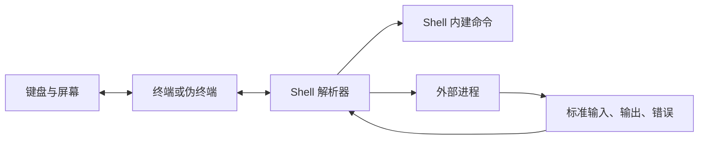

# 终端知识

终端是观察和控制系统最直接的接口。部署失败、资源耗尽或网络异常时，图形化平台可能不可用，工程师仍需要通过终端收集证据、缩小故障范围并执行可审计的操作。熟练使用终端不等于记住大量命令，而是理解 Shell 如何解析输入、命令如何交换数据，以及怎样在不扩大事故的前提下验证假设。

本章覆盖 Bash、PowerShell、进程监控、性能监控、网络工具、文本处理，以及 Vim、Nano、Emacs 三类编辑器。

## 学习目标 {#learning-objectives}

完成本章后，你应当能够：

- 解释终端、Shell、命令行程序和伪终端的职责边界。
- 在 Bash 与 PowerShell 中安全处理参数、管道、错误、退出码和引用。
- 按 CPU、内存、磁盘和网络四类资源采集进程与系统证据。
- 使用网络与文本工具验证名称解析、连接、TLS 和 HTTP 各层状态。
- 在 Vim、Nano 或 Emacs 中完成紧急查看、搜索、修改和退出，并能选择默认编辑器。
- 将一次性排障命令整理为可复现、低风险且不泄露敏感信息的记录。

## 前置知识 {#prerequisites}

- 建议先阅读[操作系统](operating-system.md)，理解进程、文件权限和网络栈。
- 需要把命令升级为可测试工具时，参见[学习一种编程语言](learn-a-programming-language.md)。
- 本章不要求管理员权限。示例只访问当前用户创建的临时数据或公开示例域名。

## 核心原理 {#core-principles}

### 终端、Shell 与命令 {#terminal-shell-and-commands}

终端模拟器负责显示字符和传递键盘输入；Shell 读取一行文本，完成引用、变量展开、重定向和管道连接，再启动内建命令或外部程序。SSH、终端复用器和容器执行接口常分配伪终端（PTY），让远端程序表现得像连接了交互终端。



程序默认获得三个流：标准输入（stdin）、标准输出（stdout）和标准错误（stderr）。退出码 `0` 通常表示成功，非零值表示不同失败。管道主要连接前一个命令的标准输出与后一个命令的标准输入；标准错误不会自动进入管道。

!!! warning "Shell 会先解析，再执行"
    空格、通配符、分号、美元符号和重定向符都可能改变命令结构。不可信输入不能拼接成命令字符串；应使用参数数组、正确引用或语言提供的进程 API。

### 观测应从现象到资源 {#observe-from-symptoms-to-resources}

排障的目标不是尽快运行“修复命令”，而是用最少侵入的观测区分假设：

1. **范围**：一个请求、一个进程、一台机器、一个可用区还是全局？
2. **时间**：何时开始，是否与发布、流量、证书或配额变化重合？
3. **资源**：CPU 是否饱和，内存是否回收，存储是否拥塞，网络是否丢包或等待？
4. **依赖**：名称解析、路由、TCP、TLS、HTTP 和下游业务分别是否成功？
5. **变化**：先保存时间戳和原始证据，再执行最小、可回滚且有验证指标的动作。

单个瞬时数值通常不足以下结论。例如负载平均值不等于 CPU 使用率，空闲内存少不一定是内存不足，`ping` 失败也不证明 HTTP 服务不可达。

## Bash {#bash}

**重点掌握**。Bash 广泛存在于 Linux 和许多 Unix 类管理环境中。它适合组合成熟命令和编写较短的胶水脚本；数据结构复杂、错误恢复困难或需要大量测试时，应转用通用编程语言。

### 解析、引用与展开 {#parsing-quoting-and-expansion}

- 单引号保留其中字符的字面意义；双引号允许变量和命令替换，但阻止分词与路径名展开。
- 变量引用通常写成 `"${name}"`。未引用的空值、空格和 `*` 可能改变参数个数。
- 数组用 `items=("one" "two words")` 定义，以 `"${items[@]}"` 逐项传参。不要用空格分隔字符串模拟数组。
- 命令替换 `$(command)` 会去掉末尾换行，不适合保存任意二进制数据。
- `--` 常用于结束选项解析，例如 `rm -- "$path"`，但是否支持取决于具体命令。

```bash
name='release notes.txt'
printf 'file=%s\n' "$name"

files=("alpha.txt" "two words.txt")
printf '<%s>\n' "${files[@]}"
```

### 错误与组合 {#errors-and-composition}

- `&&` 只在前一命令成功时执行后一命令，`||` 只在失败时执行；二者适合表达条件，不应用来隐藏错误。
- 管道退出码默认常取最后一个命令。脚本可启用 `set -o pipefail`，让管道中的前序失败可见。
- `set -e` 的行为受条件、子 Shell 和命令替换影响，不能代替显式错误处理。常见脚本基线是 `set -Eeuo pipefail`，但引入既有脚本前必须测试其语义。
- `trap` 可在退出或信号到达时清理当前脚本创建的临时资源；清理应限定明确路径并保持幂等。
- 使用 `mktemp` 创建临时文件或目录，避免可预测名称和符号链接竞争。

```bash
#!/usr/bin/env bash
set -Eeuo pipefail

work_dir="$(mktemp -d)"
cleanup() {
    rm -rf -- "$work_dir"
}
trap cleanup EXIT

printf '%s\n' 'safe temporary data' > "${work_dir}/input.txt"
wc -c < "${work_dir}/input.txt"
```

脚本应由 ShellCheck 等工具检查，并在目标 Bash 版本上测试。`sh` 不一定是 Bash；以 `#!/bin/sh` 声明的脚本不能假设数组、`[[ ... ]]` 或 `pipefail` 可用。

## PowerShell {#powershell}

**重点掌握**。PowerShell 可用于 Windows、Linux 和 macOS，核心差异是管道传递 .NET 对象，而不是只传文本行。对象保留属性和类型，筛选、排序与导出时不必先解析屏幕格式。

### 对象管道 {#object-pipeline}

```powershell
Get-Process |
    Where-Object CPU -GT 1 |
    Sort-Object CPU -Descending |
    Select-Object -First 5 Name, Id, CPU
```

`Format-Table` 和 `Format-List` 只应放在交互输出末端。格式化后管道中是展示指令而非原始业务对象，继续导出会得到意外数据。需要机器读取时使用 `ConvertTo-Json`、`Export-Csv` 等明确格式。

### 参数、错误与作用域 {#parameters-errors-and-scope}

- 单引号字符串通常不展开变量，双引号字符串会展开。复杂表达式在插值中写作 `$($value.Property)`。
- 调用 PowerShell 命令时使用命名参数；调用本机程序时要分别传递参数，避免 `Invoke-Expression`。
- 非终止错误默认可能继续执行。自动化脚本可设置 `$ErrorActionPreference = 'Stop'`，并使用 `try` / `catch` / `finally` 处理边界。
- `$LASTEXITCODE` 表示最近本机程序退出码，`$?` 表示最近操作是否成功，两者语义不同。调用本机工具后应立即检查所需状态。
- 函数或脚本应声明 `[CmdletBinding()]` 与参数类型；危险修改支持 `ShouldProcess`，使调用者能用 `-WhatIf` 预览。

```powershell
[CmdletBinding()]
param(
    [Parameter(Mandatory)]
    [ValidateScript({ Test-Path -LiteralPath $_ -PathType Leaf })]
    [string]$Path
)

$ErrorActionPreference = 'Stop'
try {
    Get-Item -LiteralPath $Path |
        Select-Object FullName, Length, LastWriteTimeUtc
}
catch {
    Write-Error "无法读取指定文件：$($_.Exception.Message)"
    exit 2
}
```

Windows PowerShell 5.1 与现代 PowerShell 7+ 使用不同运行时，模块兼容性和默认编码可能不同。生产脚本应声明并测试目标版本。

## 进程监控 {#process-monitoring}

进程监控回答“谁正在消耗资源、在等待什么、由谁启动”。先记录进程 ID、父进程、启动时间、命令、用户和状态，再决定是否重启。PID 会复用，只保存 PID 不能长期唯一标识进程。

=== "Linux / BSD"

    ```bash
    ps -A -o pid,ppid,user,state,lstart,pcpu,pmem,args
    ```

    `ps` 参数在 Linux 与 BSD 间存在差异；先运行 `man ps` 确认本机实现，GNU/Linux 也可使用 `ps --help`。交互观察常用 `top`，若已安装可使用 `htop`，但保存证据应优先选择可脚本化输出。

=== "PowerShell"

    ```powershell
    Get-Process |
        Sort-Object CPU -Descending |
        Select-Object -First 10 Name, Id, StartTime, CPU, WorkingSet64
    ```

重点字段：

- **状态**：运行、睡眠、不可中断等待、停止或僵尸。僵尸进程几乎不消耗 CPU，但说明父进程没有回收退出状态。
- **CPU 时间与瞬时占比**：累计 CPU 时间适合发现长期消耗者，瞬时占比需要结合采样间隔和 CPU 核数解释。
- **常驻内存**：进程当前映射的物理内存近似值，可能含共享页；不能直接相加当作整机实际占用。
- **打开资源**：Linux 常用 `lsof` 或 `/proc/<pid>/fd` 查看文件和套接字；Windows 可使用受支持的系统工具和性能计数器。读取其他用户进程可能需要权限。

停止进程时，优先通过服务管理器请求有序停止并观察超时。强制终止可能跳过缓冲区刷新、锁释放和状态保存，只作为已知后果的最后手段。

## 性能监控 {#performance-monitoring}

性能问题应同时观察利用率、饱和度和错误：资源很忙不一定有问题，队列持续增长或请求超时才说明容量不能满足需求。

### CPU 与调度 {#cpu-and-scheduling}

- 查看用户态、内核态、I/O 等待、空闲时间和运行队列，而不是只看总 CPU。
- Linux 可使用 `uptime` 查看负载趋势，`vmstat 1 5` 观察调度、内存和 I/O；BSD 的字段和工具选项需读本机手册。
- Windows 可用 `Get-Counter` 读取处理器时间和队列等性能计数器。
- 高系统态时间可能来自网络、存储或系统调用；先剖析再优化应用代码。

### 内存 {#memory}

- “已使用”内存包含可回收缓存。关注可用内存、换页、内存压力、OOM 或提交限制。
- 持续换入换出、请求延迟升高和进程被终止比缓存占比较高更值得关注。
- 泄漏判断需要时间序列和工作负载对照，单次进程内存快照不能证明泄漏。

### 存储 {#storage}

- 容量、inode 或元数据、吞吐、IOPS、延迟和队列是不同维度。
- Linux 常见 `df -hP` 查文件系统容量、`df -iP` 查 inode，`iostat` 需要相应工具包。Windows 使用 `Get-Volume` 与性能计数器。
- 删除仍被进程打开的文件可能不释放空间；应定位持有者并通过应用流程处理，不能盲目重启整机。

### 证据窗口 {#evidence-window}

`top` 等实时界面适合探索，但事故复盘需要带时间戳的采样、监控时间序列和变更记录。采样工具本身会消耗资源；高频跟踪或系统调用追踪应先在测试环境评估开销并限制持续时间。

## 网络工具 {#network-tools}

网络排障应逐层验证，不要从“网页打不开”直接跳到防火墙结论。

| 层次 | 要回答的问题 | 常用只读工具 |
| --- | --- | --- |
| 本机配置 | 地址、接口、路由是否符合预期？ | `ip`、`ss`、`ifconfig`、`route`、`Get-NetIPConfiguration` |
| 名称解析 | 名称由谁解析，得到什么记录？ | `dig`、`host`、`Resolve-DnsName` |
| 路径与连接 | 路径在哪里中断，目标端口能否建立连接？ | `traceroute`、`tracepath`、`Test-NetConnection`、`nc` |
| TLS | 证书、名称、协议和信任链是否正确？ | `openssl s_client`、`curl -v` |
| 应用协议 | HTTP 状态、头和响应时间是否符合预期？ | `curl`、`Invoke-WebRequest` |

=== "Linux / BSD"

    ```bash
    curl --fail --show-error --silent \
        --connect-timeout 3 --max-time 10 \
        --output /dev/null \
        --write-out 'code=%{http_code} remote=%{remote_ip} total=%{time_total}\n' \
        https://example.com/
    ```

=== "Windows PowerShell"

    ```powershell
    Resolve-DnsName example.com
    Test-NetConnection example.com -Port 443 -InformationLevel Detailed
    $response = Invoke-WebRequest -Uri 'https://example.com/' -TimeoutSec 10
    [pscustomobject]@{
        StatusCode = $response.StatusCode
        ContentLength = $response.RawContentLength
    }
    ```

`ping` 使用 ICMP，而服务可能使用 TCP 或 UDP；中间设备可以阻止 ICMP 但允许业务流量。`traceroute` 显示的是探测响应路径，路由不对称和限速会造成缺口。抓包可能包含凭据和个人数据，只能在授权范围内最小化采集、安全保存并及时删除。

## 文本处理 {#text-processing}

Unix 管道通常传递字节或文本行，PowerShell 管道通常传递对象。选择工具时先明确输入契约。

### Unix 文本工具 {#unix-text-tools}

- `grep` 按模式筛选行，固定字符串优先 `grep -F`，扩展正则使用 `grep -E`。
- `cut` 适合简单、固定分隔字段；含引号和转义的 CSV 应使用 CSV 解析器。
- `sort` 排序，`uniq` 只合并相邻重复行，常与 `sort` 组合；区域设置会影响排序和字符分类。
- `awk` 按记录与字段执行规则，适合轻量汇总；`sed` 适合流式替换。GNU 与 BSD 实现的选项可能不同。
- JSON、YAML、XML 应使用理解格式的解析器，如 `jq`、`yq` 或语言库，不要用正则猜测嵌套结构。
- 对可能含空格、换行和前导连字符的文件名，使用 NUL 分隔接口（若工具支持），不要解析 `ls` 输出。

```bash
printf '%s\n' '200 GET /health' '503 GET /api' '200 GET /' |
    awk '$1 >= 500 {count += 1} END {print "server_errors=" count + 0}'
```

### PowerShell 对象处理 {#powershell-object-processing}

```powershell
$records = @(
    [pscustomobject]@{ Status = 200; Path = '/health' }
    [pscustomobject]@{ Status = 503; Path = '/api' }
)

$records |
    Where-Object Status -GE 500 |
    Group-Object Status |
    Select-Object Name, Count
```

`Select-String` 搜索文本，`Import-Csv`、`ConvertFrom-Json` 将标准格式转换为对象。`ConvertFrom-Json` 后应检查字段和类型，不能因解析成功就信任内容。

!!! tip "先保留原始数据"
    把筛选命令和原始证据分开保存。只保留最后几行结论会丢失上下文，也无法在提出新假设后重新分析。

## 终端编辑器 {#terminal-editors}

远程节点上不一定有图形界面。至少应掌握一种编辑器的打开、搜索、修改、保存和不保存退出；更稳妥的生产方式仍是修改版本控制中的配置并通过自动化发布。

### Vim {#vim}

**重点掌握**。Vim 采用模式编辑：普通模式用于移动和命令，插入模式输入文本，命令行模式保存与退出。无需掌握复杂配置，但应能完成应急编辑。

- 打开：`vim file.conf`
- 进入插入模式：按 `i`；返回普通模式：按 `Esc`
- 搜索：普通模式输入 `/pattern`，用 `n` 跳到下一个结果
- 保存：`:w`；保存并退出：`:wq`；不保存退出：`:q!`
- 显示行号：`:set number`；撤销：普通模式按 `u`

以管理员权限打开后，编辑器插件、配置和 Shell 转义都可能扩大权限。优先编辑临时副本、校验语法、显示差异，再通过受控方式安装。

### Nano {#nano}

**替代方案**。Nano 的快捷键显示在底部，学习成本低，适合偶发的小修改。

- 打开：`nano file.conf`
- 搜索：`Ctrl+W`
- 写入：`Ctrl+O`，确认文件名后按 Enter
- 退出：`Ctrl+X`，有未保存内容时会询问
- 显示位置：`Ctrl+C`；剪切与粘贴行使用界面提示的快捷键

Nano 操作直接，但同样缺少配置事务。保存前确认文件路径，保存后运行对应语法检查。

### Emacs {#emacs}

**替代方案**。Emacs 是可扩展编辑环境，也可在终端运行。记号 `C-x` 表示按住 Ctrl 再按 x，`M-x` 通常表示 Alt+x。

- 终端打开：`emacs -nw file.conf`
- 搜索：`C-s`
- 保存：`C-x C-s`
- 退出：`C-x C-c`
- 撤销：`C-/`；取消当前命令：`C-g`

Emacs 可通过 Lisp 深度扩展，适合已有配置和长期使用者；在受控服务器上不应临时安装未经审核的包。

设置命令行工具默认编辑器时，可在个人环境中统一 `EDITOR`，需要等待编辑器关闭的工具还可能读取 `VISUAL`：

```bash
export EDITOR='vim'
export VISUAL='vim'
```

不要把交互式编辑作为大规模配置管理方法。紧急修改必须记录原因、备份、语法验证和回归自动化的后续事项。

## 选型比较 {#selection-comparison}

### Bash 与 PowerShell {#bash-and-powershell}

| 维度 | Bash | PowerShell |
| --- | --- | --- |
| 管道数据 | 字节或文本 | .NET 对象，本机程序仍输出文本 |
| 主要环境 | Linux、Unix 类系统 | Windows 管理，也支持 Linux 与 macOS |
| 组合优势 | Unix 小工具和重定向生态 | 结构化系统管理、对象筛选与 .NET API |
| 主要风险 | 引用、分词、隐式退出语义 | 非终止错误、格式化对象、版本差异 |
| 转向通用语言的信号 | 复杂数据、并发、恢复、跨平台测试 | 大型模块、复杂领域模型、严格性能要求 |

团队可以同时保留两者，但每类脚本应明确目标 Shell、最低版本、格式化和测试规则。跨平台自动化若大量调用平台特有命令，强行使用同一个脚本通常只会隐藏分支复杂度。

### 编辑器 {#editors}

选择团队在应急环境中确实可用的工具：Vim 常预装且远程效率高，Nano 易于临时上手，Emacs 适合已采用其工作流的工程师。生产标准不应要求所有人使用同一编辑器，而应要求变更可审查、可验证和可恢复。

## 最小实践：安全分析样例日志 {#minimal-practice-safely-analyze-sample-logs}

该练习只操作由当前命令创建的临时目录，不读取真实日志。目标是统计 5xx 响应并确保清理路径明确。

```bash
#!/usr/bin/env bash
set -Eeuo pipefail

work_dir="$(mktemp -d)"
cleanup() {
    rm -rf -- "$work_dir"
}
trap cleanup EXIT

log_file="${work_dir}/access.log"
cat > "$log_file" <<'LOG'
2026-08-13T10:00:00Z 200 GET /health 0.003
2026-08-13T10:00:01Z 503 GET /api 0.250
2026-08-13T10:00:02Z 502 GET /api 0.180
2026-08-13T10:00:03Z 200 GET / 0.010
LOG

awk '
    $2 ~ /^5[0-9][0-9]$/ { count += 1; latency += $5 }
    END { printf "server_errors=%d total_latency=%.3f\n", count, latency }
' "$log_file"
```

预期输出为：

```text
server_errors=2 total_latency=0.430
```

PowerShell 中可使用对象完成同样任务：

```powershell
$workDir = Join-Path ([System.IO.Path]::GetTempPath()) ([guid]::NewGuid())
New-Item -ItemType Directory -Path $workDir | Out-Null
try {
    $records = @(
        [pscustomobject]@{ Status = 200; Latency = 0.003 }
        [pscustomobject]@{ Status = 503; Latency = 0.250 }
        [pscustomobject]@{ Status = 502; Latency = 0.180 }
        [pscustomobject]@{ Status = 200; Latency = 0.010 }
    )
    $serverErrors = $records | Where-Object Status -GE 500
    [pscustomobject]@{
        ServerErrors = @($serverErrors).Count
        TotalLatency = ($serverErrors | Measure-Object Latency -Sum).Sum
    }
}
finally {
    Remove-Item -LiteralPath $workDir -Recurse -Force
}
```

真实日志可能存在字段缺失、时区差异、轮转、压缩和敏感数据。先确认格式契约与授权范围，再调整解析器，禁止直接把生产日志上传到公共服务。

## 生产实践 {#production-practices}

### 安全操作 {#safe-operations}

- 用普通权限观测，以单条、短时、可审计方式提权；不要启动永久管理员 Shell。
- 运行命令前确认主机、账户、命名空间、当前目录和时间范围。终端标题或提示符不能替代身份验证。
- 修改前读取当前状态、保存差异、运行语法检查并准备恢复命令。批量操作先在一个非关键目标演练。
- 历史记录、进程参数和终端录屏都可能保存命令。令牌通过受控输入或文件描述符传递，不写在命令行。
- 不运行来源不明的 `curl ... | sh`。下载、校验签名或摘要、阅读内容后再在隔离环境执行。

### 可靠排障 {#reliable-troubleshooting}

- 为每条假设记录时间、命令、退出码和关键输出；命令前可先记录 UTC 时间。
- 使用超时限制网络和跟踪工具，使用采样窗口避免无限运行。
- 先观测再变更，一次只改变一个变量。重启可能暂时消除症状，也会销毁内存、连接和队列证据。
- 通过[版本控制系统](version-control-systems.md)保存可复用脚本，并使用 ShellCheck、PSScriptAnalyzer 和自动测试。
- 长命令整理成参数明确的脚本；脚本支持只读模式、目标范围、并发上限和失败汇总。

### 可观测与成本 {#observability-and-cost}

- 临时终端命令用于验证监控结论，不替代持续指标、日志和追踪。
- 不在全量节点高频执行昂贵查询。先抽样并测量命令本身的 CPU、I/O 和网络开销。
- 输出机器可读格式时固定字段与版本；输出给人阅读时保留单位、时间和主机上下文。
- 事故结束后删除包含敏感数据的临时文件，并把真正有用的检测转成受保留策略管理的遥测。

## 常见误区 {#common-misconceptions}

- **复制命令但不理解 Shell**：命令可能包含重定向、命令替换或环境相关通配符，应逐段解释后运行。
- **用 `kill -9` 作为默认重启方式**：强制信号不给进程清理机会，应先通过服务管理器优雅停止。
- **把负载平均值等同于 CPU 百分比**：负载还可能包含等待资源的任务，必须结合运行队列和 I/O。
- **看到空闲内存低就清缓存**：缓存通常可回收，人工清理会降低性能并掩盖真正压力。
- **用 `ping` 判断服务健康**：ICMP、TCP、TLS 与应用请求是不同层次。
- **用正则解析 JSON 或 CSV**：转义、嵌套和换行会破坏简单模式，应使用格式解析器。
- **解析 `ls` 输出处理文件**：显示格式、区域设置和特殊文件名都会导致错误。
- **在管道中途使用 PowerShell 格式化命令**：后续收到的不是原始对象。
- **认为 `set -e` 捕获所有 Bash 错误**：其上下文规则复杂，关键边界必须显式检查和测试。
- **直接在生产节点编辑配置**：会制造漂移；紧急修改也要尽快回写声明式来源并重新发布。

## 动手练习 {#hands-on-exercises}

1. 分别写一个 Bash 和 PowerShell 命令，输出当前时间、用户、主机和 Shell / PowerShell 版本，结果必须具有稳定字段名。
2. 修改最小实践，使格式错误的行写入标准错误并导致退出码 `2`，但不得执行任何系统修改。
3. 对 `https://example.com/` 依次验证 DNS、TCP 443、TLS 与 HTTP，记录每层成功的独立证据以及工具超时。
4. 在非生产机器采样 CPU、内存和磁盘 30 秒，解释利用率、饱和度和错误各来自哪个字段，不只粘贴输出。
5. 用 Vim、Nano 或 Emacs 在临时目录编辑一个文件，完成搜索、替换、保存、撤销和不保存退出；删除临时目录前用 `diff` 验证结果。
6. 找一个自己的旧 Shell 脚本，检查未引用变量、未处理退出码、可预测临时文件和无限重试，提交一份风险清单。

## 完成检查 {#completion-checklist}

- [ ] 能区分终端、Shell、外部进程、标准流和退出码。
- [ ] 能正确解释 Bash 单引号、双引号、数组、管道和 `pipefail`。
- [ ] 能使用 PowerShell 对象管道并区分终止错误与本机程序退出码。
- [ ] 能从进程、CPU、内存、磁盘和网络逐层收集证据。
- [ ] 能说明 `ping`、DNS 查询、TCP 连接、TLS 与 HTTP 检查的边界。
- [ ] 能用格式感知工具处理 JSON、CSV 等结构化数据。
- [ ] 能在 Vim、Nano 或 Emacs 中安全完成最小编辑流程。
- [ ] 能把排障命令限制在授权范围并避免泄露凭据。

## 官方延伸阅读 {#official-further-reading}

- [GNU Bash 手册](https://www.gnu.org/software/bash/manual/)、[GNU Coreutils 手册](https://www.gnu.org/software/coreutils/manual/)与[ShellCheck](https://www.shellcheck.net/)
- [PowerShell 文档](https://learn.microsoft.com/powershell/)、[关于管道](https://learn.microsoft.com/powershell/module/microsoft.powershell.core/about/about_pipelines)与[PSScriptAnalyzer](https://learn.microsoft.com/powershell/utility-modules/psscriptanalyzer/overview)
- [Linux proc 文件系统文档](https://docs.kernel.org/filesystems/proc.html)与[`perf` 文档](https://perf.wiki.kernel.org/)
- [curl 文档](https://curl.se/docs/)、[OpenSSH 手册页](https://www.openssh.com/manual.html)与[Wireshark 用户指南](https://www.wireshark.org/docs/wsug_html_chunked/)
- [GNU `awk` 用户指南](https://www.gnu.org/software/gawk/manual/)、[`jq` 手册](https://jqlang.github.io/jq/manual/)与[PowerShell `about_Objects`](https://learn.microsoft.com/powershell/module/microsoft.powershell.core/about/about_objects)
- [Vim 帮助](https://vimhelp.org/)、[GNU nano 文档](https://www.nano-editor.org/docs.php)与[GNU Emacs 手册](https://www.gnu.org/software/emacs/manual/emacs.html)
