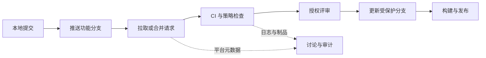

# 版本控制托管

版本控制托管平台把 Git 仓库扩展为团队协作与软件交付的控制面：身份和权限、变更评审、状态检查、流水线、制品、漏洞报告与审计记录都在这里汇合。平台并不替代 Git；它围绕 Git 引用更新建立组织规则，并保存许多不能随 `git clone` 一起迁移的元数据。

本章比较 GitHub、GitLab 和 Bitbucket。产品功能、套餐与托管区域会变化，选型时应以当前官方文档、合同和实际验证为准。

## 学习目标

完成本章后，你应当能够：

- 区分 Git 仓库数据与议题、评审、权限、流水线、制品等平台数据。
- 在 GitHub、GitLab 或 Bitbucket 上设计从分支到评审、检查、合并和发布的受控流程。
- 配置人员与自动化身份的最小权限，并说明 HTTPS、SSH、应用令牌和工作负载身份的边界。
- 按部署模式、集成生态、安全治理、可靠性、成本和迁移能力比较三个平台。
- 制定平台备份、故障降级、审计、保留和退出计划。

## 前置知识

- 应先完成[版本控制系统](version-control-systems.md)，理解提交、分支、远端、合并和标签。
- 熟悉[终端知识](terminal-knowledge.md)中的退出码、参数引用和文本输出。
- 后续流水线会运行程序和容器，可按需复习[学习一种编程语言](learn-a-programming-language.md)与[容器](containers.md)。

## 核心原理

### Git 数据面与协作控制面

Git 原生传输提交对象和引用，托管平台在其上实施身份认证、授权和变更策略。一次典型合并经过以下边界：



`git clone --mirror` 可以复制 Git 引用和对象，却不会自动带走：

- 用户、团队、权限、分支保护和审批规则；
- 议题、评审讨论、Wiki、看板、里程碑与附件；
- CI 变量、运行器、环境审批、日志、缓存和制品；
- Git LFS 对象、包仓库、漏洞告警、审计事件、Webhook 与应用安装。

因此“仓库有镜像”不等于“平台可恢复”。恢复目标必须说明哪些数据要保留、可接受丢失多久（RPO），以及平台不可用后多久恢复服务（RTO）。

### 身份认证与授权

人员可通过组织身份提供方使用单点登录和多因素认证，再通过 HTTPS 凭据或 SSH 密钥执行 Git 操作。自动化不应共享个人令牌，而应使用平台应用、项目或仓库级令牌、部署密钥，或者由流水线身份联合换取云端短期凭据。

授权至少分为读取代码、推送分支、管理议题、合并保护分支、读取机密、发布制品和管理组织。仓库管理员并不应天然拥有生产部署权限；关键操作要通过独立环境授权和审计实现职责分离。

!!! warning "分支保护不是完整安全边界"
    能修改流水线定义、依赖脚本或评审规则的人可能间接获得流水线令牌。保护规则必须同时覆盖工作流文件、代码所有者、运行器、环境机密和管理员绕过权限。

### 评审与状态检查

GitHub 使用拉取请求（Pull Request），GitLab 使用合并请求（Merge Request），Bitbucket 使用 Pull Request。名称不同，但核心都是比较来源与目标分支，承载讨论、审批和自动检查，再更新目标引用。

可靠门禁应具备：

- 检查名称稳定且来自受信任系统，防止同名状态伪装成必需检查；
- 新提交到达后旧审批和旧测试是否失效，有明确团队规则；
- 合并时验证的提交与最终进入目标分支的内容一致；
- 管理员绕过、紧急合并和失败重试有审计与事后复核；
- 外部分支或派生仓库触发流水线时，不向不可信代码暴露机密。

### 流水线、运行器与制品

平台通常把事件转换为任务图，再把作业调度到托管或自托管运行器。运行器会执行仓库中的代码，因此是高风险计算边界。

- 托管运行器降低维护成本，但网络、镜像、区域和执行时长受服务约束。
- 自托管运行器能访问私有资源和定制硬件，却需要补丁、隔离、容量、日志和凭据清理。
- 不可信变更应使用一次性隔离执行环境，禁止与可信部署作业共享持久工作目录或宿主机 Docker socket。
- 缓存用于加速，制品用于交付，两者都应设置完整性校验、访问权限和保留期限。

流水线具体工具将在[CI/CD 工具](ci-cd-tools.md)章节展开；这里的重点是托管平台如何控制源码变更和执行身份。

## GitHub

**重点掌握**。GitHub 提供公共与私有仓库、Pull Request、Issues、Actions、Packages、安全能力和应用生态。GitHub.com 由厂商托管；GitHub Enterprise Server 可部署在组织管理的基础设施中，两种部署模式的升级、功能发布时间和运维责任不同。

### 协作与治理

- Pull Request 支持草稿、逐行评论、建议变更、评审和自动合并。合并提交、squash 与 rebase 三种方式会形成不同 Git 历史，仓库应统一允许的方式。
- Rulesets 和分支保护可要求 Pull Request、状态检查、签名提交、线性历史和限制推送。规则优先级、绕过名单和适用引用需在测试仓库验证。
- `CODEOWNERS` 根据路径请求评审；它表达平台审批责任，不代表实际运行责任或文件权限。
- Issues、Projects、Discussions 和 Wiki 可承载规划与知识，但关键运行手册最好与代码一起版本化，以便离线恢复和同变更审查。

### 自动化与安全

- GitHub Actions 工作流位于 `.github/workflows/`。`GITHUB_TOKEN` 权限应在工作流或作业级显式收窄，外部 Action 固定到不可变提交并审查来源。
- GitHub Apps 以安装方式获得精细权限，通常比共享个人访问令牌更适合组织集成。部署密钥一般面向单仓库，是否允许写入应严格限制。
- Dependabot、代码扫描和秘密扫描可提供供应链信号，但覆盖语言、套餐和公开性约束应查当前文档；告警必须有分派、时限和例外流程。
- Environments 可为部署配置审批、分支限制和机密。云部署优先使用 OpenID Connect（OIDC）换取短期身份，避免长期云密钥。

### 运维边界

GitHub.com 的可用性、备份和升级主要由厂商负责，客户仍负责组织配置、账户恢复、数据导出和业务连续性。Enterprise Server 则需要组织承担容量、升级、备份、恢复和高可用设计，并遵循官方支持矩阵。

## GitLab

**重点掌握**。GitLab 把仓库、Merge Request、Issues、CI/CD、包与容器注册表及安全能力集成在同一产品中。GitLab.com 是托管服务；GitLab Self-Managed 与 Dedicated 等部署选择对应不同责任模型，版本和功能以当前官方产品说明为准。

### 协作与治理

- Merge Request 支持讨论、审批、代码所有者、合并列车等协作能力。项目、组和子组形成继承层级，适合按组织边界统一变量、运行器和策略，也可能因继承过深而难以审计。
- Protected branches 和 protected tags 限制推送、合并与创建标签的角色。环境、变量和运行器也有保护属性，必须一起检查。
- GitLab 权限以角色和资源层级组合。自定义角色、外部用户和组共享行为会随产品版本演进，敏感项目应通过测试账号验证实际授权。
- Issues、Epics、Milestones 与 Wiki 可连接计划和交付；导出与迁移时要确认这些元数据是否完整覆盖。

### 自动化与安全

- GitLab CI/CD 主要由 `.gitlab-ci.yml` 及可包含配置描述。包含外部模板时固定不可变引用并审查模板的作业、镜像和变量访问。
- GitLab Runner 可使用多种执行器。共享 Runner 上运行不可信代码时必须确保执行器隔离；特权容器、宿主机 socket 和持久 Shell executor 都会扩大逃逸后的影响。
- 作业令牌、部署令牌、项目访问令牌和组访问令牌适用范围不同，应选择最窄资源与最短有效期，并限制哪些项目可使用作业令牌访问本项目。
- 集成的依赖、容器、静态与动态扫描能力依版本和订阅而异。扫描结果要结合可利用性和资产暴露面治理，不能只追求告警归零。

### 运维边界

Self-Managed GitLab 包含数据库、Git 存储、对象存储、缓存、队列、注册表与搜索等多个状态组件。升级必须遵循官方要求的升级路径，并对备份版本兼容性、对象存储内容和机密配置执行恢复演练。不能只复制仓库目录就认为平台完整备份。

## Bitbucket

**替代方案**。Bitbucket Cloud 与 Jira、Confluence 等 Atlassian Cloud 产品集成紧密，适合已采用 Atlassian 工作流的团队。Bitbucket Data Center 面向自托管企业环境；历史产品名称和支持状态可能变化，选型时应确认当前受支持部署方式。

### 协作与治理

- Pull Request 提供讨论、审批、合并检查和任务。默认评审者与 `CODEOWNERS` 类路径责任能力的具体支持方式应依据所用产品验证。
- Branch permissions / branch restrictions 可限制写入、删除、合并和历史重写。自托管版与 Cloud 的设置名称和能力不完全相同。
- Jira 议题键、开发面板和自动化可把需求、提交、构建与发布关联起来。关联便利不应迫使仓库权限继承过宽，Jira 项目权限与代码权限需分别审计。
- 合并策略会影响历史形态；与其他平台一样，应在仓库级限定并为发布工具验证兼容性。

### 自动化与安全

- Bitbucket Pipelines 使用仓库中的 `bitbucket-pipelines.yml`，由 Cloud 基础设施或 self-hosted runner 执行。步骤镜像、缓存、部署变量和并发配额需要显式治理。
- Repository / project / workspace access token、API token、SSH 密钥等凭据模型各有范围。Bitbucket Cloud 的 App password 已由 API token 取代；新集成应优先采用当前官方推荐的细粒度方式，不共享个人凭据。
- 部署环境可隔离变量和权限；不可信 Pull Request 的流水线不得读取部署机密。
- 与 Jira、Compass、第三方 Marketplace 应用集成时，审查应用可访问的仓库、用户数据、Webhook 内容和卸载后的数据保留。

### 运维边界

Cloud 模式下要关注服务状态、数据驻留、导出能力与组织账户恢复。Data Center 模式需自行维护应用节点、数据库、共享存储、搜索组件、负载均衡和升级路径，并按照官方文档验证备份一致性。

??? note "平台产品名称为何必须带部署模式"
    “GitHub”“GitLab”“Bitbucket”都可能指云服务或自托管产品。两者在功能、升级节奏、日志可见性、数据控制和责任模型上不同。架构记录应写明产品、部署模式、版本或服务层级，而不是只写品牌。

## 选型比较

| 维度 | GitHub | GitLab | Bitbucket |
| --- | --- | --- | --- |
| 典型优势 | 开源协作、应用市场、Actions 与广泛集成 | 源码到 CI/CD 与安全能力的一体化，自托管选择完整 | Atlassian Cloud、Jira 与 Confluence 协作整合 |
| 托管选择 | GitHub.com、Enterprise Server | GitLab.com、Self-Managed 等 | Bitbucket Cloud、Data Center |
| 原生流水线 | GitHub Actions | GitLab CI/CD | Bitbucket Pipelines |
| 主要评估风险 | 第三方 Action 权限、组织规则复杂度 | 自托管组件与升级复杂度、层级继承 | 产品模式差异、生态与配额依赖 |
| 迁移关注 | PR、Issues、Actions、Packages、Apps | MR、组层级、CI 变量、Runner、Registry | PR、Jira 关联、Pipelines、应用集成 |

表格只给出比较入口，不能替代试点。至少从以下维度做加权评估：

1. **协作模型**：评审、代码所有者、合并队列、跨仓变更和移动端审批是否符合实际流程？
2. **身份治理**：是否支持组织身份源、强制多因素认证、自动配置用户、细粒度令牌和完整审计？
3. **执行安全**：托管与自托管运行器如何隔离，能否使用短期云身份，外部贡献是否安全？
4. **可靠性**：状态页、服务等级、数据驻留、备份接口、灾难恢复和离线工作是否满足目标？
5. **生态与锁定**：现有议题、模板、应用、流水线语法和包仓库迁移成本是多少？
6. **总成本**：许可证或席位、运行器计算、存储与流量、自托管人员、审计保留和迁移投入是多少？
7. **厂商与合规**：数据处理、分包商、删除周期、加密、区域和认证是否经过组织评估？

### 云托管还是自托管

云托管通常更快获得安全修复并减少平台组件运维，但组织仍需治理账户、规则、数据和集成。自托管提供网络和升级控制，却把补丁、高可用、数据库、对象存储、备份、监控和应急全部转为自身责任。只有明确的法规、网络、集成或成本需求足以覆盖长期运维能力时，才应选择自托管。

### 降低迁移成本

- 以标准 Git 保存源码和标签，以仓库内文件保存流水线、所有者和贡献说明。
- 制品遵循 OCI、Maven、npm 等开放协议，并保留来源与摘要，不让发布只能从平台界面恢复。
- 通过平台 API 定期导出权限、保护规则、议题和评审元数据，并对恢复工具进行版本测试。
- 自动化封装平台 API 边界，避免业务脚本依赖易变的页面或未声明字段。
- 在正式迁移前盘点大小写冲突、LFS、子模块、用户映射、Webhook、环境机密和外部应用。

## 最小实践：在本地模拟受控协作

该练习不需要平台账户，也不连接网络。一个裸仓库模拟服务端，两个克隆模拟贡献者和评审者；所有内容位于临时目录。

```bash
practice_dir="$(mktemp -d)"
remote_repo="${practice_dir}/service.git"
author_repo="${practice_dir}/author"
review_repo="${practice_dir}/reviewer"

git init --bare "$remote_repo"
git clone "$remote_repo" "$author_repo"
git -C "$author_repo" config user.name 'Example Author'
git -C "$author_repo" config user.email 'author@example.com'
git -C "$author_repo" switch -c main
printf '# Example service\n' > "${author_repo}/README.md"
git -C "$author_repo" add README.md
git -C "$author_repo" commit -m 'docs: initialize service'
git -C "$author_repo" push -u origin main
git -C "$remote_repo" symbolic-ref HEAD refs/heads/main

git -C "$author_repo" switch -c docs/runbook
printf '\nHealth check: GET /health\n' >> "${author_repo}/README.md"
git -C "$author_repo" add README.md
git -C "$author_repo" commit -m 'docs: add health check'
git -C "$author_repo" push -u origin docs/runbook

git clone "$remote_repo" "$review_repo"
git -C "$review_repo" diff origin/main...origin/docs/runbook
git -C "$review_repo" log --oneline origin/main..origin/docs/runbook

git -C "$author_repo" switch main
git -C "$author_repo" merge --no-ff docs/runbook -m 'merge: reviewed runbook'
git -C "$author_repo" push origin main
git -C "$review_repo" fetch origin
test "$(git -C "$review_repo" rev-parse origin/main)" = \
    "$(git -C "$author_repo" rev-parse main)"

rm -rf -- "$practice_dir"
```

本地模拟展示了“推送来源分支、按目标分支查看差异、集成、更新受控分支”的数据流，但没有真正实施审批、必需检查或权限。实际平台中应禁止贡献者直接更新受保护分支，由平台在审批和检查通过后执行合并。

### 平台试点清单

在三个平台任意一个测试组织中进行试点时，可用以下安全流程：

1. 创建不含生产代码和机密的私有测试仓库。
2. 启用默认分支保护，要求 Pull / Merge Request 和一个无机密的测试检查。
3. 创建普通贡献者测试账户，验证其不能直接推送默认分支或读取环境机密。
4. 从功能分支发起评审，推送新提交，确认旧检查与审批按预期失效或保留。
5. 执行合并后导出审计事件，并记录规则实际效果。
6. 删除测试凭据、运行器和仓库，确认外部应用授权也已撤销。

## 生产实践

### 组织与权限

- 所有人员使用组织管理身份，强制多因素认证；加入、调岗和离职通过身份生命周期自动同步。
- 团队而非个人直接获得仓库权限，定期审查外部协作者、机器人、部署密钥、应用和绕过者。
- 默认分支、发布标签、所有者文件与流水线配置使用更严格规则。管理员也通过正常评审路径操作。
- 紧急访问采用限时授权、双人确认和完整审计，使用后自动撤销并复盘。

### 流水线隔离

- 不可信代码使用一次性运行器、只读或无令牌权限、受限网络和资源配额；可信发布作业使用独立运行器池。
- 工作流默认令牌设为只读，按作业提升单项权限。生产身份由 OIDC 等联合机制按仓库、分支和环境声明换取。
- 第三方 Actions、CI 模板、容器镜像和插件固定到不可变摘要或提交，升级通过评审和测试。
- 日志自动遮盖只作为补充，脚本不得主动打印环境变量、认证头或完整云响应。

### 可靠性与连续性

- 监控平台状态、API 限额、Webhook 投递、Runner 队列、作业失败率、存储增长和备份结果。
- 定义平台不可用时的冻结规则：本地可继续提交和评审补丁，但未经等效控制不得直接部署生产。
- 定期导出 Git 与平台元数据，在隔离环境验证恢复，记录恢复后的 URL、用户映射和签名状态变化。
- 自托管平台使用厂商支持的备份与升级路径，数据库、对象存储、Git 数据和机密配置保持一致恢复点。

### 成本与维护

- 对席位、CI 分钟、并发、日志、缓存、制品、LFS 和网络流量设置预算与保留策略。
- 取消的流水线及时终止下游作业；使用依赖缓存前衡量命中率与污染风险。
- 归档无人维护仓库前保留所有者和安全联系人，禁止归档状态成为漏洞无人处理的理由。
- 每季度验证保护规则和恢复，不只检查配置存在。平台更新可能改变继承、默认值和 API 行为。

## 常见误区

- **认为代码已托管就完成备份**：云服务故障、误删、账户锁定和恶意管理员仍需独立恢复方案。
- **让所有仓库管理员绕过保护**：保护只约束普通开发者会形成虚假控制，绕过必须最小化并审计。
- **在不可信 Pull Request 中注入机密**：贡献者可以修改构建脚本并外传凭据，外部变更必须使用无机密上下文。
- **长期使用个人访问令牌做集成**：人员离职、权限变化和不可归属操作都会破坏可靠性，应改用应用或工作负载身份。
- **把自托管等同于更安全**：未及时升级、备份未验证和运行器共用宿主机会抵消网络控制收益。
- **只迁移 Git 仓库**：评审、议题、权限、流水线、包和审计丢失会中断交付与追责。
- **用更多审批替代自动验证**：审批者无法稳定发现格式、依赖和回归问题，自动检查与人工判断解决不同风险。
- **相信安全扫描结果绝对正确**：告警会误报和漏报，需要结合威胁模型、暴露面与修复时限。
- **默认所有平台同名功能语义一致**：保护继承、令牌范围和流水线事件必须在具体部署模式中验证。

## 动手练习

1. 完成本地受控协作实践，解释裸仓库中保存了什么、没有保存什么平台元数据。
2. 在测试组织创建保护规则，用普通账户验证直接推送失败、评审合并成功，并保存不含敏感信息的审计证据。
3. 比较 GitHub App、GitLab 项目访问令牌和 Bitbucket 仓库访问令牌的资源范围、有效期、轮换和审计方式；以当前官方文档为依据。
4. 为不可信贡献与生产发布设计两个 Runner 池，说明网络、凭据、宿主机、缓存和销毁策略。
5. 制定从当前平台迁出的清单，覆盖仓库、LFS、议题、评审、Wiki、权限、Webhook、流水线、制品、用户映射和停机窗口。
6. 为平台不可用两小时设计降级流程：哪些工作可继续、哪些必须冻结、恢复后如何对账。
7. 估算一个月的席位、流水线计算、制品存储与网络费用，并提出一项不会降低审计能力的优化。

## 完成检查

- [ ] 能区分 Git 对象与平台协作、执行和审计元数据。
- [ ] 能解释 GitHub、GitLab、Bitbucket 的协作模型与部署选择。
- [ ] 能为人员、应用、Runner 和部署身份授予最小权限。
- [ ] 能保护默认分支、发布标签和流水线配置，并验证规则实际生效。
- [ ] 能隔离不可信构建与可信部署，避免机密进入外部变更流水线。
- [ ] 能按协作、治理、可靠性、成本与迁移维度完成平台选型。
- [ ] 能制定覆盖 Git、LFS、平台元数据和制品的恢复计划。
- [ ] 能说明云托管与自托管各自的责任边界。

## 官方延伸阅读

- [GitHub 文档](https://docs.github.com/)、[关于受保护分支](https://docs.github.com/repositories/configuring-branches-and-merges-in-your-repository/managing-protected-branches/about-protected-branches)与[GitHub Actions 安全加固](https://docs.github.com/actions/security-for-github-actions/security-guides/security-hardening-for-github-actions)
- [GitHub Apps 文档](https://docs.github.com/apps)、[OIDC 安全加固](https://docs.github.com/actions/security-for-github-actions/security-hardening-your-deployments/about-security-hardening-with-openid-connect)与[GitHub Enterprise Server 备份服务](https://docs.github.com/en/enterprise-server@latest/admin/backing-up-and-restoring-your-instance/about-the-backup-service-for-github-enterprise-server)
- [GitLab 文档](https://docs.gitlab.com/)、[Protected branches](https://docs.gitlab.com/user/project/repository/branches/protected/)与[CI/CD 安全](https://docs.gitlab.com/ci/security/)
- [GitLab Runner 安全](https://docs.gitlab.com/runner/security/)、[GitLab 备份与恢复](https://docs.gitlab.com/administration/backup_restore/)与[升级路径工具](https://gitlab-com.gitlab.io/support/toolbox/upgrade-path/)
- [Bitbucket Cloud 文档](https://support.atlassian.com/bitbucket-cloud/)、[分支限制](https://support.atlassian.com/bitbucket-cloud/docs/use-branch-permissions/)与[Pipelines 文档](https://support.atlassian.com/bitbucket-cloud/docs/get-started-with-bitbucket-pipelines/)
- [Bitbucket Data Center 文档](https://confluence.atlassian.com/bitbucketserver/)与[数据恢复文档](https://confluence.atlassian.com/bitbucketserver/bitbucket-data-recovery-776640164.html)
- [SLSA 供应链安全框架](https://slsa.dev/)与[OpenID Connect Core 规范](https://openid.net/specs/openid-connect-core-1_0.html)
