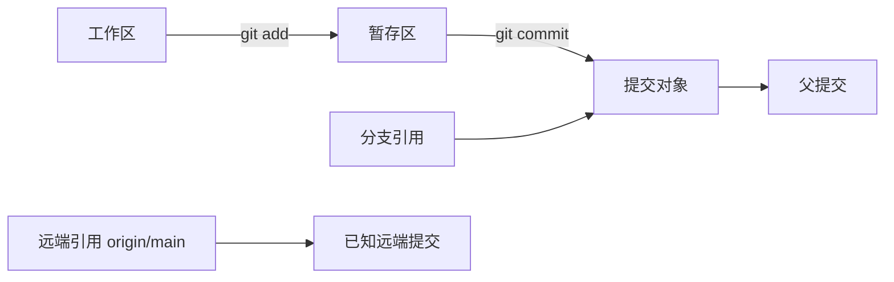

# 版本控制系统

版本控制系统（Version Control System，VCS）让代码、配置和文档的每次变化都有可比较的历史，使多人能够并行工作，也为审查、发布、回滚和审计提供共同依据。DevOps 工作中的流水线、基础设施定义和运行手册都应进入版本控制，否则生产状态会依赖聊天记录、个人目录或不可复现的点击操作。

本章聚焦分布式版本控制系统 Git。托管平台提供评审、权限和自动化能力，但 Git 的提交、分支与对象模型首先存在于本地；平台比较参见[版本控制托管](vcs-hosting.md)。

## 学习目标 {#learning-objectives}

完成本章后，你应当能够：

- 解释工作区、暂存区、提交、引用、对象数据库和远端跟踪分支之间的关系。
- 创建仓库并完成选择性暂存、提交、分支、合并、变基和冲突处理。
- 使用 `status`、`diff`、`log`、`show`、`blame` 与 `bisect` 调查变化来源。
- 根据变更是否共享，安全选择恢复、还原、重置或回退方法。
- 设计包含小提交、代码评审、分支保护、提交签名和秘密扫描的生产协作流程。

## 前置知识 {#prerequisites}

- 能在[终端知识](terminal-knowledge.md)中介绍的 Bash 或 PowerShell 环境运行命令。
- 理解文件路径、文本编码和退出码。
- 本章练习会在 `mktemp` 创建的独立临时仓库中进行，不接触当前项目和远端服务。

## 核心原理 {#core-principles}

### 快照与对象 {#snapshots-and-objects}

Git 将一次提交视为项目目录树的快照，而不是简单保存“第几行改了什么”。未变化文件可复用已有对象，因此不需要重复存储完整内容。核心对象包括：

- **blob**：文件内容，不包含文件名。
- **tree**：目录结构，把名称和模式关联到 blob 或子 tree。
- **commit**：指向根 tree 和零个或多个父提交，并记录作者、提交者和说明。
- **tag**：附注标签对象可指向提交等对象，并保存标签元数据与签名。

对象名由内容哈希得到。哈希能帮助发现对象意外损坏并建立不可变引用，但普通提交哈希本身不是作者身份认证；可信身份需要签名、受控密钥和验证策略。



### 三棵树与引用 {#three-trees-and-references}

日常操作可以理解为比较三份状态：

1. **HEAD**：当前检出的提交，通常由当前分支间接指向。
2. **暂存区（index）**：下一次提交将包含的快照。
3. **工作区**：磁盘上当前可编辑的文件。

`git diff` 默认比较工作区与暂存区；`git diff --staged` 比较暂存区与 `HEAD`；`git diff HEAD` 比较工作区整体与 `HEAD`。先确认比较边界，才能正确判断“改动去哪了”。

分支只是一个可移动的提交引用，创建分支不会复制整个目录。`HEAD` 通常指向当前分支；处于 detached HEAD 时，它直接指向某个提交，新提交若没有创建分支引用，之后可能难以找到。

### 提交图、合并与变基 {#commit-graph-merging-and-rebasing}

每个提交指向父提交，形成有向无环图。合并保留两条历史并创建双亲提交（若不能快进）；变基则把一组提交重新应用到新基点，生成内容相似但身份不同的新提交。

- **合并（merge）**保留真实分叉关系，适合共享分支和需要明确集成节点的流程。
- **变基（rebase）**可整理尚未共享的本地提交，使线性阅读更容易；它会重写提交，已共享分支上使用会给协作者造成重复历史。
- **拣选（cherry-pick）**把指定提交的补丁应用到当前位置，适合有选择地回移修复，但会生成新提交且可能遗漏依赖变化。

冲突不是 Git 损坏，而是多个变化无法自动组合。解决者必须理解两边意图，编辑最终内容，运行测试，再标记为已解决；不能机械选择“ours”或“theirs”。

### 本地与远端 {#local-and-remote}

远端是另一个 Git 仓库的简短名称和 URL。`git fetch` 下载对象并更新远端跟踪引用，如 `origin/main`，不会直接修改当前工作区；`git pull` 通常组合 fetch 与 merge 或 rebase，行为受配置影响。生产操作中分开执行 fetch、检查差异、再集成通常更可控。

`git push` 请求远端更新引用。普通推送不是把整个本地目录上传，而是发送远端缺少的对象并更新目标引用。被保护分支、权限和服务端检查可能拒绝更新。

!!! warning "Git 历史不是秘密保险箱"
    文件从最新提交删除后，内容仍可能存在于旧提交、标签、派生仓库、缓存和备份。凭据一旦提交，应立即吊销或轮换，再按协作范围决定是否重写历史。

## 日常工作流 {#daily-workflow}

### 初始化与身份 {#initialization-and-identity}

```bash
git init -b main
git config user.name 'Example Developer'
git config user.email 'developer@example.com'
git status
```

示例显式创建 `main` 分支，并使用仓库级虚构身份，不改变全局配置。作者字段用于归属记录，不构成强身份验证。组织需要可验证来源时，应另外配置 OpenPGP、SSH 或 X.509 等提交签名，并在托管平台执行验证策略。

### 查看并选择性提交 {#review-and-selective-commit}

```bash
git status --short
git diff
git add -- path/to/file
git diff --staged
git commit -m 'docs: explain deployment prechecks'
```

先查看工作区差异，再按文件或补丁选择暂存，最后检查 staged 差异。`git commit -a` 会自动暂存已跟踪文件的修改与删除，但不会包含新文件，也容易把无关修改混入提交。

提交应表达一个完整、可验证的意图。说明标题写“为什么做或得到什么”，具体背景、风险和后续工作放在正文或评审记录中。格式化和逻辑变化尽量分开，便于审查与追溯。

### 忽略文件与属性 {#ignore-files-and-attributes}

`.gitignore` 只影响尚未跟踪的路径，不能停止跟踪已经提交的文件。它适合忽略构建产物、编辑器临时文件和本地缓存，不适合隐藏应有模板或敏感配置。

`.gitattributes` 可声明文本、换行、差异驱动和合并策略。跨 Windows 与 Unix 团队应明确仓库换行约定，避免整个文件因 CRLF / LF 转换显示为变化。二进制大文件需要评估 Git LFS 或制品仓库，不应直接把每次构建产物提交到普通 Git 历史。

### 分支与集成 {#branching-and-integration}

```bash
git switch -c docs/prechecks
# 编辑并提交后：
git switch main
git merge --no-ff docs/prechecks
```

短生命周期分支减少长期漂移。团队需要明确主干、发布分支、修复回移和删除旧分支的规则，但分支模型应服务发布频率与合规要求，不应为了流程图而制造等待。

变基尚未共享的功能分支：

```bash
git fetch origin
git rebase origin/main
```

遇到冲突时，先运行 `git status`，编辑冲突文件并测试，然后 `git add` 和 `git rebase --continue`。如果发现基点或目标错误，可用 `git rebase --abort` 回到开始前状态。

### 标签与版本 {#tags-and-versions}

附注标签适合标记版本或审计节点：

```bash
git tag -a v1.0.0 -m 'Release v1.0.0'
git show v1.0.0
```

标签只是引用，不等于可复现制品。发布还应记录构建环境、依赖、制品摘要、签名和发布说明。不要移动已经公开的版本标签；需要修正时发布新版本并说明旧版本状态。

## 调查与恢复 {#investigation-and-recovery}

### 调查历史 {#investigate-history}

- `git log --graph --decorate --oneline --all` 查看提交图和引用。
- `git show <commit>` 查看提交元数据与补丁。
- `git log -- path/to/file` 跟踪文件历史；文件重命名可结合 `--follow`，但复杂拆分仍需人工判断。
- `git blame` 显示每行最后一次变化，适合寻找上下文，不应作为追责工具；格式化可能掩盖原始设计提交。
- `git bisect` 通过二分定位首次出现问题的提交，若有稳定自动测试可显著减少排查次数。
- `git reflog` 记录本地引用移动，可帮助找回误删分支或重置前提交；它是本地、有过期和清理期限的恢复线索，不是备份。

### 恢复选择 {#recovery-options}

先问两个问题：变化是否已共享？希望恢复工作区、暂存区，还是提交历史？

| 目标 | 常用方式 | 历史影响 |
| --- | --- | --- |
| 丢弃某个未暂存文件的修改 | `git restore -- file` | 不创建提交，未保存内容会丢失 |
| 从暂存区移出但保留工作区修改 | `git restore --staged -- file` | 不改变文件内容 |
| 撤销一个已共享提交 | `git revert <commit>` | 新增反向提交，保留审计历史 |
| 移动未共享分支引用 | `git reset` 的合适模式 | 可重写本地历史，必须先确认三棵树影响 |
| 找回最近移动前的提交 | `git reflog` 后创建分支 | 依赖本地 reflog 尚未过期 |

`git reset --soft`、默认 mixed 和 `--hard` 对工作区及暂存区影响不同。尤其 `--hard` 会丢弃已跟踪文件的未提交修改，本章实践不需要使用它。共享历史优先 `revert`，因为协作者不必重新同步一条被改写的分支。

暂时切换任务时可以提交一个结构完整的本地提交，或谨慎使用 `git stash push -u -m '...'`。stash 仍保存在当前仓库中，可能被遗忘，也不适合长期保存或跨机器备份。

## 选型思路 {#selection-guidance}

本章唯一核心工具是 Git，但仍需选择工作方式和配套存储。

### 仓库边界 {#repository-boundaries}

- **单仓库**便于原子修改、统一工具和跨组件重构，但仓库规模、权限分区和 CI 成本可能增长。
- **多仓库**可按团队与发布边界隔离权限和生命周期，但跨仓变更需要版本契约、编排和更强的发现能力。
- **子模块**精确记录另一个仓库的提交，适合确有独立生命周期的依赖；使用者必须理解初始化、更新和 detached HEAD。它不是通用包管理器。
- **Git LFS**用指针替代大文件内容并由独立存储传输，能减小普通对象压力，但增加服务、配额、备份和迁移依赖。

### 分支策略 {#branching-strategy}

- 高频部署团队通常适合短分支和主干集成，以自动测试和渐进发布控制风险。
- 有多个受支持版本的产品可能需要发布分支，并明确修复从主干向旧版本回移的方向。
- 强监管环境可能要求职责分离、审批和不可变发布标签，但审批数量不自动提高质量；每个门禁都应对应具体风险。

评估策略时比较：变更等待时间、冲突频率、回滚方式、并行维护版本数、审计要求和开发者认知成本。迁移分支模型时先减少长期分支和隐式规则，再调整平台保护配置。

## 最小实践：本地提交、合并与还原 {#minimal-practice-local-commit-merge-and-revert}

以下练习创建独立临时仓库，不读取或修改当前项目，也不连接远端。复制执行后，最后一条命令会删除练习目录。

```bash
practice_dir="$(mktemp -d)"
git -C "$practice_dir" init -b main
git -C "$practice_dir" config user.name 'Practice User'
git -C "$practice_dir" config user.email 'practice@example.com'

printf 'port=8080\n' > "${practice_dir}/app.conf"
git -C "$practice_dir" add app.conf
git -C "$practice_dir" commit -m 'config: add initial port'

git -C "$practice_dir" switch -c feature/health
printf 'health_path=/health\n' >> "${practice_dir}/app.conf"
git -C "$practice_dir" add app.conf
git -C "$practice_dir" commit -m 'config: add health endpoint'

git -C "$practice_dir" switch main
git -C "$practice_dir" merge --no-ff feature/health -m 'merge: health endpoint'
git -C "$practice_dir" log --graph --decorate --oneline --all

git -C "$practice_dir" revert --no-edit -m 1 HEAD
test "$(git -C "$practice_dir" show HEAD:app.conf)" = 'port=8080'
git -C "$practice_dir" status --short

rm -rf -- "$practice_dir"
```

你应看到功能提交、合并提交和还原提交。`revert` 没有删除历史，而是创建新提交抵消合并引入的变化。`-m 1` 把合并提交的第一个父提交指定为主线；实际操作前必须检查提交图，确认要保留哪一侧，错误的主线会还原错误内容。

!!! note "练习为何使用 `git -C`"
    `-C` 明确指定每条命令作用的仓库，避免因当前目录判断错误而操作正在工作的项目。生产自动化也应显式传递仓库路径并先验证远端与分支。

## 生产实践 {#production-practices}

### 变更质量 {#change-quality}

- 每个提交聚焦一个意图并通过对应测试；生成文件与源文件的关系要明确，避免审查者检查重复噪声。
- 合并请求保持可审查规模，描述问题、方案、验证、风险和恢复方式。紧急变更可以缩短流程，但不能省略记录和事后复盘。
- 使用受保护主分支、必需检查和至少一名有能力的评审者。重要路径使用所有者规则，但要避免唯一审批人成为单点。
- 自动格式化、静态检查、测试和安全扫描在本地可运行，在 CI 中以干净环境重复。

### 安全与供应链 {#security-and-supply-chain}

- 使用短期或硬件保护的认证方式访问远端，定期清理离职人员、机器人和部署密钥权限。
- 启用秘密扫描和提交前检测，但不把钩子当作唯一控制。服务端与 CI 仍应检测，发现泄露先轮换凭据。
- 对发布提交和标签使用组织认可的签名方案，验证签名者身份、密钥状态和构建者权限。
- 固定第三方 CI action、子模块和依赖的不可变提交或摘要；审查自动化在拉取请求中可获得的令牌权限。
- `.git` 历史可能包含已删除资料，备份、镜像和归档都应受到与源码相同的访问控制。

### 可靠性与恢复 {#reliability-and-recovery}

- 托管服务不是唯一备份。定期镜像仓库、默认分支、标签、LFS 对象及必要的平台元数据，并演练恢复。
- 在推送前运行 `git status`、检查远端 URL 和分支；脚本推送时使用最小权限并避免覆盖式更新。
- 确需更新已共享功能分支时，使用带租约的方式比无条件强制推送更能防止覆盖他人新提交，但仍需团队协调。
- 删除分支前确认提交已合并或有标签保留。依赖 reflog 恢复远端数据是不可靠的。

### 性能与维护 {#performance-and-maintenance}

- 不提交构建产物、依赖目录、数据库转储或频繁变化的大二进制文件；使用制品仓库和保留策略。
- 大型仓库可评估稀疏检出、部分克隆和提交图优化，但先测量克隆、状态检查和 CI 瓶颈。
- 定期升级受支持的 Git 版本，关注安全公告和协议配置。服务器侧维护应由托管平台或经过验证的运维流程执行。

## 常见误区 {#common-misconceptions}

- **把 Git 当作共享文件夹**：大提交和模糊说明失去可审查历史，应按意图组织快照。
- **使用 `git add .` 后不检查**：可能提交日志、凭据或无关修改；提交前检查 staged diff。
- **认为 `.gitignore` 能保护秘密**：它只影响未跟踪文件，且可被覆盖；凭据需要独立管理和扫描。
- **在共享分支随意变基或强推**：提交身份改变会使协作者重复合并或丢失工作。
- **用 `reset --hard` 解决所有问题**：它可能不可逆地删除未提交修改，先确认三棵树和恢复目标。
- **把提交哈希当作可信签名**：哈希标识内容，不证明提交者身份或构建来源。
- **只备份默认分支**：标签、其他分支、LFS 对象和平台评审记录也可能是恢复所需信息。
- **长期保存 stash**：stash 缺少正常分支的可见协作与生命周期，重要工作应创建分支和提交。
- **用 `blame` 追责个人**：最后改动者未必是设计者；应沿提交、评审和需求上下文调查。

## 动手练习 {#hands-on-exercises}

1. 在临时仓库创建两个文件，只暂存其中一个。分别用三种 `diff` 命令说明工作区、暂存区与 `HEAD` 的差异。
2. 创建两个分支修改同一行，制造一次冲突。解决时保留双方意图，运行一个自动断言，再完成合并。
3. 创建三个提交并用 `git bisect run` 配合一个返回 0 或 1 的测试脚本定位首次失败提交。记录总测试次数。
4. 对一个临时提交执行 `revert`，比较原提交与还原提交的 tree，并解释为什么历史仍然包含原内容。
5. 从 `git reflog` 找到一次分支移动前的提交，为其创建 `recovery/practice` 分支。不要使用 `reset --hard`。
6. 为团队拟定分支保护规则，逐条说明其降低的风险、失败时谁可处置以及是否会形成单点。
7. 检查一个自己的仓库是否包含大文件、生成目录和疑似凭据；只输出路径与类型，不在终端打印敏感内容。

## 完成检查 {#completion-checklist}

- [ ] 能画出工作区、暂存区、`HEAD` 和远端跟踪引用的关系。
- [ ] 能解释 blob、tree、commit、tag 与分支引用。
- [ ] 能选择性暂存并在提交前检查准确差异。
- [ ] 能根据共享状态选择 merge、rebase 或 cherry-pick。
- [ ] 能安全解决冲突并通过测试验证最终语义。
- [ ] 能使用 log、show、blame、bisect 和 reflog 调查问题。
- [ ] 能区分 restore、revert、reset 的目标和风险。
- [ ] 能说明秘密轮换、提交签名、分支保护和仓库备份的边界。

## 官方延伸阅读 {#official-further-reading}

- [Pro Git 中文版](https://git-scm.com/book/zh/v2)、[Git 参考手册](https://git-scm.com/docs)与[Git 教程](https://git-scm.com/docs/gittutorial)
- [Git 对象](https://git-scm.com/book/zh/v2/Git-内部原理-Git-对象)与[引用规范](https://git-scm.com/docs/gitglossary)
- [`git diff`](https://git-scm.com/docs/git-diff)、[`git restore`](https://git-scm.com/docs/git-restore)、[`git revert`](https://git-scm.com/docs/git-revert)与[`git reset`](https://git-scm.com/docs/git-reset)
- [`git merge`](https://git-scm.com/docs/git-merge)、[`git rebase`](https://git-scm.com/docs/git-rebase)与[`git bisect`](https://git-scm.com/docs/git-bisect)
- [Git 签名文档](https://git-scm.com/book/zh/v2/Git-工具-签署工作)与[Git 凭据文档](https://git-scm.com/docs/gitcredentials)
- [Git LFS 官方站点](https://git-lfs.com/)与[Git 安全公告](https://github.com/git/git/security/advisories)
